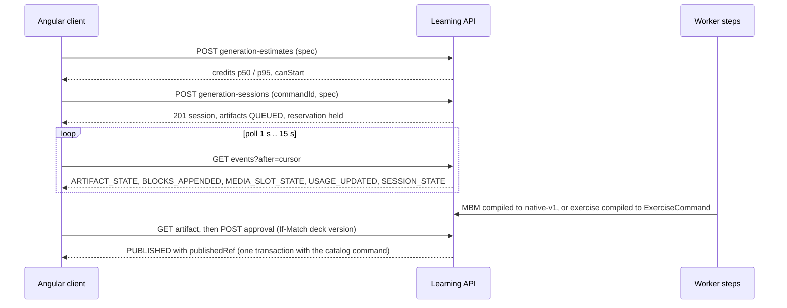

# Generation contract v1 (`generation-v1`)

Executable contract of the AI generation layer ("Workshop"): sessions, artifacts, steps, events, approval,
edits, errors, the MBM v1 output format for materials and the strict-JSON output for exercises. It is the
shared input of the backend tasks (AI-01..AI-05, AI-07, AI-13) and of the frontend, so they can proceed in
parallel without re-deciding wire shapes.

**Status: contract only.** Nothing described here is implemented; no runtime code, migration or UI exists. Each file
says which task implements it. The accepted sources, which this contract must not contradict:

- [AI generation platform](../../docs/architecture/ai-generation-platform.md) — §3 domain model and states,
  §4 steps, §5 events, §6 MBM and exercises, §7 edits, §9 capabilities, §10 usage, §12 notifications;
- [AI layer product contract](../../docs/product/ai-layer-2026-10.md) — rate card, plans, user-visible states;
- the shared contracts it builds on: [native-v1](../content/native-v1/README.md), [Study](../study/README.md),
  [items](../items/README.md), [decks](../decks/README.md), [authoring](../authoring/README.md).

Sibling contracts: [`contracts/usage`](../usage/README.md) (rate card, allowances, `GET /api/usage`, estimate
shapes) and [`contracts/notifications`](../notifications/README.md). The prompt skeleton that produces the model
output lives in
[`prompts/`](../../backend/services/learning/src/main/resources/ai/prompts/README.md).

## Index

| File | Content | Implemented by |
|---|---|---|
| [`states.json`](states.json) | State machines of session, artifact, step, turn and media slot; triggers, actors, guards, error codes, allowed operations per state | AI-04 [#287](https://github.com/MattoYuzuru/Mnema/issues/287), AI-05 [#288](https://github.com/MattoYuzuru/Mnema/issues/288) |
| [`http.json`](http.json) | 17 operations: capabilities, estimate, sessions, events, artifact, approval (single and bulk), reject/undo, hand-off, edits, revert, retry; headers, bodies, examples, errors | AI-04, AI-05, AI-11 [#293](https://github.com/MattoYuzuru/Mnema/issues/293), AI-13 [#291](https://github.com/MattoYuzuru/Mnema/issues/291) |
| [`events.json`](events.json) | Polling envelope and one example per event type | AI-04, AI-06 [#289](https://github.com/MattoYuzuru/Mnema/issues/289) |
| [`errors.json`](errors.json) | RFC 9457 codes of generation, usage and notifications; extension members | all |
| [`mbm-v1/`](mbm-v1/README.md) | Grammar, directives, limits, handles, allowlist, error codes, golden fixtures `mbm → native-v1` | AI-03 [#283](https://github.com/MattoYuzuru/Mnema/issues/283) |
| [`exercises/`](exercises/README.md) | Strict output schema per mechanic, compile rules, lint codes, fixtures | AI-13 |

## How the pieces fit

Design rules that every file follows (all from the architecture):

- the model has **no agency**: its output is data; links come only from the session allowlist; no personal data in
  prompts; no "created with AI" mark anywhere (provenance is internal and never returned);
- **nothing reaches the catalog or Study before explicit approval**; approval is one transaction with the existing
  `ItemService`/`ExerciseService` command and needs every media slot `READY` or explicitly removed;
- **no database transaction is open while a provider is called**; state changes commit with the row version and the
  event they emit;
- conventions are those of the existing contracts: private/no-store, opaque 404, decimal-string versions, quoted ETag
  / `If-Match` (missing 428, malformed 400, stale 412), `commandId` with `Idempotency-Replayed`, Problem Details with a
  stable `code`.

## Decisions beyond the architecture

The architecture leaves these open or implies them; the contract fixes them so tasks do not guess. Each is revisable
by the owning task with a note here.

1. **`GENERATION_STATE_CONFLICT` (409)** for a command that the current state forbids; 412 stays for stale versions
   only. `EDIT_IN_PROGRESS` remains the code for a second edit.
2. **Edit actions** gain `REMOVE_MEDIA` (deterministic, no model call) because approval requires slots to be `READY`
   or "explicitly removed" and no other way to remove exists; edits also take an optional `preset`
   (`SIMPLER|SHORTER|EXAMPLE|LONGER`) so the server can check the length bound of the preset.
3. **Session `CLOSED`** = every artifact is `PUBLISHED` or `HANDED_OFF`; rejected ones keep the session in `REVIEW`.
   **Session `CANCELLED`** keeps already `PROPOSED` artifacts approvable (no new steps). A failed `PLAN` step cancels the
   session.
4. **`STALE → REJECTED`** is allowed so a stale artifact whose nodes vanished is not a dead end (the architecture
   diagram has only `STALE → PROPOSED`).
5. **`POST …/retry`** (`FAILED → QUEUED`) and **`approvals`** (bulk, atomic) are separate operations; the plan-approval
   operation belongs to AI-14 ([#295](https://github.com/MattoYuzuru/Mnema/issues/295)) and is not in `http.json`.
6. **Events**: `eventId`/`cursor` are decimal strings; `BLOCKS_APPENDED` carries a `generation` counter so a restarted
   draft discards earlier blocks; draft node IDs are provisional.
7. **Spec**: prompt ≤2000 characters, ≤20 sources and ≤20 artifacts, request bodies ≤64 KiB; the spec shapes of
   `REVISE_ITEM`/`REVISE_EXERCISE` and the exercise `priority` values are provisional (AI-16 #294, AI-13).
8. **Capability problems** carry additive `capability` and `reason` members; `TEMPORARILY_UNAVAILABLE` is a new reason.

## Contradictions found between accepted documents

Resolved in favour of the architecture document unless stated.

| Where | Contradiction | Treatment |
|---|---|---|
| `docs/architecture/ai-generation-platform.md:15` vs `contracts/study/mechanics.json` | The assumption says ORDER/CATEGORIZE "may land after the first AI slices"; both exist (`createOrder`, `createCategorize`) | The contract covers all seven mechanics |
| `contracts/study/README.md:167` vs `docs/architecture/ai-generation-platform.md:430` | Study says provider uncertainty maps to `UNSURE`; the architecture says it must become a self-check | Architecture wins; the fix is in AI-20 ([#292](https://github.com/MattoYuzuru/Mnema/issues/292)), not here |
| `docs/reviews/…/context-and-quality.md:184` and `:233` vs architecture §6 | The research prompt uses a `::verify` block; the architecture's MBM v1 has none | Not in MBM v1 nor in the prompts |
| `docs/reviews/…/context-and-quality.md:96` vs architecture `:299` | Edit context: whole document up to 8k tokens vs "outline + target ± neighbour" | Not decided here (prompt placeholders allow both); AI-11 |
| architecture `:270-272` (swapped pair is `INCORRECT`) vs `AttemptEvaluation` | A swapped pair among 3+ gives `PARTIAL` in the existing evaluator | Probes shift **all** pairs so `INCORRECT` is well defined |
| `docs/product/ai-layer-2026-10.md:190` | Free unlocks a quarter of a 50-credit bar each Monday: 12.5 credits | Copied verbatim as the fraction `1/4`; rounding is open |

## Open questions

- Rounding of the Free weekly unlock (50 / 4 = 12.5): e.g. 13, 13, 12, 12 per month?
- Is an explicit "close session" operation wanted for archiving used notes ("Archive used notes (N)") when the
  remaining artifacts are rejected?
- Account-wide listing of active sessions across decks (the "active sessions" entry point of AI-06).
- Whether `GET /api/capabilities` should add per-capability usage hints.
- Media assets of a rewritten media block: kept or replaced when the slot spec is unchanged (AI-09, AI-10).
- Whether an `EXPIRED` session stays readable as a tombstone until deleted or is purged at once (then `getSession` is a 404 and the
  `EXPIRED` state is only ever seen by the retention worker).

## Verification

`GenerationContractFixtureTest` (`backend/services/learning/src/test/java/app/mnema/learning/generation/`) checks, with
the repository's own parsers: every `mbm-v1/valid/*.native.json` through `NativeDocumentReader`; every exercise
`expectedCommand` through `ExerciseCommand.readCreate` and every `modelOutput` against `output.schema.json`; every JSON
file of the three contract directories for well-formedness and duplicate keys; resolvable `$ref`s; code tables against
fixtures; rate card and notification tables against their README; prompt front matter.
