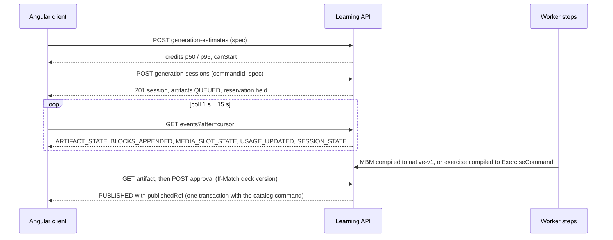

# Generation contract v1 (`generation-v1`)

Executable contract of the AI generation layer ("Workshop"): sessions, artifacts, steps, events, approval,
edits, errors, the MBM v1 output format for materials and the strict-JSON output for exercises. It is the
shared input of the backend tasks (AI-01..AI-05, AI-07, AI-13) and of the frontend, so they can proceed in
parallel without re-deciding wire shapes.

**Status: contract only.** Nothing described here is implemented; no runtime code, migration or UI exists. Each file
says which task implements it. The accepted sources, which this contract must not contradict:

- [AI generation platform](../../docs/architecture/ai-generation-platform.md) — §3 domain model and states,
  §4 steps, §5 events, §6 MBM and exercises, §7 edits, §9 capabilities, §10 usage, §12 notifications;
- [AI layer product contract](../../docs/product/ai-layer-2026-10.md) — rate card, plans, user-visible states;
- the shared contracts it builds on: [native-v1](../content/native-v1/README.md), [Study](../study/README.md),
  [items](../items/README.md), [decks](../decks/README.md), [authoring](../authoring/README.md).

Sibling contracts: [`contracts/usage`](../usage/README.md) (rate card, allowances, `GET /api/usage`, estimate
shapes) and [`contracts/notifications`](../notifications/README.md). The prompt skeleton that produces the model
output lives in
[`prompts/`](../../backend/services/learning/src/main/resources/ai/prompts/README.md).

## Index

| File | Content | Implemented by |
|---|---|---|
| [`states.json`](states.json) | State machines of session, artifact, step, turn and media slot; triggers, actors, guards, error codes, allowed operations per state | AI-04 [#287](https://github.com/MattoYuzuru/Mnema/issues/287), AI-05 [#288](https://github.com/MattoYuzuru/Mnema/issues/288) |
| [`http.json`](http.json) | 18 operations: capabilities, estimate, sessions (deck-scoped and account-wide active list), events, artifact, approval (single and bulk), reject/undo, hand-off, edits, revert, retry; headers, bodies, examples, errors; the evaluation order of checks | AI-04, AI-05, AI-11 [#293](https://github.com/MattoYuzuru/Mnema/issues/293), AI-13 [#291](https://github.com/MattoYuzuru/Mnema/issues/291) |
| [`events.json`](events.json) | Polling envelope, per-session `seq` allocation, one example per event type | AI-04, AI-06 [#289](https://github.com/MattoYuzuru/Mnema/issues/289) |
| [`errors.json`](errors.json) | RFC 9457 codes of generation, usage and notifications; extension members | all |
| [`mbm-v1/`](mbm-v1/README.md) | Grammar, directives, limits, handles, allowlist, error codes, golden fixtures `mbm → native-v1` | AI-03 [#283](https://github.com/MattoYuzuru/Mnema/issues/283) |
| [`exercises/`](exercises/README.md) | Strict output schema per mechanic, compile rules, lint codes, fixtures | AI-13 |

## How the pieces fit

Design rules that every file follows (all from the architecture):

- the model has **no agency**: its output is data; links come only from the session allowlist; no personal data in
  prompts; no "created with AI" mark anywhere (provenance is internal and never returned);
- **nothing reaches the catalog or Study before explicit approval**; approval is one transaction with the existing
  `ItemService`/`ExerciseService` command and needs every media slot `READY` or explicitly removed;
- **no database transaction is open while a provider is called**; state changes commit with the row version and the
  event they emit, with the event `seq` allocated under the session row lock (a `bigserial` would assign values before commit and a
  poller could miss an event);
- **usage**: the initial batch of a session is reserved with it, every later chargeable action (edit, retry, media redo) reserves
  on its own and is refused with `409 USAGE_LIMIT_REACHED` before any state change; see the
  [usage contract](../usage/README.md). AI-01 (#281) owns `estimateGeneration`; the generation module supplies spec
  interpretation and the personal-data scan hooks as they land;
- conventions are those of the existing contracts: private/no-store, opaque 404, decimal-string versions, quoted ETag
  / `If-Match` (missing 428, malformed 400, stale 412), `commandId` with `Idempotency-Replayed`, Problem Details with a
  stable `code`.

## Decisions beyond the architecture

The architecture leaves these open or implies them; the contract fixes them so tasks do not guess. Each is revisable
by the owning task with a note here.

1. **`GENERATION_STATE_CONFLICT` (409)** for a command that the current state forbids (reasons `ILLEGAL_STATE`, `MEDIA_NOT_READY`,
   `SOURCE_STALE`, `NOT_RETRYABLE`); 412 stays for stale versions only. `EDIT_IN_PROGRESS` remains the code for a second edit.
   `SPEC_NOT_SUPPORTED` (422) answers a `REVISE_*` spec until AI-16 (#294); a new code because `RESOURCE_LIMIT_EXCEEDED` would mislead.
2. **Edit actions** gain `REMOVE_MEDIA` (deterministic, free, answers 202 like every edit, creates a revision, does not count toward the
   50 turns) because approval requires slots to be `READY` or "explicitly removed" and no other way to remove exists; edits take an
   optional `preset` valid only with `REWRITE`.
3. **Session `CLOSED`** = no artifact is `PROPOSED`, `REVISING`, `STALE`, `QUEUED`, `GENERATING` or retryable `FAILED`. `FAILED` artifacts keep
   the session in `REVIEW`, so retry and undo stay possible; only `REJECTED` and `FAILED` with errorCode `REFUSAL` (not retryable) do not
   keep it open. The 3-active-sessions limit counts `PLANNING`, `PLAN_READY`, `RUNNING` and `REVIEW` sessions that still have a `PROPOSED`,
   `REVISING` or `STALE` artifact; a `REVIEW` session holding only `FAILED` or `REJECTED` leftovers does not count (its batch reservation is
   already released at `REVIEW` entry). **`CANCELLED`** keeps `PROPOSED` artifacts approvable, rejectable, hand-off-able and strippable of
   media (`REMOVE_MEDIA` only), and becomes `CLOSED` when none of them remains; `endReason` is `USER_CANCELLED`, `PLAN_FAILED` or `EXPIRED`. A
   failed `PLAN` step cancels the session. Cancel and delete need no `If-Match` (state-idempotent). Purge: the retention worker deletes the
   rows at `last activity + P30D`; `EXPIRED` is readable until then; after the purge every read is a 404.
4. **STALE** artifacts: reject, hand off (edit the stale proposal yourself) or retry (regenerate against the new source revision);
   there is no "keep anyway" approve (`409 SOURCE_STALE`). Staleness is evaluated by the worker or re-pin job and by approve in its own
   short transaction before the publish transaction, never by a GET.
5. **`POST …/retry`** (`FAILED`/`STALE` → `QUEUED`, not for `REFUSAL`), atomic **bulk approval** (up to 20, items and exercises in ONE
   transaction through in-process service calls with derived child command ids `uuidv5(commandId, artifactId)` and chained deck
   revisions) and an account-wide **`GET /api/generation-sessions?state=active`** (needed by AI-06) are separate operations; the
   plan-approval operation belongs to AI-14 ([#295](https://github.com/MattoYuzuru/Mnema/issues/295)).
6. **Events**: per-session `seq` (a decimal string) allocated under the session row lock with `UNIQUE (session_id, seq)`;
   `BLOCKS_APPENDED.generation` is an artifact-scoped counter; draft node IDs are provisional.
7. **Spec**: prompt ≤2000 characters, ≤20 sources, request bodies ≤64 KiB; the `REVISE_*` spec shapes and the exercise `priority` values
   are provisional (AI-16 #294, AI-13 #291).
8. **Evaluation order** of every command: authentication and ownership (a foreign or unknown ID, including a note ID in `sources`, is 404:
   no existence oracle), receipt replay, request validation, preconditions (428, 412), state (409), usage (409, last, inside the
   admission transaction).
9. **Capability problems** carry additive `capability` and `reason` members; `TEMPORARILY_UNAVAILABLE` is a new reason. Problem
   extension members are added through a small typed `ProblemExtension` map in `platform.api` (AI-01 is the first user).
10. **Errors**: the artifact error `BUDGET_EXHAUSTED` is split into `USAGE_LIMIT` (the user's limit) and `ESTIMATE_EXCEEDED`
    (under-reservation; a retry re-reserves); `MEDIA_SLOT_STATE.errorCode` and a failed turn's `errorCode` are enumerated in `states.json`.

## Owner decisions (2026-10-02)

Final. Values live in config keys, so a change is a configuration change. Details: [usage contract](../usage/README.md#owner-decisions-2026-10-02).

- **Free credits:** weekly portions 13, 13, 12, 12 (sum = the 50 bar) that accumulate within the calendar month; the first unlocks on the 1st,
  the next on each following Monday 00:00 Europe/Moscow; nothing carries over; an operation larger than the unlocked balance is
  `USAGE_LIMIT_REACHED` with `renewsAt` and a computed `fitsAfterRenewal`.
- **Daily burst (paid):** limits debits per calendar day; steps that would exceed it wait for the next day start (`USAGE_UPDATED.deferredUntil`).
- **Exercise generation:** explicit refusal, no silent clamp: at most 20 targets, 1..10 exercises per target, at most 60 exercises per session
  (`learning.generation.max-exercise-targets`, `max-exercises-per-target`, `max-exercises-per-session`); above that `422 RESOURCE_LIMIT_EXCEEDED`
  with the limits and the client splits into several sessions, uncovered materials first. The 60 differs from the architecture's 20
  artifacts per session, which now applies to `MATERIALS`; bulk approval stays at 20 per command, so the client approves larger selections in several
  atomic commands.
- **Time zone:** `learning.usage.calendar-zone` = `Europe/Moscow` for every day, week and month boundary.

## Known doc conflicts

Resolved in favour of the architecture document unless stated. These are recorded, not fixed here.

| Where | Conflict | Treatment |
|---|---|---|
| `docs/architecture/ai-generation-platform.md` (front matter assumption) | Said ORDER/CATEGORIZE "may land after the first AI slices"; both exist (#268, `contracts/study/mechanics.json`) | The assumption is corrected; the contract covers all seven mechanics |
| `contracts/study/README.md:167` vs architecture §11 | Study maps provider uncertainty to `UNSURE`; the architecture says it must become a self-check | Left to AI-20 ([#292](https://github.com/MattoYuzuru/Mnema/issues/292)) |
| research `context-and-quality.md` (the `::verify` block) vs architecture §6 | The research prompt uses a `::verify` block; MBM v1 has none | Not in MBM v1 nor in the prompts |
| research (edit context: whole document up to 8k tokens) vs architecture §7 (outline + target ± neighbour) | Edit context size | Prompt placeholders allow both; AI-11 |
| architecture §6 (swapped pair is `INCORRECT`) vs `AttemptEvaluation` | A swapped pair among 3+ gives `PARTIAL` | Probes shift **all** pairs so `INCORRECT` is well defined |
| architecture §4 (at most 20 artifacts per session) vs owner decision (60 exercises) | Different limits | 20 for `MATERIALS`, 60 for `EXERCISES`; architecture to be updated with the AI-04 task |
| `docs/product/ai-layer-2026-10.md` (¼ of the bar every Monday, i.e. 12.5) | Not an integer | Replaced by the owner decision: portions 13, 13, 12, 12 |

## Open questions

- Whether `GET /api/capabilities` should add per-capability usage hints.
- Media assets of a rewritten media block: kept or replaced when the slot spec is unchanged (AI-09, AI-10).

## Verification

`GenerationContractFixtureTest` (`backend/services/learning/src/test/java/app/mnema/learning/generation/`) checks, with
the repository's own parsers: every `mbm-v1/valid/*.native.json` through `NativeDocumentReader` (plus allocator order, directive,
heading and error-line structure); every exercise `expectedCommand` through `ExerciseCommand.readCreate` and every `modelOutput`
against `output.schema.json` (a validator that rejects unknown keywords); every JSON file of the three contract directories for
well-formedness and duplicate keys; resolvable `$ref`s; the equality of each operation's error list with each code's `endpoints`,
state-machine reachability; code tables against fixtures; rate card and allowance numbers against their README tables; notification
examples against the kind schemas; prompt front matter. `ExerciseSelfEvaluationFixtureTest` (package `app.mnema.learning.study.attempt`,
because `AttemptEvaluation` is package-private) runs every `expectedSelfEvaluation` probe through the real evaluator. **Lint and compile
semantics are executed by AI-13 and AI-03**: the fixtures state what those implementations must reproduce.
