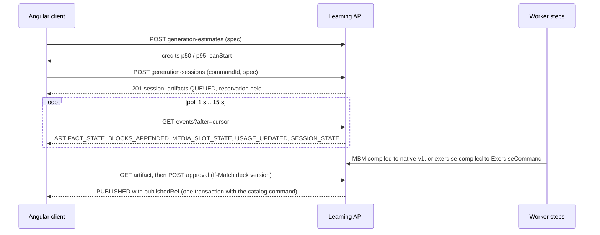

# Generation contract v1 (`generation-v1`)

Executable contract of the AI generation layer ("Workshop"): sessions, artifacts, steps, events, approval,
edits, errors, the MBM v1 output format for materials and the strict-JSON output for exercises. It is the
shared input of the backend tasks (AI-01..AI-05, AI-07, AI-13) and of the frontend, so they can proceed in
parallel without re-deciding wire shapes.

**Status: partly implemented.** AI-04 ([#287](https://github.com/MattoYuzuru/Mnema/issues/287)) implements sessions, artifacts,
steps, events, the `TEXT_DRAFT` step and the operations `estimateGeneration`, `createSession`, `listSessions`,
`listActiveSessions`, `getSession`, `cancelSession`, `listEvents` and `getArtifact`; AI-05
([#288](https://github.com/MattoYuzuru/Mnema/issues/288)) implements `approveArtifact`, `approveArtifacts`, `rejectArtifact`,
`undoRejectArtifact`, `handoffArtifact`, `retryArtifact`, `deleteSession`, `archiveUsedNotes` and the retention worker (see
the decisions below for what they settled); AI-13 ([#291](https://github.com/MattoYuzuru/Mnema/issues/291)) implements `EXERCISES`
sessions, the exercise side of approval, re-pin and retry, and the «Новое» mark (decision 14); AI-11 ([#293](https://github.com/MattoYuzuru/Mnema/issues/293))
implements `editArtifact` and `revertArtifact` for materials (decision 15); the planner, the exercise edit flow and the media executors do not exist yet. Each file says which task implements it. The accepted sources, which this contract must not contradict:

- [AI generation platform](../../docs/architecture/ai-generation-platform.md) — §3 domain model and states,
  §4 steps, §5 events, §6 MBM and exercises, §7 edits, §9 capabilities, §10 usage, §12 notifications;
- [AI layer product contract](../../docs/product/ai-layer-2026-10.md) — rate card, plans, user-visible states;
- the shared contracts it builds on: [native-v1](../content/native-v1/README.md), [Study](../study/README.md),
  [items](../items/README.md), [decks](../decks/README.md), [authoring](../authoring/README.md).

Sibling contracts: [`contracts/usage`](../usage/README.md) (rate card, allowances, `GET /api/usage`, estimate
shapes) and [`contracts/notifications`](../notifications/README.md). The prompt skeleton that produces the model
output lives in
[`prompts/`](../../backend/services/learning/src/main/resources/ai/prompts/README.md).

## Index

| File | Content | Implemented by |
|---|---|---|
| [`states.json`](states.json) | State machines of session, artifact, step, turn and media slot; triggers, actors, guards, error codes, allowed operations per state | AI-04 [#287](https://github.com/MattoYuzuru/Mnema/issues/287), AI-05 [#288](https://github.com/MattoYuzuru/Mnema/issues/288) |
| [`http.json`](http.json) | 19 operations: capabilities, estimate, sessions (deck-scoped and account-wide active list), events, artifact, approval (single and bulk), reject/undo, hand-off, edits, revert, retry, note archival; headers, bodies, examples, errors; the evaluation order of checks | AI-04, AI-05, AI-11 [#293](https://github.com/MattoYuzuru/Mnema/issues/293), AI-13 [#291](https://github.com/MattoYuzuru/Mnema/issues/291) |
| [`events.json`](events.json) | Polling envelope, per-session `seq` allocation, one example per event type | AI-04, AI-06 [#289](https://github.com/MattoYuzuru/Mnema/issues/289) |
| [`errors.json`](errors.json) | RFC 9457 codes of generation, usage and notifications; extension members | all |
| [`mbm-v1/`](mbm-v1/README.md) | Grammar, directives, limits, handles, allowlist, error codes, golden fixtures `mbm → native-v1` | AI-03 [#283](https://github.com/MattoYuzuru/Mnema/issues/283) |
| [`exercises/`](exercises/README.md) | Strict output schema per mechanic, compile rules, lint codes, fixtures | AI-13 |

## How the pieces fit

Design rules that every file follows (all from the architecture):

- the model has **no agency**: its output is data; links come only from the session allowlist; no personal data in
  prompts; no "created with AI" mark anywhere (provenance is internal and never returned);
- **nothing reaches the catalog or Study before explicit approval**; approval is one transaction with the existing
  `ItemService`/`ExerciseService` command and needs every media slot `READY` or explicitly removed;
- **no database transaction is open while a provider is called**; state changes commit with the row version and the
  event they emit, with the event `seq` allocated under the session row lock (a `bigserial` would assign values before commit and a
  poller could miss an event);
- **usage**: the initial batch of a session is reserved with it, every later chargeable action (edit, retry, media redo) reserves
  on its own and is refused with `409 USAGE_LIMIT_REACHED` before any state change; see the
  [usage contract](../usage/README.md). AI-01 (#281) owns `estimateGeneration`; the generation module supplies spec
  interpretation and the personal-data scan hooks as they land;
- conventions are those of the existing contracts: private/no-store, opaque 404, decimal-string versions, quoted ETag
  / `If-Match` (missing 428, malformed 400, stale 412), `commandId` with `Idempotency-Replayed`, Problem Details with a
  stable `code`.

## Decisions beyond the architecture

The architecture leaves these open or implies them; the contract fixes them so tasks do not guess. Each is revisable
by the owning task with a note here.

1. **`GENERATION_STATE_CONFLICT` (409)** for a command that the current state forbids (reasons `ILLEGAL_STATE`, `MEDIA_NOT_READY`,
   `SOURCE_STALE`, `NOT_RETRYABLE`); 412 stays for stale versions only. `EDIT_IN_PROGRESS` remains the code for a second edit.
   `SPEC_NOT_SUPPORTED` (422) answers a `REVISE_*` spec until AI-16 (#294); a new code because `RESOURCE_LIMIT_EXCEEDED` would mislead.
2. **Edit actions** gain `REMOVE_MEDIA` (deterministic, free, answers 202 like every edit, creates a revision, does not count toward the
   50 turns) because approval requires slots to be `READY` or "explicitly removed" and no other way to remove exists; edits take an
   optional `preset` valid only with `REWRITE`.
3. **Session `CLOSED`** (reopened only by an undo of a rejection, decision 12) = no artifact is `PROPOSED`, `REVISING`, `STALE`, `QUEUED`, `GENERATING` or retryable `FAILED`. `FAILED` artifacts keep
   the session in `REVIEW`, so retry and undo stay possible; only `REJECTED` and `FAILED` with errorCode `REFUSAL` (not retryable) do not
   keep it open. The 3-active-sessions limit counts `PLANNING`, `PLAN_READY`, `RUNNING` and `REVIEW` sessions that still have a `PROPOSED`,
   `REVISING` or `STALE` artifact; a `REVIEW` session holding only `FAILED` or `REJECTED` leftovers does not count (its batch reservation is
   already released at `REVIEW` entry). **`CANCELLED`** keeps `PROPOSED` artifacts approvable, rejectable, hand-off-able and strippable of
   media (`REMOVE_MEDIA` only), and becomes `CLOSED` when none of them remains; `endReason` is `USER_CANCELLED`, `PLAN_FAILED` or `EXPIRED`. A
   failed `PLAN` step cancels the session. Cancel and delete need no `If-Match` (state-idempotent). Purge: the retention worker deletes the
   rows at `last activity + P30D`; `EXPIRED` is readable until then; after the purge every read is a 404.
4. **STALE** artifacts: reject, hand off (edit the stale proposal yourself) or retry (regenerate against the new source revision);
   there is no "keep anyway" approve (`409 SOURCE_STALE`). Staleness is evaluated by the worker or re-pin job and by approve in its own
   short transaction before the publish transaction, never by a GET.
5. **`POST …/retry`** (`FAILED`/`STALE` → `QUEUED`, not for `REFUSAL`), atomic **bulk approval** (up to 20, items and exercises in ONE
   transaction through in-process service calls with derived child command ids `uuidv5(commandId, artifactId)` and chained deck
   revisions) and an account-wide **`GET /api/generation-sessions?state=active`** (needed by AI-06) are separate operations; the
   plan-approval operation belongs to AI-14 ([#295](https://github.com/MattoYuzuru/Mnema/issues/295)).
6. **Events**: per-session `seq` (a decimal string) allocated under the session row lock with `UNIQUE (session_id, seq)`;
   `BLOCKS_APPENDED.generation` is an artifact-scoped counter; draft node IDs are provisional.
7. **Spec**: prompt ≤2000 characters, ≤20 sources, request bodies ≤64 KiB; the `REVISE_*` spec shapes are provisional (AI-16 #294); the
   exercise `priority` values `UNCOVERED_FIRST` and `BALANCED` are settled by decision 14.
8. **Evaluation order** of every command: authentication and ownership (a foreign or unknown ID, including a note ID in `sources`, is 404:
   no existence oracle), receipt replay, request validation, preconditions (428, 412), state (409), usage (409, last, inside the
   admission transaction).
9. **Capability problems** carry additive `capability` and `reason` members; `TEMPORARILY_UNAVAILABLE` is a new reason. Problem
   extension members are added through a small typed `ProblemExtension` map in `platform.api` (AI-01 is the first user).
10. **Errors**: the artifact error `BUDGET_EXHAUSTED` is split into `USAGE_LIMIT` (the user's limit) and `ESTIMATE_EXCEEDED`
    (under-reservation; a retry re-reserves); `MEDIA_SLOT_STATE.errorCode` and a failed turn's `errorCode` are enumerated in `states.json`.

11. **AI-04 settled these** (revisable by the owning task with a note here):
    - `planFirst: true` is `422 SPEC_NOT_SUPPORTED` (`kind: MATERIALS`) in the estimate and in `createSession` until the planner
      exists (`learning.generation.planner.enabled`, AI-14), and so for `EXERCISES` (`kind: EXERCISES`; AI-13 made the rest of that kind
      supported). `AUTO` effort is priced (estimate and hold) and run as `MEDIUM` until the planner and auto-effort land.
    - The checks of `createSession` run in this order: deck (404), receipt replay, shape and limits (400, 422), sources (404 for an
      unknown, foreign or other-deck note or material, 409 `SOURCE_UNAVAILABLE` for a note whose `row_version` moved or a
      `SOURCE` material that is no longer the head; a `STYLE_EXAMPLE` only has to exist), capabilities (409; `textToSpeech`
      for audio, `imageSearch`, `webSearch` for a fact check above short effort), active sessions (422, with `activeSessionIds`
      and `limits.maxActiveSessions`), usage (409, strictly last: a full count cap, a `budgetPercent` hold that cannot pay for
      one material at its effort, then the reservation). The estimate runs the same interpretation, so it answers the same 400, 404,
      409 `CAPABILITY_UNAVAILABLE` and 422.
    - A note source must belong to the deck of the session. The estimate's `edit` form answers an opaque 404 for a session or an
      artifact that is not the owner's deck's.
    - `listSessions` takes `limit`, `cursor` and `active`; `listActiveSessions` takes a required `state=active`, `limit` and
      `cursor`; any other query parameter is `400`. Both order by `(lastActivityAt, sessionId)` descending.
    - `USAGE_UPDATED` is emitted after a committed debit and after the reservation is released (so a session that finishes
      has two), and with `deferredUntil` when the daily burst parks a step. A `BLOCKS_APPENDED` checkpoint appends events
      without bumping the session `rowVersion`; every transaction that changes the session does.
    - `GENERATION_READY` is published when every artifact is approvable and none failed, `GENERATION_PARTIAL` and
      `GENERATION_FAILED` as the notification contract says; a REVIEW session whose proposals still wait for media and has no
      failure publishes nothing until the media tasks (AI-09, AI-10) resolve the slots. The producer of the three kinds is AI-04.
    - Media directives are bounded by the declared media: `maxMedia` is one for enabled audio plus one for image search, so a
      model that emits more is repaired (`MBM_TOO_MANY_MEDIA`); `::image mode="generate"` and `::video` stay refused
      (`MBM_CAPABILITY_OFF`) until their executors exist.
    - Step time: a run has `PT6M` (`TEXT_DRAFT`); a requeue delay is at most `learning.generation.step.backoff-cap`; a step
      older than `learning.generation.step.max-lifetime` (`PT1H`, from its first claim) is `FAILED(DEADLINE_EXCEEDED)`.
    - Cancelling `FAILED(CANCELLED)`s the media slots of the cancelled media steps and emits `MEDIA_SLOT_STATE`.
    - A step ends `FAILED(ESTIMATE_EXCEEDED)` without a provider call when the remaining hold does not cover the material's
      weight; a debit that no longer fits (a parallel step used the hold) fails the artifact the same way after the call, with
      no debit. A failed run is debited nothing; a repair inside a successful step is.

12. **AI-05 settled these** (revisable by the owning task with a note here):
    - **Note archival** (`archiveUsedNotes`, `POST .../generation-sessions/{sessionId}/note-archival`, body `{commandId}`, no
      `If-Match`, `200 {archived: [{noteId}], skipped: [{noteId, reason: CHANGED | ALREADY_ARCHIVED | DELETED}]}`). "Used notes"
      are the distinct `NOTE` sources of artifacts that are `PUBLISHED` or `HANDED_OFF`; each is archived through the capture
      archive command with the **pinned** `noteRowVersion` as the expected version, so a note that changed since is skipped and
      reported, never archived silently. `ALREADY_ARCHIVED` is checked first, then `DELETED`, then `CHANGED`. It is allowed in every
      session state until the purge (then 404), changes nothing about the session, is idempotent by `commandId`
      (`Idempotency-Replayed`, changed reuse `409 IDEMPOTENCY_CONFLICT`) and a second call with a new `commandId` is harmless.
      A note counts as used only while no artifact still in play (`QUEUED`, `GENERATING`, `PROPOSED`, `REVISING`, `STALE`, retryable
      `FAILED`) pins it, because archiving bumps its `row_version` and would turn that sibling `STALE`; such notes are not part of
      the command (no extra skip reason).
      `sessionDetail` gains `notes: {used, archivable}` (`archivable` = used notes that are not archived and still match their pin).
    - **Child command ids.** The catalog and draft commands that an approval or a hand-off issues carry ids derived from the
      request's `commandId` (`derive(commandId, artifactId)`; for a bulk approval of items, one bulk publication with an id derived
      from the sorted artifact ids). The contract says `uuidv5`; a version-5 value is not a legal command id of this platform
      (`UuidPolicy.requireCommandId` accepts versions 4 and 7), so the id is a SHA-256 name-based hash shaped as a version-4 UUID.
      The member keys of the new materials are derived the same way, so a repeated request is the same publication.
    - **Evaluation inside the commands.** A stale `expectedArtifactVersion`, `expectedRevisionId` or `expectedDeckRevisionId`
      is `412` before any `409`; the bulk `412` lists the stale artifacts in `artifactIds` (none when only the deck is stale).
      A `409` reason order is `ILLEGAL_STATE`, `SOURCE_STALE`, `MEDIA_NOT_READY`. A tombstoned deck is the opaque `404` like an
      absent one (the sessions of a deleted deck are as absent as the deck); `SOURCE_UNAVAILABLE` is not an approval error.
    - **Source drift at approval.** A `PROPOSED` artifact whose `NOTE` pin moved or is gone, or whose `SOURCE` material is no
      longer the head (a `STYLE_EXAMPLE` never counts), becomes `STALE` in a short transaction of its own that commits before the
      `409 SOURCE_STALE`; `repinStatus` is `NEEDS_USER_DECISION` (a material has no by-node-id re-pin; an exercise is re-pinned first,
      decision 14).
    - **Reject / undo.** Rejecting the last open artifact closes the session (decision 3). The undo is still allowed in a `CLOSED`
      session until the purge: it reopens it (`CLOSED` to `REVIEW`, or `CANCELLED` when the session ended through cancellation),
      emits `SESSION_STATE` and refreshes `last_activity_at` and `expires_at`; an `EXPIRED` session refuses it (`409 ILLEGAL_STATE`).
      `CLOSED` is therefore not terminal in `states.json`.
    - **Hand-off** opens the revision's document without the media nodes whose assets are not `READY` (a placeholder node cannot be
      saved: its asset does not exist); the draft quota is `422 RESOURCE_LIMIT_EXCEEDED` with `limit: EDITING_DRAFTS`.
    - **Retry** makes a `STEP` reservation of the artifact's weight first (a refusal is `409 USAGE_LIMIT_REACHED` and changes
      nothing); the retried step's input carries its `reservationId`, so its debit draws from it, and it is released with the
      session's other holds when the session returns to `REVIEW`. The session's `usage` and `USAGE_UPDATED` show the sum of all
      its holds. A `STALE` artifact is regenerated against the pins as they are now; a `FAILED` one needs its pins to hold, else
      `409 SOURCE_UNAVAILABLE`. The slots, holds and waiting media steps of the replaced revision are dropped. A `REVIEW` session
      returns to `RUNNING`; when that makes a session count as active again (it held only `FAILED` or `REJECTED` leftovers) the
      3-active-sessions limit is checked first (`422 RESOURCE_LIMIT_EXCEEDED`, `limit: ACTIVE_SESSIONS`, before usage). Retry and approval of an
      `EXERCISE` artifact are decision 14.
    - **Retention.** `learning.generation.session-retention` (`P30D`) from last activity is `expires_at`. At `expires_at` the worker ends a
      live session as `EXPIRED` (it stops like a cancellation and releases its holds) and it stays readable for
      `learning.generation.retention.expired-readable` (`P1D`); then every session is purged (rows, holds, events; credit holds
      released; published materials, handed-off drafts and `generation_provenance` stay). `CLOSED` and `CANCELLED` sessions are purged
      at `expires_at`. `GENERATION_SESSION_EXPIRING` is published `retention.warn-before` (`P3D`) before expiry while a `PROPOSED`,
      `REVISING` or `STALE` artifact remains (`pendingCount`; key per expiry date). Events of an ended session are deleted
      `retention.events-after-end` (`P1D`) after it ended.
    - **Media holds** of an artifact are released in the approval's or hand-off's own transaction (the catalog or the draft holds the
      assets by then), not after the commit.

13. **AI-08 (#290) settled these** (notes as sources):
    - **Per-note `overrides`** on a `NOTE` + `SOURCE` source (`http.json` `generationSpec.MATERIALS.sources`): strict and sparse
      (`effort`, `media`; `{}` or an empty `media` is `INVALID_REQUEST`), only with `ONE_PER_NOTE` and a note source, echoed
      unchanged. The estimate and the hold price every material with its effective settings; capabilities are checked on the
      effective values; the step input (`operation`, `credits`) and the context of a material use its own note's effective effort
      and media. A retry uses the same effective settings.
    - **Pinned text**: notes are mutable in place and keep no history, so the text is copied at the pin into
      `generation_note_snapshot` (`V29`; at admission, and again when a retry re-pins). The context reads the snapshot, so an
      edit after the pin (before or during the step) never reaches the material; the old "edited before the step ran fails with
      `SOURCE_UNAVAILABLE`" behavior is gone. Drift is still detected by approval (decision 4) and by retry.
    - **`getArtifact.sourceRefs[].status`** on NOTE entries: `CURRENT` (row_version equals the pin), `DELETED` (gone), `ARCHIVED`
      (moved, archived, and the text equals the snapshot: archiving is the only change we can see), else `CHANGED`. Read-only.

14. **AI-13 (#291) settled these** (revisable by the owning task with a note here); the details of the output, lint and compile are in
    [`exercises/README.md`](exercises/README.md):
    - **Session shape.** `createSession` accepts `kind: EXERCISES` (`planFirst: true` stays `422 SPEC_NOT_SUPPORTED` until AI-14). The targets are
      pinned as `generation_session_source` rows (`type ITEM`, role `SOURCE`, in request order); a target that is not the material's head is
      `409 SOURCE_UNAVAILABLE`. The resolved quantity (`AUTO` 5 per target, `EXACT`, `BUDGET_PERCENT`, unchanged numbers) is spread over the targets in
      processing order: `UNCOVERED_FIRST` (default) orders them by their number of enabled exercises ascending (stable by request order), `BALANCED`
      keeps the request order; target *i* gets `⌊total / n⌋`, plus one for the first `total mod n`. There is **one artifact per exercise**
      (`target_kind EXERCISE`, ordinal in processing order then index, `source_refs` the target's pin) and **one `TEXT_DRAFT` step per target**
      (`input.operation: EXERCISES`, the target, `count`, the step's credits and the ids of the artifacts it fills). A step is debited
      `EXERCISES_PER_MATERIAL` credits in proportion to the exercises it produced valid: its share of the hold is the rounded-up price of the
      exercises up to it minus the price of those before it, so the shares add up to the reservation; a `FAILED` artifact is not debited.
    - **Mechanics and validation.** `AUTO` allows all seven mechanics (nothing generated needs a capability that can be off; no `ai-semantic` rubric is
      generated before AI-20). The task asks for variety (at least three different mechanics when the count and the allowed set are three or more). An
      exercise of a mechanic outside the allowed set is the new lint code `MECHANIC_NOT_ALLOWED`. The answer must hold exactly `count` exercises: the first
      `count` are used, missing ones are repaired like invalid ones. Each exercise passes SCHEMA, LINT, COMPILE, `ExerciseCommand.readCreate` and
      SELF_EVALUATION (the probes of the exercises README through the same `AttemptEvaluation` as `/exercise-previews`) before it is shown. The ones that fail
      get ONE repair call (the findings `{index, code, path}` and "exactly K replacements", the valid ones are kept and listed as accepted, so the model does not repeat them), then one call on the strong route, then
      the artifacts that still lack an exercise end `FAILED(INVALID_OUTPUT)` and are never shown. A `COMMAND_REJECTED` is logged as a gap of the compiler or the
      lint, never as a fault of the model. The Stub answers an exercise request from the material in the prompt; `[[stub:broken-key]]` in the material breaks the
      first exercise of the first answer, `[[stub:broken-key-always]]` breaks it on every call.
    - **Objective reuse.** At compile time `{"title"}` equal (NFC, trimmed, case folded, whitespace collapsed) to an offered objective's title is a `reuse` of
      it. At approval a `create` objective whose normalized title equals the title of a current objective bound to the same subject material is published as a
      `reuse` of that one, so three exercises of one direction approved together create one objective, and a later session reuses it too.
    - **Artifact payload and view.** The revision payload is `{"kind": "EXERCISE_COMMAND", "command": {objective, exercise}}`; `whyWrong` is dropped before it is
      stored. `getArtifact` adds the read-only `display {mechanic, objectiveTitle, quotes {nodeId: plain text}}` (the quotes are the text of every `MATERIAL`
      block in the pinned revision) so a client renders without further requests. `artifactSummary.title` is the first `TEXT` block of the prompt (at most 240
      code points), else the objective title. `getArtifact` is read-only; only the `display` part reads the material (`FOR KEY SHARE` row locks, refused in a read-only transaction) in a second, ordinary transaction; nothing is written.
    - **Approval** (single and bulk, items and exercises mixed, at most 20, ONE transaction) goes through the caller-owned port `GeneratedExercisePublisher`
      (implemented in `catalog.exercise`): the materials first as one bulk publication, then each exercise through `ExerciseService.publish` with the child
      command id `derive(commandId, artifactId)` and the deck revision and version the previous publication left. `publishedRef` is `{kind: EXERCISE, exerciseId,
      exerciseRevisionId, objectiveId, objectiveRevisionId}`; provenance is written as for materials. `approveArtifact` takes an optional `replacement {objective,
      exercise}` for an `EXERCISE` artifact (what the owner edited in the exercise editor): it is read by `readCreate` only, keeps the proposal's subject material,
      is published instead of the payload and the provenance records `edited: true`; on an `ITEM` artifact or in a bulk entry it is `400 INVALID_REQUEST`.
      `handoffArtifact` stays `ITEM`-only (an `EXERCISE` hand-off is `400 INVALID_REQUEST`).
    - **STALE and re-pin (no model).** When an approval finds that the head of the target material moved, a proposed exercise that was not edited is re-pinned in
      a short transaction of its own, committed before the approval goes on, **only when every block the model was shown is unchanged in the head**: the blocks
      of the old pinned revision that the exercise's context offered (the clipped material the prompt carried) are compared by text with the same nodes of the head, and
      a block that changed or vanished anywhere in what the model saw (not only in the ones the exercise quotes) is a stale exercise, because the model's other
      choices (the objective, the distractors, the answer key) rested on it. If that holds, every `MATERIAL` node of the exercise still reads as text in the head
      (not blank, at most 4000 characters) and the exercise passes the lint rules that read the material text, `readCreate` and the probes again, a `REPIN`
      revision with the new pins replaces the current one, `repinStatus` is `AUTO_REPINNED`, the artifact stays `PROPOSED` and the approval continues with it;
      otherwise (a shown block changed, a node vanished, the material is deleted, a check fails) the artifact becomes `STALE` with
      `NEEDS_USER_DECISION` and the answer is `409 SOURCE_STALE`. An owner's `replacement` is never re-pinned: it is published when it already stands on the head
      (its subject and every quoted material carry the head revision, whatever the proposal's own pin is) and otherwise the artifact is `STALE`
      (`409 SOURCE_STALE`, never `412`). A retry of a `FAILED` or `STALE` exercise regenerates one exercise against the head, also when the material moved (one
      `TEXT_DRAFT` step with `count 1`, a `STEP` reservation of one exercise's credits).
    - **A reused objective that moved.** A `reuse` objective (offered at compile time, or found by title at approval) is published against the head of that
      objective at the moment of the publication: when its revision moved after the proposal, the current head is substituted if it is still bound to the proposal's
      subject member. When the objective is gone, or is bound to another member, the artifact is `STALE` with `NEEDS_USER_DECISION` and the answer is
      `409 SOURCE_STALE`; a missing objective is never an opaque `404` and a moved one is never `412`. Two approvals that race for the same direction serialize
      on the deck version (one wins, the other is `412 PRECONDITION_FAILED` and is repeated with the new version) and end with one objective.
    - **«Новое».** The catalog owns a mark per exercise (`exercise_new_mark`, `learning.exercise.new-mark-ttl`, `P7D`) written by the approval in its
      transaction. Exercise list entries and Study presentations carry `isNew`; the mark is cleared when the exercise is opened (`DELETE
      /api/decks/{deckId}/exercises/{exerciseId}/new-mark`, 204, idempotent) or answered in Study (the attempt's own transaction, any terminal result, `CANCEL` included: a presented and then terminated exercise counts as opened). No notification kind is
      added: `GENERATION_READY`, `_PARTIAL` and `_FAILED` carry `sessionKind: EXERCISES`; the client announces «Новые упражнения: N — уже в колоде».

15. **AI-11 (#293) settled these** (revisable by the owning task with a note here):
    - **Target.** `target.nodeIds` are 1..50 distinct node IDs of **consecutive** top-level blocks of the current revision (any request order); anything else
      (a nested node, an unknown or repeated ID, a gap) is `400 INVALID_REQUEST`, and so is a rewrite target the model cannot be given: a block MBM cannot express
      (`MbmUnsupportedContentException`: heading level 4+, `youtube`, opaque math, an attribute MBM cannot carry), a block whose text holds an e-mail address, a
      telephone or a card number (the prompt layer redacts them, so the rewrite would overwrite the author's own data with a placeholder; digit groups inside a URL are not telephone numbers) and a run of media only. The 400 names its cause in the additive `reason`
      member: `TARGET_NOT_CONTIGUOUS`, `TARGET_UNSUPPORTED_BLOCK`, `TARGET_PERSONAL_DATA`, `TARGET_MEDIA_ONLY`. The blocks to rewrite weigh at most 2050 estimated tokens (the output bound holds them
      again): more is `422 RESOURCE_LIMIT_EXCEEDED` with `limit: EDIT_TARGET_SIZE`.
      The client sends every block a selection touches, media blocks inside the run included. The target is judged against the current revision, so it is checked
      after the `412` and before the state checks.
    - **Actions.** `REWRITE` (optional `preset` and `instruction`) and `FREE` (`instruction` required) run the EDIT step; `REMOVE_MEDIA` is deterministic and free (media
      nodes only); `IMAGE_SEARCH`, `IMAGE_GENERATE` and `AUDIO_REGENERATE` need blocks of their kind and answer `409 CAPABILITY_UNAVAILABLE` (the capability gate's
      reason, `PROVIDER_NOT_CONFIGURED` when the gate passes) until AI-09 and AI-10 provide their executors, so those tasks only flip the capability. An `EXERCISE` artifact
      refuses every edit and every revert with `409 GENERATION_STATE_CONFLICT` (`ILLEGAL_STATE`) until AI-16 (#294). An edit is allowed in a `RUNNING` or `REVIEW` session
      on a `PROPOSED` artifact (a `CANCELLED` session accepts `REMOVE_MEDIA` only); an artifact with a turn in flight is `REVISING`: a second edit is `409 EDIT_IN_PROGRESS`
      with the running turn's `turnId`, and approve, reject, hand-off and revert are `ILLEGAL_STATE`.
    - **Context** (architecture section 7, `ai/prompts/v1/edit.md` used verbatim). The cacheable prefix is the material's own (core, style, skills, deck brief), then
      `document` = the outline of the material (`[[bN]] first line` of every top-level block, at most 200 lines around the target) followed by `<context_before>` (one
      neighbour), `<target>` (the blocks to rewrite in full MBM, each with the handle `b(index + 1)` that the outline shows) and `<context_after>`; `history` = the last five
      instructions that shaped the text now shown (`APPLIED` rewrites whose result revision is of the current draft and not later than the current revision, so never a failed one,
      one reverted away or one of an older draft; preset and text, one line each); `preset` (the Russian label) and `instruction` last. Temperature 0.7; the output bound is
      about twice the target. A neighbour MBM cannot express is shown by its first line; a media block is shown as `[аудио]`, `[изображение]` or `[видео]` in the outline and
      the neighbours and never in the target. The prompt layer escapes `& < > "` in everything it shows, so the answer is **unescaped once** (the exact inverse) before it is compiled.
    - **Applying.** The answer is compiled in MBM edit mode with the target's handles (a block that starts with a target's handle and keeps its type keeps its node ID; a handle
      that is not a target, a repeated one and an omitted one are errors; no media directive, as `maxMedia` is 0; links only from the session allowlist and the links the
      target already carried). The new document is the current document with the target range replaced by the compiled blocks, and the range's media blocks (never
      shown to the model, never dropped, same node, same slot) each right after the rewritten block that has the node ID of the nearest text block before it in the run (a media
      block that opened the run stays first; one whose anchor is gone or changed type goes to the end of the range); every block outside the range is the same JSON. It must pass `NativeDocumentReader`. One repair call, then one
      on the strong route, then the turn is `FAILED(INVALID_OUTPUT)`. A success is a new revision (cause `EDIT`, the prompt version and route), the turn `APPLIED` with
      `resultRevisionId`, the artifact `PROPOSED` on it; a failure, a cancellation or a lost lease leaves the artifact `PROPOSED` on the unchanged revision. No database transaction
      is open during the provider call. A slot whose node is no longer in the document would become `REMOVED` (its hold dropped); the slots whose node is there follow the new
      revision (a slot row is one per key, attached to the revision that is current).
    - **Usage.** A rewrite reserves its own hold at admission (`ReservationScope.TURN`, `EDIT_SELECTION`, 4 credits on rc-v1; insufficient is `409 USAGE_LIMIT_REACHED`, nothing
      changes), debits it with the result and releases it in the same transaction; a failed or cancelled turn releases it unspent (`USAGE_UPDATED` after each). A session that
      leaves `RUNNING` keeps the holds of the edits still working. The daily burst never parks an edit (a turn that waits for the next day is a turn that hangs); its debit
      is still recorded. An EDIT step is offered to workers before drafts and fails its turn with `DEADLINE_EXCEEDED` (hold released) when no worker claimed it within
      `learning.generation.edit.queue-timeout` (`PT2M`). `429`, `5xx` and the router's fallbacks are the provider layer's; the step retries with backoff up to `learning.generation.step.max-attempts`.
      Limits: 50 turns (`REMOVE_MEDIA` not counted) and 30 revisions per artifact for a rewrite (`REMOVE_MEDIA` is exempt and may use the room up to 40, the bound of the tables, `V31`; a draft has at most eight media), `422 RESOURCE_LIMIT_EXCEEDED` with `limit` `TURNS_PER_ARTIFACT` or
      `REVISIONS_PER_ARTIFACT` (and `limits {maxTurnsPerArtifact, maxRevisionsPerArtifact}`).
    - **REMOVE_MEDIA** finishes in the request transaction: a new revision (cause `MEDIA`) without the nodes, their slots `REMOVED` (`MEDIA_SLOT_STATE`), the hold on their assets
      dropped and their waiting media steps cancelled, the turn recorded as `APPLIED` (`counts_toward_limit` false), no model call. This enforces the invariant `ReviewService`
      states: a `REMOVED` slot's node is gone from the current revision.
    - **Revert** moves the pointer to any revision of the current draft (earlier or later), creates nothing and deletes nothing, and is refused while a turn is in flight. A retry writes the
      artifact again from other pins as a new `INITIAL` revision; the revisions before it are history (readable with `?revisionId=`) but a revert to one is `409 ILLEGAL_STATE`, since it would
      put old-source text under the new pins and media nodes without slots. The artifact's
      slots follow the revision shown: a slot whose node the revision holds is attached to it, one whose node it does not hold becomes `REMOVED`, and a `REMOVED` slot whose node is
      back is `FAILED` with `NO_RESULT` (the hold ended, so the node has no ready asset and approval answers `MEDIA_NOT_READY` until `REMOVE_MEDIA` removes it again). The unknown
      or foreign revision is `404`. «Ещё раз» is a client action: a new edit with the same target, preset and instruction and a new `commandId`, with its own hold.
    - **Cancellation.** Cancelling or expiring the session cancels the QUEUED and RUNNING turns (`CANCELLED`), puts a `REVISING` artifact back to `PROPOSED` and releases the holds. A step that expires
      before it was claimed or loses its lease before the turn started fails a QUEUED turn (`QUEUED` to `FAILED` in `states.json`).
    - **Reads.** `getArtifact` lists the turns of the current draft (oldest first, `REMOVE_MEDIA` included; a retry starts a new draft) in the `turn` shape and its revisions, which are the restorable ones; `?revisionId=` returns any revision's payload; a
      historic revision's `mediaSlots` are the slots of the media nodes it holds. The Stub answers an edit with the target blocks and their handles, each plain paragraph with one
      added sentence `Переписано: <preset label>.`

## Owner decisions (2026-10-02)

Final. Values live in config keys, so a change is a configuration change. Details: [usage contract](../usage/README.md#owner-decisions-2026-10-02).

- **Free credits:** weekly portions 13, 13, 12, 12 (sum = the 50 bar) that accumulate within the calendar month; the first unlocks on the 1st,
  the next on each following Monday 00:00 Europe/Moscow; nothing carries over; an operation larger than the unlocked balance is
  `USAGE_LIMIT_REACHED` with `renewsAt` and a computed `fitsAfterRenewal`.
- **Daily burst (paid):** limits debits per calendar day; steps that would exceed it wait for the next day start (`USAGE_UPDATED.deferredUntil`).
- **Exercise generation:** explicit refusal, no silent clamp: at most 20 targets, 1..10 exercises per target, at most 60 exercises per session
  (`learning.generation.max-exercise-targets`, `max-exercises-per-target`, `max-exercises-per-session`); above that `422 RESOURCE_LIMIT_EXCEEDED`
  with the limits and the client splits into several sessions, uncovered materials first. The 60 differs from the architecture's 20
  artifacts per session, which now applies to `MATERIALS`; bulk approval stays at 20 per command, so the client approves larger selections in several
  atomic commands.
- **Time zone:** `learning.usage.calendar-zone` = `Europe/Moscow` for every day, week and month boundary.

## Known doc conflicts

Resolved in favour of the architecture document unless stated. These are recorded, not fixed here.

| Where | Conflict | Treatment |
|---|---|---|
| `docs/architecture/ai-generation-platform.md` (front matter assumption) | Said ORDER/CATEGORIZE "may land after the first AI slices"; both exist (#268, `contracts/study/mechanics.json`) | The assumption is corrected; the contract covers all seven mechanics |
| `contracts/study/README.md:167` vs architecture §11 | Study maps provider uncertainty to `UNSURE`; the architecture says it must become a self-check | Left to AI-20 ([#292](https://github.com/MattoYuzuru/Mnema/issues/292)) |
| research `context-and-quality.md` (the `::verify` block) vs architecture §6 | The research prompt uses a `::verify` block; MBM v1 has none | Not in MBM v1 nor in the prompts |
| research (edit context: whole document up to 8k tokens) vs architecture §7 (outline + target ± neighbour) | Edit context size | Architecture §7 won: outline (≤200 lines) + target + one neighbour each side (decision 15) |
| architecture §6 (swapped pair is `INCORRECT`) vs `AttemptEvaluation` | A swapped pair among 3+ gives `PARTIAL` | Probes shift **all** pairs so `INCORRECT` is well defined |
| architecture §4 (at most 20 artifacts per session) vs owner decision (60 exercises) | Different limits | 20 for `MATERIALS`, 60 for `EXERCISES`; architecture §4 updated by AI-04 |
| `docs/product/ai-layer-2026-10.md` (¼ of the bar every Monday, i.e. 12.5) | Not an integer | Replaced by the owner decision: portions 13, 13, 12, 12 |

## Open questions

- Whether `GET /api/capabilities` should add per-capability usage hints.
- Media redo of a block in place (`IMAGE_SEARCH`, `IMAGE_GENERATE`, `AUDIO_REGENERATE`): whether the asset is kept or replaced when the slot spec is unchanged (AI-09, AI-10). A rewrite never touches media (decision 15).

## Verification

`GenerationContractFixtureTest` (`backend/services/learning/src/test/java/app/mnema/learning/generation/`) checks, with
the repository's own parsers: every `mbm-v1/valid/*.native.json` through `NativeDocumentReader` (plus allocator order, directive,
heading and error-line structure); every exercise `expectedCommand` through `ExerciseCommand.readCreate` and every `modelOutput`
against `output.schema.json` (a validator that rejects unknown keywords); every JSON file of the three contract directories for
well-formedness and duplicate keys; resolvable `$ref`s; the equality of each operation's error list with each code's `endpoints`,
state-machine reachability; code tables against fixtures; rate card and allowance numbers against their README tables; notification
examples against the kind schemas; prompt front matter. `ExerciseSelfEvaluationFixtureTest` (package `app.mnema.learning.study.attempt`,
because `AttemptEvaluation` is package-private) runs every `expectedSelfEvaluation` probe through `ExerciseProbeEvaluator`, the public door to the real
evaluator. `ExerciseValidationFixtureTest` (package `app.mnema.learning.generation.exercise`) **executes** every exercise fixture: a valid one compiles to exactly
its `expectedCommand` and `expectedIdMap` (golden allocator), parses through `ExerciseCommand.readCreate` and passes the probes the server generates; a failing
one produces exactly its `expectedLint`. The MBM compile semantics are executed by AI-03.
