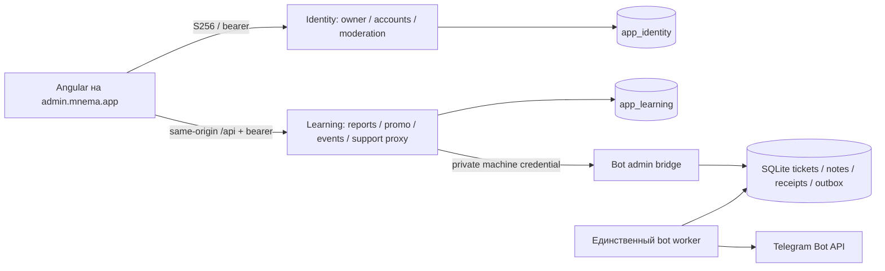

---
artifact:
  id: admin-console-architecture
  type: architecture
  title: "Owner console boundaries, reporting and support bridge"
  status: accepted
  created_at: "2026-10-09"
  updated_at: "2026-10-10"
  owners: ["project-owner"]
---

# Архитектура кабинета владельца

Требования приняты в [product contract](../product/admin-console.md).
Исполняемый HTTP и shapes принадлежат [admin contract](../../contracts/admin/README.md).
Точное состояние реализации и проверки — в
[delivery record](../engineering/evidence/admin-console-2026-10/README.md).

## Границы компонентов

Один существующий Angular bundle и два Mnema deployable достаточны.
Отдельный CMS, admin database/service, analytics warehouse или UI library не
решают текущую задачу. Identity владеет directory и moderation; Learning не
читает Identity tables. Directory запрашивается браузером у Identity с текущим
bearer. Learning владеет своими отчётами, usage/promo и editorial API.

Отклонены: копирование Identity данных в Learning, новая центральная DB,
доступ браузера к bot credentials/SQLite и второй Telegram poller. Они
добавляют владельцев состояния, поверхность доступа и неопределённые повторы.

## Доступ и admin-host

`MNEMA_ADMIN_OWNER_ACCOUNT_ID` задаётся явно в Identity и Learning. Пустое
значение закрывает console; неправильный UUID не должен открывать сервис.
Текущий subject/generation/grant проверяется до чтения данных и receipt.

Кабинет требует **оба** условия: точный аккаунт владельца и access token, выданный клиенту
`mnema-admin-web`. Identity пишет в каждый access token claim `client_id` (RFC 9068); Learning
`/admin/console/**`, `/admin/support/**` и Identity `/api/accounts/admin/{directory,audit}` принимают только
bearer JWT с `client_id = mnema-admin-web`. Токен `mnema-web` того же аккаунта, cookie-сессия и токен
без claim получают 403. Identity moderation (ban/unban/grant/revoke) при **настроенном** владельце требует то же;
пока владелец не настроен, она работает как до кабинета (действующий Identity admin, иерархия). Редактор
событий (`/admin/events`) и существующий promo-admin сохраняют независимую проверку и токен любого
клиента.

**Кабинет поставляется выключенным.** Production `compose.yaml` не фиксирует admin-origin:
`MNEMA_IDENTITY_ADMIN_ORIGIN` и `MNEMA_ADMIN_OWNER_ACCOUNT_ID` приходят из allowlist `prod`-секретов
и по умолчанию пусты. Пустой origin — клиент `mnema-admin-web` не зарегистрирован (и удалён вместе с
его grants, если был), вход на admin-хосте отклоняется; пустой владелец — все маршруты кабинета 403.
Включение — осознанное действие владельца, перечень в [VPS runtime](../operations/vps-runtime.md#owner-console).
Делегированная роль admin сама по себе не даёт console. События дополнительно
проверяют `MNEMA_EVENTS_OWNER_ACCOUNT_ID`; promo/moderation сохраняют фактическую
Identity authority и ограничения иерархии. Права модулей отражает access response.

В production `admin.mnema.app` в `Caddyfile` отдаёт SPA и same-origin Learning `/api`, как `mnema.app`. Без
`MNEMA_IDENTITY_ADMIN_ORIGIN` клиента `mnema-admin-web` нет, поэтому выключение возвращает прежний redirect на
`https://mnema.app/manage/events` ([порядок](../operations/vps-runtime.md#owner-console)).
Локально admin-origin — `https://admin.localhost:<порт web>` (тот же порт и сертификат, другой origin).
Lazy `/manage` shell исключает learner onboarding, promo popup и приватное
notification polling. Guard управляет представлением; сервер решает доступ.
Identity cookies остаются host-only на `auth.mnema.app`, CORS разрешает только
точно настроенные browser origins. Нет wildcard `.mnema.app` или общего cookie Domain.

При настроенном `MNEMA_IDENTITY_ADMIN_ORIGIN` Identity регистрирует отдельный
public client `mnema-admin-web`: exact `/auth/callback`, authorization code S256,
без client secret, access lifetime 20 минут. Existing `mnema-web` сохраняет
свой callback. Federation сохраняет выбранный разрешённый browser origin
в server-side одноразовом state; callback не принимает произвольный return origin.

Все административные данные `private, no-store`. Аудит содержит actor/action/
target/time/outcome, не тела переписки, коды, токены, prompts или материалы.
Mutation и audit одного владельца должны фиксироваться атомарно. Исход: Identity-журнал хранит
`SUCCESS` и `DENIED` (отказ действующему администратору, записанный отдельной короткой транзакцией после
отката, чтобы обычный аккаунт не раздувал журнал), причину блокировки (до 280 символов) только у `BAN`; Learning
журнал — только подтверждённые действия (`SUCCESS`, причины нет). Таблицы журналов append-only на уровне
PostgreSQL: триггеры отклоняют `UPDATE`, `DELETE` и `TRUNCATE`.

## Отчётность и точность

Отчёты bounded: UTC half-open `[from,to)`, максимум 90 дней. UI показывает
включённые calendar dates и отдельно преобразует конец в exclusive API дату.
Текущий незавершённый день назван частичным. generatedAt не означает свежесть
неподключённого источника. SQL агрегаты читаются в пределах одной согласованной
read snapshot; расходы/credits/байты не складываются.

| Источник | Что достоверно наблюдаемо | Предел интерпретации |
|---|---|---|
| `ai_provider_call` | Записанные calls/outcomes/token counts/latency и configured cost micro-USD | Estimate, не invoice; failed/PENDING могут иметь нулевую неизвестную стоимость; journal retention обычно 90 дней |
| `usage_ledger` / periods | Product DEBIT, fair-use operations, reservations, source/plan/expiry | Credits и stored micro-RUB weight не равны USD/provider invoice или выручке |
| Study persisted rows | Attempts/session outcomes в доступной истории | Не page views/clicks; учитывать mode и политику retention |
| `generation_provenance` | Durable publication provenance | Generation session/artifact rows имеют отдельный retention, не полный longitudinal funnel |
| Media catalog/blob | Текущие asset states и deduplicated inventory bytes | Snapshot, не помесячный storage/egress/CPU invoice; account source bytes не сумма всех variants |
| `billing_order` (T-Bank) | Заказы `PAID` и `REFUNDED` по `paid_at` в периоде (возврат переводит PAID в REFUNDED, поэтому выручка периода его не теряет): число и сумма в копейках (RUB); подмножество `REFUNDED` показано рядом | Брутто до комиссий банка, не выплата на счёт; возвраты не вычитаются; сумма возврата не хранится, частичный возврат учтён полной суммой заказа — верхняя граница; не смешивается с USD и ledger micro-RUB |
| Provider/cloud invoices | В текущем scope отсутствуют | `UNAVAILABLE`, а не ноль; entitlement/catalog price не заменяют поступление денег |

Usage-active cohort — distinct owner с DEBIT/fair-use activity в периоде.
Feature key `COALESCE(operation,bucket)` включает zero-credit STT/assessment.
Feature share = distinct пользователей операции / размер этой cohort; числители
пересекаются. Credit distribution включает fair-use-only пользователей с нулём.
p50/p95/p99 используют PostgreSQL `percentile_cont` и N; пустая population даёт null.
Latency population (`latency.sampleCount`, `population=RECORDED_LATENCY`: вызовы с записанной длительностью) и
failure/pending счётчики подписаны отдельно. Разбивка функций ограничена 64 строками, `featuresTruncated`
сообщает об усечении, как `routeGroupsTruncated` для маршрутов.

Журнал провайдеров не хранит owner_id. Нельзя распределять все расходы по
пользователям через случайный retained step join: для assessment/STT и purged
generation связь отсутствует. Mini report пользователя показывает точно
атрибутируемый usage; полная себестоимость пользователя недоступна без будущего
owner-aware provider evidence. Нет молчаливого fixed-FX RUB total или маржи.

## Поддержка: команды и доставка

Authoritative SQLite и single worker остаются в bot repository. Отдельный
`serve-admin` listener отключён по умолчанию, принимает только loopback и
отдельный machine bearer; бот token не нужен reader/command процессу.
Production соединение требует подготовленный private TLS transport;
stdlib listener нельзя выставлять публичным HTTP server.

**Предусловие, которого сейчас нет.** Learning принимает только `https` bridge (production принудительно
`ALLOW_LOOPBACK_HTTP=false`), а бот слушает plain HTTP на `127.0.0.1` хоста, тогда как Learning работает в
контейнере. Пока TLS-транспорт (приватный сертификат/прокси между контейнером и ботом) не поставлен,
`MNEMA_ADMIN_SUPPORT_ENDPOINT` и `_SECRET` остаются пустыми: поддержка в кабинете — явное состояние
UNAVAILABLE (`permissions.support=false`, спокойное русское сообщение, ни одного запроса к боту и без ошибок
в интерфейсе; прямой вызов API получает 503 `SUPPORT_UNAVAILABLE`). Транспорт не строится в рамках эпика #398;
его отсутствие — блокирующий пункт перед включением поддержки.

Learning использует один фиксированный configured HTTPS endpoint, ограниченные
timeout/concurrency/body/page sizes и не следует пользовательским URLs. Local
HTTP разрешён только явно для literal loopback fixture. Actor UUID извлекается
из текущего проверенного caller, не из browser payload.

Tickets исключают неподанные drafts. Фильтры ограничены, страницы keyset с ограниченным размером
(очередь до 100, переписка до 100, журналы по 50, коды по 200, директория по 50); интерфейс подгружает их
общим `app-auto-load`, без кнопок страниц.
Числовые Telegram/ticket/message IDs сериализуются строками. Attachment response
содержит только bounded metadata, не `file_id`, token или секретный download URL.

Команда содержит UUID и expectedVersion. SQLite transaction сначала ищет receipt:
тот же fingerprint повторяет acknowledgement, другой payload с тем же ID — conflict.
Далее CAS, изменение, audit, receipt и outbox записываются атомарно. Внутренние
notes отдельны от пользовательских messages; admin timeline задаёт единый порядок.
Другие worker/CLI изменения тоже должны инвалидировать version.

Unknown application HTTP outcome повторяет исходную команду. Telegram вызов
выполняет только существующий worker после commit. `queued` может сохраняться
во время long poll; `sent` означает API acceptance, не read receipt. Неясная
Telegram отправка становится `uncertain`; автоматического повторного send нет.
Неясную доставку оператор проверяет через существующий privileged recovery.

## Поставка и проверка

Production/DNS/bridge installation не входят в текущий локальный mandate.
Config/source-ready не означает deployed. Billing отдельно принадлежит #79/#389
(V45 в `main`). Admin Learning V48 и Identity V4 не пересекаются с `main`; применённые migrations
не переписываются. Merge в `main` выпускает runtime в production автоматически, поэтому кабинет
в нём выключен до настройки владельцем (см. выше); `compose.yaml` и `Caddyfile` проверяются drift-check и
ставятся администратором до одобрения релиза.

Проверка: реальный PostgreSQL HTTP deny/revocation/owner, arithmetic fixtures,
SQLite receipt/CAS/note-isolation/outbox, fake upstream bridge (без настоящего
Telegram), component privacy/retry/stale-response и браузерные flows. Затем
full repository gate и независимый adversarial review. Rollback сохраняет
source ledger/tickets/audit; политика account-linked audit/support retention и
удаления остаётся отдельной [Backlog-задачей #409](https://github.com/MattoYuzuru/Mnema/issues/409),
не разрешением на destructive purge. Transport выключается отдельно, документы называют
неподключённые источники и непроверенные devices честно.

Решения опираются на [Spring Security request authorization](https://docs.spring.io/spring-security/reference/servlet/authorization/authorize-http-requests.html),
[Angular guard boundary](https://angular.dev/guide/routing/route-guards),
[OAuth security BCP](https://www.rfc-editor.org/rfc/rfc9700.html),
[PostgreSQL 18 aggregates](https://www.postgresql.org/docs/18/functions-aggregate.html)
и [Telegram API](https://core.telegram.org/bots/api#sendmessage).
