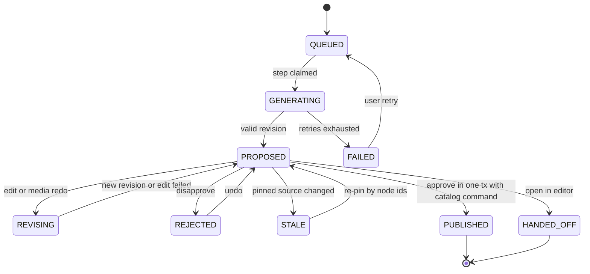
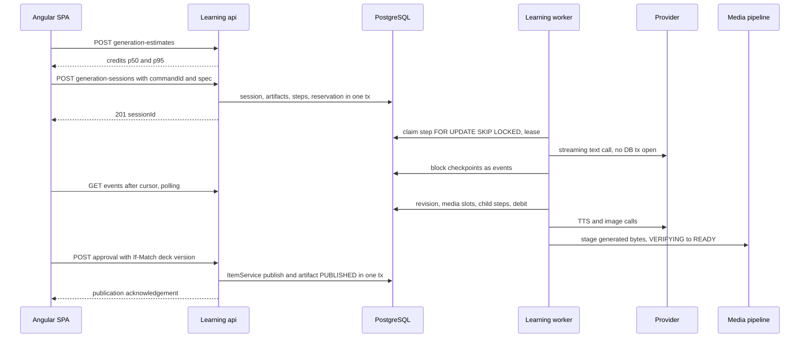

---
artifact:
  id: ai-generation-platform
  type: architecture
  title: "Mnema AI layer: generation, speech input, media and usage"
  status: accepted
  created_at: "2026-10-02"
  updated_at: "2026-10-02"
  owners: ["project-owner"]
  source_tasks: ["Epic #77 reactivation", "owner decisions 2026-10-01/02"]
  base_revision: "origin/main 9d462f7b (#274) for code facts"
  assumptions:
    - "Primary storage, Identity, payments and learning history stay in Russian hosting; a stateless AI gateway abroad is optional and needs a legal decision."
    - "The backend platform upgrade (Java 25, Gradle 9.8.0, Spring Boot 4.1.1, #278) and the frontend upgrade (Angular 22.2.1, Node 24 LTS, Vitest, zoneless, #306) are delivered. AI code is written to be portable."
    - "The seven exercise mechanics come from the server registry; ORDER/CATEGORIZE (#268) are merged: all seven mechanics exist in the registry and in contracts/study."
  unresolved_questions:
    - "TTS vendor accessible to a Russian sole proprietor with quality close to Google; Yandex SpeechKit needs an explicit owner exception."
    - "Whether faster-whisper on the first 4 vCPU / 8 GB VPS meets the dictation latency target; benchmark before choosing self-host vs API."
---

# AI-слой Mnema: генерация, голосовой ввод, медиа и usage

Этот документ — принятая архитектура AI-слоя после реактивации Epic #77. Он не
утверждает, что что-либо из него реализовано. Продуктовые решения — в
[AI layer product contract](../product/ai-layer-2026-10.md); исследование и
альтернативы — в [research index](../reviews/ai-layer-research-2026-10/README.md).
Факты о коде проверены на `origin/main` `9d462f7b`.

## 1. Решения

| # | Решение | Отклонено |
|---|---|---|
| A1 | AI-слой — модули `generation`, `generation.mbm`, `ai`, `usage`, `notification` внутри `services:learning`; независимое масштабирование и изоляция ключей — роль процесса одного jar (`learning.runtime.roles=api|worker|all`) | Отдельный `services:ai`: потребовал бы on-behalf-of доступа к owner-scoped контенту после истечения токена и распределённой публикации |
| A2 | `GenerationSession` («Мастерская», батч) → N × `GenerationArtifact` → immutable `ArtifactRevision` + `ArtifactTurn`; `GenerationStep` — durable job | Хранение AI-черновиков в `EditingDraft` (лимит 200, другой lifecycle) |
| A3 | Approve вызывает существующие `ItemService`/`ExerciseService` через caller-owned порт в одной транзакции (паттерн `CaptureItemPublisher`) | Прямая запись в catalog/study таблицы из worker |
| A4 | Материалы: модель пишет MBM → детерминированный компилятор → тот же `NativeDocumentReader`, что и публикация. Упражнения: strict JSON per mechanic → `ExerciseCommand` → семантический lint → self-evaluation через `AttemptEvaluation` | Генерация native-v1 JSON напрямую; доверие схеме провайдера |
| A5 | Прогресс в UI — append-only события с монотонным `seq` + adaptive polling; блоковое проявление; без token streaming, `EventSource` и WebSocket в v1 | Token streaming (генерация идёт в фоновом шаге; `EventSource` не передаёт bearer) |
| A6 | Свой PostgreSQL step queue по образцу `MediaProcessingRepository`: `FOR UPDATE SKIP LOCKED`, lease + fencing token, heartbeat, backoff, deadline, cancel, fairness | JobRunr (нужные функции только Pro), db-scheduler (нет DAG), Modulith events (не job queue), брокеры |
| A7 | Порты per capability + адаптеры на JDK `HttpClient`; routing и flags server-owned; существующий `/api/capabilities` расширяется | Spring AI (2.0 только Boot 4; 1.1 EOL; абстракции не нужны) |
| A8 | Usage: credits как внутренняя cost-weighted единица, versioned rate card, `reserve → settle → release`, append-only ledger; entitlement приходит из billing через inbox | Списание из браузера; unlimited |
| A9 | Общий durable центр уведомлений с read watermark; producer в той же транзакции | Отдельная outbox-доставка |
| A10 | У модели нет agency: вывод — данные; ссылки только из allowlist; медиа — untrusted upload через pipeline #76; промпты без ПД | Tool calling с побочными эффектами; хранение raw prompts |
| A11 | `ai-semantic` evaluator реализует существующий `SemanticAssessmentProvider`; строгость — серверная политика по состоянию objective; AI не пишет `StudyState` | Отдельный классификатор; строгость, выбранная моделью |

## 2. Границы и зависимости

```text
app.mnema.learning.generation        сессии, артефакты, ревизии, шаги, approve, HTTP, events
app.mnema.learning.generation.mbm    чистый компилятор MBM ↔ native-v1 (без Spring)
app.mnema.learning.ai                порты capability, routing, адаптеры, stub, provider_call log, prompt library
app.mnema.learning.usage             rate card, allowance, reservations, ledger, estimate, promo entitlements inbox
app.mnema.learning.notification      durable уведомления (общие, не AI-специфичные)
app.mnema.learning.capability        существующий fail-closed gate, расширяется
```

- `generation` зависит от портов `catalog` (publish/read item и exercise, read capture
  notes), команд `media` (`MediaCatalog`), `ai`, `usage`, `notification`.
- `catalog`, `study`, `media` **никогда** не зависят от `generation`. `ai` не знает о домене.
- Порты публикации принадлежат вызывающей стороне, как `CaptureItemPublisher`;
  реализации живут в `catalog.item` / `catalog.exercise`.
- Границы держатся package-private классами, как в `media`; ArchUnit/Modulith не вводятся.
- Это соответствует правилу [content platform](./content-platform-v2.md): workers
  пишут только integration-owned таблицы или вызывают application command.

Роли процесса: локально и в первой поставке — `all`. При разделении `api` не держит
ключей провайдеров и не исполняет шаги; `worker` отдаёт наружу только actuator, держит
ключи в env и исполняет шаги. Обе роли используют одну БД; пулы соединений ограничены
суммарно. Триггеры для настоящего отдельного deployable: worker-нагрузка бьёт по p95 API
при раздельных процессах; другая security-зона для ключей; провайдеры из другой
юрисдикции; независимый release cadence.

## 3. Доменная модель

| Таблица | Назначение | Мутабельность |
|---|---|---|
| `generation_session` | один запуск в колоде: `kind` (`MATERIALS`, `EXERCISES`, `REVISE_ITEM`, `REVISE_EXERCISE`), immutable `spec`, `state`, `reservation_id`, `row_version`, `last_activity_at`, `expires_at` | state/pointers под CAS |
| `generation_session_source` | закреплённые источники: `note_id + note_row_version`, `member_key + item_revision_id`, prompt text; роль `SOURCE` / `STYLE_EXAMPLE` | immutable |
| `generation_artifact` | нить одного будущего материала/упражнения: `target_kind`, `ordinal`, `state`, `current_revision_id`, `source_refs`, `publication_command_id`, `published_ref`, `row_version` | state/pointers под CAS |
| `generation_artifact_revision` | снимок предложения: `payload` (native-v1 для ITEM; exercise command без deck IDs для EXERCISE), `handles` (handle → nodeId), `cause` (`INITIAL`, `EDIT`, `MEDIA`, `REPIN`), `prompt_version`, `model_route`, `validation`; ≤30 на артефакт, ≤1 MiB | immutable |
| `generation_artifact_turn` | инструкция пользователя (≤2000 символов; текст или результат STT), `target_node_ids`, `status`, `step_id`, `result_revision_id`; ≤50 на артефакт | immutable после terminal |
| `generation_media_slot` | медиа-место в AST: `slot_key` (стабилен между ревизиями), `kind`, `spec` (голос, язык, prompt/query), `asset_id`, `state` | под CAS |
| `generation_media_ref` | hold для GC, аналог `draft_media_ref`, с `owner_id` и композитными FK как в `V10` | удаляется при закрытии/истечении |
| `generation_step` | durable job (§4) | lease-поля |
| `generation_event` | курсор прогресса: `session_id` + `seq` (per-session, выдаётся под row lock сессии, `UNIQUE(session_id, seq)`; не bigserial), `artifact_id`, `type`, малый `payload` | append-only, TTL |
| `ai_provider_call` | аудит и стоимость: `step_id`, `attempt`, `provider`, `model`, `request_hash`, `usage`, `cost_micros`, `provider_request_id`, `outcome`, `latency_ms`; без текстов промптов; 90 дней | append-only |
| `generation_provenance` | происхождение опубликованного: revision → session, model routes, prompt versions; **не показывается в UI** (решение владельца), служит аудиту и экономике | immutable |

Состояния артефакта:



Состояния сессии: `PLANNING` (только при включённом планировщике) → `PLAN_READY` →
`RUNNING` → `REVIEW` (все артефакты вне `QUEUED/GENERATING`) → `CLOSED`; побочные
`CANCELLED`, `EXPIRED`. Удаление сессии (hold-to-delete) физически удаляет
неопубликованные строки; опубликованное остаётся в catalog.

### Approve

`POST /api/decks/{deckId}/generation-sessions/{sid}/artifacts/{aid}/approval` с
`If-Match` версии колоды и `{commandId, expectedArtifactVersion, expectedRevisionId,
expectedDeckRevisionId}`. В одной транзакции: lock артефакта и проверка CAS; проверка,
что каждый media slot `READY` или явно удалён (решение владельца: approve требует
готовые медиа); `GeneratedItemPublisher.create(...)` → `ItemService` сам извлекает
media refs и привязывает assets; completion переводит артефакт в `PUBLISHED`, пишет
`published_ref` и provenance; `generation_media_ref` снимается после commit. Повтор
`commandId` — stored receipt (`Idempotency-Replayed`); устаревшая версия колоды — 412,
повтор с новым `commandId`. «Одобрить все готовые (N)» — одна bulk publication
(≤100 changes) и один completion.

Упражнение: `GeneratedExercisePublisher` → `ExerciseService` с
`objective.operation=reuse` там, где цель та же (иначе один навык расщепится на
несколько расписаний). Новая ревизия материала после генерации → артефакт `STALE` и
серверный re-pin по стабильным node IDs без LLM; если узлы исчезли — пользователь
решает.

### Handoff и retention

«Править самому» создаёт обычный `EditingDraft` из текущей ревизии (`member_key = null`
для нового материала); артефакт → `HANDED_OFF`. `learning.generation.session-retention`
= `P30D` от последней активности, уведомление за 3 дня; retention worker по образцу
`StudyRetentionWorker` удаляет неопубликованное и снимает holds; дальше действуют
существующие `unattached-ready-hold` (P7D) и two-scan GC.

### Эталоны и источники

Пользователь отмечает «Эталон» звёздочкой в колоде один раз (deck-local флаг на
`LearningItem`, не ревизия). Бриф сессии включает до двух эталонов и один самый
свежий материал с учётом размера (бюджет токенов на секцию, усечение по outline), в
кэшируемой части префикса. Заметки «На потом» закрепляются по `row_version`; при
закрытии сессии UI предлагает «Архивировать использованные заметки (N)»; conversion
N:M не вводится.

## 4. Оркестрация

`generation_step`: `step_id`, `session_id`, `artifact_id` (null для шагов сессии),
`owner_id`, `kind` (`PLAN`, `RESEARCH`, `TEXT_DRAFT`, `EDIT`, `TTS`, `IMAGE_GENERATE`,
`IMAGE_SEARCH`, `VIDEO_GENERATE`, `TRANSCRIBE`, `ASSESS`), `capability`, `state`,
`depends_on uuid[]`, `priority`, `attempts`, `lease_token`, `lease_until`,
`next_attempt_at`, `deadline_at`, `cancel_requested`, `input` (≤64 KiB), `output_ref`,
`error_code`, `external_job_id`, `idempotency_key` UNIQUE.

Состояния: `WAITING_DEPENDENCIES → READY → RUNNING → SUCCEEDED`; `RUNNING → READY`
(retryable, `next_attempt_at`) / `WAITING_EXTERNAL` / `FAILED` / `CANCELLED`.

- **Fan-out без barrier.** `TEXT_DRAFT` в одной транзакции создаёт ревизию, где media
  nodes уже ссылаются на заранее выделенные `assetId`, создаёт слоты и дочерние шаги
  `READY`. Когда asset становится `READY`, renderer показывает медиа. «Все слоты готовы»
  — производное условие, не шаг. Частичный успех — норма; approve блокирует только
  неразрешённый слот.
- **Claim** — `FOR UPDATE SKIP LOCKED` по `READY`, `next_attempt_at <= now()`,
  capability со свободным локальным слотом, мягкий per-account cap; затем новый
  `lease_token`, `lease_until`, `attempts+1`. Heartbeat на virtual thread продлевает
  lease только при совпадении токена; запись результата проверяет токен.
- **Жёсткие лимиты на admission**: ≤3 активные сессии, ≤20 артефактов в сессии `MATERIALS` (60 упражнений в сессии
  `EXERCISES`, решение владельца 2026-10-02), reservation. Семафоры per capability на инстанс (config): text 16, tts 4, image 2,
  video 1, search 4, assess 16.
- **Ни одна DB-транзакция не открыта во время вызова провайдера.** Checkpoint и
  завершение — короткие отдельные транзакции.
- **Таймауты Mnema** короче провайдерских: connect 5 s; idle stream 60 s; `TEXT_DRAFT`
  `PT6M`; `EDIT`/`TTS` `PT2M`; `IMAGE` `PT3M`; `ASSESS` deadline `PT20S` (цель p50 ≤3 s, p95 ≤8 s); видео —
  по deadline задачи провайдера. Каждый запуск шагов ограничен `PT1H`.
- **Ошибки**: 429 → backoff с `Retry-After` (≤6); transient → ≤3, затем fallback route;
  invalid output → один repair, затем strong route, затем `FAILED(INVALID_OUTPUT)`;
  refusal → `FAILED` без retry; budget → без вызова провайдера; source gone →
  `FAILED(SOURCE_UNAVAILABLE)` или `STALE`.
- **Circuit breaker** per `(provider, capability)`: 5 подряд неуспехов за 60 s →
  open 30 s → half-open; своя реализация (~80 строк), без Resilience4j/spring-retry.
- **Пробуждение worker**: `afterCommit` → executor (`all`), sweeper раз в 2 s, при
  разделении ролей `NOTIFY/LISTEN` как подсказка; источник истины — таблица.
- **Отмена**: `POST …/cancellation` переводит ожидающие шаги в `CANCELLED`, ставит
  `cancel_requested` на `RUNNING`; heartbeat обрывает HTTP-вызов; reservation
  освобождается кроме фактически потреблённого.
- **Идемпотентность**: at-least-once; intent `ai_provider_call` до вызова, usage после;
  списание по ключу `debit:{stepId}:{attempt}`.



## 5. Прогресс в UI

Аллокация `seq` событий (под row lock сессии, не `bigserial`) уточнена в [events contract](../../contracts/generation/events.json).

`GET /api/decks/{deckId}/generation-sessions/{sid}/events?after={seq}&limit=100` →
`{events, cursor, session: {state, rowVersion}, activeSteps}`. Типы: `ARTIFACT_STATE`,
`BLOCKS_APPENDED` (уже скомпилированные native-блоки, ≤32 KiB), `MEDIA_SLOT_STATE`,
`USAGE_UPDATED`, `SESSION_STATE`. Крупное содержимое — `GET …/artifacts/{aid}`.
События хранятся до закрытия сессии + 1 день.

Клиент: один цикл опроса на сессию — 1 s при видимой вкладке и активных шагах,
5–15 s в фоне, немедленно при `visibilitychange`, остановка в terminal-состоянии.
Worker использует streaming от провайдера для checkpoint'ов и прерывания и публикует
`BLOCKS_APPENDED` каждые ≥750 ms или на границе блока. Критерий добавления
streaming-endpoint (HttpClient `partialText` / `rxResource({stream})`, отдельный nginx
`location`): p50 до первого блока > 5 s по измерениям или заметно рваный UX. Контракт
событий при этом не меняется.

## 6. Формат вывода модели

### MBM v1 (материалы)

Подмножество Markdown + директивы; набор целиком задан native-v1 и узлами #76:

```text
# Заголовок (уровни 1–3)
Абзац с **strong**, *em*, `code`, [ссылка](https://…) и {漢字|かんじ}.
- пункт / 1. пункт
> цитата
---
::table{caption="…"}  + pipe-таблица (≤12 колонок, ≤100 строк)
::mermaid{title="…" description="…"}  + fenced source
::audio{slot="a1" lang="ja" voice="female" title="…"} текст для озвучивания
::image{slot="i1" mode="search|generate" alt="…"} запрос или prompt
::video{slot="v1" title="…"} prompt            (только при включённой capability)
::sources                                      список [n] из RESEARCH
```

Правила компилятора: серверные UUIDv4 на узлы; handle `[[b3]]` сохраняет node ID при
правке, если тип блока не изменился; media-директива создаёт slot и узел с заранее
выделенным `assetId`; `alt`/`title` обязательны; ссылка допускается только из allowlist
сессии (источники `RESEARCH`, URL из заметок пользователя), иначе остаётся текстом;
результат проходит тот же `NativeDocumentReader` (UTF-8, 1 MiB, 10 000 узлов, глубина
32, лексический профиль `href`/`lang`); неизвестная директива — ошибка. Repair — один
повтор с компактным списком «строка → правило»; многие ошибки чинятся детерминированно.
Точная грамматика и golden fixtures — [`contracts/generation/mbm-v1/`](../../contracts/generation/mbm-v1/README.md) (задача AI-00); остальные исполняемые контракты — [generation](../../contracts/generation/README.md), [usage](../../contracts/usage/README.md), [notifications](../../contracts/notifications/README.md).

### Упражнения (strict JSON)

Схема с `anyOf` по механике из `contracts/study/mechanics.json`; модель использует
локальные ID (`o1`, `l1`, `bl1`) и handles блоков материала (`m2:b3`); сервер
выделяет настоящие ID и компилирует `MATERIAL {memberKey, itemRevisionId, nodeId}`
закреплённой ревизии. Модель никогда не видит и не придумывает UUID. Проверка до
показа: (1) тот же разбор `ExerciseCommand`, что при публикации; (2) семантический
lint per mechanic; (3) self-evaluation тем же `AttemptEvaluation`, что у
`/exercise-previews` — ключ как ответ обязан быть `CORRECT`, дистрактор/переставленная
пара — `INCORRECT`; (4) опционально модель-критик для «Подробно». Схема провайдера
(`json_object` DeepSeek, strict tools beta, OpenRouter structured outputs) — подсказка;
источник истины — серверная валидация.

| Механика | Lint |
|---|---|
| `SELF_CHECK` | эталон непустой и не совпадает с условием |
| `FREE_RESPONSE` | нормализованный ответ не содержится в условии; альтернативы различны; `SOFT` не даёт пустую строку |
| `CLOZE` | каждый пропуск — существующий фрагмент закреплённого текста; ключ покрывает ровно blank IDs; `ANSWER_LENGTH` — ответы одной длины |
| `CHOICE` | 2..12 различимых вариантов; `SINGLE` ровно один верный; без «все/ни один из перечисленных» без явного запроса |
| `MATCH` | 2..6 пар, биекция, стороны различны, подписи не выдают пару |
| `ORDER` / `CATEGORIZE` (#268) | ≥2 различимых элементов, однозначный порядок / ≥2 непустые категории, элемент ровно в одной |

### Пробелы формата, закрываемые отдельно

- `code_block {lang, source}` (CONTENT-01, #303) поддерживается в native-v1 и MBM v1 (ограда ```` ``` ````
  вне `::mermaid`); контракт — [native-v1](../../contracts/content/native-v1/README.md#code-blocks).
  `math` остаётся opaque: решение «позже», отдельное решение по KaTeX/MathML не запланировано.
- `LearnerContent` не перемешивает варианты CHOICE при показе — задача STUDY-01.

## 7. Правки по выделению

Гранулярность — блок; выделение внутри абзаца расширяется до блока. Renderer в режиме
Мастерской помечает блоки `data-node-id`; Browse/Study этого не выводят. `POST
…/artifacts/{aid}/edits {commandId, expectedRevisionId, target:{nodeIds}, action ∈
REWRITE|IMAGE_SEARCH|IMAGE_GENERATE|AUDIO_REGENERATE|FREE, instruction}`; одна правка
на артефакт одновременно (`409 EDIT_IN_PROGRESS`). Контекст собирается в порядке,
удобном для prefix cache: стабильный системный блок → бриф сессии → outline + целевые
блоки ± сосед → ≤5 последних инструкций. Результат — MBM целевого диапазона; блок с
сохранённым handle и тем же типом оставляет node ID. Undo —
`POST …/artifacts/{aid}/revert {toRevisionId}` под CAS: перевод указателя.

## 8. Контекст и prompt library

Текст дешёв; владелец решил не экономить на контексте ради качества. Prompt library
живёт в `ai` как versioned ресурсы (`prompt_version` фиксируется в ревизии):

1. стабильный системный блок: что такое Mnema, формат MBM/JSON, запреты (без agency,
   без ссылок вне allowlist, без ПД);
2. «скиллы» стиля: общий стиль письма Mnema (человечный, ясный русский, пример перед
   правилом, ограничение плотности markdown) и per-type skills (словарная карточка,
   грамматика, STEM-концепт, код, конспект к экзамену);
3. бриф колоды: название, описание, outline материалов (заголовки/первые строки с
   бюджетом), эталоны (≤2 звёздочных + 1 свежий, по размеру), язык/уровень;
4. источники сессии (заметки, материалы, результаты поиска) — как untrusted data;
5. задача и настройки (effort, вложения, механики).

Пункты 1–3 стабильны в пределах сессии и попадают в cache-hit; 4–5 меняются.

Границы и правила (по [research: context and quality](../reviews/ai-layer-research-2026-10/context-and-quality.md)):

- рабочий вход на вызов генерации — 12–25k токенов, жёсткий потолок 32k для
  Flash non-thinking (длинный контекст деградирует: NoLiMa, RULER, Context Rot);
  50–100k — только `PLAN`/анализ колоды с thinking или на Pro, отдельная цена;
- обзор колоды — outline (`handle · заголовок · первая строка · число упражнений`,
  ≤200 строк ≈5k токенов) из существующей `item_preview`; для колод >200
  материалов: все эталоны, 40 последних, top-K по PostgreSQL FTS/`pg_trgm`
  (без векторной БД), хвост — счётчиками; «термины колоды» из одобренных
  материалов (≤60);
- эталоны: ≤2,5k токенов целиком, длиннее — скелетом; общий бюджет ≤6k;
  сервер считает «карточку стиля» из AST (объём, заголовки, списки, таблицы,
  примеры, аудио) и говорит модели «возьми форму, не бери факты»; неотредактированный
  AI-текст не используется как образец стиля (внутренний provenance); lint копирования —
  общая с эталоном n-грамма ≤8 слов, иначе repair;
- задача и ключевые правила — в конце промпта (повтор 3–5 правил); документы
  размечаются XML-тегами как untrusted data;
- общий self-critique проход не выполняется; repair — только по нарушениям lint,
  компилятора или self-evaluation; критик — опция «Подробно»;
- температуры (стартовые, уточняются в eval): материалы 0,7–0,9, упражнения
  0,3–0,5, грейдер 0,2–0,3; варианты CHOICE перемешиваются сервером при показе
  (position bias модели).

Бюджеты по сценариям, черновики промптов и slop-lint — в research; prompt
library версионируется в AI-02, бюджеты применяются в AI-04.

## 9. Провайдеры и capabilities

| Порт | Primary | Fallback | Stub |
|---|---|---|---|
| `TextGeneration` | direct DeepSeek V4.1 Flash (non-thinking; thinking выключать явно), эскалация V4 Pro | GigaChat (cloud.ru); OpenRouter как опциональный адаптер при доступности аккаунта | детерминированный Stub для local/CI |
| `SemanticAssessment` (есть seam) | DeepSeek Flash, rubric в кэшируемом префиксе | GigaChat Lite | `UNAVAILABLE` → self-check |
| `Transcription` (есть seam `SpeechToTextProvider`) | self-host в отдельном контейнере (2 vCPU / 2,5 GB, очередь, backpressure) с маршрутизацией по языку колоды: RU → GigaAM-v3 (MIT), остальные → Qwen3-ASR-0.6B int8 (Apache-2.0); Whisper turbo/medium на 4 vCPU слишком медленны для интерактива; benchmark на целевом VPS обязателен | Yandex SpeechKit STT (RU/EN, без KO/JA/ZH) при снятом исключении; внешние US/EU STT-API юридически закрыты для оператора из РФ (EU Reg. 833/2014 Art. 5n) — только по заключению юриста | ручной ввод |
| `SpeechSynthesis` | RU: Yandex SpeechKit TTS v1 (1 342 ₽/1M символов с НДС; terms разрешают кэш и переиспользование) при явном снятии исключения владельцем; FR/ES/JA/ZH/KO: MiniMax или Alibaba Qwen-Audio при легальной оплате, иначе self-host Qwen3-TTS/CosyVoice3 пакетно на почасовом GPU; кэш по SHA-256 канонического ключа (схема, нормализованный текст, язык, провайдер/модель/версия, голос, формат) в S3 по контент-адресу, `ON CONFLICT` + lease, без `account_id`, pre-warm при публикации, credits только при промахе | загруженное автором аудио | загруженное автором аудио |
| `ImageSearch` | Pexels + Pixabay + Openverse/Wikimedia; файл сохраняется, атрибуция в provenance и `caption` | — | — |
| `ImageGeneration` | позже (Pro/Max), после legal-проверки контрагента | — | — |
| `VideoGeneration` | не в первом релизе; порт зарезервирован | — | — |
| `WebSearch` | Yandex Search API (0,488 ₽ sync / 0,0305 ₽ deferred за запрос; иностранные языки через тип COM; российский контрагент) | Brave / Perplexity только при легальной оплате; Exa и Tavily исключают Россию; извлечение страниц — self-host jsoup за SSRF-guard | фактчек выключен |

Адаптеры — JDK `HttpClient` + Jackson + records (как `IdentityHttp`): ограниченный body,
deadline, без redirects; SSE провайдера читается построчно на virtual thread.
Routing — server-owned конфиг (`learning.ai.routes.text-fast=…`); fallback только на
429/5xx/timeout/invalid-after-repair; выбор модели скрыт от пользователя (без BYOK).
Capability flags — по существующему правилу `flag && adapter configured`:
`aiGeneration`, `textToSpeech`, `imageSearch`, `imageGeneration`, `videoGeneration`,
`webSearch` плюс существующие `aiAssessment`, `speechToText`. Reason codes:
`DISABLED`, `PROVIDER_NOT_CONFIGURED`, новый `TEMPORARILY_UNAVAILABLE` (circuit open /
глобальный бюджет). Квота — не capability: `GET /api/usage`. Per-provider kill-switch
и model id — в конфигурации, меняются без релиза.

Секреты — только имена env: `MNEMA_AI_DEEPSEEK_API_KEY`, `MNEMA_AI_GIGACHAT_AUTH_KEY`,
`MNEMA_AI_OPENROUTER_API_KEY`, `MNEMA_AI_PEXELS_API_KEY`, `MNEMA_AI_PIXABAY_API_KEY`,
`MNEMA_AI_OPENVERSE_CLIENT_ID`/`_SECRET`, `MNEMA_AI_SEARCH_API_KEY`, `MNEMA_AI_TTS_API_KEY`;
только в окружении `worker`; отдельные ключи на окружение; лимит трат на стороне
провайдера как последний предохранитель. CI никогда не ходит к реальным провайдерам;
live-тесты — отдельная opt-in Gradle-задача с ключами из локального окружения.

Observability: структурированные логи `ai_call provider=… model=… capability=…
step_id=… outcome=… latency_ms=… in_hit=… in_miss=… out=… cost_micros=…` без промптов
и ПД; Micrometer: `mnema_ai_calls_total{provider,model,capability,outcome}`,
`mnema_ai_call_seconds`, `mnema_ai_cost_micros_total`,
`mnema_generation_step_queue_age_seconds`, `mnema_generation_repairs_total`,
`mnema_generation_accept_ratio`, `mnema_usage_reserved_credits`. Продуктовая метрика —
cost per accepted item.

## 10. Usage, credits, ledger

- `usage_allowance` (аккаунт × период: credits, график недельного разблокирования Free,
  media count-caps, STT bucket, assessment bucket), `usage_balance` (материализованный
  остаток, `row_version`, в одной транзакции с ledger), `usage_reservation`
  (`ACTIVE → SETTLED / RELEASED / EXPIRED`), `usage_ledger_entry` (append-only:
  `GRANT`, `DEBIT`, `REFUND`, `ADJUSTMENT`, `EXPIRE`; `cost_micros`, `idempotency_key`
  UNIQUE, `rate_card_version`).
- Жизненный цикл reservation (сессия — только начальный батч, каждое последующее действие — своя reservation, период, never-negative) уточнён в [usage contract](../../contracts/usage/README.md#reservation-lifecycle).
- Preflight: `POST /api/decks/{deckId}/generation-estimates` → credits p50/p95. Старт
  резервирует p95 в той же транзакции, что создаёт сессию; нехватка → `409
  USAGE_LIMIT_REACHED` с остатком и датой обновления. Перед вызовом остаток reservation
  задаёт `max_tokens`. `DEBIT` по факту идемпотентно в транзакции результата шага;
  `RELEASE` при завершении/отмене; осиротевшие reservations истекают по TTL.
- Шаги `FAILED` по вине провайдера не списываются; repair внутри успешного шага —
  списывается. Пользователь не уходит в минус.
- «Потратить X% на колоду»: `budget = X% × текущий остаток`, становится reservation и
  входом планировщика.
- Entitlement: потребление — в Learning; покупки, промокоды и периоды — в будущем
  billing-контексте (#79), который публикует **entitlement snapshot** (план, период,
  allowances, `valid_until`) в `entitlement_inbox` идемпотентно. До billing —
  `EntitlementSource` port с конфигурационной реализацией. Browser return URL никогда не
  меняет права. Удаление аккаунта удаляет/обезличивает ledger по retention schedule.

## 11. Семантическая проверка объяснений (`ai-semantic`)

Реализует существующий `SemanticAssessmentProvider` поверх `TextGeneration`.

- **Рубрика** (расширение typed evaluation из #266): эталон; критерии с `tier ∈
  CORE | DETAIL | TERM` и весом; `misconceptions[]`; `acceptableTerms[]`. Пишет автор
  или генератор (AI-13): 2–3 CORE, 1–4 DETAIL, 0–2 TERM.
- **Грейдер** (DeepSeek Flash non-thinking, рубрика в кэшируемом префиксе, strict
  JSON): по каждому критерию — дословная цитата из ответа и заметка, затем вердикт
  `MET | PARTLY | NOT_MET | CONTRADICTED | UNCLEAR`; флаги `OFF_TOPIC`, `ASR_GARBLED`.
  Уровень строгости модели **не передаётся**; итог собирает сервер.
- **Прогрессивная строгость** — серверная versioned policy `ai-semantic-v1` по
  `StudyState` objective в текущем learning epoch: S1 «Знакомство» (нет попыток или
  level ≤1), S2 «Закрепление» (level 2–3), S3 «Владение» (level ≥4 или correctStreak
  ≥2); первая попытка конкретного упражнения — не строже S2; на любом уровне
  `OFF_TOPIC`, ни одного CORE ≥ PARTLY или любой `CONTRADICTED` → INSUFFICIENT.
  Mapping: COMPLETE → CORRECT (S1 — `LOW`, S2/S3 — `MEDIUM`), PARTIAL → PARTIAL,
  INSUFFICIENT → INCORRECT; `HIGH` AI-проверка не даёт никогда; PARTIAL не
  переименовывается в CORRECT — мягкость S1 кодируется порогом и `LOW`.
- **Неуверенность провайдера** (расхождение двух прогонов на S2/S3, `UNCLEAR` в
  CORE, `ASR_GARBLED`) никогда не становится result: presentation переходит в
  self-check; result `UNSURE` остаётся только для неуверенности, заявленной
  учеником. Это исправляет расхождение `contracts/study` ↔ reducer, где `UNSURE`
  снимает уровень.
- **UNAVAILABLE/таймаут** → `NOT_ASSESSED` + «Оцените себя», не ошибка ученика.
- **Прозрачность**: после ответа — «Есть: …» с цитатами, «Не хватает: …», эталон;
  после S1 — предупреждение о росте строгости. До ответа — только условие.
- **Dispute**: «Не согласен» заменяет AI-evidence самооценкой компенсирующей
  append-only transition, пока она последняя для objective (CAS); отправка примера
  владельцу — только с явного согласия.
- **Голос**: STT → транскрипт показывается и редактируется до отправки → тот же путь
  с `reasonCode SPEECH`; термины колоды передаются STT как подсказка.
- **SLA**: шаг `ASSESS` синхронен через короткий polling; цель p50 ≤3 s, p95 ≤8 s;
  на 5-й секунде UI предлагает «Оценить себя»; deadline 20 s → `UNAVAILABLE`.
  Thinking и Pro для проверки не используются. «Live»-оценка частичного ввода не
  делается (×10–20 к fair-use и канал подсказок).

## 12. Центр уведомлений

`notification(notification_id, owner_id, kind, severity, params jsonb ≤4 KiB, route,
dedupe_key, created_at, dismissed_at, expires_at)`, `UNIQUE(owner_id, dedupe_key)`;
`notification_cursor(owner_id, read_upto)`. `NotificationPublisher.publish(...)` в
той же транзакции, что доменное изменение. `GET /api/notifications?after=&limit=20` →
items + `unreadCount` + `activeWork`; `PUT …/read-cursor`; `DELETE …/{id}`. Текст
формирует клиент по `kind + params`. Retention 30 дней / 200 на аккаунт. Опрос с
ETag/304 раз в 30–60 s, раз в 10 s при `activeWork > 0`. Первые типы:
`GENERATION_READY`, `GENERATION_PARTIAL`, `GENERATION_FAILED`, `USAGE_LOW`,
`USAGE_EXHAUSTED`, `GENERATION_SESSION_EXPIRING`, `MEDIA_PROCESSING_FAILED`.

## 13. Безопасность и privacy

- У модели нет agency; её вывод компилирует детерминированный код. Заметки, материалы,
  веб-сниппеты — untrusted data с явным framing (OWASP LLM01/05/06/10).
- Бюджеты задаёт подтверждённый пользователем spec; intent parsing возвращает spec,
  который сервер клампит и показывает чипами. Текст никогда не тратит credits без
  подтверждённого плана.
- Ссылки — только из allowlist; YouTube — только `videoId`; Mermaid strict; байты от
  провайдера/из интернета — untrusted upload через FFmpeg-контейнер без сети с более
  строгими лимитами (изображение ≤10 MiB, аудио ≤10 мин).
- «Найти похожее»: только лицензированные источники; скачивание с allowlist хостов,
  HTTPS, без cross-host redirects, DNS-резолв с отказом для private/loopback/link-local/
  metadata (включая IPv4-mapped IPv6), потоковый предел размера.
- В prompt никогда не попадают email, имя, payment data, account UUID; `user_id` =
  `HMAC(account_id, rotating key)`; preflight предупреждает о похожих на ПД фрагментах
  с вариантом исключить; raw prompts и ответы не хранятся дольше job.
- Данные пользователей, Identity, медиа и платежи — в РФ. Передача обезличенного
  учебного текста провайдеру — трансграничная передача; уведомление РКН до начала и
  disclosure перед первым AI-действием — human actions эпика. Голос — ПД; STT
  предпочтительно self-host в РФ; внешний STT — только после проверки terms.

## 14. Веб-поиск по effort

И потолок на шаг, и списание по факту. Дефолты: Короткий 0; Средний 2 (только при
«Проверять факты»); Подробный 6; Auto — модель предлагает, сервер клампит до 3;
максимум 15 — настраиваемый cap. Pipeline: `RESEARCH` (дешёвая модель предлагает ≤N
запросов strict JSON) → сервер выполняет через `WebSearch`, дедуплицирует, нумерует →
`TEXT_DRAFT` ставит `[n]`; `::sources` компилируется в heading + список ссылок, URL
которых обязаны быть в результатах. Страницы целиком не скачиваются.

## 15. Platform

Backend (#278, доставлено): Java 25 LTS (Temurin 25.0.4.1), Gradle 9.8.0, Spring Boot 4.1.1
(Framework 7.0.9, Security 7.1.1 с Authorization Server внутри, Session 4.1.1, Jackson 3.1.5,
JUnit 6.0.3, Testcontainers 2.0.5, Flyway 12.4.0; Tomcat закреплён на 11.0.26 поверх 11.0.24 из
BOM ради исправлений безопасности), JaCoCo 0.8.15, `-Xlint:all -Werror`. Frontend (#278, доставлено
в #306): Angular 22.2.1 zoneless (TypeScript 6.0.x), Node 24.21.0 LTS, ESLint 10, unit-тесты на
Vitest 5 + jsdom (геометрия — в browser harness). Разобранные риски backend — семантика Jackson 3 (`JacksonException`
unchecked, строгие `JsonNode`-аксессоры), стартеры Flyway/Session JDBC; факты и тесты — в
[platform research](../reviews/ai-layer-research-2026-10/platform-speech-search.md) и
[repository guide](../engineering/repository-guide.md#platform-baseline).
Порядок и characterization-тесты — в [platform research](../reviews/ai-layer-research-2026-10/platform-speech-search.md).
AI-код пишется переносимо: JDK `HttpClient`, без spring-retry и Resilience4j; Spring AI
не используется и может быть пересмотрен после миграции.

## 16. Источники

Внутренние: [content platform](./content-platform-v2.md),
[revision storage](./revision-storage-and-runtime-boundaries.md),
[native content format](./learning-content-format-v2.md),
[native-v1 contract](../../contracts/content/native-v1/README.md),
[Study contract](../../contracts/study/README.md),
[exercise catalog](../product/exercise-catalog-v2.md),
[media refinement #76](../engineering/epic-76-refinement.md),
[media GC](../engineering/media-gc.md), [Learning guide](../../backend/services/learning/guide.md).
Внешние источники с датой доступа — в [research index](../reviews/ai-layer-research-2026-10/README.md).
