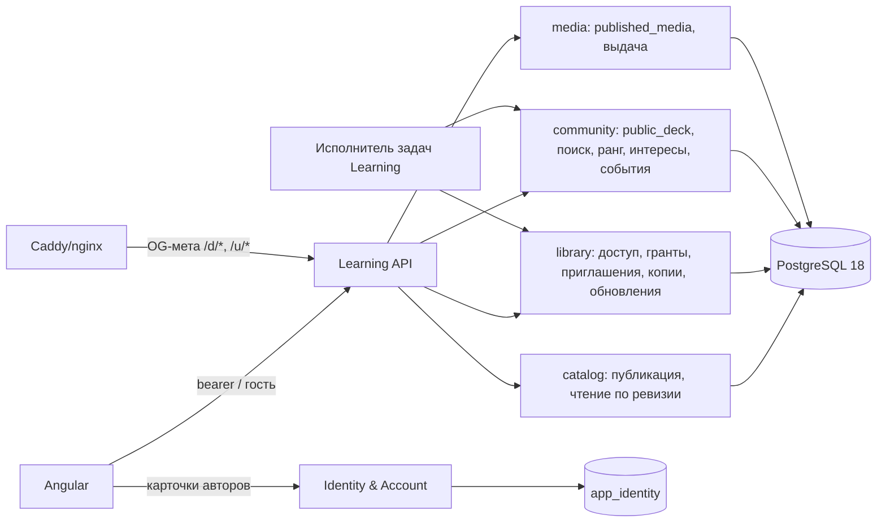
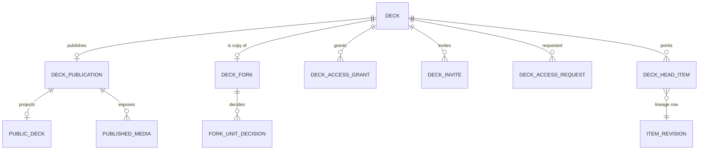

---
artifact:
  id: community-decks-architecture
  type: architecture
  title: "Колоды сообщества: линия ревизий, доступ, копии, обновления, каталог и поиск"
  status: accepted
  created_at: "2026-10-10"
  updated_at: "2026-10-10"
  owners: ["project-owner"]
  decision_scope: [lineage-storage, deck-access, publication, forks, upstream-updates,
                   media-authorization, catalog-search, ranking-recommendations, public-urls]
  supersedes_clauses:
    - "revision-storage-and-runtime-boundaries.md: 'A future fork … cannot require eager per-item rows' (replaced by §5)"
    - "content-platform-v2.md: visibility PUBLIC/REQUEST_RESTRICTED/PRIVATE (replaced by four levels, §6)"
  evidence:
    - "docs/reviews/community-decks-2026-10/ (RFC, research, index audit, adversarial review reconciliation)"
    - "code and schema at origin/main 284b4664"
---

# Колоды сообщества: архитектура

Принятая архитектура. Продуктовое поведение описано в
[контракте](../product/community-decks.md), задачи — в
[refinement](../engineering/community-decks-refinement.md). Обоснование и
отклонённые варианты — в [RFC](../reviews/community-decks-2026-10/rfc.md).

Статус реализации — **не реализовано**. Документ задаёт цель, и каждый
инвариант подтверждается тестом в задаче, которая им владеет.

## 1. Решения

| ID | Решение | Отклонено |
|---|---|---|
| CD-1 | Неизменяемые ревизии материалов, упражнений, целей, привязок, превью и медиа-ссылок принадлежат **линии** (`reuse_scope_id`). Колода хранит только указатели голов и свой журнал изменений. | Копирование строк повтором публикаций (сотни синтетических ревизий). Импорт с сохранением ID (ломает инварианты). Сразу полный copy-on-write (нужен индекс манифеста по ключу; это следующий шаг, §13). |
| CD-2 | Копия создаётся за O(1): колода в линии источника, ревизия на корни опубликованной ревизии, durable pins, `deck_fork`. Указатели голов пишет фоновая задача. | Ленивая материализация: нужен «держатель строк» и двойной путь чтения. |
| CD-3 | Доступ — `DeckAccess`: владелец / грант / публичная / по ссылке. Чужое чтение идёт отдельным read-only путём по опубликованной ревизии. Мутации — только владелец. | Ослабить предикаты владельца в существующих мутациях. |
| CD-4 | Явная публикация `deck_publication.published_revision_id`. Видимость и метаданные лежат в отдельной таблице, потому что `deck_head_guard` блокирует любые колонки `deck`. | Колонки в `deck`; «каждое сохранение публично». |
| CD-5 | Обновление — трёхсторонний план по единицам с frontier-diff страниц. По умолчанию вручную, авто — явная настройка копии и фоновая задача после публикации. | Авто по умолчанию; запись при чтении; рассылка уведомлений копиям. |
| CD-6 | Медиа чужой колоды авторизуются через проекцию `published_media` или головы собственной копии. Не владельцу отдаются только производные варианты. | Сканирование манифеста на запрос; отдача исходников всем. |
| CD-7 | Каталог — проекция `public_deck` над опубликованной ревизией: outbox из публикации, агрегаты считает задача. Поиск — PostgreSQL FTS + `pg_trgm` + синонимы тем. | Внешний движок до порогов §12. Пересчёт агрегатов в транзакции публикации. |
| CD-8 | Ранг пересчитывается раз в час поколениями. Персонализация — интересы по темам, без ML. События лежат в своей схеме с месячными партициями. | Коллаборативная фильтрация и эмбеддинги до порогов. |
| CD-9 | Публичный профиль автора отдаёт Identity только при отдельном согласии (152-ФЗ ст. 10.1). Learning хранит лишь `owner_id`. | Копировать данные Identity в Learning. |
| CD-10 | URL `/d/{code}/{slug}`: случайный код base58, slug вычисляется, 301 на канонический адрес. OG подставляет веб-сервер, без SSR. | `/@author/slug`; Angular SSR сейчас. |

## 2. Компоненты и владение данными

- Learning не читает таблицы Identity. Браузер сам берёт карточки авторов у
  Identity: `GET /api/accounts/profiles?ids=…` (до 50 id, только при согласии) и
  `GET /api/accounts/profiles/by-username/{u}`. Так же сейчас работает директория
  кабинета.
- Модули `library` и `community` — новые пакеты в `app.mnema.learning`. Своих
  deployable у них нет.
- Тяжёлая работа выполняется задачами в существующей роли воркера, с отдельными
  очередями и лимитами: копии, применение обновлений, агрегаты, ранг, интересы.
- **Исполнитель задач.** Нужен общий исполнитель: lease, retry, progress,
  per-account concurrency. Сначала проверить, подходит ли паттерн
  `platform/wake` + leases генерации; новый фреймворк не вводить.

## 3. Модель данных (новое и изменённое)

| Таблица | Ключ | Назначение |
|---|---|---|
| `deck_publication` | `deck_id` | `visibility`, `published_revision_id`, `published_at`, `public_code` (unique), `code_rotated_at`, `topic_id`, `content_language`, `target_language`, `level`, `tags`, `release_note`, `requests_enabled`, `row_version` |
| `deck_fork` | `deck_id` | `upstream_deck_id`, `base_revision_id`, `forked_at`, `auto_update`, `detached_at`, `materialized_at`; уникальность живой копии `(owner, upstream)` |
| `deck_access_grant` | `(deck_id, grantee_id)` | `role` (`VIEWER`; `EDITOR` в резерве), `granted_by`, `granted_at` |
| `deck_invite` | `invite_id` | `deck_id`, `token_hash` (unique), `max_uses`, `uses`, `expires_at`, `revoked_at` |
| `deck_access_request` | `(deck_id, requester_id)` | `status`, `created_at`, `decided_at` |
| `fork_unit_decision` | `(deck_id, unit_kind, unit_key)` | `resolved_upstream_revision_id`, `decision` (`KEEP_MINE` / `DECLINE_NEW` / `KEEP_DELETED`), `pending_base_revision_id` |
| `published_media` | `(deck_id, revision_id, asset_id)` | `kind`; пишется инкрементально командой публикации |
| `topic`, `topic_alias` | `topic_id`; `(alias_norm, topic_id)` | Двухуровневый справочник, синонимы ru/en/исходные |
| `public_deck` | `deck_id` | Проекция каталога (§10), STORED tsvector |
| `deck_engagement` | `(deck_id, account_id, kind)` | `first_at`, `last_at`, `study_days` — источник метрик |
| `deck_rank`, `rank_generation` | `(generation, deck_id)` | Поколения ранга, хранение 24 ч |
| `user_topic_interest` | `(account_id, topic_id)` | `weight`, `updated_at`, ≤20 строк |
| `catalog_event` | `uuidv7` | Месячные партиции, 13 месяцев |
| `deck_exposure_day` | `(deck_id, day, surface)` | `n` |
| `content_complaint` | `complaint_id` | Жалобы, решения, журнал снятий (§11) |

Все новые таблицы — в `app_learning`, кроме согласия на профиль: оно в
`app_identity`.

## 4. Линия: неизменяемые строки (CD-1)

- **Перенос ключей.** `item_revision`, `item_preview`, `content_media_ref`,
  `exercise_revision`, `exercise_content_binding`, `exercise_media_ref`,
  `objective_revision` и идентичности `learning_item`, `exercise_definition`,
  `memory_objective` переходят на ключ `(reuse_scope_id, …)`.
  - `deck_id` и `deck_revision_id` остаются колонками происхождения (origin) без
    FK на колоду читателя.
  - Цепочки ревизий и `sequence` остаются линейными внутри линии. Если правка в
    копии отходит от общей истории, у ревизии есть явный `parent_revision_id`.
    Уникальность по номеру заменяется уникальностью `(reuse_scope_id,
    revision_id)` и проверкой родителя.
- **У колоды остаются:**
  - головы: `deck_head_item`, `deck_head_exercise`, `objective_head`;
  - журналы: `deck_item_change`, `deck_exercise_change`;
  - проекции.

  Головы ссылаются на строки линии. На единицу приходится примерно 0,2–0,25 КБ.
- **Study.** FK Study (`study_candidate`, `study_presentation`, `study_evidence`,
  `study_policy_assignment`) переводятся на строки линии. `deck_id` в них остаётся
  личной колодой ученика. Ключи прогресса не меняются: `(account_id, deck_id,
  objective_id)`.
- **Авторизация** определяется не строкой линии, а только головой колоды или
  опубликованной ревизией, к которой у читателя есть доступ. Голый `revision_id`
  доступа не даёт.
- **Prerequisites:**
  - GC хранилища работает в production
    ([MattoYuzuru/Mnema#417](https://github.com/MattoYuzuru/Mnema/issues/417));
  - прототип «несколько колод в одном scope» проверил GC, пины и уникальности до
    массовой миграции.
- **Миграция.** Пользователей ноль, поэтому миграция идёт в одном окне обслуживания:
  backfill ключей линии из `deck.reuse_scope_id`. Откат — восстановление из
  backup перед миграцией. Двойных записей и адаптеров нет (правило greenfield).

## 5. Копия (CD-2)

1. **`POST /decks/{source}/forks`**: идемпотентно по command id, в контексте
   копирующего.
   - Проверки:
     - `DeckAccess.canFork`;
     - у источника есть `published_revision_id`;
     - живой копии этого источника у пользователя нет.
   - Создаётся колода с `reuse_scope_id` источника, ревизия 0 с корнями
     опубликованной ревизии и пинами копирующего (O(1)), `deck_fork`.
   - Ставится задача материализации.
   - Ответ — id колоды и `preparing=true`.
2. **Задача материализации** вставляет головы пачками по манифесту опубликованной
   ревизии: `INSERT … SELECT` по ключам линии, ≤N строк на транзакцию, затем
   отмечает `materialized_at`.
   - Повтор после сбоя продолжает с курсора.
   - До `materialized_at` хаб копии показывает «Готовим колоду…» и read-only
     чтение по ревизии. Мутации и Study отвечают 409 `deck.preparing`.
3. Копия копии использует свою опубликованную ревизию, если копия публикуется, или
   недоступна, если копия приватна. Рекурсии нет: корень указывает прямо на
   страницы.
4. **«Отвязать»** ставит `detached_at`. Обновления прекращаются, содержимое
   остаётся.

## 6. Доступ и публикация (CD-3, CD-4)

- **`DeckAccess.resolve(actor | guest, deckId | code)`** возвращает `OWNER`,
  `GRANTEE`, `PUBLIC`, `LINK` или `NONE`.
  - `NONE` для приватной или несуществующей колоды → 404.
  - `NONE` для «по приглашению» → 403 без названия.
  - Публичные эндпоинты (гость, `LINK`/`PUBLIC`) — отдельный набор маршрутов без
    JWT, с rate limit по IP/аккаунту.
- **Read-only путь** читает **опубликованную** ревизию. Владелец, читающий свою
  колоду, по-прежнему видит голову. Около 150 предикатов владельца в мутациях не
  ослабляются.
- **Публикация** — команда `POST /decks/{id}/publication`:
  - вход: `expectedHeadRevision`, метаданные, `releaseNote`;
  - CAS по `deck_publication.row_version`, ревизия колоды не создаётся;
  - инкрементально обновляет `published_media`, пишет outbox для `public_deck`;
  - первая публикация происходит при выходе из «Приватной».
- **Смена видимости** не трогает `deck.row_version`, поэтому у открытого редактора
  нет 412. При понижении меняется `public_code`.
- **Гранты, приглашения, запросы:**
  - приглашение хранится хешем токена и погашается вошедшим пользователем в
    транзакции (`uses < max_uses`, не истекло, не отозвано);
  - запросы ограничены по частоте и шлют агрегированные уведомления
    `DECK_ACCESS_REQUESTED` / `DECK_ACCESS_GRANTED`;
  - логин резолвится только для профилей с согласием, ответ одинаков для «нет» и
    «скрыт».

## 7. Обновления (CD-5)

- **Diff.** `frontierDiff(rootA, rootB)` сравнивает множества достижимых id
  страниц двух корней одной линии.
  - Общие поддеревья (path-copy) пропускаются, отличающиеся листья дают
    `(member_key | exercise_key, descriptorA, descriptorB)`.
  - Сдвиг ординалов после вставки на результат не влияет.
  - Цель — O(изменений · log N). Её подтверждает бенчмарк в задаче.
  - Перевыпуск всех страниц («rebuild») для опубликованных линий запрещён.
- **Единицы:** метаданные колоды, материал, упражнение (включая `enabled`), цель,
  порядок материалов.
- **Классификация** (базы — `deck_fork.base_revision_id` или
  `pending_base_revision_id` единицы):

  | У автора | В копии голова | Класс |
  |---|---|---|
  | изменена | == база | безопасно |
  | изменена | ≠ база, содержимое ≠ (fingerprint) | конфликт |
  | изменена | ≠ база, но содержимое совпадает | безопасно (откат правки) |
  | новая | — | безопасно (если не `DECLINE_NEW`) |
  | удалена | есть | спросить |
  | изменена после `resolved_upstream_revision_id` | — | спросить снова |

- **Зависимости.** Упражнение автора тянет свои материалы и цели. Если у
  ученика своя голова материала, привязка проверяется по node id: узлы есть —
  безопасно, нет — конфликт. Неголовные ревизии из привязок доступны, потому что
  принадлежат линии.
- **План** (`GET /decks/{fork}/update-plan`) закрепляет `forkHead` и
  `upstreamPublished`. Любое расхождение при применении → 409, план строится
  заново.
- **Применение** — `POST /decks/{fork}/update-plan:apply` с выбором по единицам.
  - Это одна **комбинированная** ревизия копии с материалами, упражнениями, целями,
    метаданными и порядком — новый путь публикации.
  - До 100 единиц синхронно, больше — задача.
  - Идемпотентно по command id.
  - База колоды сдвигается, только если не осталось ожидающих единиц. Иначе у
    ожидающих единиц сохраняется своя `pending_base_revision_id`.
- **Авто-режим.** После публикации источника ставится задача для копий с
  `auto_update` и активностью за 30 дней, с троттлингом. Она применяет только
  безопасное и пишет «Что нового». Путь чтения ничего не записывает.
- **Значок «Есть обновление»** вычисляется при чтении:
  `base_revision_id ≠ published_revision_id` источника, у которого есть доступ.
- **Study.** Выдача опирается на актуальные головы, поэтому после применения
  меняются следующие выдачи. Показанная попытка сохраняет снимок.

## 8. Медиа (CD-6)

- **Авторизация ассета для не владельца:**
  - `DeckAccess` к колоде;
  - ассет есть в `published_media` её опубликованной ревизии, **или** зритель —
    владелец копии, и ассет есть в медиа-ссылках голов копии.

  Это O(1) по индексам.
- Медиа-ссылки линии хранят `asset_owner_id`. Запросы, которые джойнят
  `asset.owner_id = ref.owner_id`, переписываются в той же задаче:
  `exercise_media_ready`, `MediaManifestCatalog`, `MediaCatalog`.
- **Тест fail-closed:** отсутствие строк не равно «готово», без `COALESCE(…,
  TRUE)`.
- **Гости и чужие зрители** получают только производные варианты (playback,
  poster, thumbnail) без EXIF, через публичный media-эндпоинт с rate limit.
  Исходник с `attachment` получает только владелец.
- **Офлайн-манифест копии** строится по колоде копии. Холды ассетов автора
  держатся ссылками линии, а GC медиа уже учитывает ссылки контента.
- **Атрибуция** стоковых изображений берётся из provenance. Лицензия NC блокирует
  перевод колоды в «Публичную» с понятной причиной.

## 9. Ссылки, OG, rate limits (CD-10)

- **`public_code`** — 10 символов base58 из CSPRNG, уникальный индекс. При
  коллизии — повтор.
- **Ссылки:** `/d/{code}/{slug}`. Slug — транслит, до 80 символов, вычисляется.
  Неверный slug → 301. Self-canonical.
- **«По ссылке» и «по приглашению»:** без slug, `noindex`, обобщённое OG.
- **OG без SSR.** Веб-сервер для HTML-запросов `/d/*`, `/u/*` берёт
  `GET /public/meta/{code|username}`: короткий кэш, только публичные поля и
  карточка автора с согласием. Он подставляет `title`, `description`, `og:*`,
  `canonical`, `robots` в `index.html`.
- **Sitemap** строится из `public_deck`.
- **Rate limits:**
  - публичное чтение и поиск гостя — по IP;
  - резолв логина и создание запросов — по аккаунту;
  - публичные медиа — по IP и колоде.

## 10. Каталог, поиск, ранг, рекомендации (CD-7, CD-8)

- **`public_deck`** — строка на публичную колоду, только над
  `published_revision_id`.
  - Outbox из публикации, а задача пересчитывает агрегаты инкрементально:
    состав, медиа-флаги, механики, порог качества.
  - Поиск:
    - `search_ru` = russian(A название, B описание, C теги);
    - `search_simple` = simple_unaccent(A, B, C);
    - `title_norm`.

    Все три — STORED.
- **Поиск:**
  - `websearch_to_tsquery` по двум векторам;
  - `word_similarity` по `title_norm`;
  - расширение запроса по `topic_alias`;
  - релевантность `0.6·ts_rank_cd(…, 1|32) + 0.2·word_similarity + 0.2·pop_pct`,
    понижение при несовпадении языка;
  - кандидаты — топ-200, курсор `(score, deck_id, generation)`.
- **Ранг** (раз в час, новое поколение и переключение указателя) — формула из
  [RFC §11.2](../reviews/community-decks-2026-10/rfc.md#112-базовый-ранг-job-раз-в-час-поколения)
  по `deck_engagement`.
  - Метрики считаются по прямым копиям, без автора. Учитываются `trust_u`, `ln`,
    байесовская активация, свежесть.
  - Ночной запрос аномалий шлёт флаг в кабинет.
- **Метрики.** `deck_engagement` пополняется инкрементально по
  `study_session_reporting_complete` и `deck_fork`.
- **Интересы.** Ночная задача пересчитывает `user_topic_interest` для активных:
  - чипы;
  - темы копий;
  - занятия;
  - открытия;
  - цель — после правки политики.

  Инкрементальный upsert при копии.
- **«Для вас»:**
  - кандидаты: топ-N по трём темам + новые + глобальный топ (около 100);
  - ранжирование: `score × (1 + 0.8·интерес) × (язык ? 1 : 0.3)`;
  - переранжирование: ≤2 одного автора или темы в первых 10, без своих копий;
  - 2/12 исследовательских мест;
  - в событии пишется `rank_version`.
- **События.** `catalog_event` с месячными партициями. Показы — агрегатом
  `deck_exposure_day`. Через 13 месяцев партиция удаляется, агрегаты остаются.

## 11. Безопасность, ПДн, модерация (CD-9)

- **Identity.**
  - Согласие на публичный профиль: по полям, снимаемое, журнал версий текста.
  - `GET /profiles/**` и avatar без согласия ведут себя как для неизвестного
    аккаунта.
  - Логин обязателен, чтобы публиковать.
  - Это **первая** задача эпика 1: до неё ни один публичный API не отдаёт
    `owner_id`.
- **Жалобы.** `content_complaint`:
  - цель — колода или профиль;
  - причина, статус, решение, срок ≤30 дней;
  - журнал снятий.
- **Кабинет владельца:**
  - очередь жалоб;
  - скрытие из каталога (`rank_penalty=0`, `hidden_by_moderation`);
  - юридическое снятие;
  - флаги аномалий;
  - «Выбор Мнемы».
- **Юридическое снятие** действует по линии: блокирует чтение ревизий с
  оспоренным содержимым в источнике и в копиях, где голова совпадает с этим
  содержимым. Своя правка ученика, которая удалила спорное, остаётся доступной.
- **Удаление аккаунта автора.** Публичные колоды уходят из каталога, копии и
  строки линии, на которые ссылаются копии, остаются. Purge в Learning
  ([MattoYuzuru/Mnema#409](https://github.com/MattoYuzuru/Mnema/issues/409))
  учитывает это правило.
- **Ссылки** в публичном контенте получают `rel="ugc nofollow"`. Комментариев и
  сообщений нет.

## 12. Нагрузка: ноль и высокий MAU

Требование владельца: каждое решение должно быть допустимо и при нулевой
нагрузке, и при большом MAU. Сценарий **H** — гипотеза для проверки границ, не
прогноз: 100k MAU, 20k DAU, 5k публичных колод средним размером 300 единиц,
2 копии на MAU (200k копий), одна «вирусная» колода с 20k копий. Размеры строк
взяты по средним локальной БД (±2×).

| Решение | При нуле | При H | Триггер / план |
|---|---|---|---|
| CD-1/2 указатели копий | Пусто, без затрат | 200k × 300 × ~0,23 КБ ≈ **14 ГБ**; вирусная колода 20k × 600 × 0,23 КБ ≈ 2,8 ГБ | Указатели больше ~15% БД или колода больше ~10⁴ копий → полный copy-on-write (разреженные головы + key-addressed манифест). CD-1 — его предпосылка. |
| Задача копий | Простаивает | Пик 2k копий в час × 600 ≈ 330 строк/с — для PG нормально | Очередь с per-account=1 и глобальным лимитом |
| CD-5 авто-обновления | Нет | Публикация вирусной колоды × 20k авто-копий: при троттлинге 50 копий в минуту ≈ 7 ч | Только активные за 30 дней. Ручной экран доступен сразу |
| Чтение каталога и поиска | Пустые состояния, без задач | 20k DAU × 10 запросов ≈ 2,3 rps в среднем, ~25 rps в пике; индексный запрос < 10 мс | Больше ~100k публичных колод или p95 больше 200 мс → BM25 или внешний движок |
| Ранг и метрики | Задача на пустых таблицах, миллисекунды | `deck_engagement` ≈ 300k строк, пересчёт за секунды | Распределённый кэш не нужен |
| Интересы | Нет | ≤20 строк × 100k = 2M строк, ночной пересчёт за минуты | Инкремент при копии |
| События | Почти пусто | ~120k в день → 13 месяцев ≈ 47M строк ≈ 8–10 ГБ | Месячные партиции. При давлении на диск — сэмплирование `DETAIL_VIEW` (решение владельца) |
| Медиа публичных колод | Нет | Исходящий трафик Object Storage растёт с гостями | Rate limit гостя, метрика M-07, CDN для производных вариантов — отдельное решение |
| Study (существующее) | — | `study_presentation` и генерации кандидатов без retention: 600k выдач в день × ~1 КБ ≈ 0,6 ГБ в день | Задача retention вне эпиков — **главный** рост. Без неё H недостижим на одном VPS |
| Identity, карточки авторов | — | ~25 rps батчей по ≤24 id | Кэш браузера; лимит батча 50 |

Вывод: всё работает на одном VPS и одном PostgreSQL от нуля до порядка 20–30k MAU.
Ближе к H нужны две вещи из плана: copy-on-write голов и retention Study. Обе
записаны триггерами, а не обещаниями.

## 13. Эволюция

1. **CD-1 → полный copy-on-write** по триггеру §12. Головы копии становятся
   разреженными, нетронутые единицы разрешаются через key-addressed манифест
   базы.
2. **Рекомендации:** co-occurrence «добавившие X добавили Y» (~2–5k активных) →
   эмбеддинги в pgvector (больше 20–50k колод или межъязыковой поиск).
3. **Поиск:** `pg_textsearch` (BM25) → Manticore или Meilisearch по порогам.
4. **Вклад автору (pull request)** и соавторы (`role=EDITOR`). Merge-рёбра
   провенанса добавляются отдельно от основного родителя.

## 14. Наблюдаемость и операции

- **Метрики:**
  - очередь и возраст задач копий, обновлений, агрегатов и ранга;
  - длительность материализации;
  - размер плана;
  - доля конфликтов;
  - 404/403/429 публичных маршрутов;
  - поколение ранга и его возраст;
  - отношение указателей копий к объёму БД (триггер §12).
- **Kill switches:** публичные маршруты, создание копий, авто-обновления,
  «Для вас», публичные медиа.
- **Логи** структурные, без содержимого колод и без токенов приглашений.

## 15. Открытые технические вопросы (решаются внутри задач)

- Точный алгоритм frontier-diff и его бенчмарк на 10⁴–10⁵ единиц.
- Исполнитель задач: переиспользовать паттерн wake и leases или общий модуль.
- Порядок переноса FK Study на строки линии и время окна миграции (прототип).
- Проверка `show_trgm('Привет')` на production-образе и установка `unaccent`
  (изменение `init-database.sh`).
