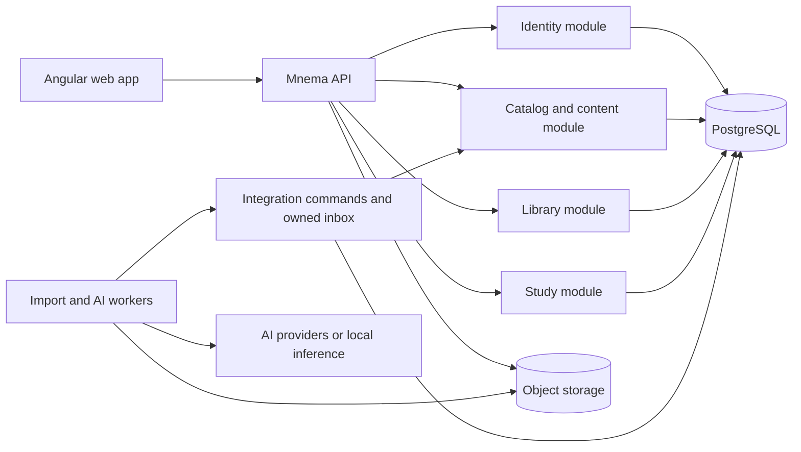
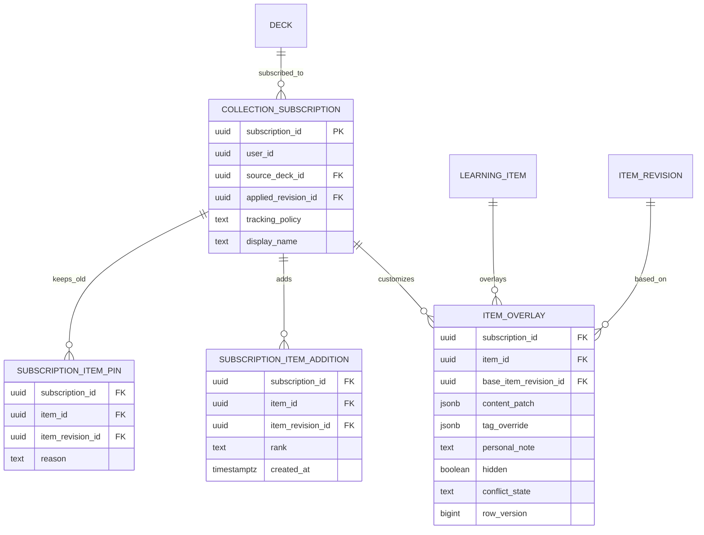
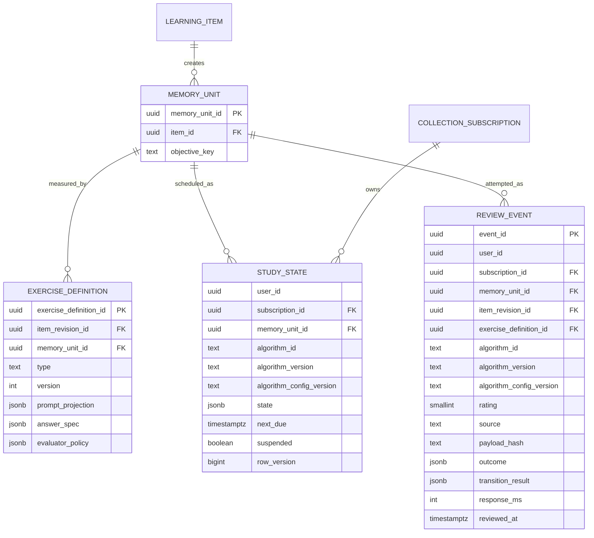

---
artifact:
  id: content-platform-v2
  type: architecture
  title: "Mnema content and study platform v2"
  status: proposed
  created_at: "2026-08-15"
  updated_at: "2026-08-15"
  owners: ["project-owner"]
  source_tasks: ["project architecture and product review"]
  supersedes: []
  superseded_by: null
  assumptions:
    - "Production has approximately ten accounts whose identity data must be retained; deck, media, review and AI data may be irreversibly reset after an account-only export is verified."
    - "PostgreSQL remains the primary transactional store."
    - "Real multi-author merge is not required in the first v2 release."
  unresolved_questions:
    - "Which exercise directions deserve independent memory objectives after the first instrumented cohort?"
    - "What compact/aggregate review retention policy meets product analytics needs before archival is required?"
    - "After an expected answer/objective change, should one near-term revalidation be scheduled automatically or require confirmation?"
    - "May an account-only reset verification artifact contain hashes/counts of deleted content, without retaining the content itself?"
  evidence:
    - "backend/services/core schema, services, repositories and tests at 8e0c83d"
    - "official Git and Flyway documentation, accessed 2026-08-15"
---

# Content and study platform v2

This document is a design proposal, not an accepted ADR and not an implemented schema. Its purpose is to make the data-model decision reviewable before a destructive migration.

## Requirements and workload

The target model must:

1. Reuse shared deck content across subscribers and forks.
2. Store only changed content in a new deck revision.
3. Preserve stable identity when text, labels or ordering change.
4. Keep personal notes, edits, hides and progress private and sparse.
5. Make subscribe, fork and export three different operations.
6. Support pinned/manual updates and explicit conflicts.
7. Add exercise types without copying content or coupling every exercise to a card template.
8. Represent rich multilingual, mathematical, code, diagram and media content without executing user code.
9. Preserve IDs and idempotency boundaries needed by future offline review and native clients.
8. Keep the common read and review paths simple enough for PostgreSQL.

Unknown workload inputs must not be disguised as measurements. Before implementation, collect row sizes, relation/index sizes, query plans, p95/p99 latency, active users, review volume, deck-size distribution and tenant skew.

### Confirmed current scaling behavior

Adding or globally editing a card constructs a complete next snapshot: it loads the old version, copies its cards and saves them again ([CardService.java](../../backend/services/core/src/main/java/app/mnema/core/deck/service/CardService.java#L1054)). Adding `N` cards one by one therefore produces:

```text
snapshot rows = 1 + 2 + ... + N = N × (N + 1) / 2
```

The full-text GIN index also indexes every JSON copy ([V14__search_indexes.sql](../../backend/services/core/src/main/resources/db/migration/V14__search_indexes.sql#L13)). With an explicitly guessed 2–5 KiB physical cost per public-card row:

| Cards added one by one | Snapshot rows | Illustrative physical size |
|---:|---:|---:|
| 1,000 | 500,500 | 0.9–2.3 GiB |
| 3,000 | 4,501,500 | 8.4–21.0 GiB |
| 10,000 | 50,005,000 | 93–233 GiB |

The production PostgreSQL PVC currently requests 15 GiB ([postgres.yaml](../../k8s/postgres.yaml#L45)). This is a scale boundary, not a benchmark: actual row size and edit pattern must be measured.

Subscribing also eagerly inserts a `user_cards` row for every active source card ([DeckService.java](../../backend/services/core/src/main/java/app/mnema/core/deck/service/DeckService.java#L630)). This grows as:

```text
user rows = subscribers × cards per subscribed deck
```

Personal study state for every item actually studied is irreducible. What v2 removes is eager membership/content duplication for untouched cards.

### Review events will eventually dominate

An illustrative scenario of 100,000 DAU × 30 answers/day is 3 million events/day. At a guessed 300–800 bytes per event plus 150% heap/index overhead, one year is roughly 0.82–2.19 TB before backups, compression and replicas. The current log stores `state_before` and `state_after` JSON for every answer ([V1__initial_migration.sql](../../backend/services/core/src/main/resources/db/migration/V1__initial_migration.sql#L464)).

This makes event retention, compact columns and rollups a more important long-term capacity decision than adding Redis. Partitioning is a trigger-based option for a genuinely large table, not a default; PostgreSQL documents both its benefits and the cost of excessive partitions in [Table Partitioning](https://www.postgresql.org/docs/current/ddl-partitioning.html).

## Candidates and decision

| Candidate | Benefits | Costs and failure modes | Decision |
|---|---|---|---|
| Immutable item content plus full membership list per release | Simple historical SQL and reads | Still `O(releases × cards)` membership and large commits | Possible transition, not target |
| Immutable item revisions plus release changes and head projection | `O(head items + item revisions + changes)`, fast current reads, O(1) subscribe and O(1) synchronous fork creation | Fork base traversal/materialization, projection rebuild and conflict semantics must be explicit | **Recommended** |
| Literal Git/JGit/Merkle repository as primary store | Native objects, commits, refs and structural sharing | Poor fit for ACL, SQL search, moderation, transactions and common queries; extra GC/backup/operations | Reject for now |

Git is useful as a semantic model: immutable objects, parented commits and refs. A literal Git repository is not required. Git itself models commits as references to a tree and parent commits; see the official [Git data model](https://git-scm.com/docs/gitdatamodel.html).

Do not expose hashes as entity identity. Identical text can represent separate learning units, and equality of private content must not become visible across users.

## Context and components

The content model is deployment-neutral. Logical ownership must remain the same whether the current six deployables remain or a separate ADR consolidates them into a modular API plus worker processes. Consolidation is attractive at current scale because independent scaling has not been demonstrated, but it is not a prerequisite for the data migration and must not be coupled to its cutover.



Workers may write only integration-owned inbox/job tables or call an application command. They must not update catalog/library/study tables directly. Deployment boundaries may change when measurements show different scaling, security or failure-isolation needs; source modules should not depend on that choice.

### Proposed domain modules

- `catalog`: shared decks, structured learning items, publication and public search.
- `library`: subscriptions, personal overlays, forks and upstream conflicts.
- `study`: exercise selection, memory state, review events and aggregate progress.
- `integration`: idempotent import/AI commands, outbox and media/provider adapters.
- `identity`: authentication and account/profile boundaries.

No Kafka or additional database is required for the first v2. PostgreSQL-backed workers with `FOR UPDATE SKIP LOCKED` are adequate when reclaim, idempotency and observability are correct.

## Data ownership and contracts

### Shared content and releases

```mermaid
erDiagram
    DECK ||--o{ DECK_REVISION : publishes
    DECK_REVISION o|--o{ DECK : bases_fork
    DECK_REVISION ||--o{ DECK_ITEM_CHANGE : contains
    LEARNING_ITEM ||--o{ ITEM_REVISION : evolves
    LEARNING_ITEM ||--o{ DECK_ITEM_CHANGE : affected_by
    ITEM_REVISION o|--o{ DECK_ITEM_CHANGE : selects
    DECK ||--o{ DECK_HEAD_ITEM : projects
    LEARNING_ITEM ||--o{ DECK_HEAD_ITEM : appears_as

    DECK {
        uuid deck_id PK
        uuid owner_id
        text visibility
        uuid head_revision_id
        uuid base_deck_id
        uuid base_revision_id
        bigint row_version
    }
    DECK_REVISION {
        uuid revision_id PK
        uuid deck_id FK
        bigint sequence
        uuid parent_revision_id FK
        jsonb metadata_snapshot
        uuid command_id UK
    }
    LEARNING_ITEM {
        uuid item_id PK
    }
    ITEM_REVISION {
        uuid item_revision_id PK
        uuid item_id FK
        int format_version
        jsonb content_document
        text content_hash
        text plain_text_projection
    }
    DECK_ITEM_CHANGE {
        uuid change_id PK
        uuid revision_id FK
        int ordinal
        uuid item_id FK
        text operation
        uuid item_revision_id nullable FK
        text rank
        jsonb contextual_tags
    }
    DECK_HEAD_ITEM {
        uuid deck_id FK
        uuid item_id FK
        uuid item_revision_id FK
        text rank
        jsonb contextual_tags
    }
```

Required relational constraints include:

- `DECK_REVISION UNIQUE(deck_id, revision_id)`, `UNIQUE(deck_id, sequence)` and a composite parent FK that keeps a parent revision in the same deck;
- `CHECK ((base_deck_id IS NULL) = (base_revision_id IS NULL))` plus a composite base FK `(base_deck_id, base_revision_id)` to `deck_revision(deck_id, revision_id)`;
- `DECK_ITEM_CHANGE` ordered uniquely within a revision; `REMOVE` has no item revision, while add/update does;
- `DECK_HEAD_ITEM PRIMARY KEY(deck_id, item_id)` and deterministic tie-breaking for equal ranks;
- `ITEM_REVISION UNIQUE(item_id, item_revision_id)` for composite lineage references.

`deck_head_item` is a synchronously updated, rebuildable current-head projection. In v2.0, historical reads may replay the base plus changes and are not promised to have bounded depth. If measured chain depth or read latency crosses a budget, add asynchronous immutable `deck_checkpoint(revision_id, deck_id, status, built_at, item_count, checksum)` plus `deck_checkpoint_item(revision_id, item_id, item_revision_id, rank, contextual_tags)`. Storage then becomes `O(head items + item revisions + changes + checkpoint count × checkpoint size)`; checkpoints are not free.

Publication is atomic:

1. Lock the deck head or compare-and-set `row_version`.
2. Deduplicate by `command_id`.
3. Insert immutable item/deck revisions and changes.
4. Update the head projection.
5. Advance `deck.head_revision_id`.

A published revision is never mutated. The current `deck_update_sessions` path violates this invariant because an old operation can update its target version in place ([CardService.java](../../backend/services/core/src/main/java/app/mnema/core/deck/service/CardService.java#L1512)).

`deck_revision` contains only fully published releases; it has no mutable lifecycle status. Draft work is separate mutable `deck_draft`/`deck_draft_change` state. Publication consumes a draft and creates an immutable `deck_revision`. Withdrawal or moderation changes deck/release availability without editing revision content.

### Subscriptions, forks and sparse overlays



- **Subscribe** creates one subscription pointer and no per-card rows. `deck_revision` admits only published releases, and `FOREIGN KEY (source_deck_id, applied_revision_id) REFERENCES deck_revision(deck_id, revision_id)` guarantees that the applied release belongs to the source deck; `tracking_policy` controls when an updater proposes advancing it.
- **Fork** synchronously creates a new editable deck identity whose `base_revision_id` is the semantic membership base of its first revision. Effective membership is the base revision plus the fork's own changes, so immutable item revisions are reused without inserting N membership rows. Initial reads may traverse or asynchronously materialize that base. Limit lineage depth or checkpoint/materialize it after a measured threshold.
- **Clone/export** physically detaches content only when explicitly requested.
- A custom private item in a subscription is a real `learning_item` referenced by sparse `subscription_item_addition`; it does not mutate the source deck. An alternative product action can explicitly convert the subscription into a private fork.

The same semantic item keeps one `item_id` across fork lineages; a fork selects an explicit immutable item revision through membership. There is never an API for “latest item revision by item ID”. Authorization resolves revision access through an accessible deck/subscription lineage.

Updating a subscription uses a three-way comparison: old applied source, proposed source and the overlay's `base_item_revision_id`. Disjoint stable-node changes can rebase; changes to the same semantic node or exercise answer contract become explicit conflicts. Checksum fallback is not identity. The v2 contract may still apply conflict-free item changes while leaving explicit per-item conflicts pinned to their prior source revisions; the update plan and final mixed state are both durable and visible. A single global pointer is therefore insufficient after a partial update: store the accepted source revision plus sparse `subscription_item_pin` rows for unresolved/kept-old items.

Revisions/item revisions referenced by a subscription, fork base, overlay, moderation record or retention hold cannot be purged. Source deletion cannot break an existing fork. Purge must first archive or rebind dependents according to an explicit policy.

`ITEM_OVERLAY` and `SUBSCRIPTION_ITEM_ADDITION` both use `(subscription_id, item_id)` as their primary key. Their `(item_id, item_revision_id)` references are composite lineage FKs, and a subscription/item addition cannot name an item revision belonging to another semantic item.

### Visibility, collaboration and publication review

`deck.visibility` is an allowlisted enum: `PUBLIC`, `REQUEST_RESTRICTED`, or `PRIVATE`. Restricted access uses explicit membership/request state, not an unguessable URL as authorization. `deck_collaborator(deck_id, user_id, role, status)` supports owner/editor/reviewer roles with least privilege. Publishing may require an approved `deck_publication_review` bound to the exact immutable draft checksum/base revision; changing the draft invalidates approval.

Catalog and author-profile counts are rebuildable aggregates, not transactional counters trusted for ACL or billing. A public deck may be withdrawn from discovery, but revisions reachable by existing subscriptions remain available according to retention policy. Deleting an author therefore cannot cascade through subscribed content; authorship becomes a tombstoned identity where required. Forks/clones never submit changes upstream in v2.

### Structured content instead of templates and fields

The owner decision removes user-facing templates, arbitrary fields and mandatory deck language pairs from the native model. An item revision stores a bounded, validated, versioned document tree. A card-like front/reveal view is one exercise projection over stable node IDs rather than the storage shape.

The document supports semantic ruby/furigana, bidi metadata, math, code, diagrams, drawings and media through registered nodes. It never executes user JavaScript or arbitrary CSS. Markdown is an authoring/interchange view; Anki HTML/CSS must be compiled into registered native nodes or reported unsupported and is never executed by a legacy renderer. The complete contract, editor behaviour, security boundary, media references and offline envelope are defined in [learning-content-format-v2.md](./learning-content-format-v2.md).

This makes schema evolution local: `format_version` governs the document, each node and exercise config has its own version, and unknown nodes remain preserved with a visible fallback. Adding a renderer normally does not require rewriting every stored item.

### Study state and exercises



Required constraints include `UNIQUE(item_id, objective_key)`, a composite lineage constraint keeping an exercise's item revision under the objective's item, and `STUDY_STATE PRIMARY KEY(subscription_id, memory_unit_id)`. `REVIEW_EVENT.event_id` is the global primary key. Ownership should be derived from subscription where possible rather than duplicated without a composite FK.

Because `event_id` is client-generated and globally unique, it is the primary database idempotency key; `user_id` and payload hash are checked when replaying it. A revision-scoped `deck_exercise_policy(revision_id, exercise_definition_id, enabled_by_default, weight, eligibility)` selects exercises compatible with the content capabilities; an optional sparse user preference may narrow the set without copying shared definitions.

Study state is created lazily on first presentation. `memory_unit` represents a learning objective, not a UI exercise: several exercise definitions can provide evidence for one shared state; separate forward/reverse objectives create independent states. Updating a renderer/exercise version therefore does not reset memory by itself. The product must decide objective granularity before migration.

Track actual first exposure sparsely (for example `study_exposure(subscription_id, memory_unit_id, introduced_at, source_revision_id)`) rather than relying on one reorder-sensitive cursor. A monotonic introduction key may optimize selection, but source insertion/reorder must not silently skip unseen items.

Each review event records the item revision actually shown, exercise definition and scheduler/config version so an answer remains explainable after content changes. A content change policy classifies presentation-only edits (normally keep state) versus semantic-answer changes (keep, mark relearn or reset by explicit rule).

## API boundaries

The exact URL names are an LLD concern, but v2 must preserve these resource/command semantics:

| Operation | Contract |
|---|---|
| Read deck | paginated head/manifest pinned to an explicit `deckRevisionId`; cursor is opaque and stable for that revision |
| Read item | explicit `itemRevisionId`, document `formatVersion`, exercise revisions and capability set; no implicit “latest by item ID” |
| Save draft | mutable draft + `If-Match`/row version; accepts client-generated command ID and stable node IDs |
| Publish | command against expected deck head; validates all node/media/exercise references and returns one immutable revision |
| Plan subscription update | pure three-way diff with summary, safe changes and conflicts; no writes |
| Apply update | idempotent command referencing the exact plan/source revision and explicit conflict choices/pins |
| Start study | requires one `subscriptionId/deckId`; returns a bounded prefetch batch pinned to revision/exercise runtime |
| Submit attempt | client event ID + payload hash; duplicate retry returns the stored outcome, conflicting reuse returns 409 |
| Media upload | initiate/complete protocol, server-verified hash/MIME/size and logical asset result; object key is not an ACL |
| Offline sync | opaque per-user cursor, bounded changes/tombstones and idempotent command/attempt batch |

Large documents/media never ride in an unbounded deck response. Use pagination/prefetch, presigned object transfer and HTTP range for media. Apply request/body, node-depth/count, upload and concurrency limits at the edge and in application validation. API replicas remain stateless; durable jobs expose status and safe retry rather than holding an HTTP request open through provider work.

## Consistency, failure and recovery

### Correctness defects to fix even before v2

- Browser/review paths sometimes fetch the latest `public_card` by `card_id` rather than the subscription's pinned deck/version ([DeckCardViewAdapter.java](../../backend/services/core/src/main/java/app/mnema/core/deck/adapter/DeckCardViewAdapter.java#L103)). Search and review can therefore disagree.
- The database no longer enforces a source FK for `user_cards.public_card_id` ([V21__public_card_id_non_unique.sql](../../backend/services/core/src/main/resources/db/migration/V21__public_card_id_non_unique.sql#L1)).
- Local editing writes the whole effective JSON as an override although reading supports patches ([CardService.java](../../backend/services/core/src/main/java/app/mnema/core/deck/service/CardService.java#L1442)).
- The in-process `DeckAlgorithmUpdateBuffer` is unsafe with more than one core replica ([DeckAlgorithmUpdateBuffer.java](../../backend/services/core/src/main/java/app/mnema/core/review/service/DeckAlgorithmUpdateBuffer.java#L14)).
- Publication calculates `latestVersion + 1` without a deck-head lock/CAS ([CardService.java](../../backend/services/core/src/main/java/app/mnema/core/deck/service/CardService.java#L1183)).
- Some card mapping performs N+1 latest-card lookups ([CardService.java](../../backend/services/core/src/main/java/app/mnema/core/deck/service/CardService.java#L2044)); sync loads complete current/user/history collections in memory ([DeckService.java](../../backend/services/core/src/main/java/app/mnema/core/deck/service/DeckService.java#L384)).
- Review keeps a state lock while calculating the next card ([ReviewService.java](../../backend/services/core/src/main/java/app/mnema/core/review/service/ReviewService.java#L203)).
- Import can commit earlier batches before the job fails ([ImportProcessor.java](../../backend/services/import/src/main/java/app/mnema/importer/service/ImportProcessor.java#L152)); AI can change a requested global update into a local update based on exception text ([CoreApiClient.java](../../backend/services/ai/src/main/java/app/mnema/ai/client/core/CoreApiClient.java#L119)).

### Idempotent review

`REVIEW_EVENT.event_id` is a client-generated idempotency key. Within one transaction:

1. Insert missing study state with `ON CONFLICT DO NOTHING`.
2. Lock the state row.
3. If `event_id` already exists for the same user and payload hash, return its stored transition result; if the owner or payload differs, return an idempotency conflict.
4. Insert the event and update state.

This closes the current first-answer race and duplicate retry risk.

### Import and AI commands

Remote service calls are not distributed transactions. Every import/AI write carries `job_id + item/batch key`, returns a queryable command result and is safe to retry. A worker must reclaim stale `processing` work; the current import worker selects only `queued` jobs even though its query mentions stale locks ([ImportJobWorker.java](../../backend/services/import/src/main/java/app/mnema/importer/service/ImportJobWorker.java#L78)).

## Security and observability

- Keep private content hashes internal and scope physical deduplication to a trusted lineage/tenant.
- Record actor, source revision and command ID for publication and rebase.
- Never put provider keys or card content into logs.
- Add metrics for publish changes/transaction duration, head rebuild failures, checkpoint age when checkpoints exist, conflicts, review duplicate rate, queue age, stale job reclaim, relation/index growth and retained review events.
- Define timeouts for every inter-module HTTP call that remains remote; current core media/user clients do not set explicit connect/read timeouts.

## Capacity, cost and scale boundaries

| Signal | Initial action | Scale trigger for a larger mechanism |
|---|---|---|
| Deck history | Changes + synchronous head projection | Historical reconstruction p95 or fork-base depth justifies checkpoints/materialization |
| Review log | Compact append-only rows + aggregate tables | Measured table/index size and maintenance justify time partitioning/archive |
| Study state | Partial index on `(subscription_id, next_due) WHERE suspended = false` (include user only if ownership is not derivable) | Hot tenants, lock waits or write IOPS exceed one primary's measured envelope |
| Jobs | PostgreSQL queue with reclaim/idempotency | Sustained queue age cannot recover within SLO after adding bounded workers |
| Search | Head/current projection only | Measured GIN update/read cost or relevance requires a dedicated engine |

The present architecture cannot name an exact user count at which it fails because no representative workload, relation sizes or p95/p99 baseline were provided. The formulas identify cliffs; only measured load tests can place the boundary.

## Validation and migration

Do not rewrite applied Flyway V1–V25. Flyway validates checksums of versioned migrations; corrections belong in new versioned migrations, as described in [Flyway versioned migrations](https://documentation.red-gate.com/fd/versioned-migrations-273973333.html).

### Phase 0 — verify and export accounts

- Put the hosted product into maintenance mode and record deployed image/database migration identities.
- Count and export the approximately ten identity/account/profile records that must survive, including a deterministic mapping and checksums that do not expose secrets.
- Restore the account-only export into an isolated fresh database and prove login/password-reset/OAuth-link behaviour.
- Count users, decks, cards, review states/events and unfinished import/AI jobs before irreversible deletion.
- Capture `pg_total_relation_size`, indexes and orphan/duplicate lineage queries.
- Confirm that no deck, media, review or AI data must survive and explicitly approve deletion of object-storage keys.

The owner has authorized downtime and deletion of non-account data. Prefer a fresh v2 database plus verified account import over an in-place transformation or dual writes. A full legacy backup that contains the data declared “irreversibly deleted” is not a valid long-term rollback artifact; if one is used for the cutover rehearsal, define its encrypted location and destruction deadline before proceeding.

### Phase 1 — build and rehearse the fresh v2 schema

Create the v2 schema in a fresh PostgreSQL database using new ordered Flyway migrations. Keep the legacy production database read-only during rehearsal. Prepare an idempotent account transformer with a persisted old-to-new ID map; do not build deck/card/media transformers for data explicitly being discarded.

### Phase 2 — account-only migration and destructive reset

- Stop auth/account writes and background workers.
- Run the final account export and import; verify exact account count, stable IDs or mapping, unique emails/provider links and credential/session policy.
- Start v2 with no decks, item content, media references, review history or AI jobs.
- Delete legacy object data only from an explicit manifest/prefix after a dry-run count and owner approval; record tombstone/result counts without retaining user content.
- Keep no silent compatibility path that can resurrect old deck/card data after cutover.

### Phase 3 — cutover

1. Keep the whole product in maintenance while identity is frozen.
2. Import and reconcile accounts in the fresh database.
3. Switch the API and compatible workers while writes remain disabled.
4. Smoke-test login/password reset, create, publish, subscribe, review, media upload, update and collaboration with synthetic data.
5. If gates pass, explicitly open v2 for writes and observe error rate, latency, locks, queue age and storage.

Binary/schema rollback is guaranteed only before v2 is opened for writes and before the approved legacy-destruction point. After v2-only writes and irreversible content deletion, recovery is roll-forward or restore of the v2/account-only backup. Document the exact point of no return, RPO/RTO, object-store deletion manifest and account verification sign-off.

## Proposed decision sequence

1. Accept the native content and exercise contracts.
2. Approve fresh-database/account-only reset and its irreversible deletion envelope.
3. Decide partial subscription-update pins, fork lineage limits, semantic-change policy and review retention.
4. Approve the v2 relational constraints and point of no return.
5. Implement publication/idempotency, base reconstruction, projection rebuild and MinIO integration tests.
6. Move import/AI/media workers to idempotent application commands.
7. Measure v2 before adding checkpoints, outbox, partitions, replicas, Kafka or a new datastore.
