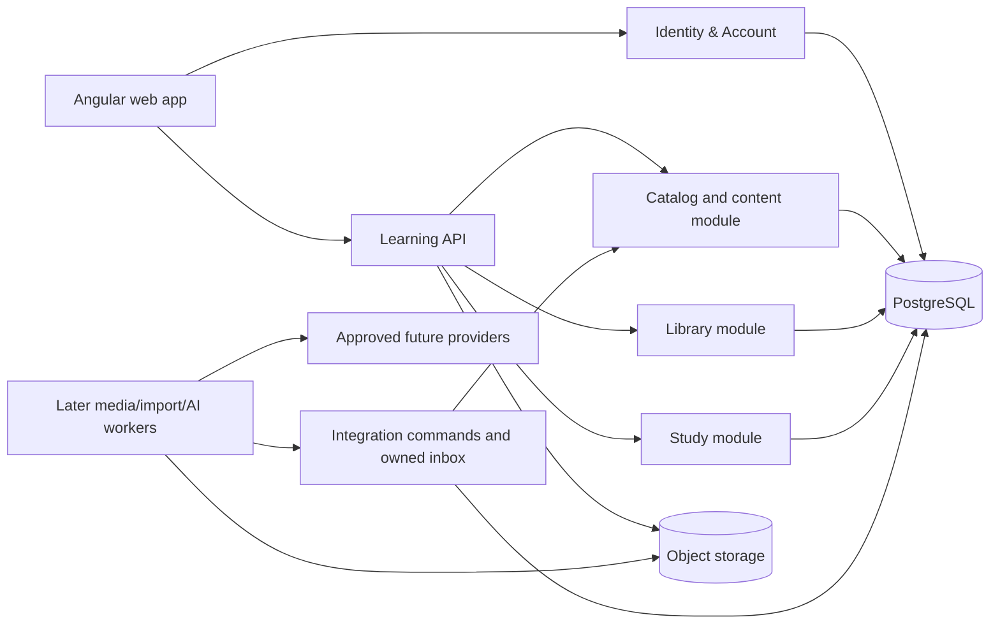
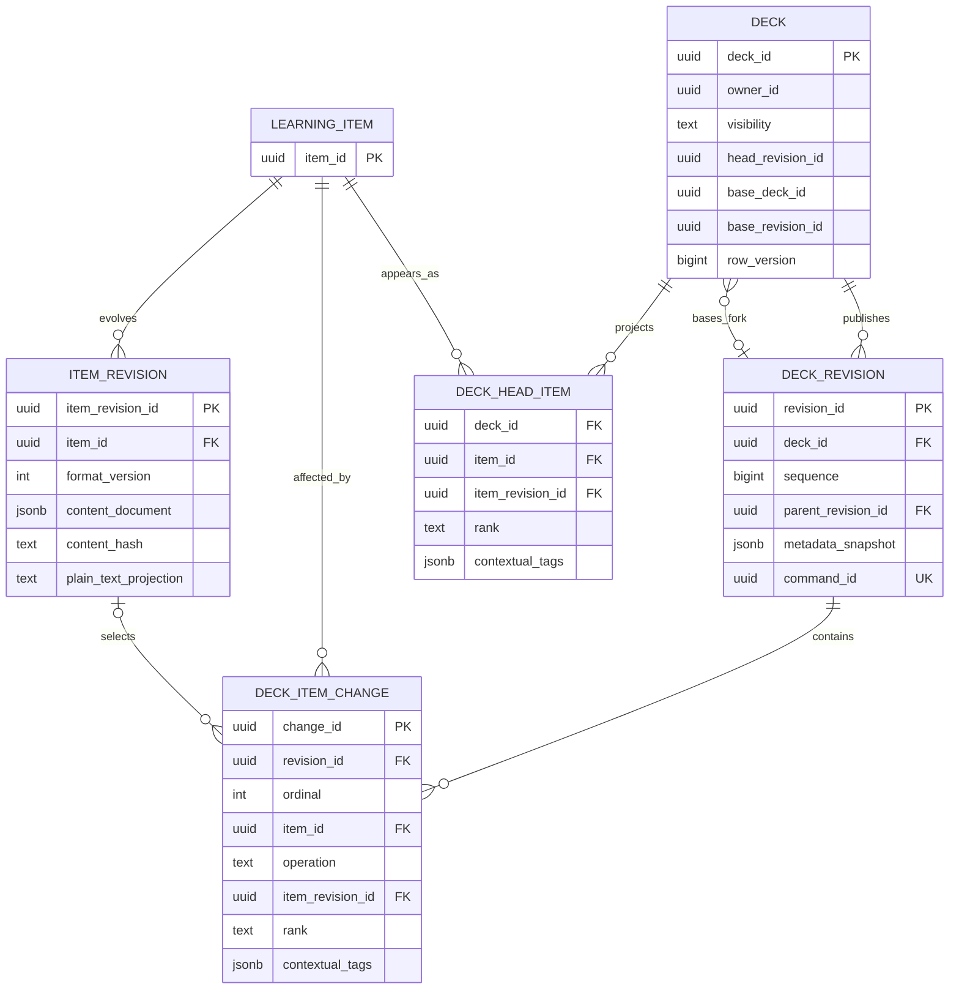
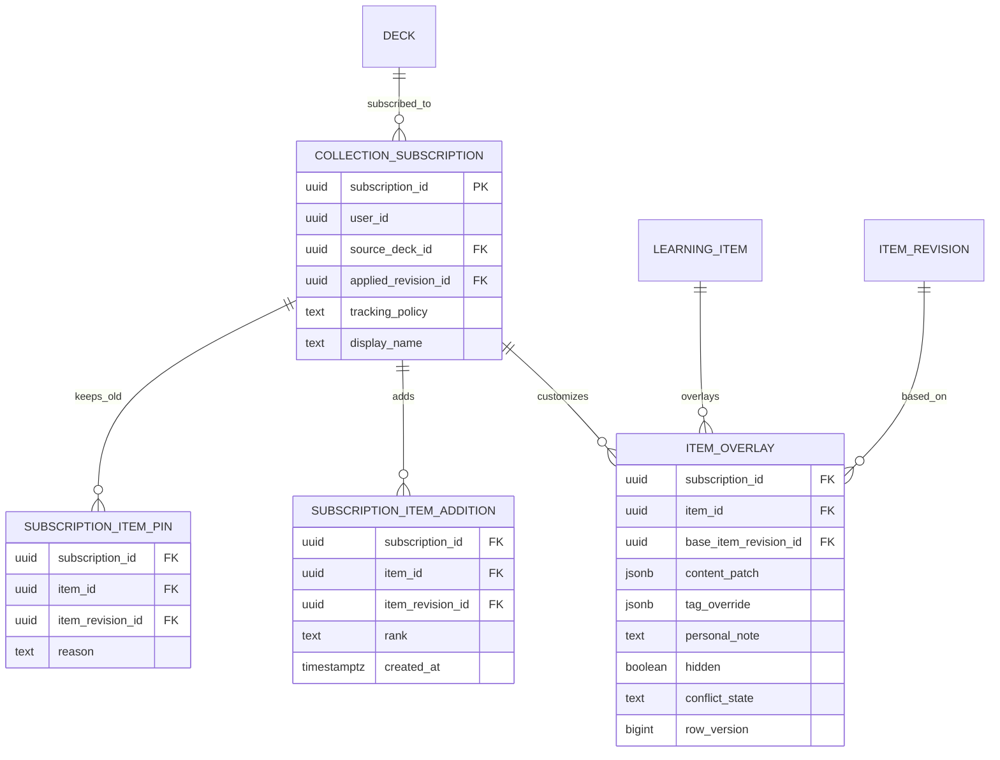
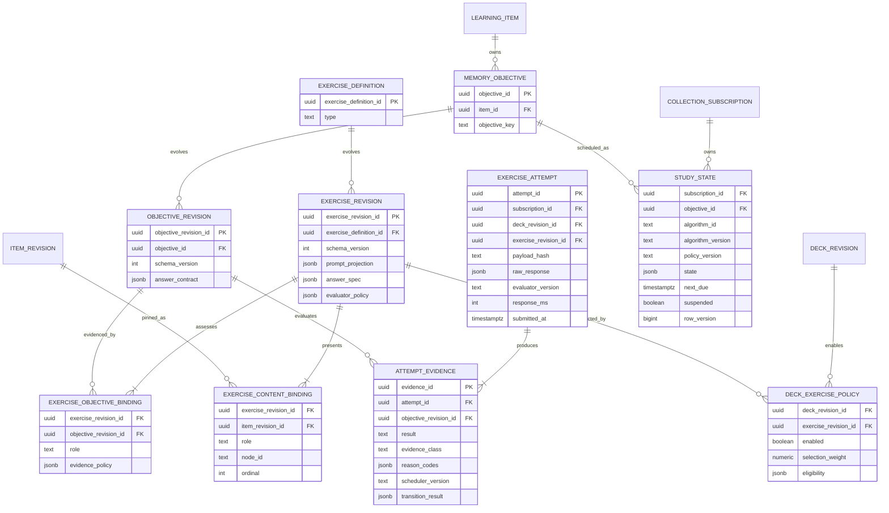

---
artifact:
  id: content-platform-v2
  type: architecture
  title: "Mnema greenfield content and study platform"
  status: proposed
  created_at: "2026-08-15"
  updated_at: "2026-08-30"
  owners: ["project-owner"]
  source_tasks: ["project architecture and product review"]
  supersedes: []
  superseded_by: null
  assumptions:
    - "Only long-lived account identity/profile data and account avatar survive; all other DB/S3/backup state is deleted without a retained legacy snapshot."
    - "The owner accepts downtime and an incomplete product during a direct replacement with no /v2 or compatibility runtime."
    - "PostgreSQL remains the primary transactional store."
    - "Real multi-author merge is not required in the first v2 release."
  unresolved_questions:
    - "Which exercise directions deserve independent memory objectives after the first instrumented cohort?"
    - "What compact/aggregate review retention policy meets product analytics needs before archival is required?"
    - "After an expected answer/objective change, should one near-term revalidation be scheduled automatically or require confirmation?"
    - "Should multi-target attempts be a P1 feature, or should P0 restrict every scheduler-affecting attempt to one assessed objective?"
  evidence:
    - "backend/services/core schema, services, repositories and tests at 8e0c83d"
    - "official Git and Flyway documentation, accessed 2026-08-15"
---

# Greenfield content and study platform

This document is a design proposal, not an implemented schema. Owner constraints are accepted inputs; relational details remain proposed until their epic is refined. The target directly replaces v1 on canonical routes. It has no `/v2`, dual read/write, legacy adapter, old scheduler fallback or retained full legacy snapshot.

## Requirements and workload

The target model must:

1. Reuse shared deck content across subscribers and forks.
2. Store only changed content in a new deck revision.
3. Preserve stable identity when text, labels or ordering change.
4. Keep personal notes, edits, hides and progress private and sparse.
5. Make subscribe, fork and export three different operations.
6. Support pinned/manual updates and explicit conflicts.
7. Add single- and multi-item exercise types without copying content or coupling every exercise to a card template.
8. Represent rich multilingual, mathematical, code, diagram and media content without executing user code.
9. Preserve IDs and idempotency boundaries needed by future offline review and native clients.
10. Keep the common read and review paths simple enough for PostgreSQL.

Unknown workload inputs must not be disguised as measurements. The owner's zero-usage assertion is not a gate to recheck. Capacity choices below are scenarios; after the replacement has real traffic, collect its row sizes, query plans, p95/p99 latency, review volume, deck-size distribution and tenant skew before adding scale mechanisms.

### Confirmed current scaling behavior

Adding or globally editing a card constructs a complete next snapshot: it loads the old version, copies its cards and saves them again ([CardService.java](../../backend/services/core/src/main/java/app/mnema/core/deck/service/CardService.java#L1054)). Adding `N` cards one by one therefore produces:

```text
snapshot rows = 1 + 2 + ... + N = N × (N + 1) / 2
```

The full-text GIN index also indexes every JSON copy ([V14__search_indexes.sql](../../backend/services/core/src/main/resources/db/migration/V14__search_indexes.sql#L13)). With an explicitly guessed 2–5 KiB physical cost per public-card row:

| Cards added one by one | Snapshot rows | Illustrative physical size |
|---:|---:|---:|
| 1,000 | 500,500 | 0.9–2.3 GiB |
| 3,000 | 4,501,500 | 8.4–21.0 GiB |
| 10,000 | 50,005,000 | 93–233 GiB |

The production PostgreSQL PVC currently requests 15 GiB ([postgres.yaml](../../k8s/postgres.yaml#L45)). This is a scale boundary, not a benchmark: actual row size and edit pattern must be measured.

Subscribing also eagerly inserts a `user_cards` row for every active source card ([DeckService.java](../../backend/services/core/src/main/java/app/mnema/core/deck/service/DeckService.java#L630)). This grows as:

```text
user rows = subscribers × cards per subscribed deck
```

Personal study state for every item actually studied is irreducible. What v2 removes is eager membership/content duplication for untouched cards.

### Review events will eventually dominate

An illustrative scenario of 100,000 DAU × 30 answers/day is 3 million events/day. At a guessed 300–800 bytes per event plus 150% heap/index overhead, one year is roughly 0.82–2.19 TB before backups, compression and replicas. The current log stores `state_before` and `state_after` JSON for every answer ([V1__initial_migration.sql](../../backend/services/core/src/main/resources/db/migration/V1__initial_migration.sql#L464)).

This makes event retention, compact columns and rollups a more important long-term capacity decision than adding Redis. Partitioning is a trigger-based option for a genuinely large table, not a default; PostgreSQL documents both its benefits and the cost of excessive partitions in [Table Partitioning](https://www.postgresql.org/docs/current/ddl-partitioning.html).

## Candidates and decision

| Candidate | Benefits | Costs and failure modes | Decision |
|---|---|---|---|
| Immutable item content plus full membership list per release | Simple historical SQL and reads | Still `O(releases × cards)` membership and large commits | Possible transition, not target |
| Immutable item revisions plus release changes and head projection | `O(head items + item revisions + changes)`, fast current reads, O(1) subscribe and O(1) synchronous fork creation | Fork base traversal/materialization, projection rebuild and conflict semantics must be explicit | **Recommended** |
| Literal Git/JGit/Merkle repository as primary store | Native objects, commits, refs and structural sharing | Poor fit for ACL, SQL search, moderation, transactions and common queries; extra GC/backup/operations | Reject for now |

Git is useful as a semantic model: immutable objects, parented commits and refs. A literal Git repository is not required. Git itself models commits as references to a tree and parent commits; see the official [Git data model](https://git-scm.com/docs/gitdatamodel.html).

Do not expose hashes as entity identity. Identical text can represent separate learning units, and equality of private content must not become visible across users.

## Context and components

The current six-deployable topology is not preserved. Identity and User become one Identity & Account deployable; content/library/study begin as modules of one Learning API. Separate media/import/AI workers appear only when their later epic introduces an actual resource, failure or trust boundary. This topology is a source boundary, not an invitation to recreate current remote calls inside one process.



Workers may write only integration-owned inbox/job tables or call an application command. They must not update catalog/library/study tables directly. Deployment boundaries may change when measurements show different scaling, security or failure-isolation needs; source modules should not depend on that choice.

### Proposed domain modules

- `catalog`: shared decks, structured learning items, publication and public search.
- `library`: subscriptions, personal overlays, forks and upstream conflicts.
- `study`: exercise selection, memory state, review events and aggregate progress.
- `integration`: idempotent commands/inbox for capabilities introduced by later epics.
- `identity-account` (separate deployable): credentials, issuer, federated identity, account/profile and avatar ownership.

No Kafka or additional database is required for the first replacement. PostgreSQL-backed workers are sufficient when a later capability needs them and reclaim, idempotency and observability are correct.

## Data ownership and contracts

### Shared content and releases



Required relational constraints include:

- `DECK_REVISION UNIQUE(deck_id, revision_id)`, `UNIQUE(deck_id, sequence)` and a composite parent FK that keeps a parent revision in the same deck;
- `CHECK ((base_deck_id IS NULL) = (base_revision_id IS NULL))` plus a composite base FK `(base_deck_id, base_revision_id)` to `deck_revision(deck_id, revision_id)`;
- `DECK_ITEM_CHANGE` is ordered uniquely within a revision; `ADD`/`UPDATE` select the new item revision and `REMOVE` pins the exact previously selected revision being removed;
- `DECK_HEAD_ITEM PRIMARY KEY(deck_id, item_id)` and deterministic tie-breaking for equal ranks;
- `ITEM_REVISION UNIQUE(item_id, item_revision_id)` for composite lineage references.

`deck_head_item` is a synchronously updated, rebuildable current-head projection. In v2.0, historical reads may replay the base plus changes and are not promised to have bounded depth. If measured chain depth or read latency crosses a budget, add asynchronous immutable `deck_checkpoint(revision_id, deck_id, status, built_at, item_count, checksum)` plus `deck_checkpoint_item(revision_id, item_id, item_revision_id, rank, contextual_tags)`. Storage then becomes `O(head items + item revisions + changes + checkpoint count × checkpoint size)`; checkpoints are not free.

Publication is atomic:

1. Lock the deck head or compare-and-set `row_version`.
2. Deduplicate by `command_id`.
3. Insert immutable item/deck revisions and changes.
4. Update the head projection.
5. Advance `deck.head_revision_id`.

A published revision is never mutated. The current `deck_update_sessions` path violates this invariant because an old operation can update its target version in place ([CardService.java](../../backend/services/core/src/main/java/app/mnema/core/deck/service/CardService.java#L1512)).

`deck_revision` contains only fully published releases; it has no mutable lifecycle status. Draft work is separate mutable `deck_draft`/`deck_draft_change` state. Publication consumes a draft and creates an immutable `deck_revision`. Withdrawal or moderation changes deck/release availability without editing revision content.

### Subscriptions, forks and sparse overlays



- **Subscribe** creates one subscription pointer and no per-card rows. `deck_revision` admits only published releases, and `FOREIGN KEY (source_deck_id, applied_revision_id) REFERENCES deck_revision(deck_id, revision_id)` guarantees that the applied release belongs to the source deck; `tracking_policy` controls when an updater proposes advancing it.
- **Fork** synchronously creates a new editable deck identity whose `base_revision_id` is the semantic membership base of its first revision. Effective membership is the base revision plus the fork's own changes, so immutable item revisions are reused without inserting N membership rows. Initial reads may traverse or asynchronously materialize that base. Limit lineage depth or checkpoint/materialize it after a measured threshold.
- **Clone/export** physically detaches content only when explicitly requested.
- A custom private item in a subscription is a real `learning_item` referenced by sparse `subscription_item_addition`; it does not mutate the source deck. An alternative product action can explicitly convert the subscription into a private fork.

The same semantic item keeps one `item_id` across fork lineages; a fork selects an explicit immutable item revision through membership. There is never an API for “latest item revision by item ID”. Authorization resolves revision access through an accessible deck/subscription lineage.

Updating a subscription uses a three-way comparison: old applied source, proposed source and the overlay's `base_item_revision_id`. Disjoint stable-node changes can rebase; changes to the same semantic node or exercise answer contract become explicit conflicts. Checksum fallback is not identity. The v2 contract may still apply conflict-free item changes while leaving explicit per-item conflicts pinned to their prior source revisions; the update plan and final mixed state are both durable and visible. A single global pointer is therefore insufficient after a partial update: store the accepted source revision plus sparse `subscription_item_pin` rows for unresolved/kept-old items.

Revisions/item revisions referenced by a subscription, fork base, overlay, moderation record or retention hold cannot be purged. Source deletion cannot break an existing fork. Purge must first archive or rebind dependents according to an explicit policy.

`ITEM_OVERLAY` and `SUBSCRIPTION_ITEM_ADDITION` both use `(subscription_id, item_id)` as their primary key. Their `(item_id, item_revision_id)` references are composite lineage FKs, and a subscription/item addition cannot name an item revision belonging to another semantic item.

### Visibility, collaboration and publication review

`deck.visibility` is an allowlisted enum: `PUBLIC`, `REQUEST_RESTRICTED`, or `PRIVATE`. Restricted access uses explicit membership/request state, not an unguessable URL as authorization. `deck_collaborator(deck_id, user_id, role, status)` supports owner/editor/reviewer roles with least privilege. Publishing may require an approved `deck_publication_review` bound to the exact immutable draft checksum/base revision; changing the draft invalidates approval.

Catalog and author-profile counts are rebuildable aggregates, not transactional counters trusted for ACL or billing. A public deck may be withdrawn from discovery, but revisions reachable by existing subscriptions remain available according to retention policy. Deleting an author therefore cannot cascade through subscribed content; authorship becomes a tombstoned identity where required. Forks/clones never submit changes upstream in v2.

### Structured content instead of templates and fields

The owner decision removes user-facing templates, arbitrary fields and mandatory deck language pairs from the native model. An item revision stores a bounded, validated, versioned document tree. A card-like front/reveal view is one exercise projection over stable node IDs rather than the storage shape.

The document supports semantic ruby/furigana, bidi metadata, math, code, diagrams, drawings and media through registered nodes. It never executes user JavaScript or arbitrary CSS. Markdown is an authoring/interchange view; Anki HTML/CSS must be compiled into registered native nodes or reported unsupported and is never executed by a legacy renderer. The complete contract, editor behaviour, security boundary, media references and offline envelope are defined in [learning-content-format-v2.md](./learning-content-format-v2.md).

This makes schema evolution local: `format_version` governs the document, each node and exercise config has its own version, and unknown nodes remain preserved with a visible fallback. Adding a renderer normally does not require rewriting every stored item.

### Study state and exercises



Required constraints include `UNIQUE(item_id, objective_key)`, immutable objective/exercise revisions, unique binding ordinals/roles, lineage FKs from every revision to its stable entity, and `STUDY_STATE PRIMARY KEY(subscription_id, objective_id)`. `EXERCISE_ATTEMPT.attempt_id` is a client-generated global idempotency key. Reuse with the same owner and payload hash returns the stored result; conflicting reuse returns an idempotency conflict.

`ExerciseDefinition` is stable identity; `ExerciseRevision` pins prompt, answer and evaluator policy. `ExerciseContentBinding` creates the M:N relation requested by the product and uses allowlisted roles `ASSESSED`, `CUE`, `OPTION`, `CONTEXT`. `ExerciseObjectiveBinding` identifies exactly which objectives may receive evidence. A deck-revision policy enables compatible exercises without copying their definitions.

Study state is created lazily for a `MemoryObjective`, not for a renderer. Forward/reverse objectives remain independent. Several exercise kinds can emit evidence for one shared state, so a renderer change does not reset memory. In P0 an objective belongs to one `LearningItem`; cross-item objectives remain deferred until a real case cannot be represented as several per-item outcomes.

### Multi-item attempt semantics

- Candidate bindings come only from one pinned deck revision. `OPTION`/`CONTEXT` exposure never changes progress.
- A focal matching exercise may pin one `ASSESSED` item plus several options. A group matching submission may return several `ATTEMPT_EVIDENCE` rows, but each row needs an observable response for its own objective.
- Aggregate `4/4` feedback is not copied to all items. If a mechanic cannot produce valid per-objective evidence, it is feedback-only and rejected as scheduler-affecting.
- A directional relation updates only its declared direction. Showing or matching one pair does not automatically credit the reverse objective.
- For P0, prefer one assessed objective per attempt. A later atomic multi-target submission locks study-state rows in deterministic objective-ID order and commits all transitions or none; it never leaves partial progress on failure.
- The full presented set is immutable for the attempt. A concurrent deck edit affects the next attempt, not the one already started.

Do not select neighbors with `ORDER BY random()` over a large head. Start with indexed eligibility by `(deck_revision_id, capability/tag/objective kind, item_id)` and deterministic hash/cursor sampling. Add a rebuildable candidate projection or reservoir only when query plans show it is needed. Semantic distractor quality remains a product validation problem, not something row adjacency proves.

### Evidence and scheduler boundary

Evaluators return normalized evidence, not an interval:

- result: `CORRECT`, `PARTIAL`, `INCORRECT`, `UNSURE`, `NOT_ASSESSED` or `UNAVAILABLE`;
- evidence class: `HIGH`, `MEDIUM`, `LOW` or `NONE`;
- reason codes such as retrieval mode, hints/reveal, deterministic/self/human evaluator and uncertainty;
- per-part feedback plus the exact evaluator/runtime version.

Browse, cancel, timeout and evaluator failure create no scheduler transition. Response time is diagnostic only. Recognition, cued recall and free production may produce different evidence classes, but no hard-coded scientific weight is claimed before Mnema cohort calibration.

Use one canonical versioned scheduler-reducer interface over normalized evidence. Do not bind an algorithm to an exercise type: that duplicates memory state and makes cross-exercise learning incoherent. Different algorithms/configs remain possible through a durable assignment and reducer version, so A/B tests compare policies without rewriting content or UI. Record experiment ID/version, assignment unit and reducer/config on every transition. Assignment should be stable at account/deck or account/objective level; avoid changing it mid-history without an explicit migration/analysis boundary.

Track actual first exposure sparsely (for example `study_exposure(subscription_id, objective_id, introduced_at, source_revision_id)`) rather than relying on one reorder-sensitive cursor. A monotonic introduction key may optimize selection, but source insertion/reorder must not silently skip unseen items.

Each attempt records all item/exercise revisions actually shown, evaluator version, normalized evidence and scheduler/config assignment so the transition remains explainable after content changes. A content change policy classifies presentation-only edits (normally keep state) versus semantic-answer changes (retain history and schedule explicit revalidation by an accepted rule).

## API boundaries

The exact URL names are an LLD concern, but the canonical replacement API must provide these resource/command semantics without a `/v2` prefix or legacy aliases:

| Operation | Contract |
|---|---|
| Read deck | paginated head/manifest pinned to an explicit `deckRevisionId`; cursor is opaque and stable for that revision |
| Read item | explicit `itemRevisionId`, document `formatVersion`, exercise revisions and capability set; no implicit “latest by item ID” |
| Save draft | mutable draft + `If-Match`/row version; accepts client-generated command ID and stable node IDs |
| Publish | command against expected deck head; validates all node/media/exercise references and returns one immutable revision |
| Plan subscription update | pure three-way diff with summary, safe changes and conflicts; no writes |
| Apply update | idempotent command referencing the exact plan/source revision and explicit conflict choices/pins |
| Start study | requires one `subscriptionId/deckId`; returns a bounded prefetch batch pinned to revision/exercise runtime |
| Submit attempt | client event ID + payload hash; duplicate retry returns the stored outcome, conflicting reuse returns 409 |
| Media upload | initiate/complete protocol, server-verified hash/MIME/size and logical asset result; object key is not an ACL |
| Offline sync | opaque per-user cursor, bounded changes/tombstones and idempotent command/attempt batch |

Large documents/media never ride in an unbounded deck response. Use pagination/prefetch, presigned object transfer and HTTP range for media. Apply request/body, node-depth/count, upload and concurrency limits at the edge and in application validation. API replicas remain stateless; durable jobs expose status and safe retry rather than holding an HTTP request open through provider work.

## Consistency, failure and recovery

### Legacy defects that justify replacement, not repair scope

The following findings are evidence for deleting the old paths. Do not turn them
into a v1 remediation backlog unless a defect blocks the greenfield cutover itself:

- Browser/review paths sometimes fetch the latest `public_card` by `card_id` rather than the subscription's pinned deck/version ([DeckCardViewAdapter.java](../../backend/services/core/src/main/java/app/mnema/core/deck/adapter/DeckCardViewAdapter.java#L103)). Search and review can therefore disagree.
- The database no longer enforces a source FK for `user_cards.public_card_id` ([V21__public_card_id_non_unique.sql](../../backend/services/core/src/main/resources/db/migration/V21__public_card_id_non_unique.sql#L1)).
- Local editing writes the whole effective JSON as an override although reading supports patches ([CardService.java](../../backend/services/core/src/main/java/app/mnema/core/deck/service/CardService.java#L1442)).
- The in-process `DeckAlgorithmUpdateBuffer` is unsafe with more than one core replica ([DeckAlgorithmUpdateBuffer.java](../../backend/services/core/src/main/java/app/mnema/core/review/service/DeckAlgorithmUpdateBuffer.java#L14)).
- Publication calculates `latestVersion + 1` without a deck-head lock/CAS ([CardService.java](../../backend/services/core/src/main/java/app/mnema/core/deck/service/CardService.java#L1183)).
- Some card mapping performs N+1 latest-card lookups ([CardService.java](../../backend/services/core/src/main/java/app/mnema/core/deck/service/CardService.java#L2044)); sync loads complete current/user/history collections in memory ([DeckService.java](../../backend/services/core/src/main/java/app/mnema/core/deck/service/DeckService.java#L384)).
- Review keeps a state lock while calculating the next card ([ReviewService.java](../../backend/services/core/src/main/java/app/mnema/core/review/service/ReviewService.java#L203)).
- Import can commit earlier batches before the job fails ([ImportProcessor.java](../../backend/services/import/src/main/java/app/mnema/importer/service/ImportProcessor.java#L152)); AI can change a requested global update into a local update based on exception text ([CoreApiClient.java](../../backend/services/ai/src/main/java/app/mnema/ai/client/core/CoreApiClient.java#L119)).

### Idempotent review

`REVIEW_EVENT.event_id` is a client-generated idempotency key. Within one transaction:

1. Insert missing study state with `ON CONFLICT DO NOTHING`.
2. Lock the state row.
3. If `event_id` already exists for the same user and payload hash, return its stored transition result; if the owner or payload differs, return an idempotency conflict.
4. Insert the event and update state.

This closes the current first-answer race and duplicate retry risk.

### Later integration commands

Remote service calls are not distributed transactions. When media/import/AI is introduced by later epics, every write carries `job_id + item/batch key`, returns a queryable command result and is safe to retry. These workers and their legacy behavior are not foundation dependencies; the current import worker's stale-lock defect is deletion evidence ([ImportJobWorker.java](../../backend/services/import/src/main/java/app/mnema/importer/service/ImportJobWorker.java#L78)).

## Security and observability

- Keep private content hashes internal and scope physical deduplication to a trusted lineage/tenant.
- Record actor, source revision and command ID for publication and rebase.
- Never put provider keys or card content into logs.
- Add metrics for publish changes/transaction duration, head rebuild failures, checkpoint age when checkpoints exist, conflicts, review duplicate rate, queue age, stale job reclaim, relation/index growth and retained review events.
- Define timeouts for every inter-module HTTP call that remains remote; current core media/user clients do not set explicit connect/read timeouts.

## Capacity, cost and scale boundaries

| Signal | Initial action | Scale trigger for a larger mechanism |
|---|---|---|
| Deck history | Changes + synchronous head projection | Historical reconstruction p95 or fork-base depth justifies checkpoints/materialization |
| Review log | Compact append-only rows + aggregate tables | Measured table/index size and maintenance justify time partitioning/archive |
| Study state | Partial index on `(subscription_id, next_due) WHERE suspended = false` (include user only if ownership is not derivable) | Hot tenants, lock waits or write IOPS exceed one primary's measured envelope |
| Jobs | PostgreSQL queue with reclaim/idempotency | Sustained queue age cannot recover within SLO after adding bounded workers |
| Search | Head/current projection only | Measured GIN update/read cost or relevance requires a dedicated engine |

The present architecture cannot name an exact user count at which it fails because no representative workload, relation sizes or p95/p99 baseline were provided. The formulas identify cliffs; only measured load tests can place the boundary.

### Attempt fan-out scenario

This is a design envelope, not traffic evidence. Reusing the operations plan's low/
medium/high attempt rates and assuming mean `1.5` evidence rows per attempt, a hard
cap of `20`, p95 request target `300 ms`, roughly `1.7 KiB` logical attempt bundle
and 100% index overhead. The last column deliberately assumes that the listed
peak is sustained for a full year; it is a storage upper envelope, not a usage
forecast:

| Scenario | Attempt writes/s | Mean evidence/s | Adversarial cap evidence/s | Approx. annual event + index |
|---|---:|---:|---:|---:|
| low | 1.5 | 2.3 | 30 | ~153 GiB |
| medium | 18.5 | 28 | 370 | ~1.85 TiB |
| high | 222 | 333 | 4,440 | ~22.2 TiB |

The high case is dominated by append/index/vacuum/retention rather than ordinary
API RPS. Bound a multi-target attempt (initial proposal: at most 20 objectives),
lock state rows in objective-ID order and keep the compact idempotency receipt
separate from bulky/raw response retention.

Initial hot indexes:

- due pool: partial `(subscription_id, next_due, objective_id)` where not suspended;
- current deck: `(deck_id, rank, item_id) INCLUDE (item_revision_id)`;
- exercise policy/candidates: `(deck_revision_id, enabled, exercise_revision_id)`;
- bindings: primary keys by revision/binding key plus reverse indexes on
  `item_revision_id` and `objective_revision_id`;
- idempotency: `exercise_attempt(attempt_id)` primary key;
- replay/audit: `(subscription_id, objective_id, submitted_at, evidence_id)`.

Start unpartitioned. Prepare monthly partitions for append-only evidence/transition
history only when measured growth approaches roughly 25–50 million rows or 50 GiB;
do not partition `StudyState`, head projections or revision tables by time. PostgreSQL
requires partition keys in unique constraints on partitioned tables, another reason
to keep the globally unique attempt receipt separate ([PostgreSQL partitioning](https://www.postgresql.org/docs/18/ddl-partitioning.html)).

## Validation and direct replacement

The legacy database and its applied Flyway history remain untouched while it exists;
the replacement runtime owns a new migration baseline built from zero. It does not
run the old chain or append compatibility migrations. After cutover, the legacy
migration source leaves the shipping build together with its module; Git history
and `v1-apache-final` preserve evidence.

### Phase 0 — planning and account-only rehearsal

- Define one field-level allowlist for stable ID, email/verification, local
  credential, federated binding, profile/moderation fields and account avatar.
- Explicitly deny sessions, tokens, OAuth authorization/consent/grants, transient
  auth state and all learning/media/import/AI data.
- Restore only that export into an isolated fresh database and prove forced
  re-authentication, password reset, federated link and profile/avatar behavior.
- Build an exact deletion-manifest schema for DB/PVC/WAL/backups, Redis, object
  versions/delete markers, multipart uploads, old deployables/routes and credentials.
- Do not re-open the accepted zero-usage/RPS question and do not create a full
  legacy snapshot for rehearsal.

### Phase 1 — build the replacement

Build Identity & Account and the Learning API from new source/module/schema roots.
Canonical endpoints have no `/v2` prefix or old aliases. #74 owns Deck/LearningItem
revision implementation; #75 owns exercise/evidence/scheduler; #76 owns new learning
media. #77 is absent. The product may remain in maintenance or incomplete while
these epics replace their paths.

### Phase 2 — frozen cutover and point of no return

1. Stop account writes, old application traffic and every legacy worker; keep maintenance.
2. Run final account-only export/import and exact allowlist reconciliation.
3. Start the replacement with writes closed and run account plus completed #74–#76 synthetic smoke.
4. If any account, target or smoke gate fails, stop before deletion; the untouched old resources are still available.
5. Record the explicit no-rollback acknowledgement.
6. The first deletion of non-allowlisted legacy data is the point of no return. Remove every full legacy backup/snapshot/PITR/WAL copy, DB/PVC, Redis state, learning-media object/version/multipart upload and old runtime target from the manifest.
7. Verify absence, create the first fresh-system backup and only then open replacement writes.

After step 6, recovery of deleted v1 content/study/media/import/AI data is impossible
by owner decision. Only account-only/fresh-system recovery and roll-forward exist.
No runbook may promise an emergency legacy restore.

## Proposed decision sequence

1. Merge owner-decision/document/epic reconciliation; this is the current planning step.
2. Implement #73 Identity & Account, greenfield runtime and platform contracts in reviewable tasks.
3. Accept and implement #74 content, #75 study and #76 media contracts in their own epics.
4. Rehearse the exact no-snapshot cutover on isolated synthetic targets.
5. Execute the destructive operational issue only after all gates; #77 is not a dependency.
6. Measure the replacement before adding checkpoints, partitions, replicas, Kafka or another datastore.
