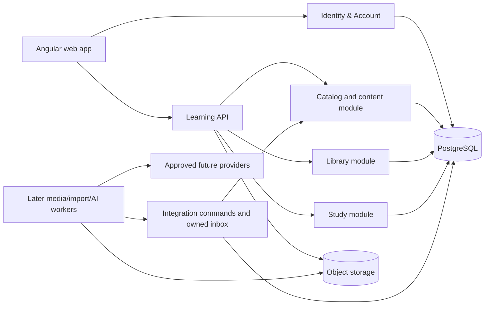
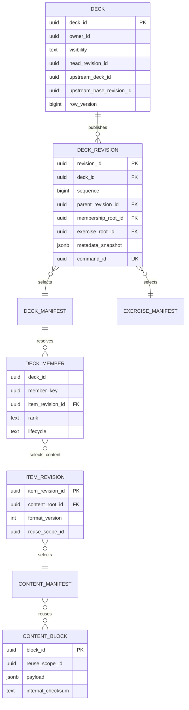
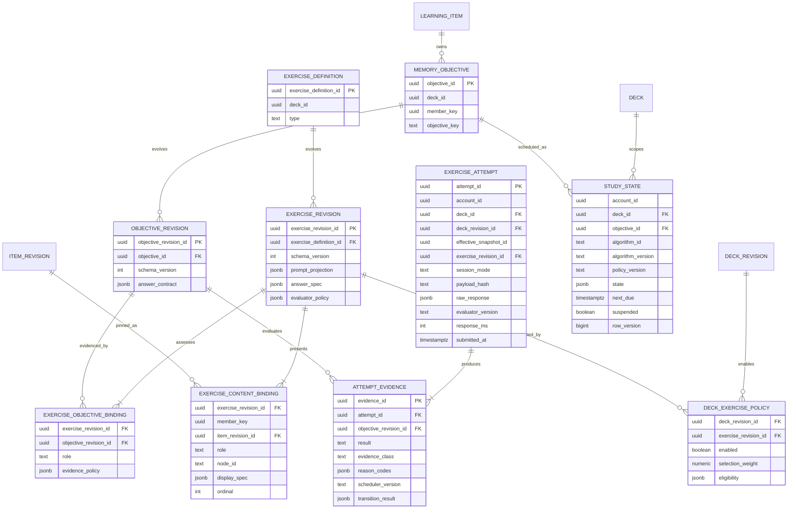

---
artifact:
  id: content-platform-v2
  type: architecture
  title: "Mnema greenfield content and study platform"
  status: proposed
  created_at: "2026-08-15"
  updated_at: "2026-09-06"
  owners: ["project-owner"]
  source_tasks: ["project architecture and product review"]
  supersedes: []
  superseded_by: null
  assumptions:
    - "Only long-lived account identity/profile data and account avatar survive; all other DB/S3/backup state is deleted without a retained legacy snapshot."
    - "The owner accepts downtime and an incomplete product during a direct replacement with no /v2 or compatibility runtime."
    - "PostgreSQL remains the primary transactional store."
    - "Real multi-author merge is not required in the first v2 release."
  unresolved_questions:
    - "Which exercise directions deserve independent memory objectives after the first instrumented cohort?"
    - "What compact/aggregate review retention policy meets product analytics needs before archival is required?"
    - "Should multi-target attempts be a P1 feature, or should P0 restrict every scheduler-affecting attempt to one assessed objective?"
  evidence:
    - "backend/services/core schema, services, repositories and tests at 8e0c83d"
    - "official Git and Flyway documentation, accessed 2026-08-15"
    - "owner product clarification and Learning API runtime guide, 2026-09-06"
    - "official Git, PostgreSQL, Shopify engineering and GitLab architecture sources, accessed 2026-09-06"
---

# Greenfield content and study platform

This document is a design proposal, not an implemented schema. Owner constraints are accepted inputs; relational details remain proposed until their epic is refined. The target directly replaces v1 on canonical routes. It has no `/v2`, dual read/write, legacy adapter, old scheduler fallback or retained full legacy snapshot.

The 2026-09-06 owner clarification accepts personal-deck launch, deck-local items
and progress, custom exercise presentations, durable authoring drafts, unfinished
quick notes, and repeat practice with no scheduler writes. Future catalog/forks,
selective updates (manual pull is recommended), detailed conflict resolution and upstream contributions
must remain possible. [Revision storage and runtime boundaries](./revision-storage-and-runtime-boundaries.md)
supersedes earlier physical full-item snapshots, unbounded historical replay and
cross-fork logical item identity assumptions. Its storage details are proposed.

## Requirements and workload

The target model must:

1. Start with personal decks and preserve physical sharing for future forks.
2. Reuse unchanged item blocks, membership and media in a new revision.
3. Preserve stable deck-local identity when text, labels or ordering change.
4. Keep personal notes, edits, hides and progress private and sparse.
5. Make future editable fork/clone and streamed export distinct operations; subscription tracking is a future option.
6. Support pinned/manual updates and explicit conflicts.
7. Add single- and multi-item exercise types without copying content or coupling every exercise to a card template.
8. Represent rich multilingual, mathematical, code, diagram and media content without executing user code.
9. Preserve IDs and idempotency boundaries needed by future offline review and native clients.
10. Keep the common read and review paths simple enough for PostgreSQL.

Unknown workload inputs must not be disguised as measurements. The owner's zero-usage assertion is not a gate to recheck. Capacity choices below are scenarios; after the replacement has real traffic, collect its row sizes, query plans, p95/p99 latency, review volume, deck-size distribution and tenant skew before adding scale mechanisms.

### Confirmed current scaling behavior

Adding or globally editing a card constructs a complete next snapshot: it loads the old version, copies its cards and saves them again ([CardService.java](../../backend/services/core/src/main/java/app/mnema/core/deck/service/CardService.java#L1054)). Adding `N` cards one by one therefore produces:

```text
snapshot rows = 1 + 2 + ... + N = N × (N + 1) / 2
```

The full-text GIN index also indexes every JSON copy ([V14__search_indexes.sql](../../backend/services/core/src/main/resources/db/migration/V14__search_indexes.sql#L13)). With an explicitly guessed 2–5 KiB physical cost per public-card row:

| Cards added one by one | Snapshot rows | Illustrative physical size |
|---:|---:|---:|
| 1,000 | 500,500 | 0.9–2.3 GiB |
| 3,000 | 4,501,500 | 8.4–21.0 GiB |
| 10,000 | 50,005,000 | 93–233 GiB |

The production PostgreSQL PVC currently requests 15 GiB ([postgres.yaml](../../k8s/postgres.yaml#L45)). This is a scale boundary, not a benchmark: actual row size and edit pattern must be measured.

Subscribing also eagerly inserts a `user_cards` row for every active source card ([DeckService.java](../../backend/services/core/src/main/java/app/mnema/core/deck/service/DeckService.java#L630)). This grows as:

```text
user rows = subscribers × cards per subscribed deck
```

Personal study state for every item actually studied is irreducible. What v2 removes is eager membership/content duplication for untouched cards.

### Review events will eventually dominate

An illustrative scenario of 100,000 DAU × 30 answers/day is 3 million events/day. At a guessed 300–800 bytes per event plus 150% heap/index overhead, one year is roughly 0.82–2.19 TB before backups, compression and replicas. The current log stores `state_before` and `state_after` JSON for every answer ([V1__initial_migration.sql](../../backend/services/core/src/main/resources/db/migration/V1__initial_migration.sql#L464)).

This makes event retention, compact columns and rollups a more important long-term capacity decision than adding Redis. Partitioning is a trigger-based option for a genuinely large table, not a default; PostgreSQL documents both its benefits and the cost of excessive partitions in [Table Partitioning](https://www.postgresql.org/docs/current/ddl-partitioning.html).

## Candidates and decision

| Candidate | Benefits | Costs and failure modes | Decision |
|---|---|---|---|
| Full immutable item content plus full membership per release | Simple historical SQL and reads | Repeats unchanged document payload and `O(releases × items)` membership | Not the general storage target |
| Stable-node deltas, head projection and bounded checkpoints | Compact usual edits and simple current SQL | Checkpoint/fork materialization needs budgets; replay depth must be capped | Viable simpler alternative with explicit revised decision |
| Immutable bounded content blocks and persistent paged manifests | Reuses unchanged document blocks and membership pages; history-independent reads and cheap future fork | Page splitting, ordering, projection parity and GC require dedicated tests | **Proposed target** |
| Literal Git/JGit/Merkle repository as primary store | Native objects, commits, refs and structural sharing | Poor fit for ACL, SQL search, moderation, transactions and common queries; extra GC/backup/operations | Reject for now |

Git is useful as a semantic model: immutable objects, parented commits and refs.
Logical snapshots do not imply complete physical copies. Git initially stores
changed blobs and later may delta-compress them in packs; it does not always store
only changed characters. Mnema's proposed block/page reuse, PostgreSQL caveats and
bounded-operation contract are in [revision storage](./revision-storage-and-runtime-boundaries.md).

Do not expose hashes as entity identity. Identical text can represent separate learning units, and equality of private content must not become visible across users.

## Context and components

Identity and User source is already consolidated into Identity & Account. The
[Learning API runtime shell](../../backend/services/learning/guide.md) exists with
platform contracts, but its content/library/study product modules are not yet
implemented. Legacy core/media/import/AI remain replacement input. The selected
target puts content/library/study in one modular Learning API; separate
media/import/AI and bulk workers receive independent capacity when their capability
is introduced. This lets a busy importer scale without multiplying API replicas.
The distinction, real-project evidence and remaining database/failure boundaries
are explained in [runtime rationale](./revision-storage-and-runtime-boundaries.md#runtime-decision-and-evidence).



Workers may write only integration-owned inbox/job tables or call an application command. They must not update catalog/library/study tables directly. Deployment boundaries may change when measurements show different scaling, security or failure-isolation needs; source modules should not depend on that choice.

### Proposed domain modules

- `catalog`: personal decks, structured learning items and publication; later shared discovery.
- `library`: personal ownership and access; later forks, subscriptions and upstream conflicts.
- `study`: exercise selection, memory state, review events and aggregate progress.
- `integration`: idempotent commands/inbox for capabilities introduced by later epics.
- `identity-account` (separate deployable): credentials, issuer, federated identity, account/profile and avatar ownership.

No Kafka or additional database is required for the first replacement. PostgreSQL-backed workers are sufficient when a later capability needs them and reclaim, idempotency and observability are correct.

## Data ownership and contracts

### Content identity and immutable releases

The following is a conceptual schema. Item/exercise keys are deck-local and may
be resolved through an inherited immutable manifest without an eager entity row
for every item at fork time. The physical schema must preserve that distinction.



A logical `LearningItem` has identity `(deck_id, member_key)`. The manifest
membership binds that item to an immutable content revision. A revision payload
can be reused by a fork's different logical item; it is not a global knowledge
identity. API IDs/authorization resolve both deck and member, and all study keys
remain local to that personal deck. The native document returned by an item read
is assembled from bounded blocks, with no replay of its prior revisions.

Required relational/domain constraints include:

- `DECK_REVISION UNIQUE(deck_id, revision_id)`, `UNIQUE(deck_id, sequence)`
  and a composite primary-parent FK constrained to the same deck;
- upstream deck/base pointers must both be absent or point to the exact source
  revision; future merge/provenance edges are separate from the primary parent;
- membership keys are unique in a manifest and ordered with deterministic rank
  tie-breaking; every selected revision/block lies in an authorized reuse scope;
- bindings resolve member/objective/exercise keys through the same deck namespace;
  a bare physical revision ID cannot grant access or merge progress;
- a current `deck_head_item` projection, when used, has key
  `(deck_id, member_key)` and is rebuildable from an immutable root.

A metadata-only save writes a small deck revision and reuses item/exercise roots.
A document edit writes changed blocks and affected manifest pages. No publication
copies every unchanged document or eagerly materializes every membership.
The change ledger records audit/update semantics; common and historical reads use
bounded root/page traversal. SQL search/eligibility projections must expose the
same root generation as the read contract.

Publication checks an expected head and command identity, prepares and validates
bounded content, then atomically inserts the immutable revision, updates/switches
the ready projection and advances the head with its command receipt. Large edits,
rebalances and index generations use durable jobs with a short final transaction.
Detailed budgets, staged-object recovery and read complexity are in
[revision storage](./revision-storage-and-runtime-boundaries.md#publication-budgets-and-concurrency).

`deck_revision` contains only saved/published revisions. In the personal editor,
Save makes validated material available to future learning; public catalog
publication is a separate later permission/discovery operation. Mutable server
drafts have their own identity, base revision, version and expiry policy. Durable
quick notes are unfinished material until completed, have `created_at`, and never
expire through draft/cache TTL. They have no scheduler state. The exact draft
limits and lifecycle are in [authoring workflows](../product/authoring-and-study-workflows.md).

### Future forks, selective updates and sparse personal state

Launch serves a user's own decks. A future editable fork/clone creates one private
deck namespace and points to existing immutable membership/exercise roots. It
stores the exact upstream revision and a namespace mapping rule. Reusing inherited
member keys in the new namespace avoids both logical cross-deck links and an
`O(N)` synchronous mapping insert. New private edits advance only the fork head;
progress is independent and initialized lazily. Source deletion cannot invalidate
reachable fork blocks.

A future subscription is a separate tracking option, not a launch requirement or
a mandatory second identity for an owned deck. Private overlays, if exposed later,
must be resolved into an immutable effective snapshot before study. Export streams
an interchange artifact; it does not require copying all content inside the DB.

Manual pull shows separate deck metadata, material and exercise changes. Compare
the last resolved source base, proposed source and private head; apply only
approved conflict-free/dependency-valid changes. Keep private content when edits
conflict. Persist per-unit resolved upstream bases and explicit keep/conflict
choices, because selective pull cannot be represented by one global pointer.
The plan binds exact heads and is invalidated by intervening edits. Applying it
is idempotent and creates a new private revision without duplicate members.

Later conflict UI can combine selected parts of own/upstream material. Upstream
contribution proposals are a desired future target, based on explicit selected
changes and exact provenance; they are not part of personal-deck launch. The
earlier statement that forks never submit upstream is superseded.

Reachability protects retained history, forks, pull bases, drafts, attempts,
replay and bounded offline leases. Purge removes only unreachable shared storage
under a documented policy; a deleted source owner does not imply cascade deletion
of already-authorized fork content. See the
[retention contract](./revision-storage-and-runtime-boundaries.md#retention-and-garbage-collection).

### Visibility, collaboration and publication review

Private ownership is the initial behavior. Preserve an extensible visibility
policy for later `PUBLIC`, `REQUEST_RESTRICTED` and `PRIVATE` decks; restricted
access requires explicit permission, not an unguessable URL. Catalog, likes,
recommendations and community onboarding are future product phases, not primary
navigation requirements for the current frontend.

Future collaborator roles and publication review bind approval to the exact
draft/base checksum; changing approved material invalidates that approval.
Discovery/author counts are rebuildable aggregates, never ACL or entitlement
authority. Withdrawal from discovery and permission to retain an existing fork
are distinct operations. Financial limits and downgrade retention belong to
product/entitlement policy, not the physical deduplication layer.

### Structured content instead of templates and fields

The owner decision removes user-facing templates, arbitrary fields and mandatory deck language pairs from the native model. An item revision stores a bounded, validated, versioned document tree. A card-like front/reveal view is one exercise projection over stable node IDs rather than the storage shape.

The owner may organize an item as a long note containing a word, translation,
grammar, examples, links and several media assets. Named sections/node selections
provide that freedom without imposing one deck-wide field schema. An exercise
binding can select a small excerpt or own custom compact text/audio/image display.
Front/reveal recall requires explicitly authored or confirmed sides; the platform
does not pretend every document naturally has two sides.

The document supports semantic ruby/furigana, bidi metadata, math, code, diagrams, drawings and media through registered nodes. It never executes user JavaScript or arbitrary CSS. Markdown is an authoring/interchange view; Anki HTML/CSS must be compiled into registered native nodes or reported unsupported and is never executed by a legacy renderer. The complete contract, editor behaviour, security boundary, media references and offline envelope are defined in [learning-content-format-v2.md](./learning-content-format-v2.md).

This makes schema evolution local: `format_version` governs the document, each node and exercise config has its own version, and unknown nodes remain preserved with a visible fallback. Adding a renderer normally does not require rewriting every stored item.

### Study state and exercises



Required constraints include `UNIQUE(deck_id, member_key, objective_key)`,
immutable objective/exercise revisions, unique binding ordinals/roles, namespace
validation for all referenced members, and
`STUDY_STATE PRIMARY KEY(account_id, deck_id, objective_id)`. Objective/exercise
keys inherited by a fork resolve in its deck namespace, like member keys.
`EXERCISE_ATTEMPT.attempt_id` is a client-generated global idempotency key. Reuse
with the same owner and payload hash returns the stored result; conflicting
reuse returns an idempotency conflict.

`ExerciseDefinition` is stable deck-local identity; `ExerciseRevision` pins prompt,
answer and evaluator policy. `ExerciseContentBinding` creates the M:N relation and
uses allowlisted roles `ASSESSED`, `CUE`, `OPTION`, `CONTEXT`. Its versioned display
spec selects stable node excerpts or custom bounded labels/media. Matching pools
contain only user-enabled, compatible bindings: a mixed vocabulary/grammar deck
does not automatically place grammar notes into word matching. Explicitly authored
compatible labels can include them. Missing/deleted selected nodes invalidate the
affected configuration until repaired; they never fall back to rendering a whole
document into a compact tile. UI-specific size limits and accessible validation
belong to the exercise/content contracts. `ExerciseObjectiveBinding` identifies
exactly which objectives may receive evidence. A deck-revision policy enables
compatible exercises without copying their definitions.

Study state is created lazily for a `MemoryObjective`, not for a renderer. If
independent forward/reverse objectives are enabled, their states remain independent.
Several exercise kinds can emit evidence for one shared state, so a renderer
change does not reset memory. In P0 an objective belongs to one `LearningItem`;
cross-item objectives remain deferred until a real case cannot be represented as
several per-item outcomes.

Product progress is visible at material level, scoped to its personal deck. The
numerical indicator is an explainable projection of evidence/state, not a claim
that a document is permanently “100% learned.” Independent directional objectives
remain an engineering/calibration choice under the exercise contract, not a new
cross-deck knowledge entity. Editing a correct answer preserves existing history
and scheduling state with no automatic reset or revalidation. An explicit user
restart resets future scheduling for the chosen material, records the action and
retains previous attempts.

### Multi-item attempt semantics

- Candidate bindings come only from one pinned effective personal deck snapshot. `OPTION`/`CONTEXT` exposure never changes progress.
- A focal matching exercise may pin one `ASSESSED` item plus several options. A group matching submission may return several `ATTEMPT_EVIDENCE` rows, but each row needs an observable response for its own objective.
- Aggregate `4/4` feedback is not copied to all items. If a mechanic cannot produce valid per-objective evidence, it is feedback-only and rejected as scheduler-affecting.
- A directional relation updates only its declared direction. Showing or matching one pair does not automatically credit the reverse objective.
- For P0, prefer one assessed objective per attempt. A later atomic multi-target submission locks study-state rows in deterministic objective-ID order and commits all transitions or none; it never leaves partial progress on failure.
- The full presented set is immutable for the attempt. A concurrent deck edit affects future sessions, not a session already pinned to its effective snapshot.

Do not select neighbors with `ORDER BY random()` or compute/sort a hash for every
member over a large head. Use explicitly eligible, revision-pinned candidate
indexes and the bounded seeded ordinal/page traversal in
[session reads](./revision-storage-and-runtime-boundaries.md#session-reads-and-large-decks).
If the filtered index is not ready, expose preparation rather than hide an
unbounded scan. Semantic distractor quality remains a product validation problem.

### Evidence and scheduler boundary

Evaluators return normalized evidence, not an interval:

- result: `CORRECT`, `PARTIAL`, `INCORRECT`, `UNSURE`, `NOT_ASSESSED` or `UNAVAILABLE`;
- evidence class: `HIGH`, `MEDIUM`, `LOW` or `NONE`;
- reason codes such as retrieval mode, hints/reveal, deterministic/self/human evaluator and uncertainty;
- per-part feedback plus the exact evaluator/runtime version.

Browse, cancel, timeout and evaluator failure create no scheduler transition. Response time is diagnostic only. Recognition, cued recall and free production may produce different evidence classes, but no hard-coded scientific weight is claimed before Mnema cohort calibration.

Use one canonical versioned scheduler-reducer interface over normalized evidence. Do not bind an algorithm to an exercise type: that duplicates memory state and makes cross-exercise learning incoherent. Different algorithms/configs remain possible through a durable assignment and reducer version, so A/B tests compare policies without rewriting content or UI. Record experiment ID/version, assignment unit and reducer/config on every transition. Assignment should be stable at account/deck or account/objective level; avoid changing it mid-history without an explicit migration/analysis boundary.

Track actual scheduled first exposure sparsely (for example
`study_exposure(account_id, deck_id, objective_id, introduced_at, source_revision_id)`)
rather than relying on one reorder-sensitive cursor. Practice/replay do not update
canonical exposure. Source insertion/reorder must not silently skip unseen items.

Each attempt records all item/exercise revisions actually shown, evaluator version,
normalized evidence and scheduler/config assignment so the transition remains
explainable after content changes. Both presentation and answer edits retain state;
there is no automatic revalidation. Normal scheduled sessions, today's replay and
whole-deck practice are one product study experience with different server-enforced
effects: replay/practice never write canonical scheduler state, due dates, streaks
or experiment outcomes. They may record separately classified diagnostic events.
The post-session screen permits leaving, replaying today's completed selection or
practicing the deck beyond today's selection. Preparation/prefetch stays bounded.

## API boundaries

The exact URL names are an LLD concern, but the canonical replacement API must provide these resource/command semantics without a `/v2` prefix or legacy aliases:

| Operation | Contract |
|---|---|
| Read deck | paginated manifest pinned to an explicit effective personal snapshot; cursor is opaque and stable for that snapshot |
| Read item | deck namespace + item key + explicit selected `itemRevisionId`, document `formatVersion`, exercise revisions and capability set; no unscoped “latest by item ID” |
| Save draft | mutable draft + `If-Match`/row version; accepts client-generated command ID and stable node IDs |
| Publish | command against expected deck head; validates all node/media/exercise references and returns one immutable revision |
| Plan upstream update (future) | pure three-way diff with summary, safe changes, dependency closure and conflicts; no writes |
| Apply upstream update (future) | idempotent command referencing the exact compared heads/plan and explicit choices; a new private revision |
| Start study | requires one personal `deckId` and explicit scheduled/replay/practice mode; returns a bounded batch pinned to effective snapshot/exercise runtime |
| Submit attempt | client event ID + payload hash; duplicate retry returns the stored outcome, conflicting reuse returns 409 |
| Media upload | initiate/complete protocol, server-verified hash/MIME/size and logical asset result; object key is not an ACL |
| Offline sync | opaque per-user cursor, bounded changes/tombstones and idempotent command/attempt batch |

Large documents/media never ride in an unbounded deck response. Use pagination/prefetch, presigned object transfer and HTTP range for media. Apply request/body, node-depth/count, upload and concurrency limits at the edge and in application validation. API replicas remain stateless; durable jobs expose status and safe retry rather than holding an HTTP request open through provider work.

## Consistency, failure and recovery

### Legacy defects that justify replacement, not repair scope

The following findings are evidence for deleting the old paths. Do not turn them
into a v1 remediation backlog unless a defect blocks the greenfield cutover itself:

- Browser/review paths sometimes fetch the latest `public_card` by `card_id` rather than the subscription's pinned deck/version ([DeckCardViewAdapter.java](../../backend/services/core/src/main/java/app/mnema/core/deck/adapter/DeckCardViewAdapter.java#L103)). Search and review can therefore disagree.
- The database no longer enforces a source FK for `user_cards.public_card_id` ([V21__public_card_id_non_unique.sql](../../backend/services/core/src/main/resources/db/migration/V21__public_card_id_non_unique.sql#L1)).
- Local editing writes the whole effective JSON as an override although reading supports patches ([CardService.java](../../backend/services/core/src/main/java/app/mnema/core/deck/service/CardService.java#L1442)).
- The in-process `DeckAlgorithmUpdateBuffer` is unsafe with more than one core replica ([DeckAlgorithmUpdateBuffer.java](../../backend/services/core/src/main/java/app/mnema/core/review/service/DeckAlgorithmUpdateBuffer.java#L14)).
- Publication calculates `latestVersion + 1` without a deck-head lock/CAS ([CardService.java](../../backend/services/core/src/main/java/app/mnema/core/deck/service/CardService.java#L1183)).
- Some card mapping performs N+1 latest-card lookups ([CardService.java](../../backend/services/core/src/main/java/app/mnema/core/deck/service/CardService.java#L2044)); sync loads complete current/user/history collections in memory ([DeckService.java](../../backend/services/core/src/main/java/app/mnema/core/deck/service/DeckService.java#L384)).
- Review keeps a state lock while calculating the next card ([ReviewService.java](../../backend/services/core/src/main/java/app/mnema/core/review/service/ReviewService.java#L203)).
- Import can commit earlier batches before the job fails ([ImportProcessor.java](../../backend/services/import/src/main/java/app/mnema/importer/service/ImportProcessor.java#L152)); AI can change a requested global update into a local update based on exception text ([CoreApiClient.java](../../backend/services/ai/src/main/java/app/mnema/ai/client/core/CoreApiClient.java#L119)).

### Idempotent review

`EXERCISE_ATTEMPT.attempt_id` is a client-generated idempotency key. For a scheduled
attempt, within one transaction:

1. Insert missing study state with `ON CONFLICT DO NOTHING`.
2. Lock the state row.
3. If `attempt_id` already exists for the same account/deck/mode and payload hash,
   return its stored transition result; if scope or payload differs, return an
   idempotency conflict.
4. Insert the attempt/evidence and update state atomically.

This closes the current first-answer race and duplicate retry risk.
Practice/replay uses its mode-specific receipt path and must not create, lock for
update or change canonical study-state rows. Mode validation precedes reduction.

### Later integration commands

Remote service calls are not distributed transactions. When media/import/AI is introduced by later epics, every write carries `job_id + item/batch key`, returns a queryable command result and is safe to retry. These workers and their legacy behavior are not foundation dependencies; the current import worker's stale-lock defect is deletion evidence ([ImportJobWorker.java](../../backend/services/import/src/main/java/app/mnema/importer/service/ImportJobWorker.java#L78)).

## Security and observability

- Keep private content hashes internal and scope physical deduplication to a trusted lineage/tenant.
- Record actor, source revision and command ID for publication and rebase.
- Never put provider keys or card content into logs.
- Add metrics for publish changes/transaction duration, head rebuild failures, checkpoint age when checkpoints exist, conflicts, review duplicate rate, queue age, stale job reclaim, relation/index growth and retained review events.
- Define timeouts for every inter-module HTTP call that remains remote; current core media/user clients do not set explicit connect/read timeouts.

## Capacity, cost and scale boundaries

| Signal | Initial action | Scale trigger for a larger mechanism |
|---|---|---|
| Deck history | Shared immutable blocks/pages + bounded head projection | Measured page read/write cost guides caches and page sizing; unbounded history replay is never the baseline |
| Review log | Compact append-only rows + aggregate tables | Measured table/index size and maintenance justify time partitioning/archive |
| Study state | Partial index on `(account_id, deck_id, next_due) WHERE suspended = false` | Hot tenants, lock waits or write IOPS exceed one primary's measured envelope |
| Jobs | PostgreSQL queue with reclaim/idempotency | Sustained queue age cannot recover within SLO after adding bounded workers |
| Search | Head/current projection only | Measured GIN update/read cost or relevance requires a dedicated engine |

The present architecture cannot name an exact user count at which it fails because no representative workload, relation sizes or p95/p99 baseline were provided. The formulas identify cliffs; only measured load tests can place the boundary.

### Attempt fan-out scenario

This is a design envelope, not traffic evidence. Reusing the operations plan's low/
medium/high attempt rates and assuming mean `1.5` evidence rows per attempt, a hard
cap of `20`, p95 request target `300 ms`, roughly `1.7 KiB` logical attempt bundle
and 100% index overhead. The last column deliberately assumes that the listed
peak is sustained for a full year; it is a storage upper envelope, not a usage
forecast:

| Scenario | Attempt writes/s | Mean evidence/s | Adversarial cap evidence/s | Approx. annual event + index |
|---|---:|---:|---:|---:|
| low | 1.5 | 2.3 | 30 | ~153 GiB |
| medium | 18.5 | 28 | 370 | ~1.85 TiB |
| high | 222 | 333 | 4,440 | ~22.2 TiB |

The high case is dominated by append/index/vacuum/retention rather than ordinary
API RPS. Bound a multi-target attempt (initial proposal: at most 20 objectives),
lock state rows in objective-ID order and keep the compact idempotency receipt
separate from bulky/raw response retention.

Initial hot indexes:

- due pool: partial `(account_id, deck_id, next_due, objective_id)` where not suspended;
- current deck: `(deck_id, rank, member_key) INCLUDE (item_revision_id)`;
- exercise policy/candidates: `(deck_revision_id, enabled, exercise_revision_id)`;
- bindings: primary keys by revision/binding key plus reverse indexes on
  `item_revision_id` and `objective_revision_id`;
- idempotency: `exercise_attempt(attempt_id)` primary key;
- replay/audit: `(account_id, deck_id, objective_id, submitted_at, evidence_id)`.

Start unpartitioned. Prepare monthly partitions for append-only evidence/transition
history only when measured growth approaches roughly 25–50 million rows or 50 GiB;
do not partition `StudyState`, head projections or revision tables by time. PostgreSQL
requires partition keys in unique constraints on partitioned tables, another reason
to keep the globally unique attempt receipt separate ([PostgreSQL partitioning](https://www.postgresql.org/docs/18/ddl-partitioning.html)).

## Validation and direct replacement

The legacy database and its applied Flyway history remain untouched while it exists;
the replacement runtime owns a new migration baseline built from zero. It does not
run the old chain or append compatibility migrations. After cutover, the legacy
migration source leaves the shipping build together with its module; Git history
and `v1-apache-final` preserve evidence.

### Phase 0 — planning and account-only rehearsal

- Define one field-level allowlist for stable ID, email/verification, local
  credential, federated binding, profile/moderation fields and account avatar.
- Explicitly deny sessions, tokens, OAuth authorization/consent/grants, transient
  auth state and all learning/media/import/AI data.
- Restore only that export into an isolated fresh database and prove forced
  re-authentication, password reset, federated link and profile/avatar behavior.
- Build an exact deletion-manifest schema for DB/PVC/WAL/backups, Redis, object
  versions/delete markers, multipart uploads, old deployables/routes and credentials.
- Do not re-open the accepted zero-usage/RPS question and do not create a full
  legacy snapshot for rehearsal.

### Phase 1 — build the replacement

Identity & Account source consolidation and the Learning API foundation exist;
continue product implementation from their new source/module/schema roots.
Canonical endpoints have no `/v2` prefix or old aliases. #74 owns Deck/LearningItem
revision implementation; #75 owns exercise/evidence/scheduler; #76 owns new learning
media. #77 is absent. The product may remain in maintenance or incomplete while
these epics replace their paths.

### Phase 2 — frozen cutover and point of no return

1. Stop account writes, old application traffic and every legacy worker; keep maintenance.
2. Run final account-only export/import and exact allowlist reconciliation.
3. Start the replacement with writes closed and run account plus completed #74–#76 synthetic smoke.
4. If any account, target or smoke gate fails, stop before deletion; the untouched old resources are still available.
5. Record the explicit no-rollback acknowledgement.
6. The first deletion of non-allowlisted legacy data is the point of no return. Remove every full legacy backup/snapshot/PITR/WAL copy, DB/PVC, Redis state, learning-media object/version/multipart upload and old runtime target from the manifest.
7. Verify absence, create the first fresh-system backup and only then open replacement writes.

After step 6, recovery of deleted v1 content/study/media/import/AI data is impossible
by owner decision. Only account-only/fresh-system recovery and roll-forward exist.
No runbook may promise an emergency legacy restore.

## Proposed decision sequence

1. Merge owner-decision/document/epic reconciliation; this is the current planning step.
2. Use the implemented Identity & Account and greenfield runtime/platform foundation; verify remaining #73 delivery gates against its current status.
3. Accept and implement #74 content, #75 study and #76 media contracts in their own epics.
4. Rehearse the exact no-snapshot cutover on isolated synthetic targets.
5. Execute the destructive operational issue only after all gates; #77 is not a dependency.
6. Validate bounded storage/read contracts and measure the replacement before adding optional partitions, replicas, Kafka or another datastore.
