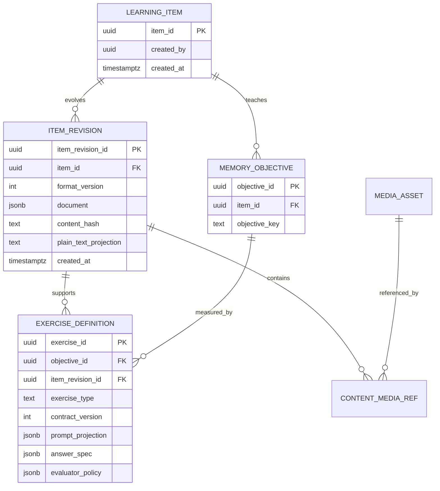

---
artifact:
  id: learning-content-format-v2
  type: architecture
  title: "Mnema native LearningItem content format"
  status: proposed
  created_at: "2026-08-15"
  updated_at: "2026-08-30"
  owners: ["project-owner"]
  decision_scope: [content-format, rendering, exercises, media, anki, offline]
---

# Native LearningItem content format

This proposed format belongs to greenfield epic #74. It replaces the canonical
content/editor/renderer directly: no `/v2`, legacy renderer, compatibility route or
mechanical reuse of v1 components is required. AI authoring is deferred to #77.

## Decision

The canonical content of a Mnema learning item should be a **versioned, validated document tree stored as `JSONB`**, not two Markdown strings, arbitrary HTML, or a user-defined set of fields.

Markdown remains a first-class authoring and interchange view for the subset it can represent. `prompt` and `reveal` are projections owned by an exercise, not mandatory halves of the content entity. Imported Anki HTML/CSS is parsed as inert input and compiled to native nodes/exercises; Mnema never ships a legacy renderer.

This choice preserves creative freedom without making untrusted HTML, CSS and JavaScript the product's internal API.

## Why not `front.md` and `back.md`

Two Markdown documents are attractive because they are simple, searchable and portable. They fail as the source of truth for Mnema's target content:

- furigana needs a semantic ruby annotation, not a convention hidden in a string;
- bidirectional text needs block/inline direction metadata;
- math, chemistry, diagrams, drawings and media need typed source plus derived representations;
- exercises must refer to stable pieces of material even when neighbouring text is edited;
- Markdown dialects do not preserve arbitrary HTML/CSS consistently;
- a single learning item may support cloze, listening, ordering and explanation without having one canonical front/back split.

Anki itself does not use a front/back Markdown contract. A note has fields; card templates use HTML/CSS and one note may generate several cards. See the official [notes and cards model](https://docs.ankiweb.net/getting-started.html), [card templates](https://docs.ankiweb.net/templates/intro.html) and [card generation](https://docs.ankiweb.net/templates/generation.html).

## Domain model



- `learning_item` is stable identity: one unit of material in a deck.
- `item_revision` is immutable content. Publishing an edit creates a revision; it never overwrites history.
- `memory_objective` names what must be remembered. Forward and reverse recall are separate objectives when they require independent scheduling.
- `exercise_definition` is an independently versioned way to test an objective. One item may have none, one or many exercises.
- browsing renders the document. It is a mode, not an exercise and does not change study state.

There are no `template`, `field`, mandatory deck language, or card-type entities in the native v2 model. Optional `lang` and `dir` attributes describe rendering of any block or span. They do not assert that a deck has exactly one source and target language.

## Document envelope and node contract

The exact editor library remains a prototype decision. The persisted contract belongs to Mnema and must not be an unversioned dump of a UI component's private state.

```json
{
  "formatVersion": 1,
  "root": {
    "id": "018f...",
    "type": "doc",
    "version": 1,
    "attrs": {},
    "content": [
      {
        "id": "018f...",
        "type": "paragraph",
        "version": 1,
        "attrs": {"lang": "ja", "dir": "auto"},
        "content": [
          {
            "id": "018f...",
            "type": "ruby",
            "version": 1,
            "attrs": {"base": "漢字", "reading": "かんじ"},
            "content": []
          }
        ]
      }
    ]
  }
}
```

Every node has a stable opaque `id`, a registered `type`, its own `version`, validated `attrs`, and optional children. Stable node IDs allow exercises and diffs to refer to meaning without fragile character offsets. IDs must be globally unique and client-generatable for future offline drafts; UUIDv4 is sufficient without adding a dependency.

The renderer registry owns four contracts for every node type:

1. JSON validation and size limits;
2. accessible HTML rendering and print/plain-text fallback;
3. editor behaviour and clipboard/import conversion;
4. compatibility tests for supported historical node versions.

Unknown nodes are retained byte-for-byte and rendered as an explicit “unsupported content” placeholder. They must never be silently dropped on save. A new node type normally requires a new renderer and contract tests, not a database-wide content migration. A node migration is needed only when that node's persisted meaning changes.

ProseMirror's schema-governed document tree and transaction model are a useful reference; Tiptap documents storage as JSON or HTML and warns that arbitrary unsupported HTML is not preserved. See the [ProseMirror guide](https://prosemirror.net/docs/guide/), [Tiptap JSON/HTML storage guide](https://tiptap.dev/docs/guides/output-json-html) and [Tiptap FAQ](https://tiptap.dev/docs/guides/faq). Adopting either package requires a small Angular integration prototype and separate permission before changing dependencies.

## Native block set

### P0 document nodes

- document, section, paragraph, heading, text and inline marks;
- ordered/unordered lists, quotation, divider and table;
- semantic `ruby` annotation for furigana and other pronunciation guides;
- inline/block math source;
- fenced code with language, line emphasis and wrap/scroll preference;
- image, audio, video and animated-image media references;
- Mermaid source block;
- callout and source/citation block.

The browser has native support for `<ruby>` annotations and bidirectional `dir` behaviour; these should be generated by Mnema's renderer rather than embedded as arbitrary user HTML. See MDN's [`ruby` element](https://developer.mozilla.org/en-US/docs/Web/HTML/Reference/Elements/ruby) and [`dir` attribute](https://developer.mozilla.org/en-US/docs/Web/HTML/Reference/Global_attributes/dir).

### Later native nodes

- editable drawing source plus optimized preview;
- chemistry notation when ordinary math is insufficient;
- timeline, graph and spatial-map source;
- transcript with timestamped audio/video segments;
- source excerpt with provenance and licensing metadata.

Interactive inputs such as checkboxes, answer fields, hotspots and matching targets do not live inside the content document. They are exercise renderers. A diagram may be zoomed or scrolled in browse/reveal, but submitting an answer is a separate attempt contract.

## Markdown and editor UX

Markdown is an authoring surface, not the database contract:

- desktop: source/editor on the left, live rendered preview on the right;
- mobile: editor and preview tabs with a predictable swipe or explicit segmented control;
- toolbar and keyboard shortcuts insert native nodes or portable Markdown syntax;
- media upload inserts an asset reference, never a long-lived public object URL;
- unsupported rich nodes appear as fenced/directive syntax in source mode and remain editable through their node inspector;
- long items scroll freely inside a bounded study shell; no arbitrary content-length UI truncation.

Three creation paths share the same document output:

1. full editor;
2. quick drafts, including batch text and voice capture with optional original audio;
3. future AI generation/enhancement only after #77 is explicitly reactivated.

The current block/template builder is not migrated or wrapped. Historical UX findings may inform requirements, but new components and persistence are designed from this contract.

## Rendering and security boundary

Native content is data, not executable code:

- no user JavaScript, event handlers, iframes, forms or arbitrary CSS;
- URLs are internal asset IDs or explicitly allowlisted/proxied HTTPS sources;
- raw HTML is sanitized on ingress and converted only to registered nodes;
- output is encoded by node renderers;
- Mermaid links/click callbacks are disabled and rendering uses strict settings in a worker or isolated execution boundary;
- custom audio/video controls remain semantic, keyboard accessible and expose captions/transcripts when present;
- Content Security Policy is defense in depth, not a replacement for sanitization.

OWASP explicitly recommends contextual output encoding and HTML sanitization, while treating CSP as an additional layer: [XSS Prevention](https://cheatsheetseries.owasp.org/cheatsheets/Cross_Site_Scripting_Prevention_Cheat_Sheet.html) and [CSP](https://cheatsheetseries.owasp.org/cheatsheets/Content_Security_Policy_Cheat_Sheet.html).

## Anki compatibility without a legacy renderer

Anki import is a later acquisition feature, not the native model's constraint. Treat it as a compiler pipeline, never as an alternate runtime:

```text
APKG notes/templates/media
  → inert HTML/CSS parser; no script or network execution
  → normalized import IR with provenance
  → rule-based mapping to native AST/objectives/exercises
  → schema/security validation
  → editable preview + conversion report
  → explicit user approval and publication
```

Every generated card/template has one outcome:

1. **Converted:** learning intent, supported style and media became editable native nodes/exercises.
2. **Converted with warnings:** safe meaning was preserved, but unsupported presentation/interaction became an explicit placeholder or requires user correction before publish.
3. **Unsupported/rejected:** unsafe or materially ambiguous behaviour is not published; the report names the exact template/node and reason.

Raw HTML/CSS/JavaScript never renders in Browse, editor or Study. The upload artifact may exist only in an encrypted import-job quarantine with a short TTL for retry/report generation, then is deleted. This avoids maintaining two security, accessibility and offline runtimes.

The converter should recognize reusable patterns: basic blocks/marks/tables, CSS colors/spacing within a strict token map, media refs, cloze markers, typed-answer templates, ruby/furigana, math and supported audio controls. For example, hover-furigana becomes a native `ruby` node with hover/focus/tap behaviour, not a flattened unrelated field. JavaScript callbacks, arbitrary layouts and unknown network content are rejected rather than approximated invisibly.

Perfect Anki visual fidelity, full native editability and lossless APKG round-trip cannot all be guaranteed. Mnema prioritizes learning intent, safe native rendering and a visible conversion report. There is no v2 APKG export guarantee. AI may later propose a conversion for ambiguous content, but it cannot bypass schema/security validation and the user approves the result.

## PostgreSQL, not MongoDB

Keep PostgreSQL for relational identities, ACL, deck revisions, subscriptions, collaboration, attempts, payments and jobs. Store only the bounded immutable content document in `JSONB`, with selected relational/generated projections for search and routing.

`JSONB` is decomposed for processing and supports indexing according to the official [PostgreSQL JSON types documentation](https://www.postgresql.org/docs/current/datatype-json.html). MongoDB would still require references or multi-document transactions for Mnema's many-to-many graph. MongoDB's own guidance recommends references for high-cardinality and many-to-many data and notes the cost of distributed transactions: [data-modeling practices](https://www.mongodb.com/docs/manual/data-modeling/best-practices/). Adding a second operational database would move, not remove, the difficult invariants.

Do not add a broad GIN index to every document by default. Maintain explicit projections such as title, normalized search text, content capabilities and media references; add expression/GIN indexes only for measured queries.

## Media model

```text
media_blob    = immutable physical bytes, sha256, size, mime, object key
media_asset   = logical authorized asset and provenance, points to a blob
media_variant = derived preview/poster/waveform/WebP, points to another blob
content_ref   = item revision + node ID + asset ID
```

- physical blobs are content-addressed and deduplicated across authorized assets;
- access is checked through `media_asset` and reachable content, never granted by knowing a hash;
- the server verifies hash, size and detected MIME after upload;
- editable source is retained; previews and optimized variants are reproducible derived data;
- one asset may be referenced by thousands of items without copying bytes;
- deleting content tombstones references first;
- a mark-and-sweep job deletes an unreferenced blob only after a grace period, two successful scans and absence of retention/import/job holds;
- deletion is idempotent and records an audit result.

Yandex Object Storage remains suitable for production and MinIO for local/CI compatibility. Existing local MinIO provisioning is useful, but v2 requires automated real-S3-protocol integration tests rather than only mocked SDK calls.

## Offline-compatible boundaries

Offline review is not P0, but the v2 IDs and API must not make it impossible:

- immutable item/deck/exercise revisions are downloaded with a media manifest;
- attempts use client-generated event IDs and idempotent submission;
- the device keeps an append-only pending attempt log and applies server-confirmed study state;
- deleted/unavailable source content has tombstones and a retention window;
- v1 offline scope is browsing and review of downloaded decks, not collaborative editing;
- later editing submits a draft against an explicit base revision and receives a normal conflict if stale.

Do not introduce CRDT/Yjs history before real-time or concurrent offline editing is a validated requirement. Tiptap's collaboration documentation notes that serialized JSON alone is not a substitute for Yjs update history; that is a separate storage and operations commitment.

## Acceptance gates

- a fixture covers Japanese ruby, RTL text, math, code, Mermaid, image/audio/video and a long scrolling item;
- every historical node version has render/plain-text/round-trip tests;
- unknown nodes survive load-edit-save unchanged;
- an exercise survives unrelated edits because it references stable nodes;
- malicious HTML, URLs, SVG and Mermaid payloads cannot execute script or escape their boundary;
- shared bytes remain stored once while authorization is evaluated per asset/content lineage;
- offline retry of the same attempt creates exactly one review event;
- representative Anki fixtures produce explicit converted/warned/rejected reports without executing imported HTML/CSS/JavaScript.

## Open decisions before implementation

1. Choose the editor engine only after a spike proves Angular integration, IME/ruby/RTL, mobile selection, large-document performance and accessible preview.
2. Define the exact P0 node JSON schemas and size/depth limits.
3. Decide whether a semantic answer change automatically marks an objective for relearning or only warns the user; never silently erase history.
4. Define the first supported Anki compiler pattern set and quarantine TTL after native launch; unsupported content must remain explicit.
