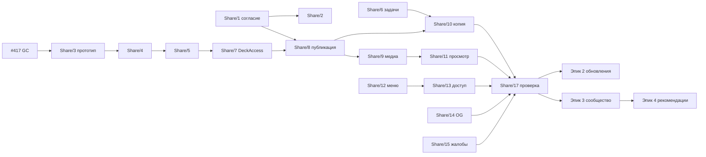

---
artifact:
  id: community-decks-refinement
  type: epic-refinement
  title: "Колоды сообщества: эпики, задачи, зависимости и правила исполнения"
  status: accepted
  created_at: "2026-10-10"
  updated_at: "2026-10-10"
  owners: ["project-owner"]
---

# Колоды сообщества: refinement

- Поведение — в [продуктовом контракте](../product/community-decks.md).
- Техника — в [архитектуре](../architecture/community-decks.md).
- Решения владельца 2026-10-10 — в
  [журнале](../decisions/owner-decisions-2026-08.md#колоды-сообщества-принято-2026-10-10).
- Задачи ведутся на доске «Mnema Kanban» (Project #4). Все стоят в Backlog, пока
  не выполнен Definition of Ready из
  [work item standard](./work-item-standard.md).

## Правила исполнения (требования владельца)

1. **Нагрузка.** Каждое архитектурное решение проверяется при нулевой нагрузке
   (пустые таблицы, пустые состояния, простаивающие задачи) и в сценарии H из
   [архитектуры §12](../architecture/community-decks.md#12-нагрузка-ноль-и-высокий-mau).
   Вывод записывается в PR.
2. **Styleguide первым.** Новые элементы сначала добавляются в `/styleguide`
   ([styleguide](../frontend/styleguide.md)):
   - меню «⋯»;
   - карточка публичной колоды;
   - чип автора;
   - панель доступа;
   - колонки сравнения;
   - книга-поиск;
   - чипы фильтров;
   - глифы.
3. **Существующие компоненты.** Используются уже готовые: `app-auto-load`
   (бесконечная подгрузка, без кнопок страниц), `app-mnema-select` (выпадающие
   списки), `.check-row`/`.check-field` (флажки), `app-segmented-choice`,
   `app-toggletip`, тосты. Нужно больше — компонент расширяется, а не дублируется.
4. **Greenfield.** Без `/v2`, двойных записей и адаптеров. Миграции ключей идут в
   окне обслуживания с backup.
5. **Полный gate** из `AGENTS.md` на точном commit. Для UI — desktop/mobile,
   клавиатура, скринридер, reduced-motion. Для ACL, медиа и приглашений —
   независимое security-ревью.

## Эпики

| Эпик | Issue | Приоритет |
|---|---|---|
| 1. Фундамент, доступ и копии | [MattoYuzuru/Mnema#419](https://github.com/MattoYuzuru/Mnema/issues/419) | P1 |
| 2. Обновления копий | [MattoYuzuru/Mnema#420](https://github.com/MattoYuzuru/Mnema/issues/420) | P1 |
| 3. Сообщество и поиск | [MattoYuzuru/Mnema#421](https://github.com/MattoYuzuru/Mnema/issues/421) | P1 |
| 4. Рекомендации и витрины | [MattoYuzuru/Mnema#422](https://github.com/MattoYuzuru/Mnema/issues/422) | P2 |

## Задачи и зависимости

| Задача | Issue | Размер | Зависит от |
|---|---|---|---|
| Share/1 Согласие и шлюз публичного профиля | [#423](https://github.com/MattoYuzuru/Mnema/issues/423) | M | — |
| Share/2 Batch-карточки авторов | [#424](https://github.com/MattoYuzuru/Mnema/issues/424) | S | Share/1 |
| Share/3 Прототип линии хранения | [#425](https://github.com/MattoYuzuru/Mnema/issues/425) | S | [#417](https://github.com/MattoYuzuru/Mnema/issues/417) GC |
| Share/4 Линия: материалы | [#426](https://github.com/MattoYuzuru/Mnema/issues/426) | L | Share/3 |
| Share/5 Линия: упражнения, цели, Study | [#427](https://github.com/MattoYuzuru/Mnema/issues/427) | L | Share/4 |
| Share/6 Исполнитель задач | [#428](https://github.com/MattoYuzuru/Mnema/issues/428) | M | — |
| Share/7 DeckAccess и read-only чтение | [#429](https://github.com/MattoYuzuru/Mnema/issues/429) | L | Share/5 |
| Share/8 Явная публикация и темы | [#430](https://github.com/MattoYuzuru/Mnema/issues/430) | L | Share/7, Share/1 |
| Share/9 Медиа чужих и гостей | [#431](https://github.com/MattoYuzuru/Mnema/issues/431) | M | Share/7, Share/8 |
| Share/10 Копия колоды | [#432](https://github.com/MattoYuzuru/Mnema/issues/432) | L | Share/6, 7, 8 |
| Share/11 Публичный просмотр и экраны | [#433](https://github.com/MattoYuzuru/Mnema/issues/433) | M | Share/7, 9 |
| Share/12 Меню «⋯», «Поделиться», глифы | [#434](https://github.com/MattoYuzuru/Mnema/issues/434) | M | — |
| Share/13 Панель доступа и приглашения | [#435](https://github.com/MattoYuzuru/Mnema/issues/435) | L | Share/7, 12, 2 |
| Share/14 OG-превью без SSR | [#436](https://github.com/MattoYuzuru/Mnema/issues/436) | S | Share/11, 2 |
| Share/15 Жалобы и снятие | [#437](https://github.com/MattoYuzuru/Mnema/issues/437) | M | Share/7, 11 |
| Share/16 Утверждённые тексты на страницах, облегчение документов | [#438](https://github.com/MattoYuzuru/Mnema/issues/438) | S | Share/1 (ставится вместе с функциями) |
| Share/17 Проверка эпика 1 | [#439](https://github.com/MattoYuzuru/Mnema/issues/439) | M | Share/10, 11, 13, 14, 15 |
| Updates/1 frontier-diff | [#440](https://github.com/MattoYuzuru/Mnema/issues/440) | M | Share/8 |
| Updates/2 Комбинированная публикация | [#441](https://github.com/MattoYuzuru/Mnema/issues/441) | M | Share/5, 6 |
| Updates/3 План обновления | [#442](https://github.com/MattoYuzuru/Mnema/issues/442) | L | Updates/1, Share/10 |
| Updates/4 Применение | [#443](https://github.com/MattoYuzuru/Mnema/issues/443) | M | Updates/2, 3 |
| Updates/5 Экран обзора | [#444](https://github.com/MattoYuzuru/Mnema/issues/444) | L | Updates/4, Share/12 |
| Updates/6 Значок, отвязка, автоприём | [#445](https://github.com/MattoYuzuru/Mnema/issues/445) | M | Updates/4 |
| Updates/7 Проверка эпика 2 | [#446](https://github.com/MattoYuzuru/Mnema/issues/446) | S | Updates/5, 6 |
| Community/0 pg_trgm и unaccent на prod (ops) | [#447](https://github.com/MattoYuzuru/Mnema/issues/447) | XS | — |
| Community/1 Проекция `public_deck` | [#448](https://github.com/MattoYuzuru/Mnema/issues/448) | M | Share/8, 9, 6, Community/0 |
| Community/2 Поиск | [#449](https://github.com/MattoYuzuru/Mnema/issues/449) | M | Community/1 |
| Community/3 Метрики и ранг v1 | [#450](https://github.com/MattoYuzuru/Mnema/issues/450) | M | Community/1, Share/10 |
| Community/4 Страница «Сообщество» | [#451](https://github.com/MattoYuzuru/Mnema/issues/451) | L | Community/2, 3, Share/12, 2 |
| Community/5 Книга-поиск и фильтры | [#452](https://github.com/MattoYuzuru/Mnema/issues/452) | M | Community/4 |
| Community/6 Профиль автора | [#453](https://github.com/MattoYuzuru/Mnema/issues/453) | M | Community/4, Share/1 |
| Community/7 «Выбор Мнемы» и sitemap | [#454](https://github.com/MattoYuzuru/Mnema/issues/454) | S | Community/1 |
| Community/8 Проверка эпика 3 | [#455](https://github.com/MattoYuzuru/Mnema/issues/455) | S | Community/5, 6, 7 |
| Recs/1 События и хранение | [#456](https://github.com/MattoYuzuru/Mnema/issues/456) | M | Community/4, Share/16 |
| Recs/2 Профиль интересов | [#457](https://github.com/MattoYuzuru/Mnema/issues/457) | M | Recs/1 |
| Recs/3 Полка «Для вас» | [#458](https://github.com/MattoYuzuru/Mnema/issues/458) | M | Recs/2, Community/3 |
| Recs/4 Проверка и пороги | [#459](https://github.com/MattoYuzuru/Mnema/issues/459) | S | Recs/3 |

Попутные задачи вне эпиков (решение владельца):

- [#417](https://github.com/MattoYuzuru/Mnema/issues/417) — GC хранилища в production
  (смержено в
  [#418](https://github.com/MattoYuzuru/Mnema/pull/418));
- [#460](https://github.com/MattoYuzuru/Mnema/issues/460) — retention генераций и
  выдач Study;
- [#461](https://github.com/MattoYuzuru/Mnema/issues/461) — индекс
  `media_asset(source_blob_id)`;
- [#462](https://github.com/MattoYuzuru/Mnema/issues/462) — read-only статистика
  индексов production.

## Порядок

- Независимо и параллельно с началом эпика 1 можно взять Share/1, Share/3,
  Share/6, Share/12 и попутную #461.
- Попутная #460 (retention Study) идёт в начале эпика 2. #462 и Community/0 — в
  начале эпика 3.
- Промпты сессий — [prompts/community-decks.md](./prompts/community-decks.md).
- Эпики 2 и 3 идут параллельно после эпика 1. Эпик 4 начинается после эпика 3.
- Первая публичная колода появляется не раньше закрытия Share/15 и Share/16.

## Definition of Ready (для каждой задачи)

- Нет нерешённых продуктовых и архитектурных вопросов. Если в ходе работы
  обнаружился новый — эскалация владельцу, решение записывается в журнал.
- Зависимости закрыты или явно разрешено работать stacked-веткой.
- Задача помещается в 1–3 дня. Если нет — она режется до перехода в Ready.
