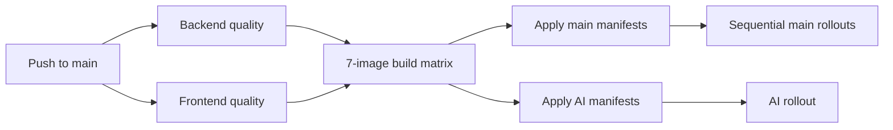
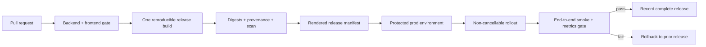

---
artifact:
  id: delivery-audit-2026-08
  type: operations-review
  title: "Mnema delivery and production readiness audit"
  status: proposed
  created_at: "2026-08-15"
  updated_at: "2026-08-24"
  owners: ["project-owner"]
  evidence_revision: "8e0c83d"
  assumptions:
    - "The manifests in this repository describe the current mnema.app deployment."
    - "SSH inventory was read-only; no database query, backup or restore was attempted."
---

# Delivery and production readiness audit

> **V2 cutover note:** the owner has since authorized a maintenance reset that preserves only account/identity data and deletes legacy content/media/review/AI data. The fresh-database procedure, point of no return, capacity model and offline/MinIO requirements in [v2 reset, capacity and offline plan](./v2-reset-capacity-and-offline-plan.md) supersede generic additive-content-migration wording here.

This is a read-only review of the repository, public health endpoints, GitHub configuration/Actions history and the two SSH targets supplied by the owner. The later SSH inventory confirmed a shared 6-vCPU/29-GiB host and a smaller k3s/AI host already near 72% Kubernetes memory usage. It is still not evidence that production data is backed up: no database query, backup or restore test was attempted. The detailed GitHub and staging plan is [GitHub platform and staging plan](./github-platform-and-staging-plan-2026-08.md).

## Decision

The pipeline is usable for an early private MVP, but it is not yet a safe unattended production delivery system. Tests do gate image creation, immutable SHA tags are produced and Kubernetes health probes exist. The immediate gaps are release atomicity, reproducible frontend images, post-deploy verification and data recovery.

Do not redesign the platform or add a new orchestrator. Harden the existing GitHub Actions + GHCR + Kubernetes path in small slices.

## Current delivery path

The last inspected run for revision `8e0c83d` completed successfully: [GitHub Actions run 26878396537](https://github.com/MattoYuzuru/Mnema/actions/runs/26878396537). That proves the configured gate passed for that revision; it does not prove restore, rollback or end-to-end production behavior.

## Findings

### P0 — a newer push can interrupt a partially completed release

The main workflow has branch-wide `cancel-in-progress: true` ([deploy.yaml](../../.github/workflows/deploy.yaml#L9)). Main and AI deployments then proceed independently, and the main services roll out sequentially ([deploy.yaml](../../.github/workflows/deploy.yaml#L356)).

This is not hypothetical: [run 26711785556](https://github.com/MattoYuzuru/Mnema/actions/runs/26711785556) was cancelled by a subsequent push while `deploy-main` was in progress, after `deploy-ai` had already succeeded. Production could therefore contain services from different commits.

Target behavior:

1. CI work for superseded commits may be cancelled before deployment.
2. Once a production deployment starts, it runs to a terminal state.
3. One release manifest records the exact image digest for every service.
4. A failed rollout either rolls back the affected release or leaves a clearly reported, recoverable state.

Use a separate non-cancelling deployment concurrency group or a reusable deployment workflow triggered after CI. Assign `environment: prod` to deployment jobs themselves so protection rules, approvals and history cover the mutation, not only image builds. GitHub documents environment protection and concurrency semantics in [Deployments and environments](https://docs.github.com/en/actions/reference/workflows-and-actions/deployments-and-environments) and [Control deployments](https://docs.github.com/en/actions/how-tos/deploy/configure-and-manage-deployments/control-deployments).

Resolution update (2026-08-24, [#89](https://github.com/MattoYuzuru/Mnema/issues/89)): cancellable quality/build jobs live in `Main CI`. A successful run triggers the direct `Staging Deploy` workflow, which receives the tested SHA and artifacts through the bounded `workflow_run` event. Only after staging smoke and release-state recording succeed does it relay the checksummed production manifest to direct `Production Deploy`. Each triggered workflow has an unprivileged predecessor/artifact gate that fails the workflow for an unsuccessful, invalid or stale predecessor before Environment access; this avoids GitHub's successful conclusion for a workflow containing only skipped jobs. Staging owns a non-cancelling workflow group, while production applies non-cancelling concurrency only to its mutating job so stale preview approvals do not block a newer preview. Privileged jobs directly declare `staging` or `prod`, so Environment secrets are never copied through a reusable-workflow caller. Both staging and production artifacts are checksummed and bound to the exact predecessor SHA before credential access, then checked again inside the privileged path. The production mutation alone creates the production deployment record.

GitHub reruns use the historical workflow definition, so the YAML guard cannot revoke historical authority by itself. This PR therefore has a strict **pre-merge** cutover: provision `prod/PROD_KUBECONFIG_B64`, confirm no legacy deploy is running, revoke both repository credentials used by rerunnable historical workflows (`KUBECONFIG_B64` and `AI_KUBECONFIG_B64`), and verify the environment name is present while both repository names are absent. Do not merge until those checks hold. Only after that revocation do historical workflow revisions fail before Kubernetes authentication; the merge then starts the first guarded deployment. Restoring either repository credential is not an allowed rollback.

### P0 — recovery of the only production database is unproven

The main PostgreSQL instance is a single StatefulSet with a 15 GiB claim ([postgres.yaml](../../k8s/postgres.yaml#L1)); the application services mostly have one replica, and the manifests do not define a backup schedule, off-host retention or restore verification. A PersistentVolume is not a backup.

Before a schema replacement or public launch, require:

- scheduled database backups outside the cluster;
- retention and encryption ownership;
- a documented restore command into an isolated namespace;
- a recurring restore drill with measured RPO/RTO;
- free-space alerts and relation/index size dashboards;
- a pre-migration backup and reconciliation report.

The exact backup implementation depends on the actual cluster/storage provider and cannot be selected from this repository alone.

### P0 — frontend releases can remain stale for a year

Angular production output does not enable filename hashing ([angular.json](../../frontend/angular.json#L22)), while nginx marks all JS/CSS/images immutable for one year ([nginx.conf](../../frontend/nginx.conf#L50)). The live site returned files named `main.js`, `runtime.js` and `styles.css` with that cache policy.

Enable content hashing and keep HTML/runtime configuration revalidated. Until hashed assets ship, remove `immutable` from unhashed JS/CSS. Add a deploy smoke check that fetches the public HTML, resolves its script names and verifies that they correspond to the released image.

Resolution update (2026-08-18, [#90](https://github.com/MattoYuzuru/Mnema/issues/90)): Angular production builds now hash all emitted filenames. Nginx retains long-lived `immutable` caching only for those content-addressed assets; `/index.html` remains revalidated and `/app-config.js` remains `no-store`. The frontend image now resolves dependencies with the committed lockfile and invokes the repository-local build script. Previously cached unhashed bundles cannot be recalled, so production verification still records the transition as a residual risk.

### P1 — manifests are applied before the release images are selected

`apply-main-manifests` applies deployments first ([deploy.yaml](../../.github/workflows/deploy.yaml#L278)); a later job uses `kubectl set image` to select SHA-tagged images ([deploy.yaml](../../.github/workflows/deploy.yaml#L388)). The checked-in manifests contain mutable `latest` tags or a frontend placeholder. A manifest edit can therefore start an unintended transient rollout before the desired image is set.

Render one release artifact with exact digests, inspect its diff, then apply it once. Keep `latest` only as a convenience tag, never as deployed state. Kubernetes recommends meaningful tags or digests and notes that tags can move in [Images](https://kubernetes.io/docs/concepts/containers/images/).

Resolution update (2026-08-18, [#90](https://github.com/MattoYuzuru/Mnema/issues/90)): each successful six-image build publishes its exact digest, then a deterministic renderer produces one checksummed application manifest containing the release ConfigMap, six Deployments/Services and both ingresses. A non-deployment `prod` job verifies the artifact checksum and current `main`, uses pinned `kubectl` for a server-side dry run, and uploads a sanitized diff plus release/checksum/tool metadata under the unique run ID and attempt. A versioned external-diff wrapper compares the sorted union of stable resource-relative paths, so random `kubectl` temporary roots never enter the approved bytes. GitHub still requires the environment reviewer before that job may read its environment-only credential, but does not create a deployment record for it. A release with no application diff stops there without a production record or cluster mutation. Otherwise the cluster-mutating job waits for a separate `prod` approval after the preview, resolves that preview by its immutable artifact ID, checks the server-side artifact digest and exact run identity, downloads it with digest mismatch configured as an error, and validates its release SHA, manifest hash, diff hash, tool version and run attempt before reading the kubeconfig. It then rechecks current `main` and the exact canonical server diff before any mutation, and applies the complete application manifest once. Reject the second approval if the preview is unexpected; a missing artifact or changed cluster diff fails closed and requires a fresh run. The flow is incompatible with custom deployment-protection-rule apps because GitHub does not support those rules with `deployment: false`; use the configured required reviewer gate. Checked-in application manifests are explicitly non-applicable templates; every image in the rendered artifact is digest-pinned, and all Mnema workloads share the same full commit build identifier. Broader supply-chain provenance and automated digest maintenance remain scope under #72.

### P1 — the container build is not the build that CI tested

The frontend quality job correctly uses `npm ci`, but the image copies only `package.json`, runs `npm install`, and downloads a CLI with `npx -y` ([Dockerfile](../../frontend/Dockerfile#L5)). Dependency resolution can therefore differ between quality and release.

The image should copy `package.json` and `package-lock.json`, run `npm ci`, and use the repository-local build script. This requires no new dependency.

Resolution update (2026-08-18, [#90](https://github.com/MattoYuzuru/Mnema/issues/90)): the frontend Docker build now copies both package files, runs `npm ci`, and uses `npm run build`; it no longer resolves a separate CLI through `npx -y`.

The backend build matrix invokes the same multi-target Dockerfile six times. Each build target currently compiles all six boot JARs ([backend/Dockerfile](../../backend/Dockerfile#L25)). Shared cache reduces network cost, but the structure still repeats orchestration and makes provenance harder to understand. Prefer one tested backend build artifact or a single multi-output build before optimizing further.

### P1 — runtime limits and multi-replica semantics are absent

The core, auth, user, media, import and AI workloads have no application CPU/memory requests or limits, no PodDisruptionBudget and no autoscaling policy; most use one replica. Kubernetes schedules and applies resource pressure based on requests and limits, as documented in [Resource Management for Pods and Containers](https://kubernetes.io/docs/concepts/configuration/manage-resources-containers/).

Do not guess limits globally. First record actual working set, CPU throttling, request latency and worker queue depth under a bounded load test. Then set per-service requests, conservative limits and alerts. Core cannot simply be scaled out until the in-process algorithm update buffer is externalized or made transactional.

### P1 — there is no release-level verification or rollback gate

Rollout status proves Pods became Ready. It does not prove that login, import, subscribe, review, media or the main-to-AI bridge work as a coherent release. Add a small post-deploy suite using a dedicated test account and disposable content:

1. public page and build identity;
2. auth/token refresh;
3. create or import a tiny deck;
4. subscribe/open/answer one review idempotently;
5. enqueue and observe a cheap AI smoke only where configured;
6. verify metrics and error-rate gates;
7. delete the disposable fixture.

Rollback must select the previous complete release manifest, not seven independently remembered `latest` images. Database migrations need forward-compatible expand/contract semantics; a binary rollback is unsafe after a destructive schema change.

### P1 — environment and secret contracts have drifted

There are two independently managed clusters and secret-creation blocks. `CORE_INTERNAL_TOKEN` is referenced by service configuration and local compose, but is not part of the Kubernetes secret creation/injection path found in the workflow. The AI-to-core client can fall back to an end-user access token; expiry can then affect long-running jobs. This is a configuration-drift risk, not a production-outage claim.

Define a checked, non-secret environment contract per service: required key names, owning system, rotation behavior and startup validation. Never print values. Generate a shared internal token once from an explicit secret source; do not let clusters independently invent a missing value.

At the audited revision, the main cluster reached AI through a public bridge with a hard-coded IPv4 endpoint in `k8s/ai-bridge.yaml`. Document why the split cluster exists, authenticate both directions, restrict network exposure, monitor reachability and move the address to environment-owned configuration. Do not bury an infrastructure endpoint in a source manifest.

Resolution update (2026-08-18, [#88](https://github.com/MattoYuzuru/Mnema/issues/88)): the hosted release path no longer builds or deploys the AI service, and the public bridge manifest and ingress route were removed. Hosted AI entry points are feature-gated off and `/api/ai` fails closed at the frontend proxy. Local self-hosting keeps AI enabled. The keykomi workloads, volumes, databases and host data were deliberately left untouched for the later DeepSeek redesign.

### P1 — platform versions are inconsistent or unsupported

- CI and the frontend image use Node 20 ([deploy.yaml](../../.github/workflows/deploy.yaml#L40), [Dockerfile](../../frontend/Dockerfile#L2)); Node marks v20 end-of-life as of March 2026 in its [release schedule](https://nodejs.org/en/about/previous-releases). Move CI and images together to a supported even-numbered LTS compatible with the Angular migration.
- Local compose and Kubernetes use different PostgreSQL major versions. Pick one supported major, document the upgrade/rollback process and test extensions/migrations against it.
- Third-party Actions and container base images use moving version tags. Pin high-impact Actions to full commit SHAs, record update ownership and use digest or controlled update automation for runtime bases. GitHub recommends full-length commit SHA pinning in [Secure use reference](https://docs.github.com/en/actions/reference/security/secure-use).

### P2 — production ownership is implicit

The repository has useful liveness/readiness probes and observability manifests, but no concise production runbook covering ownership, dashboards, alert thresholds, incident access, certificate renewal, secret rotation, queue recovery or data restoration. Create the runbook after the actual environment is inventoried; copying guessed commands would be worse than marking the gap.

## Proposed delivery contract

Release acceptance criteria:

- every deployed workload exposes the same release identifier;
- deployed image references are immutable;
- no production mutation can be cancelled by a newer commit;
- health and smoke checks pass within a declared timeout;
- failure produces diagnostics and an executable rollback target;
- migrations are backed up and compatibility-scoped;
- production secrets are referenced, never generated or echoed accidentally;
- a restore drill has passed within the agreed recovery window.

## Order of work

### Stabilization: before the next schema migration

1. Fix frontend hashing/cache correctness.
2. Make production deployment non-cancellable and environment-protected.
3. Stop applying placeholder/`latest` deployment images.
4. Make the frontend Docker build lockfile-reproducible.
5. Add build identity and a small post-deploy smoke.
6. Establish backup plus isolated restore evidence.

### Hardening: next two iterations

1. Inventory actual nodes, storage class, volumes, ingress and certificate ownership.
2. Baseline CPU, memory, latency, database size/locks and queue depth.
3. Add resource requests/limits and actionable alerts from measurements.
4. Reconcile environment contracts and the AI bridge.
5. Align supported Node, Angular and PostgreSQL versions.
6. Pin supply-chain inputs and publish release provenance.

### Scale only after evidence

1. Load-test the review and deck update paths against target workload.
2. Remove single-process correctness assumptions before adding replicas.
3. Choose review-event retention/partitioning from measured volume.
4. Add HPA/read replicas/cache only for observed bottlenecks.

## Remaining environment unknowns

- storage classes, volume IOPS and per-workload historical CPU/RAM;
- backup destination, retention, last successful restore and RPO/RTO;
- active users, peak request rate and database relation sizes;
- current deployed image digests versus repository revision;
- ingress/TLS/WAF/CDN behavior and security-header ownership;
- whether `CORE_INTERNAL_TOKEN` is injected out-of-band;
- actual alert routes and incident owner.

SSH access resolved only the host-level capacity snapshot. These remaining items are verification tasks, not reasons to delay repository-level fixes.
