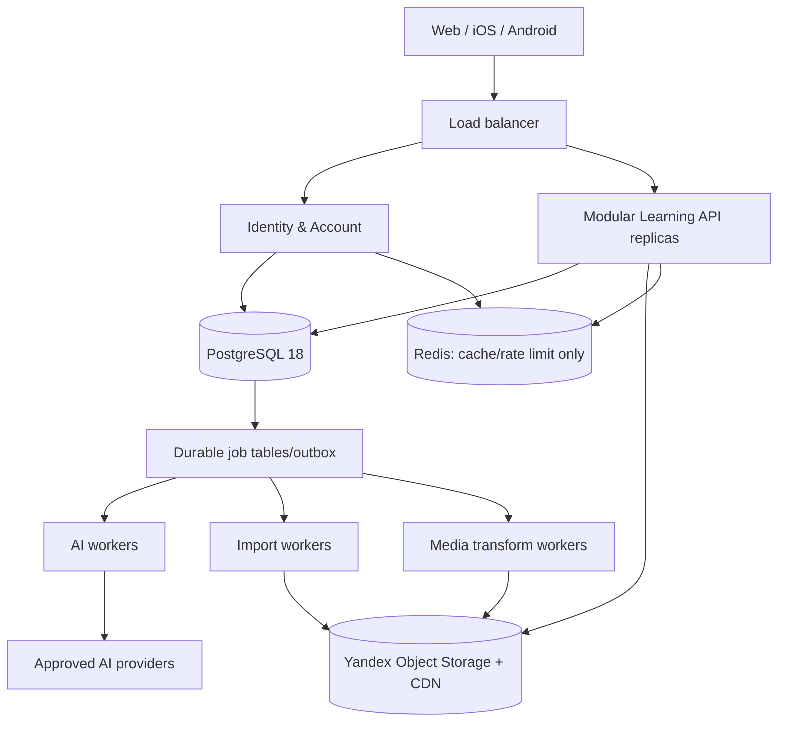

---
artifact:
  id: v2-reset-capacity-offline-plan
  type: operations-design
  title: "Mnema greenfield reset, capacity and offline plan"
  status: proposed
  created_at: "2026-08-15"
  updated_at: "2026-09-06"
  owners: ["project-owner"]
---

# Greenfield reset, capacity and offline plan

## Recommendation

Create a fresh PostgreSQL 18 database, apply the replacement runtime's migrations from zero, import only explicitly allowlisted account data, and cut over during maintenance. The replacement takes the canonical routes: do not create `/v2`, transform disposable v1 data, run dual reads/writes or retain a compatibility runtime.

Run Mnema initially as one Identity & Account deployable plus a modular Learning API. Add media/import/AI workers only when the owning epic introduces the capability and its failure/resource boundary. PostgreSQL owns durable jobs and transactional state; object storage owns new learning media. Kafka, MongoDB, sharding and a separate search engine are scale-triggered options, not launch dependencies.

The owner accepts temporary outage and an incomplete product during the rewrite. This document plans a later operational change; it does not authorize a production mutation from a documentation PR.

## Confirmed current constraints

- the inspected legacy runtime used one PostgreSQL 16 StatefulSet with a 15 Gi PVC;
- local Compose already uses PostgreSQL 18, so environments are not aligned;
- main deployments use one replica;
- identity is split across `auth.users`, `auth.accounts` and `app_user.users`;
- no recovery duration is a product or legal default; Identity deletion stays disabled until an explicit environment policy is approved;
- AI jobs already use lease/heartbeat/reclaim with `FOR UPDATE SKIP LOCKED`, while import jobs do not correctly reclaim all stale `processing` work;
- PostgreSQL integration tests exist, but media tests mainly mock S3; no automated MinIO protocol-level E2E suite was found.

## Account-only cutover

### Preservation allowlist

Preserve only after field-level review:

- stable `user_id`;
- email and verification state;
- username, display name and bio;
- password hash for local auth;
- OAuth `provider` and `provider_sub` identities;
- created/last-login timestamps;
- active ban/admin state if still meaningful.
- the account profile's avatar reference and exact source blob/metadata needed to keep that avatar, if present.

Recreate OAuth clients, signing material, secrets and feature flags from configuration. Do not export sessions, authorization codes, OAuth authorizations/consents, refresh/access tokens, grants, transient challenges or caches.

Delete legacy core, media, import and AI data, provider credentials, usage ledgers/jobs, Redis state, media object versions and incomplete multipart uploads. Exact table/bucket targets must come from a generated manifest, never a broad recursive path or unresolved environment variable.

### Rehearsal and cutover

1. Enable maintenance and stop login/write traffic plus workers.
2. Record deployed image SHAs, migration state and an exact resource manifest; do not reopen the settled usage/RPS question.
3. Create an encrypted account-only logical export and old→new ID/checksum manifest.
4. Restore it into an isolated fresh PostgreSQL 18 environment.
5. Verify counts, auth/profile ID consistency, unique email/username, password login, OAuth link and password reset.
6. Apply v2 migrations to a fresh production database and use a fresh media bucket/prefix.
7. Import accounts with preserved UUIDs and keep user writes closed.
8. Run synthetic account/login smoke plus the replacement capabilities actually completed by #74–#76 while maintenance stays enabled.
9. If any pre-deletion gate fails, discard the new environment and keep maintenance; the untouched legacy resources are still the only rollback boundary.
10. At the separately tracked point of no return, purge legacy DB/PVC, every snapshot/PITR/WAL/backup-shaped copy, Redis state, learning-media objects and versions, and incomplete multipart uploads from exact manifests. Keep only account-only and new-runtime recovery artifacts.
11. Verify the old deployables, routes, database resources and object keys are absent, then switch traffic and open replacement writes.

The policy choice is closed: no complete emergency/legacy snapshot is created or retained. Managed PostgreSQL backup/PITR and Object Storage versioning may retain data after a logical delete; object locks may prevent deletion. The operational issue must enumerate and verify these provider-level copies against [Yandex Managed PostgreSQL backups](https://yandex.cloud/en/docs/managed-postgresql/concepts/backup), [Object Storage versioning](https://yandex.cloud/en/docs/storage/concepts/versioning) and [Object Lock](https://yandex.cloud/en/docs/storage/concepts/object-lock).

Rollback exists only while the untouched legacy resources still exist and deletion has not started. The first destructive delete is the point of no return. Afterwards recovery is roll-forward or restore of account-only/new-runtime artifacts; v1 content cannot be restored by design.

The executable private-manifest contract, sanitized evidence boundary and
disposable verification sequence are defined in
[`no-snapshot-purge-rehearsal.md`](no-snapshot-purge-rehearsal.md). This tooling
does not authorize production execution; #147 remains the sole production
cutover and irreversible-delete boundary.

## Account deletion and category-specific retention

Use an explicit state machine:

```text
ACTIVE → PENDING_DELETION → PURGING → PURGED
```

Identity #157 stores `deletion_requested_at`, immutable `recoverable_until`/`purge_after`, operation/deletion generation, retry state and a fenced lease. It immediately advances the security generation, deletes sessions/grants/proofs and hides the profile. A short account-bound recovery context can only read its own deadline, cancel before the PostgreSQL transaction-time boundary or log out; it cannot enter account, Learning or OAuth/OIDC flows. The bounded purge scanner uses `FOR UPDATE SKIP LOCKED`; expired leases are reclaimed and stale heartbeat/completion writes are rejected by operation/generation/worker/epoch.

Identity freezes exact owned avatar keys, asset IDs and known storage versions before purge. It enumerates a bounded exact-key version set, verifies ownership metadata on every data version, deletes all versions/delete markers and proves absence before completion. Missing objects are idempotent success, but foreign metadata, truncated/excessive listings, unknown ownership and transport failure stop completion. The Identity tombstone retains the UUID and minimal lifecycle/moderation/integrity evidence while removing email, credentials, provider subject, profile and avatar metadata. Its durable `identity-account` receipt and erasure-ledger handoff do not certify #74–#76 or provider backup deletion; each future owning domain must attach its own operation/generation-bound receipt before any platform-wide claim.

The production recovery window remains unset and must not be hard-coded before explicit policy review. Define `recoverable_until` per data category and legal basis. Product/profile/content data should use the shortest approved recovery period and then purge/anonymize; fiscal, payment and dispute records may remain longer in an isolated system under a different basis and cannot feed analytics or AI.

Backups must expire consistently with the published schedule. A restore consumes an external erasure ledger so purged accounts do not reappear. Exact periods and notices are launch gates in the [Russia legal/payment checklist](../product/russia-legal-launch-checklist-2026.md).

## Target topology



Logical modules in the Learning API: catalog/content, library/collaboration/ACL, study and integration commands. Identity/account is one separate deployable because it owns credentials, issuer and profile lifecycle. AI/media/import workers are not pre-created; when later epics justify them, a worker on another process leases work through an authenticated internal API and returns an idempotent result rather than receiving unrestricted database credentials.

PostgreSQL jobs need status/next run, lease owner/until, heartbeat, attempts/backoff/dead-letter, idempotency key, a partial runnable index and bounded claims with `FOR UPDATE SKIP LOCKED`. PostgreSQL explicitly documents `SKIP LOCKED` as useful for queue-like consumers ([PostgreSQL `SELECT`](https://www.postgresql.org/docs/current/sql-select.html)). Redis remains non-durable cache/rate limiting.

## Capacity model

These are design scenarios, not measurements or a market forecast.

Assumptions:

- DAU/MAU 20%;
- 80/100/120 reviews per DAU for 1k/10k/100k MAU;
- two API operations per review after prefetch/batching;
- peak 8× daily average, resilience burst 2×;
- 5% of DAU concurrently studying;
- 0.8–1.5 KiB per indexed review event, ~1 KiB per study state;
- retained media 20/50/100 MB per MAU after dedup;
- client media per attempt 150/250/350 KiB.

| Metric | 1k MAU | 10k MAU | 100k MAU |
|---|---:|---:|---:|
| DAU | 200 | 2 000 | 20 000 |
| Reviews/day | 16 000 | 200 000 | 2 400 000 |
| Peak review writes/s | 1.5 | 18.5 | 222 |
| Peak all API RPS | 3 | 37 | 444 |
| 2× burst API RPS | 6 | 74 | 889 |
| Active study users | 10 | 100 | 1 000 |
| In-flight at p95 300 ms | ~1 | ~11 | ~133 |
| Review log/year | 4.5–8.4 GiB | 55.7–104 GiB | 668–1 253 GiB |
| Study state | ~0.3 GiB | ~5.7 GiB | ~95 GiB |
| Content/revisions, guessed | ~0.3 GiB | ~7.4 GiB | ~159 GiB |
| Primary DB total/year | ~5–9 GiB | ~69–118 GiB | ~0.9–1.5 TiB |
| Retained media, post-dedup | ~20 GB | ~0.5 TB | ~10 TB |
| Media/day to clients | ~2.3 GiB | ~47.7 GiB | ~801 GiB |
| Guessed peak media bandwidth | 0.8 Mbps | 17 Mbps | 287 Mbps |
| 2× media burst | 1.6 Mbps | 33 Mbps | 574 Mbps |

Allow roughly 30% extra media capacity for variants, incomplete upload and GC grace: 26 GB / 0.65 TB / 13 TB. At 100k MAU the likely problem is not 444 API RPS; it is roughly a billion annual review events, index/vacuum/retention work and media egress. The current 15 Gi volume is already a poor production envelope around the 1k-MAU scenario.

### Deferred AI queue scenario

Assume 0.15/0.2 AI jobs per DAU/day, 20% in the busy hour and 30 seconds average text processing:

| Metric | 1k MAU | 10k MAU | 100k MAU |
|---|---:|---:|---:|
| AI jobs/day | 30 | 400 | 4 000 |
| Normal concurrency | 0.05 | 0.7 | 6.7 |
| 3× burst concurrency | 0.15 | 2 | 20 |
| Backlog after 30-minute outage | 9 | 120 | 1 200 |

This is a later #77 sizing envelope, not a foundation dependency. Provider quota and cost will likely bind before the PostgreSQL job table.

## Scale triggers

- API: use at least two replicas at paid launch for availability; HPA only after requests and load baseline exist.
- HPA: sustained CPU 60–70% or p95 SLO breach for 10–15 minutes, not transient spikes.
- PostgreSQL vertical scale: sustained CPU >65%, I/O saturation, lock waits or storage >70%.
- Read replica: reads consume >60–70% of DB capacity and bounded staleness is acceptable; review/job writes stay on primary.
- Review partitions: make the contract partition-compatible now; add monthly partitions before ~50 GiB/~50m rows or around measured 10k MAU. Too many partitions have their own cost ([PostgreSQL partitioning](https://www.postgresql.org/docs/current/ddl-partitioning.html)).
- Dedicated broker: runnable job age still breaches SLO after worker scaling, claim p95 >50 ms or queue operations exceed 10% of DB time.
- Search engine: measured PostgreSQL search cannot meet target p95 and GIN maintenance materially affects writes.
- Service extraction: separate security/team/release boundary or one module consistently consumes >30% application resources.
- Sharding: only after the largest affordable PostgreSQL vertical configuration fails a 2× growth load test.

Kubernetes HPA requires correct resource requests/readiness and can scale on custom metrics such as queue age ([Kubernetes HPA](https://kubernetes.io/docs/concepts/workloads/autoscaling/horizontal-pod-autoscale/)).

## Offline contract

Current launch is web-only. The first future iOS/Android clients share account and
progress APIs; a BFF is optional and does not own a second scheduler. #76 reserves
these contracts without promising native apps or a PWA in its launch acceptance.
Offline monetization is an open hypothesis, not a current entitlement.

- immutable deck, item and exercise revisions;
- globally unique client-generated IDs for offline entities, commands and attempts;
- mutable aggregates use `row_version` and CAS/`If-Match`;
- sync uses an opaque server cursor over a per-user append-only change feed, never client wall-clock time;
- tombstones live for a defined offline window; recommend 90 days, after which a stale client full-resyncs;
- a deck download is an immutable manifest with revision IDs, hashes and media references and installs transactionally;
- media downloads lazily or as an explicit offline pack;
- editing uses three-way merge over stable node/region IDs, not last-write-wins or Markdown line merge;
- attempt includes event ID, device ID/sequence, base state version, client/server time and runtime versions;
- parallel scheduled device attempts are retained; the versioned reducer needs an explicit ordering/rebase policy, including attempts from before a user-requested learning restart; exactly-once transport alone does not settle this;
- replay/practice mode remains server-authorized through offline sync and never updates canonical state, exposure, streak or scheduler experiment outcomes;
- an unsupported exercise never executes arbitrary content code.

PostgreSQL 18 can generate UUIDv7 for server-originated IDs, but clients need a cross-platform implementation or may use UUIDv4 initially; do not add an unapproved dependency only for sortability. Relevant references: [PostgreSQL UUID functions](https://www.postgresql.org/docs/18/functions-uuid.html) and [RFC 9562](https://www.rfc-editor.org/rfc/rfc9562). Android's offline-first guidance likewise recommends a local read source and explicit conflict resolution ([Android](https://developer.android.com/topic/architecture/data-layer/offline-first)).

The first future offline scope is browse/review of downloaded decks, including
their available media. Manifests pin immutable hashes; partially downloaded updates
do not replace a usable installed pack. Bounded downloads, expiring retention leases
and a visible unavailable-content policy avoid indefinite history/media retention.
Offline collaborative editing and CRDT history are deferred.

## Authoring and large-operation budgets

[Owner workflows](../product/authoring-and-study-workflows.md) distinguish durable
quick notes from expiring server editing drafts. PostgreSQL is the acknowledged
draft source; Redis, if later used, is a cache, not the sole copy. Draft TTL must
not delete unfinished quick notes. Proposed retention/size defaults live there.

[Revision storage](../architecture/revision-storage-and-runtime-boundaries.md)
defines shared blocks/pages, bounded publication, cheap forks, seeded paged practice
and GC reachability. Heavy imports/media/bulk publication use independent bounded
workers. More API replicas do not remove database IOPS, lock, pool, queue or provider
limits; admission control and measured failover/restore remain necessary.

## MinIO and reliability harness

Pin PostgreSQL 18 across development, CI and production compatibility tests.

1. Unit tests without containers.
2. Repository integration tests with real PostgreSQL 18 + Flyway.
3. S3 contract tests with a pinned MinIO `GenericContainer`.
4. E2E topology with API, worker, PostgreSQL, MinIO and deterministic AI provider stub.
5. Nightly bounded load/fault suite in an isolated environment.

Required media cases: direct/multipart upload, abort/expiry, presigned URL, server hash/MIME validation, duplicate-upload race, authorization, source/variant lifecycle, range GET, GC race, all-version deletion, timeout/retry and orphan reconciliation.

Required workload cases: review idempotency/concurrency, offline batch replay, due selection, 1k/10k/50k-item publish, subscription update/conflict, AI outage/backlog recovery and media burst. A dedicated integration CI job must fail when Docker is unavailable rather than silently skipping through `disabledWithoutDocker`.

Testcontainers recommends disposable real PostgreSQL instances for compatibility and supports arbitrary services through `GenericContainer` ([PostgreSQL module](https://java.testcontainers.org/modules/databases/postgres/), [GenericContainer](https://java.testcontainers.org/features/creating_container/)). MinIO single-node is appropriate for development/testing; its inclusion in shipped distributions needs a separate AGPL/commercial-license review ([MinIO container docs](https://min.io/docs/minio/container/index.html)).

## License and repository split

Apache 2.0 grants already distributed versions perpetual, irrevocable rights; replacing the current `LICENSE` cannot retract them ([Apache License 2.0](https://www.apache.org/licenses/LICENSE-2.0.html), [ASF FAQ](https://apache.org/foundation/license-faq.html)). A stricter license may govern future code only if ownership and contributor rights permit it. A license cannot prevent independent implementation of the product idea.

Resolution update (2026-08-30): `v1-apache-final` fixes the last Apache revision.
New official revisions remain public under a personal-use source-available
license. One natural person may run and modify the current source privately;
organizational, shared, public, hosted, commercial and machine-learning use
requires a separate written license. Public code contributions are paused until
a separate contributor agreement is available. See the accepted
[license decision](../decisions/source-license-transition.md).

The `v1-apache-final` tag is the historical source boundary. Current-main self-host
and legacy deployment assets may be deleted by the epic that replaces their
capability; they are not compatibility requirements. A future separately licensed
self-host edition needs its own deliberate release and support contract rather than
preserving dead v1 runtime paths.
