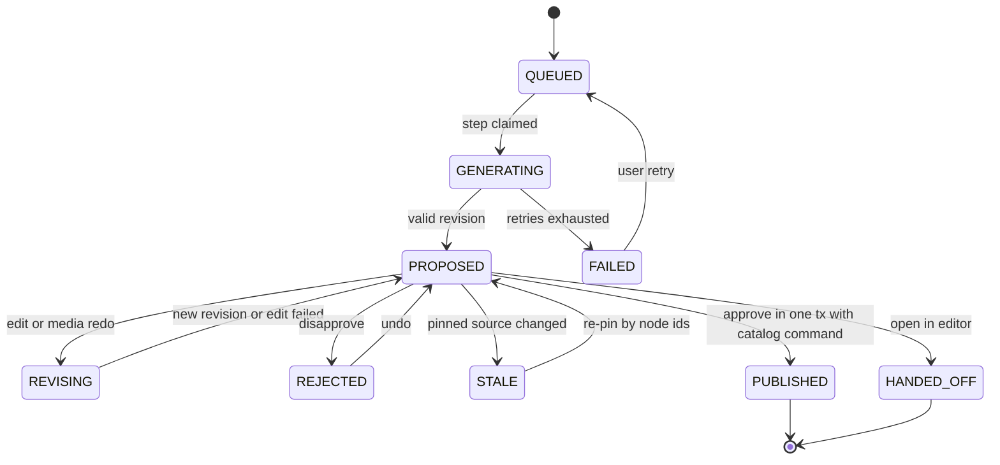
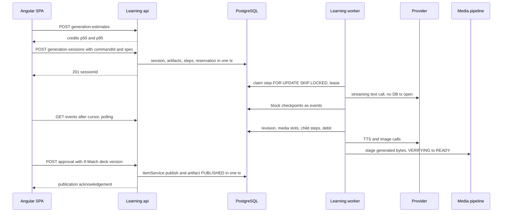
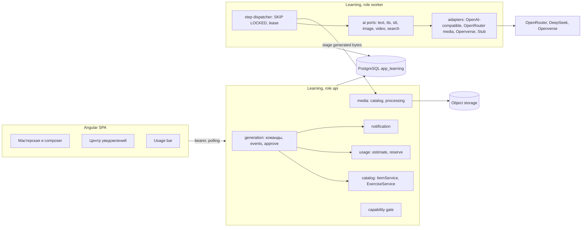

---
artifact:
  id: ai-layer-architecture-research
  type: architecture-research
  title: "Mnema AI layer: generation, speech input and media — architecture research"
  status: historical
  created_at: "2026-10-01"
  base_revision: "origin/main 9d462f7b (#274); local checkout not used for code facts"
  owners: ["project-owner"]
  source_tasks: ["Epic #77 reactivation input", "owner voice brief, 2026-10"]
  evidence_accessed: "2026-10-01"
---

# AI-слой Mnema: архитектурное исследование

Документ превращает голосовое ТЗ владельца в предлагаемую архитектуру. Это **proposal**,
не принятое решение и не разрешение на реализацию: #77 остаётся deferred до явной
реактивации. Факты о коде взяты из `origin/main` `9d462f7b` (после #266, #267, #270);
внешние факты — из официальной документации, доступ 2026-10-01. Где проверить не удалось,
это сказано прямо (§18).

## 1. Ключевые решения — сводка

1. **Размещение.** AI-слой — набор модулей внутри `services:learning`
   (`generation`, `ai`, `usage`, `notification`), а не отдельный deployable `services:ai`.
   Независимое масштабирование и изоляция ключей достигаются **process role** того же
   артефакта (`api` / `worker` / `all`). Отдельный сервис потребовал бы on-behalf-of доступа
   к owner-scoped контенту после истечения пользовательского токена и распределённой
   публикации — сложность без измеренной причины.
2. **Домен.** `GenerationSession` («Мастерская», батч) → N × `GenerationArtifact` (отдельная
   «нить» на каждый материал или упражнение, ровно то, что владелец назвал «сессией на
   материал») → immutable `ArtifactRevision` + `ArtifactTurn`. `GenerationStep` — durable
   job. Approve — пользовательская команда, которая через caller-owned port вызывает
   существующие `ItemService` / `ExerciseService` в **той же транзакции** (паттерн
   `CaptureItemPublisher`), сохраняя их CAS, receipts и валидацию.
3. **AI-черновики — свои таблицы, не `EditingDraft`.** «Править вручную» = явный handoff
   текущей ревизии в обычный `EditingDraft`.
4. **Медиа через #76.** Сгенерированные байты идут в существующий pipeline
   (`VERIFYING → PROCESSING → READY`, FFmpeg-контейнер без сети) с новым origin
   `generated`. Placeholder в UI — это просто ещё не READY asset в AST. Удержание —
   `generation_media_ref`, после закрытия сессии работает существующий
   `unattached-ready-hold` (P7D) и GC.
5. **Оркестрация — свой PostgreSQL step queue** по образцу `MediaProcessingRepository`:
   `FOR UPDATE SKIP LOCKED`, lease + fencing token, heartbeat на virtual thread, backoff,
   deadline, cancel, fairness per account. Fan-out без barrier-шагов. JobRunr, db-scheduler,
   Spring Modulith events и брокеры не нужны.
6. **Прогресс — event cursor + adaptive polling** (как решение #76 п.7), блоковое
   прогрессивное появление текста. Без token streaming, SSE и WebSocket в v1; путь к SSE
   поверх `fetch` оставлен открытым тем же event-контрактом.
7. **Формат.** Материалы: LLM пишет **MBM** (Mnema Block Markup: подмножество Markdown +
   директивы media slots + block handles) → детерминированный компилятор → тот же
   `NativeDocumentReader`, что и при публикации. Упражнения: strict JSON per mechanic →
   валидация `ExerciseCommand` → семантический lint → **self-evaluation тем же
   `AttemptEvaluation`**, что у `/exercise-previews`. Один repair, затем fallback-модель.
8. **Правки по выделению** — блоковая гранулярность; контекст = кэшируемый префикс +
   outline + цель ±1 блок + ≤5 последних инструкций; node IDs сохраняются через handles;
   undo = перевод указателя текущей ревизии.
9. **Провайдеры** — порты per capability, один OpenAI-compatible text adapter (OpenRouter и
   direct DeepSeek), OpenRouter audio/image/video, Openverse для лицензированных
   изображений, Stub для CI. Server-owned флаги расширяют уже существующий fail-closed
   контракт `GET /api/capabilities`. **Spring AI сейчас не брать.**
10. **Platform finding.** Backend на Spring Boot `3.5.16`, у ветки 3.5 OSS-поддержка
    закончилась **2026-06-30**; Spring AI 2.0 требует Boot 4.0/4.1, а у Spring AI 1.1 OSS
    тоже закончилась 2026-06-30. Нужна отдельная задача миграции на Boot 4.1 до production.
11. **Usage.** Внутренняя единица — credit (cost-weighted), versioned rate card,
    `reserve → settle → release`, append-only идемпотентный ledger, hard caps, отдельные
    media sub-caps и отдельный бюджет бесплатного STT. Ledger живёт в Learning; entitlement
    приходит через порт из будущего billing-контекста (#79), никогда из браузера.
12. **Уведомления** — общий durable `notification` + read watermark; toast — проекция
    центра уведомлений; polling.
13. **Blocking legal finding.** Первый хостинг в Финляндии для пользователей — граждан РФ
    противоречит принятому решению «инфраструктура в России» и ч. 5 ст. 18 152-ФЗ в
    редакции с 01.07.2025. Отдельно: по сторонним сообщениям OpenRouter с мая–июня 2026
    ограничивает RU-аккаунты и IP; у direct DeepSeek API нет документированного opt-out от
    training. До юридического решения — только stub и synthetic данные.
14. **Безопасность.** У LLM нет agency: вывод — данные, которые компилирует детерминированный
    код. Пользовательский контент и веб — untrusted data. Ссылки — только из allowlist
    сессии; сгенерированные/скачанные медиа проверяются как обычная загрузка; «найти похожее
    в интернете» — только CC/PD-источники с attribution и host allowlist (SSRF).
15. **Декомпозиция** — 20 issues (AI-00…AI-19) + 2 внешних gate (legal, Boot 4.1). Первая — docs/contracts;
    вертикальный срез работает на stub-провайдере раньше реального.

## 2. Исходные факты, которые определяют дизайн

| Факт | Где проверено | Следствие для AI-слоя |
|---|---|---|
| Learning — modular monolith на `JdbcClient`, command receipts, row-version CAS, RFC 9457; `spring.threads.virtual.enabled=true` | `learning/guide.md`, `application.properties` | Новые модули следуют тем же примитивам; ожидание провайдера дёшево по потокам, но не по DB-соединениям |
| Fail-closed capability gate (#266): доступно только при `flag && provider bean`; `GET /api/capabilities` → `{aiAssessment, speechToText}`; seams `SemanticAssessmentProvider`, `SpeechToTextProvider`; публикация `ai-semantic`/`TEXT_OR_SPEECH` без capability → 409 `CAPABILITY_UNAVAILABLE` | `capability/*.java`, `ExerciseService:184`, `contracts/study/README.md` | Расширять этот контракт, а не строить второй. Frontend-парсер `capabilities-api.service.ts` требует **точный набор ключей** — новые capabilities меняют backend и frontend в одном PR |
| На `main` 5 механик (`ExerciseType`); `ORDER`/`CATEGORIZE` — открытая #268 на ветке | `ExerciseType.java`, `gh pr list` | Генератор берёт разрешённые механики из серверного registry, а не из захардкоженного списка «7» |
| Медиа #76 обрабатываются **внутри процесса Learning**: `@Scheduled` scan + virtual threads + `DockerMediaWorkerGateway` (`--network none`, read-only), lease/token/heartbeat/backoff/`maxAttempts` | `MediaProcessingService`, `MediaProcessingRepository` | Готовый прецедент in-process worker и durable job; генерацию медиа надо встроить в этот pipeline |
| `media_asset.origin ∈ {upload, recording, import}`; `learning.media.unattached-ready-hold=P7D`; GC учитывает holds от revisions, drafts, manifests | `V10__media_catalog.sql`, `media-gc.md` | Новый origin `generated`/`web_import` и новый hold-источник `generation_media_ref` |
| Capture conversion публикует через `CaptureItemPublisher` с completion callback в той же транзакции; есть bulk publication до 100 changes | `CaptureService.convert`, `ItemPublicationCommand` | Approve AI-материала — тот же паттерн; «Одобрить все» — bulk command |
| `editing_draft`: только native document, 30 дней, 200 на аккаунт, 1 MiB, `member_key` nullable для нового материала | `V5__…sql`, runtime-policy-index | Подходит как цель handoff, не как хранилище AI-артефактов |
| Каждый приватный запрос Learning синхронно вызывает Identity `/userinfo` без кэша (≤32 параллельно, 2 s) | `learning/guide.md` | Частота polling = нагрузка на Identity; long-lived stream проверял бы отзыв доступа только при подключении |
| Локальный nginx: `/api` с `proxy_read_timeout 10s`, `Cookie ""`, `proxy_buffering off` | `deploy/local-full-stack/nginx.conf` | Длинные соединения требуют отдельного `location`; cookie-auth для `EventSource` невозможен |
| `auth.interceptor.ts` добавляет bearer только к allowlist корней Learning | `isCredentialTarget` | Новые корни (`/notifications`, `/usage`, `/speech-inputs`) нужно явно добавить |
| Renderer не выводит node IDs в DOM | grep `content/rendering` | Inline-правка требует режима аннотации блоков |
| Learning не получает сигнал об удалении аккаунта из Identity | grep Learning | Фоновые jobs ограничиваются по времени; пробел шире AI (#147) |
| DeepSeek сейчас: `deepseek-flash` $0.15/$0.30 cache-miss input и $0.60/$1.20 output за 1M (off-peak/peak), `deepseek-v4-pro` без изменений | api-docs.deepseek.com | Таблица в `russia-launch-economics-2026.md` устарела в сторону удорожания Flash |
| Owner decisions: managed AI без BYOK; Yandex AI исключён; direct DeepSeek — основной eval-кандидат + не-Yandex fallback; AI не пишет `StudyState`; сначала deterministic evaluation; O-06 golden eval; O-08 consent | `owner-decisions-2026-08.md`, `exercise-catalog-v2.md` | Ограничивают routing, eval gate и границу с Study |

## 3. A. Где живёт AI-слой

### Варианты

| Критерий | A1. Отдельный `services:ai` | A2. Модуль в Learning, один процесс | **A3. Модуль в Learning + process roles** |
|---|---|---|---|
| Чтение owner-scoped контекста (материалы, заметки, упражнения) | Нужен внутренний API с service-auth и утверждением «действую от имени account X» после истечения пользовательского токена — новая trust boundary; прямое чтение таблиц Learning запрещено docs | Через application services с `actor` — тот же ACL | То же, что A2 |
| Approve → публикация с CAS/receipt | Распределённая операция: inbox/outbox, command с `job_id`, компенсации | Одна транзакция через port | Одна транзакция (approve выполняется в `api` role) |
| Генерированные медиа | Вызов внутреннего media API Learning | Прямой вызов application command `MediaCatalog` | То же |
| Изоляция сбоев провайдера (429, таймауты до 10 мин у DeepSeek) | Полная | Bulkheads внутри процесса: семафоры per capability, никакой открытой DB-транзакции во время I/O | Плюс отдельный процесс `worker`: падение/утечка памяти не задевает API |
| Независимое масштабирование | Да | Нет | Да: реплики `worker` масштабируются отдельно |
| Секреты провайдеров | Только в AI-сервисе | В API-процессе | Только в env `worker` |
| Операционная сложность сейчас (0 RPS, local-only) | Высокая: второй сервис, схема, auth, деплой | Минимальная | Минимальная: локально `all`, разделение — конфигом |
| Соответствие правилу content-platform «workers пишут только integration-owned таблицы или вызывают application command» | Да | Да, если соблюдать границы пакетов | Да |

### Рекомендация: A3

Код — в `services:learning`; в первой поставке процесс один (`all`), как у медиа. Когда
понадобится, тот же jar запускается с `learning.runtime.roles=api` и `=worker`:

- `api`: HTTP, команды сессий, estimate, approve, events, notifications; ключей провайдеров нет;
- `worker`: dispatcher шагов и адаптеры провайдеров; наружу только actuator; ключи только здесь;
- обе роли используют одну БД; пулы соединений ограничены суммарно на все реплики.

Это прямо соответствует `revision-storage-and-runtime-boundaries.md`: «Workers submit
idempotent domain commands; they do not mutate another module's tables» и «source modules
should not depend on that choice». Прецедент разделения web/worker при общей кодовой базе —
GitLab Web/API vs Sidekiq, уже процитированный в этом документе.

Выделять настоящий `services:ai` стоит только по измеренным триггерам: worker-нагрузка
влияет на p95 API даже при раздельных процессах; аудит требует другой security zone для
ключей; провайдеров нужно вызывать из другой юрисдикции, чем хранится контент; нужен
независимый release cadence.

### Пакеты и направление зависимостей

```text
app.mnema.learning.generation        сессии, артефакты, ревизии, шаги, approve, HTTP, events
app.mnema.learning.generation.mbm    чистый компилятор/рендерер MBM ↔ native-v1 (без Spring)
app.mnema.learning.ai                порты capability, routing, adapters, stub, provider_call log
app.mnema.learning.usage             rate card, allowance, reservations, ledger, estimate
app.mnema.learning.notification      durable уведомления (общие, не AI-специфичные)
app.mnema.learning.capability        существующий gate, расширяется
```

`generation` зависит от портов `catalog` (publish item/exercise, read item/capture), команды
`media`, `ai`, `usage`, `notification`. `catalog`, `study`, `media` **никогда** не зависят
от `generation`. `ai` не знает о домене. Порты публикации принадлежат вызывающей стороне,
как `CaptureItemPublisher`. Границы держатся package-private классами, как уже сделано в
`media`; ArchUnit или Spring Modulith ради этого не нужны.

## 4. B. Доменная модель генерации

### Агрегаты и таблицы

| Сущность / таблица | Назначение | Ключевые поля | Мутабельность |
|---|---|---|---|
| `generation_session` («Мастерская») | Один запуск: батч материалов или упражнений в одной колоде | `session_id`, `owner_id`, `deck_id`, `kind` (`MATERIALS`, `EXERCISES`, `REVISE_ITEM`, `REVISE_EXERCISE`), `spec` JSONB, `state`, `reservation_id`, `row_version`, `last_activity_at`, `expires_at` | state/pointers под CAS; `spec` неизменяем после старта |
| `generation_session_source` | Закреплённые источники | `note_id + note_row_version`, или `member_key + item_revision_id`, или prompt text; роль `SOURCE` / `STYLE_EXAMPLE` | immutable |
| `generation_artifact` | Нить одного будущего материала/упражнения | `artifact_id`, `session_id`, `target_kind` (`ITEM`, `EXERCISE`), `ordinal`, `state`, `current_revision_id`, `source_refs`, `publication_command_id`, `published_ref`, `row_version` | state/pointers под CAS |
| `generation_artifact_revision` | Снимок предложения | `revision_id`, `seq`, `parent_revision_id`, `payload` (native-v1 для ITEM; exercise command без IDs деки для EXERCISE), `handles` (handle → nodeId), `cause` (`INITIAL`, `EDIT`, `MEDIA`, `REPIN`), `prompt_version`, `model_route`, `validation` | immutable; ≤30 на артефакт, ≤1 MiB |
| `generation_artifact_turn` | Журнал инструкций | `seq`, `kind`, `instruction` (≤2000 символов, текст или результат STT), `target_node_ids`, `status`, `step_id`, `result_revision_id` | immutable после terminal |
| `generation_media_slot` | Медиа-место в AST | `slot_key` (стабилен между ревизиями), `kind`, `spec` (голос, язык, prompt/query), `asset_id`, `state` | под CAS |
| `generation_media_ref` | Hold для GC, аналог `draft_media_ref` | `artifact_revision_id`, `asset_id`, `owner_id` (композитные FK как в V10) | удаляется при закрытии/истечении |
| `generation_step` | Durable job | см. §5 | lease-поля мутабельны |
| `generation_event` | Курсор прогресса для UI | `event_id` (bigserial), `session_id`, `artifact_id`, `type`, маленький `payload` | append-only, TTL |
| `ai_provider_call` | Аудит и стоимость | `step_id`, `attempt`, `provider`, `model`, `request_hash`, `usage`, `cost_micros`, `provider_request_id`, `outcome`, `latency_ms` | append-only |
| `generation_provenance` | Происхождение опубликованного | `(deck_id, member_key, item_revision_id)` или exercise revision → session, model routes, prompt versions | immutable, живёт пока живёт revision |
| `usage_*`, `notification*` | §10, §11 | | |

### Состояния артефакта



Состояние сессии: `PLANNING` (только если включён планировщик) → `PLAN_READY` (план и
оценка ждут подтверждения) → `RUNNING` → `REVIEW` (все артефакты вне `QUEUED/GENERATING`) →
`CLOSED` (всё решено или пользователь закрыл); побочные `CANCELLED`, `EXPIRED`. Удаление
сессии (hold-to-delete) — физическое удаление неопубликованных строк; опубликованное
остаётся в catalog с `generation_provenance`.

### Что неизменяемо

Неизменяемы `spec`, закреплённые источники, ревизии, turns, provider calls, ledger entries,
provenance. Мутабельны только указатели и состояния (`row_version` + `CompareAndSetExecutor`)
и lease-поля шагов. Это та же дисциплина, что у Deck/EditingDraft.

### Approve → существующие команды публикации

**Материал.** `POST /api/decks/{deckId}/generation-sessions/{sid}/artifacts/{aid}/approval`
с `If-Match` версии колоды и телом `{commandId, expectedArtifactVersion, expectedRevisionId,
expectedDeckRevisionId}`. В одной транзакции:

1. lock артефакта, проверка CAS и того, что ревизия текущая;
2. проверка: каждый media slot `READY` или явно удалён (см. §16, вопрос 8);
3. `GeneratedItemPublisher.create(actor, deckId, expectedDeckVersion, commandId,
   expectedDeckRevisionId, null, document, completion)` — реализация в `catalog.item`, как
   `CaptureItemPublicationAdapter`;
4. completion переводит артефакт в `PUBLISHED`, пишет `published_ref` и `generation_provenance`;
5. `ItemService` сам извлекает media refs и привязывает assets к ревизии, поэтому после
   commit `generation_media_ref` можно снять.

Повтор того же `commandId` возвращает stored receipt (`Idempotency-Replayed`); устаревшая
версия колоды даёт обычный 412, клиент перечитывает ETag и повторяет с **новым** `commandId`
(старый привязан к прежнему payload). «Одобрить все» — одна bulk publication команда
(≤100 changes) и один completion, переводящий несколько артефактов.

**Упражнение.** `GeneratedExercisePublisher` вызывает `ExerciseService` create с
`objective.operation=create|reuse`. Генератор получает названия существующих objectives
материала и **предпочитает reuse**, если цель та же: иначе один навык расщепится на
несколько расписаний. Если материал после генерации получил новую ревизию, публикация с
устаревшим `itemRevisionId` отклоняется; артефакт переходит в `STALE`, и сервер пробует
re-pin без LLM: node IDs стабильны между ревизиями, поэтому, если все `MATERIAL` nodes ещё
существуют, достаточно подставить новую ревизию и заново провалидировать.

### Контекст для правок: что хранить

Хранится полный журнал turns (ограничен 50 на артефакт) — для аудита, undo и UI истории.
В модель отправляется **не** вся история: принятое состояние уже содержится в текущей
ревизии. Контекст правки: стабильный префикс сессии + текущий документ/outline + последние
≤5 инструкций дословно. LLM-summary истории в v1 не нужен; его вводить только если eval
покажет потерю предпочтений.

### Почему не `EditingDraft`

AI-артефакт имеет историю ревизий, provenance, media holds, AI-состояния и до 20 штук на
сессию. В `EditingDraft` это засорило бы список черновиков, упёрлось бы в лимит 200 и
смешало бы два lifecycle. Поэтому: свои таблицы + handoff. Handoff создаёт обычный
`EditingDraft` (для нового материала `member_key = null`) из текущей ревизии, артефакт →
`HANDED_OFF`, дальше обычный редактор и публикация.

### TTL и GC

- `learning.generation.session-retention` = `P30D` от последней активности (как drafts),
  уведомление за 3 дня до истечения.
- Retention worker по образцу `StudyRetentionWorker` (locked batches) удаляет
  неопубликованные артефакты, ревизии, turns и события, снимает `generation_media_ref`.
- Дальше assets подчиняются уже существующему `unattached-ready-hold` (P7D) и two-scan GC.
  Новой политики удаления медиа не требуется.
- `ai_provider_call` хранится ограниченно (предложение — 90 дней) без текста промптов.

### Заметки «На потом» и provenance

Conversion `CaptureNote` — строго 1:1 с receipt (`capture_note_guard`). Генерация N заметок
в M материалов этот инвариант не использует. Источники записываются в
`generation_session_source`, а при закрытии сессии UI предлагает явное действие
«Архивировать использованные заметки (N)». Расширение conversion до N:M — отдельное решение,
не нужное для первого релиза.

### «Колоды целиком AI не трогает»

Ни один `kind` сессии не меняет метаданные колоды и не удаляет материалы/упражнения.
AI только предлагает новые ревизии или новые сущности; удаление «выбранных» — ручная
команда пользователя (hold-to-delete), а не AI-действие.

## 5. C. Оркестрация

### Модель шага

`generation_step`: `step_id`, `session_id`, `artifact_id` (null для шагов уровня сессии),
`owner_id`, `kind`, `capability` (`TEXT`, `TTS`, `STT`, `IMAGE`, `VIDEO`, `SEARCH`),
`state`, `depends_on uuid[]` (короткий; ребра не больше нескольких), `priority`,
`attempts`, `lease_token`, `lease_until`, `next_attempt_at`, `deadline_at`,
`cancel_requested`, `input` (JSONB ≤64 KiB), `output_ref`, `error_code`,
`external_job_id` (для асинхронных провайдеров), `idempotency_key` UNIQUE
(`artifact_id + kind + slot_key + revision_seq`).

Состояния: `WAITING_DEPENDENCIES` → `READY` → `RUNNING` (lease) → `SUCCEEDED`;
`RUNNING` → `READY` с `next_attempt_at` (retryable) / `WAITING_EXTERNAL` (видео: задача
отправлена, ждём опроса, lease не держится) / `FAILED` / `CANCELLED`.

| `kind` | Что делает | Пишет |
|---|---|---|
| `PLAN` (опц.) | Сильная модель предлагает план по статистике колоды | `spec.plan` предложение → `PLAN_READY` |
| `RESEARCH` (опц.) | Планирует ≤N запросов, выполняет поиск, нумерует источники | `output_ref` с источниками |
| `TEXT_DRAFT` | MBM-материал или JSON-упражнения артефакта, streaming checkpoints | ревизия, media slots, дочерние шаги, события |
| `EDIT` | Правка по выделению или по инструкции | новая ревизия |
| `TTS`, `IMAGE_GENERATE`, `IMAGE_SEARCH`, `VIDEO_GENERATE` | Производит байты слота | staging через `MediaCatalog` → asset `VERIFYING` |
| `TRANSCRIBE` | STT для диктовки | текст инструкции/заметки |

### Fan-out без barrier

```text
[PLAN] → per artifact: [RESEARCH] → TEXT_DRAFT ─┬→ TTS(slot a1) ─→ media pipeline → READY
                                                ├→ IMAGE(slot i1) → media pipeline → READY
                                                └→ VIDEO(slot v1) → WAITING_EXTERNAL → media pipeline
```

`TEXT_DRAFT` при успехе в одной транзакции создаёт ревизию, где media nodes **уже
ссылаются** на заранее выделенные `assetId`, создаёт slots и дочерние шаги `READY`.
Отдельный шаг «сборки» не нужен: когда asset становится `READY`, существующий renderer сам
показывает медиа. «Ожидание последнего ресурса» — производное условие (нет слотов в
`GENERATING/PROCESSING`), а не блокирующий шаг. Уведомление «готово» отправляется, когда
сессия выходит в `REVIEW` и ни один слот не в работе.

**Частичный успех** — норма: текст `PROPOSED`, видео `FAILED`. UI показывает материал,
у слота — «Повторить / Заменить / Убрать блок». Approve блокируется только неразрешённым
слотом.

### Claim, lease, fencing

Как в `MediaProcessingRepository`:

```sql
SELECT s.step_id FROM app_learning.generation_step s
 WHERE s.state = 'READY' AND s.next_attempt_at <= now()
   AND s.capability = ANY(:capabilitiesWithFreeLocalSlots)
   AND (SELECT count(*) FROM app_learning.generation_step r
         WHERE r.owner_id = s.owner_id AND r.state = 'RUNNING') < :perAccountRunningCap
 ORDER BY s.priority, s.created_at, s.step_id
 LIMIT 1 FOR UPDATE SKIP LOCKED;
```

Затем выдаётся новый `lease_token`, `lease_until`, `attempts+1`. Heartbeat — отдельный
virtual thread, продлевающий lease только при совпадении токена; потеря lease или
`cancel_requested` прерывает HTTP-вызов. Любая запись результата проверяет токен
(`current(claim)`), поэтому опоздавший worker ничего не перезапишет. Документация PostgreSQL
прямо называет `SKIP LOCKED` инструментом для queue-like таблиц и предупреждает о
непоследовательном view — поэтому per-account cap в claim считается **мягким** (две
параллельные транзакции могут его кратко превысить), а жёсткий лимит обеспечивается на
admission: reservation и лимит активных сессий.

**Дисциплина БД:** ни одна транзакция не открыта во время вызова провайдера; checkpoint и
завершение — короткие отдельные транзакции. Именно так #76 держит FFmpeg вне транзакции.

### Классы ошибок и retry

| Класс | Пример | Поведение |
|---|---|---|
| Rate limit | HTTP 429 (DeepSeek: превышение concurrency) | backoff с jitter, учёт `Retry-After`, до 6 попыток, не открывает circuit сразу |
| Transient | 5xx, обрыв, таймаут | экспоненциальный backoff, до 3 попыток, затем fallback route |
| Invalid output | MBM/JSON не прошёл валидацию | 1 repair-запрос с перечнем ошибок, затем 1 попытка на strong route, затем `FAILED(INVALID_OUTPUT)` |
| Refusal / content filter | модель отказалась | `FAILED(PROVIDER_REFUSED)`, без retry |
| Source gone | колода удалена, заметка изменена | `FAILED(SOURCE_UNAVAILABLE)` или `STALE` |
| Budget | reservation исчерпана | `FAILED(BUDGET_EXHAUSTED)`, без вызова провайдера |

### Таймауты и deadline

DeepSeek закрывает соединение, если inference не начался за 10 минут, и шлёт keep-alive
(пустые строки или SSE-комментарии `: keep-alive`). Поэтому у Mnema собственные, более
короткие границы: connect 5 s; idle между чанками stream 60 s; весь шаг `TEXT_DRAFT`
`PT6M` по умолчанию; `EDIT` `PT2M`; `TTS` `PT2M`; `IMAGE` `PT3M`; `VIDEO` — по deadline
задачи провайдера с опросом раз в 15–30 s. Шаг с истёкшим `deadline_at` не берётся в
работу. Каждый запуск шагов (старт сессии или правка) ограничен `PT1H`; сама сессия живёт дольше (§4), но без пользователя ничего не исполняет. Это защищает от фоновой
работы после удаления аккаунта, сигнала о котором Learning сейчас не получает.

### Отмена

`POST …/cancellation` в одной транзакции переводит `READY/WAITING_*` шаги в `CANCELLED` и
ставит `cancel_requested` на `RUNNING`. Heartbeat видит флаг, worker обрывает stream
(запрос JDK `HttpClient` отменяется), шаг → `CANCELLED`. Reservation освобождается кроме
фактически потреблённого (usage, которую провайдер успел сообщить, либо оценка по
полученным токенам).

### Конкурентность, fairness, лимиты провайдера

- Локальные семафоры per capability на инстанс (config): text 16, tts 4, image 2, video 1,
  search 4. Claim не берёт шаги capability без свободного слота.
- Мягкий per-account cap (2 running text, 1 running media) + жёсткие лимиты на admission:
  ≤3 активные сессии и ≤20 артефактов в сессии.
- Circuit breaker per `(provider, capability)`: 5 подряд неуспехов за 60 s → open 30 s →
  half-open одна проба. Около 80 строк своего кода. Spring Framework 7 даёт в core
  `RetryTemplate` и `@ConcurrencyLimit`, но **не** circuit breaker; на Boot 3.5 этих API
  нет, поэтому зависимость Resilience4j/spring-retry не оправдана.
- Опубликованный лимит DeepSeek — 2500 одновременных запросов Flash и 500 Pro на аккаунт,
  с отдельной изоляцией по `user_id`. Это не SLA, поэтому вся защита — на стороне Mnema.

### Пробуждение worker

1. `TransactionSynchronization.afterCommit` в той же JVM сразу отдаёт новый шаг в
   virtual-thread executor — нулевая задержка в режиме `all`.
2. Sweeper раз в 2 s (config) — восстановление после рестарта и истёкших lease.
3. Когда роли разделены — `NOTIFY generation_step_ready` из транзакции `api`, `LISTEN` на
   выделенном соединении в `worker`. По документации NOTIFY доставляется только после
   commit и не durable, поэтому это лишь подсказка; источником истины остаётся таблица.

### Идемпотентность и стоимость повторов

Исполнение шага — at-least-once. Перед вызовом пишется `ai_provider_call` (intent) с
`request_hash`; после ответа — usage и `provider_request_id` (у OpenRouter —
`X-Generation-Id`). Крах между ответом провайдера и commit приводит к повторной оплате;
это ограничено `attempts` и учитывается метрикой. Списание с пользователя идемпотентно по
ключу `debit:{stepId}:{attempt}`.

### Сравнение механизмов оркестрации

| Вариант | Плюсы | Минусы | Решение |
|---|---|---|---|
| **Свой `@Scheduled`/afterCommit dispatcher + `SKIP LOCKED`** | Без зависимостей; повторяет проверенный #76 паттерн; состояние шагов видно UI и соединяется с артефактами SQL-ом | ~500–700 строк своей логики DAG/fairness | **Выбрать** |
| Spring Modulith Event Publication Registry | Транзакционный outbox между модулями | По собственной документации — не job queue: нет lease/heartbeat и backoff; восстановление через рестарт или resubmission API; новая зависимость | Не нужен: модули в одной транзакции |
| JobRunr OSS | Dashboard, retry | LGPL; job chaining, batches, priority queues, rate limiting, mutexes — только Pro, а это ровно нужные возможности; своё сериализованное состояние | Отклонить |
| db-scheduler | Apache 2.0, `SKIP LOCKED`, heartbeats, starters для Boot 3/4 | Нет DAG/fan-out; доменное состояние шагов всё равно пришлось бы дублировать | Отклонить сейчас; пересмотреть, если появится много разнородных фоновых задач |
| Kafka/RabbitMQ | Масштаб | Docs: «No Kafka or additional database is required»; два источника истины | Отклонить |

### Последовательность: генерация и approve



## 6. D. Доставка прогресса во frontend

### Варианты

| Вариант | Auth (bearer) | Инфраструктура | Сложность | Вывод |
|---|---|---|---|---|
| **Adaptive polling event cursor** | Обычный `HttpClient` + interceptor | Работает с текущим nginx (10 s) | Минимальная; паттерн уже есть в `native-media-upload.component.ts` | **v1** |
| Long-poll того же endpoint (`wait=20s`, `DeferredResult`) | Как polling | Отдельный nginx `location` с `proxy_read_timeout` ≥ 30 s | Низкая; пробуждение через afterCommit/NOTIFY | Расширение при измеренной нагрузке на Identity |
| SSE через `EventSource` | **Нельзя** передать `Authorization`: по WHATWG `EventSourceInit` содержит только `withCredentials`; cookie на `/api` nginx вырезает | — | — | Отклонить |
| SSE через `fetch` + `ReadableStream` | Можно, но мимо interceptor — дублировать `isCredentialTarget` | Отдельный nginx location; heartbeat-комментарии; Spring `SseEmitter` требует периодической записи для обнаружения отключения | Средняя; отзыв доступа проверяется лишь при подключении, нужен max lifetime | Позже, если polling не даст нужного UX |
| WebSocket | Токен в первом сообщении | Новый протокол, sticky/broker при нескольких репликах | Высокая | Отклонить |

### Контракт событий

`GET /api/decks/{deckId}/generation-sessions/{sid}/events?after={cursor}&limit=100` →
`{events, cursor, session: {state, rowVersion}, activeSteps}`. Типы:
`ARTIFACT_STATE`, `BLOCKS_APPENDED` (`artifactId`, `attempt`, уже скомпилированные native
блоки, ≤32 KiB на событие), `MEDIA_SLOT_STATE`, `USAGE_UPDATED`, `SESSION_STATE`.
Крупное содержимое клиент забирает через `GET …/artifacts/{aid}`. События append-only
(bigserial), без hot-row на сессии: десять параллельных шагов не конкурируют за одну
строку. Хранятся до закрытия сессии + 1 день.

Клиент — signal-store мастерской: цикл `timer` с `takeUntilDestroyed`, интервал 1 s при
видимой вкладке и активных шагах, 5–15 s в фоне, остановка в terminal-состоянии, немедленный
запрос при `visibilitychange`. Каждый poll — это ещё и вызов Identity `/userinfo`; одна
сессия = один цикл независимо от числа артефактов.

### Нужен ли настоящий token streaming

Не в v1. Генерация идёт в фоновом шаге, а не в HTTP-запросе пользователя; ретрансляция
токенов потребовала бы in-memory pub/sub между процессами или запись в БД на каждый токен.
Сырые токены MBM/JSON до завершения блока нестабильны для отображения. При этом worker
**внутри** использует streaming от провайдера: так он видит прогресс, может прервать
генерацию и каждые ≥750 ms или на границе блока публикует `BLOCKS_APPENDED`. Пользователь
видит, как материал «пишется» блоками; новый блок проявляется короткой чернильной
анимацией 150–250 ms, при `prefers-reduced-motion` — сразу. Для скринридера —
`aria-live="polite"` на уровне артефакта («Материал 3 из 10 готов»), а не на каждый блок.
Критерий пересмотра: p50 времени до первого блока > 5 s по измерениям.

## 7. E. Структурированный вывод → native AST

### Возможности провайдеров (официальные docs)

- **DeepSeek JSON mode** (`response_format: {type: json_object}`): схема не enforced; в
  prompt должно быть слово «json» и пример; возможен пустой `content`; риск обрезки при
  малом `max_tokens`.
- **DeepSeek strict tool calls** — beta (`base_url …/beta`, `strict: true`): поддерживает
  `object/string/number/integer/boolean/array/enum/anyOf`, `$ref`/`$def` (рекурсия), но
  **не** `minLength/maxLength` и `minItems/maxItems`; все свойства обязаны быть `required`,
  `additionalProperties: false`.
- **OpenRouter structured outputs**: `response_format: {type: json_schema, strict: true}`,
  поддержка зависит от модели и конкретного провайдера; `provider.require_parameters: true`
  гарантирует маршрут только на совместимые endpoints; плагин Response Healing — только для
  non-streaming.

Следствие: схема провайдера — подсказка; **источник истины — серверная валидация Mnema**.

### Варианты для материалов

| Вариант | Плюсы | Минусы |
|---|---|---|
| Генерировать native-v1 JSON напрямую | Нет компилятора | Модель должна выдумывать уникальные UUIDv4 на каждый узел; JSON многословен (больше output-токенов — самая дорогая часть); рекурсивную схему не провалидировать strict-режимом DeepSeek; частичный JSON плохо показывать при streaming |
| JSON-конверт: массив блоков с inline-Markdown | Строгая схема верхнего уровня | Двойной формат; streaming по-прежнему неудобен |
| **MBM: подмножество Markdown + директивы** | Модели лучше всего пишут Markdown; в 3–5 раз меньше токенов; граница блока — пустая строка, удобно для checkpoints; Markdown уже признан в `learning-content-format-v2.md` authoring/interchange view | Нужен свой ограниченный парсер (без зависимости) и fixtures |

**Решение: MBM v1.** Набор целиком определяется возможностями native-v1 + узлами #76:

```text
# Заголовок (уровни 1–3)
Абзац с **strong**, *em*, `code`, [ссылка](https://…) и {漢字|かんじ}.
- пункт / 1. пункт
> цитата
---
::table{caption="…"}  + pipe-таблица (≤12 колонок, ≤100 строк)
::mermaid{title="…" description="…"}  + fenced source
::audio{slot="a1" lang="en" voice="female" title="Произношение"} текст для озвучивания
::image{slot="i1" mode="generate|search" alt="…"} prompt или поисковый запрос
::video{slot="v1" title="…"} prompt            (только при включённой capability)
::sources                                      список [n] из RESEARCH
```

Правила компилятора:

- каждый узел получает серверный UUIDv4; при правке строка с handle `[[b3]]` сохраняет
  node ID, если тип блока не изменился (§8);
- media-директива создаёт slot и узел `image/audio/video` с заранее выделенным `assetId`;
  `alt`/`title` обязательны (как в native-v1), пустые — ошибка, а не автозаполнение;
- ссылка допускается, только если URL есть в allowlist сессии (источники RESEARCH и URL
  из пользовательских заметок); иначе текст ссылки остаётся без `link`. Это защита от
  фишинговых ссылок, внедрённых через prompt injection;
- результат проходит **тот же** `NativeDocumentReader` (UTF-8, 1 MiB, 10 000 узлов,
  глубина 32, лексический профиль `href`/`lang`), что и публикация, поэтому второго
  валидатора нет;
- неизвестная директива — ошибка валидации, а не opaque-узел.

Repair: ошибки компилятора возвращаются модели компактным списком «строка → правило» с
просьбой вернуть исправленный документ целиком; максимум один repair, затем strong route,
затем `FAILED`. Многие ошибки исправляются детерминированно без модели (уровень заголовка,
лишние пустые строки).

### Упражнения

Упражнения — структурные данные с ключами ответов, поэтому здесь **strict JSON** с
`anyOf` по `type`, повторяющий `contracts/study/mechanics.json`. Модель использует
локальные короткие ID (`o1`, `l1`, `r2`, `bl1`); сервер выделяет настоящие ID. Ссылки на
материал — по handle блока `m2:b3`, компилируемые в `MATERIAL {memberKey,
itemRevisionId, nodeId}` закреплённой ревизии; subject — материал, для которого
генерируется упражнение. Модель видит handles, но **никогда** не видит и не придумывает
UUID.

### Детерминированная проверка до показа пользователю

1. **Форма** — тот же разбор `ExerciseCommand`, что при публикации: точный набор полей,
   schemaVersion 2, профили слотов (PROMPT/REFERENCE/COMPACT 300, Passage 4000), ≤32 media.
2. **Семантический lint** (новый, чистый код):

| Механика | Проверки |
|---|---|
| `SELF_CHECK` | эталон непустой и не совпадает с условием |
| `FREE_RESPONSE` | нормализованный ответ не содержится в условии; альтернативы различны после выбранной нормализации; `SOFT` не даёт пустую строку |
| `CLOZE` | каждый пропуск — существующий фрагмент закреплённого текста, исходный фрагмент входит в accepted; ключ покрывает ровно blank IDs; `ANSWER_LENGTH` — все ответы одной длины |
| `CHOICE` | 2..12 вариантов, различны после нормализации; `SINGLE` ровно один верный; нет вариантов «все/ни один из перечисленных» без явного запроса |
| `MATCH` | 2..6 пар, стороны различны, биекция, подписи не выдают пару |
| `ORDER` (#268) | ≥2 различимых элементов, порядок однозначен |
| `CATEGORIZE` (#268) | ≥2 непустые категории, каждый элемент ровно в одной |

3. **Self-evaluation** — прогон того же `AttemptEvaluation`, что у `POST
   /api/exercise-previews` (без БД): ключ как ответ → обязан быть `CORRECT`; заведомо
   неверный ответ (дистрактор, переставленная пара) → `INCORRECT`. Это ловит
   несогласованные ключи без LLM.
4. Опционально для «Подробно»: дешёвая модель-критик сверяет ключ с материалом и ставит
   флаг «сомнительно». Это подсказка автору, а не гарантия.

Не прошедшее проверку пользователь не видит как готовое: repair или `FAILED` с причиной.
Мастерская показывает упражнение через существующий `exercise-preview-host` — автор
проходит его тем же evaluator, что в Study.

## 8. F. Правки по выделению

**Гранулярность — блок.** Выделение внутри абзаца расширяется до содержащего блока: это
надёжно отображается в node IDs и не ломает inline-структуру. Renderer в режиме мастерской
помечает блоки `data-node-id`; обычный Browse/Study это не выводит.

**Запрос:** `POST …/artifacts/{aid}/edits` `{commandId, expectedRevisionId, target:
{nodeIds}, action, instruction}`; `action ∈ REWRITE | IMAGE_SEARCH | IMAGE_GENERATE |
AUDIO_REGENERATE | FREE`; инструкция — текст или результат диктовки (§14.2). Одна правка на
артефакт одновременно (`EDIT_IN_PROGRESS`, 409), разные артефакты — параллельно.

**Сборка контекста в порядке, удобном для prefix cache** (DeepSeek кэширует автоматически,
best-effort, по совпадающему префиксу; попадания видны в `prompt_cache_hit_tokens`):

1. системный prompt + спецификация MBM + few-shot — байт-в-байт неизменны в пределах
   `prompt_version`;
2. бриф сессии: настройки, источники, образцы стиля — общий для всех артефактов батча;
3. outline документа (заголовки и handles) и целевые блоки целиком ± по одному соседу;
4. ≤5 последних инструкций и новая инструкция.

Пункты 1–2 одинаковы для десяти артефактов и всех правок, поэтому они дешёвые
(cache hit Flash — $0.003–0.006 за 1M). Это же делает выбор образцов стиля почти
бесплатным, если положить их в бриф (§14).

**Результат** — MBM только для целевого диапазона (0..N блоков). Компилятор заменяет
диапазон: блок с сохранённым handle и тем же типом оставляет node ID (будущие привязки
упражнений не ломаются), новые получают свежие UUID. Медиа-действия не требуют
текстовой модели, кроме короткого переписывания prompt. Новая ревизия становится текущей.

**Undo/redo** — `POST …/artifacts/{aid}/revert {commandId, expectedArtifactVersion,
toRevisionId}`: только перевод указателя под CAS, ничего не удаляется. В UI — «История
правок» с ограниченным списком.

## 9. G. Абстракция провайдеров

### Компоненты



### Порты per capability

| Порт | Вход | Выход | Первая реализация |
|---|---|---|---|
| `TextGeneration` | route key, сегменты сообщений с пометкой cacheable, контракт вывода (MBM или JSON schema), `maxOutputTokens`, deadline, opaque user key, listener для stream | текст, usage (`cacheHit`, `cacheMiss`, `output`), finish reason, provider request id, cost | OpenAI-compatible chat: OpenRouter и direct DeepSeek |
| `SpeechSynthesis` | текст ≤ лимит, абстрактный голос (`lang`, `gender`, `style`), формат | поток байтов (ограниченный) + символы/стоимость | OpenRouter `/api/v1/audio/speech` (OpenAI-compatible) |
| `Transcription` | аудио ≤60 s, формат, язык | текст, секунды, стоимость | OpenRouter `/api/v1/audio/transcriptions`; доменный seam `SpeechToTextProvider` реализуется поверх |
| `ImageGeneration` | prompt, размер, стиль | байты | OpenRouter `/api/v1/images` |
| `ImageSearch` | запрос, лицензии | кандидаты с URL, лицензией, автором | Openverse API |
| `VideoGeneration` | prompt, длительность | async job id → опрос → байты | OpenRouter `/api/v1/videos` (асинхронный по docs) |
| `WebSearch` | запрос, `maxResults`, домены | результаты: URL, title, snippet | адаптер выбирается по eval (OpenRouter web plugin/Exa или прямой поиск) |
| `SemanticAssessmentProvider` (есть) | rubric, ответ | judgement | позже, поверх `TextGeneration`; отдельный epic |

Адаптер — JDK `HttpClient` + Jackson + records, как уже сделано в `IdentityHttp`
(ограниченный body, deadline, без redirects); streaming SSE от провайдера читается
построчно на virtual thread. Различия провайдеров — в конфиге и маленьких стратегиях:
base URL, дополнительные поля тела (`provider` routing у OpenRouter), разбор usage
(`prompt_cache_hit_tokens` у DeepSeek, `usage.cost` у OpenRouter).

### Routing (server-owned)

```properties
learning.ai.routes.text-fast=openrouter:deepseek/deepseek-v4.1-flash,deepseek-direct:deepseek-flash
learning.ai.routes.text-strong=openrouter:deepseek/deepseek-v4-pro-0813
learning.ai.routes.tts=openrouter:<model chosen by eval>
learning.ai.openrouter.provider.data-collection=deny
learning.ai.openrouter.provider.zdr=true
learning.ai.openrouter.provider.require-parameters=true
learning.ai.global-daily-budget-usd.text=…
```

Fallback переключает маршрут только на 429/5xx/timeout или на invalid output после repair.
Выбор модели скрыт от пользователя (owner decision: без BYOK и выбора провайдера).

### Capability flags

Расширить существующий `LearningCapabilities` по тому же правилу `flag && adapter
configured`: `aiGeneration`, `textToSpeech`, `imageGeneration`, `imageSearch`,
`videoGeneration`, `webSearch`; существующие `speechToText`, `aiAssessment` получают
реализации позже. `GET /api/capabilities` и frontend-парсер меняются вместе. Reason codes:
существующие `DISABLED`, `PROVIDER_NOT_CONFIGURED` + `TEMPORARILY_UNAVAILABLE` (circuit
open или сработал глобальный бюджет). Квота пользователя — **не** capability: она
отдаётся `GET /api/usage`, чтобы не смешивать «функция существует» и «у вас закончился
лимит».

### Наблюдаемость

- Структурированные логи в существующем key=value формате:
  `ai_call provider=… model=… capability=… step_id=… outcome=… latency_ms=… in_hit=… in_miss=… out=… cost_micros=…`.
  Никаких prompt, ответов, email, имён; account — только opaque ключ.
- Micrometer (actuator уже подключён): `mnema_ai_calls_total{provider,model,capability,outcome}`,
  `mnema_ai_call_seconds`, `mnema_ai_cost_micros_total`, `mnema_generation_step_queue_age_seconds`,
  `mnema_generation_repairs_total`, `mnema_generation_accept_ratio`, `mnema_usage_reserved_credits`.
- Главная продуктовая метрика из economics: **cost per accepted item**, а не per generation.

### Секреты

Только имена: `MNEMA_AI_OPENROUTER_API_KEY`, `MNEMA_AI_DEEPSEEK_API_KEY`,
`MNEMA_AI_OPENVERSE_CLIENT_ID`, `MNEMA_AI_OPENVERSE_CLIENT_SECRET`. Только в окружении
`worker`; отдельные ключи на окружение; лимит трат на стороне провайдера (OpenRouter
позволяет лимитировать ключ) как последний предохранитель.

### Тестирование

- **Stub provider** — детерминированные ответы по hash входа; дефолт для local/CI. CI
  никогда не ходит к реальным провайдерам.
- **Recorded fixtures** — очищенные реальные ответы (включая stream-чанки, keep-alive,
  429, пустой `content` DeepSeek) для тестов разбора адаптеров через JDK `HttpServer`.
- **Golden-контракты MBM** — MBM → native JSON, общие fixtures; property-тесты лимитов.
- **Golden eval** (O-06) — offline Gradle-задача вне CI: ≥300 fixtures из economics
  (RU/EN/FR/ES/JA/ZH/KO, код, математика, фуригана, механики); метрики: доля прошедших
  валидацию, repair rate, доля принятых человеком, p50/p95 latency, cost per accepted item.
  Это gate включения реальных пользователей, а не unit-тест.

### Spring AI: честная оценка

| Что даёт Spring AI 2.0 | Насколько нужно Mnema |
|---|---|
| `ChatClient`, модули DeepSeek/OpenAI, streaming через Reactor `Flux` | Нужен один OpenAI-compatible endpoint; Reactor в servlet + virtual threads приложении — лишний стек |
| Structured output converters (JSON schema из бинов) | Материалы — MBM, не JSON; упражнения валидирует сервер; схемы пишутся вручную из контрактов |
| Chat memory | Противоречит решению не отправлять полную историю |
| Tool calling, MCP, vector stores | Не нужны: у модели сознательно нет agency |
| Observability | Micrometer доступен и без него |
| Поля провайдеров: cache hit/miss DeepSeek, `provider` routing и `usage.cost` OpenRouter | Документация DeepSeek-модуля не описывает доступ к cache-hit usage; провайдер-специфичные поля — ровно то, что нужно для ledger |

Решающий факт: Spring AI 2.0.x поддерживает только Boot 4.0/4.1, а у Spring AI 1.1.x
OSS-поддержка закончилась 2026-06-30. Взять его сейчас значит либо EOL-ветку, либо
сделать AI заложником миграции на Boot 4. **Рекомендация: RestClient/JDK HttpClient и свои
DTO за портами.** Пересмотреть после миграции на Boot 4.1, если появятся агентные сценарии
с tools/MCP.

### Platform finding: Spring Boot 3.5

`api.spring.io` (2026-10-01): 3.5.x — OSS до 2026-06-30, commercial до 2032-06-30;
4.0.x — OSS до 2026-12-31; 4.1.x — OSS до 2027-07-31. Проект на 3.5.16, последнем OSS-патче.
`AGENTS.md` требует не использовать устаревшее, поэтому нужна **отдельная** задача
миграции на 4.1 (Framework 7, Jackson 3, Security 7) с собственным refinement. AI-код
пишется переносимо: JDK `HttpClient`, без spring-retry и Resilience4j.

## 10. H. Usage, credits и ledger

### Единицы и тарифная карта

Пользователь видит **credits**; внутри хранится `cost_micros` в USD. Versioned
`usage_rate_card` переводит фактическую стоимость вызова в credits:
`credits = ceil(cost_usd × fx × safety_factor / credit_value)`. Ориентир economics —
≤0,10 ₽ p95 переменной стоимости на credit. Rate card — конфигурация с версией, а не
константы в коде; каждая ledger-запись хранит версию.

### Таблицы

| Таблица | Суть |
|---|---|
| `usage_allowance` | Account × период: выдано credits (из entitlement snapshot), график недельного разблокирования, media sub-caps (изображения/период, секунды видео, символы TTS), бесплатный STT bucket (секунды/день и /месяц) |
| `usage_balance` | Материализованный остаток за период, `row_version`; меняется в одной транзакции с ledger insert; восстанавливается из ledger |
| `usage_reservation` | `ACTIVE → SETTLED / RELEASED / EXPIRED`, сумма, остаток, `session_id`, `expires_at` |
| `usage_ledger_entry` | Append-only: `GRANT`, `DEBIT`, `REFUND`, `ADJUSTMENT`, `EXPIRE`; signed credits, `cost_micros`, reference (step/provider call), `idempotency_key` UNIQUE, `rate_card_version` |

### Поток

1. **Preflight estimate** — чистый `POST /api/decks/{deckId}/generation-estimates`: число
   артефактов × бюджет токенов effort × цены маршрута + media по caps + поисковый бюджет →
   credits p50/p95. UI: «≈ 12–18 кредитов из 240».
2. **Старт** резервирует p95 в той же транзакции, что создаёт сессию. Если
   `balance − active reservations < p95` → 409 `USAGE_LIMIT_REACHED` с остатком и датой
   обновления (RFC 9457, без внутренних деталей).
3. **Перед каждым вызовом** шаг проверяет остаток reservation и выводит из него
   `max_tokens` — это и есть жёсткий потолок на стороне провайдера.
4. **После вызова** — `DEBIT` по фактическому usage, идемпотентно, в одной транзакции с
   результатом шага.
5. **Завершение/отмена** — `RELEASE` остатка; осиротевшие reservations истекают по TTL.
6. **Правки** — маленькая отдельная reservation на каждую.

**Политика «платите за результат»:** шаги, ушедшие в `FAILED` по вине провайдера,
пользователю не списываются; стоимость видна оператору метрикой. Repair внутри
успешного шага списывается — он часть результата и учтён множителем 1,5–2 из economics.

### «Потратить X% usage на эту колоду»

`budget = X% × текущий доступный остаток периода` (не от номинала), показывается
абсолютным числом. Он становится размером reservation и входом планировщика: сколько
упражнений по какой механике помещается. Жёсткость обеспечивает reservation, а не
обещание модели.

### Защита от злоупотреблений, особенно бесплатного STT

- отдельный бесплатный bucket в секундах (размер — открытый вопрос §16, п. 5, после
  замера стоимости), ≤60 s на запрос — у OpenRouter STT upstream timeout 60 s на запрос и
  предел 25 MB multipart;
- rate limit на аккаунт (например, 20 диктовок за 10 минут) → 429 `RATE_LIMITED`
  с `Retry-After`;
- STT только для подтверждённых аккаунтов;
- глобальный дневной бюджет per capability: при превышении capability получает
  `TEMPORARILY_UNAVAILABLE`, а не тихий убыток;
- лимит активных сессий и артефактов (§5).

### Где живёт entitlement

| Вариант | Оценка |
|---|---|
| Identity & Account | Нет: security-критичный контекст должен оставаться минимальным; legal checklist требует изолировать платёжные/налоговые записи от продуктовых систем, аналитики и AI |
| Learning `usage` | Да для **потребления**: reservation должна быть в одной транзакции с шагами и сессиями |
| Будущий billing-контекст (#79 T-Bank) | Да для **покупок**: платежи, `RebillId`, периоды подписки, чеки, refunds; правило «entitlement только из durable payment state» |

Связь: billing публикует **entitlement snapshot** (план, период, allowances, `valid_until`)
в `entitlement_inbox` Learning (идемпотентно по `snapshot_id`) или Learning читает его
внутренним API; браузерный return URL никогда не меняет права. До появления billing —
`EntitlementSource` port с конфигурационной реализацией: все аккаунты Free с
настраиваемыми allowances; локальный owner — через конфиг, а не флаг в БД.
Удаление аккаунта должно удалять или обезличивать ledger по retention schedule (O-09).

### Сколько это стоит: сценарий, не прогноз

Курс 90 ₽/$, peak-цены, единицы цен TTS/STT интерпретированы как «за символ»/«за секунду»
по совпадению со списочными ценами вендоров (§18).

| Операция | Допущение | USD | ₽ | Credits по 0,10 ₽ |
|---|---|---:|---:|---:|
| Материал «средний», DeepSeek Flash | 2k miss + 2k hit input, 1,5k output | ≈0.0024 | ≈0,22 | 2–3 |
| 10 упражнений для одного материала | 3k input, 2k output | ≈0.003 | ≈0,27 | 3 |
| TTS 400 символов | $15/1M символов (средний tier) | 0.006 | 0,54 | 6 |
| TTS 400 символов | $0.62/1M (самый дешёвый в каталоге) | 0.00025 | 0,02 | 1 (минимум) |
| Изображение | $0.003–0.04 в зависимости от модели | 0.003–0.04 | 0,27–3,6 | 3–36 |
| Веб-поиск, 1 запрос | Exa через OpenRouter $0.007 | 0.007 | 0,63 | 6–7 |
| STT 1 минута | $0.0002–0.0043 в зависимости от модели | 0.0002–0.0043 | 0,02–0,39 | 1–4 |

Выводы: текст дешёвый; медиа и поиск дороже текста на порядок. Восемь поисковых запросов
стоят больше, чем сам подробный материал, — отсюда бюджеты поиска (§13). «Бесплатный STT
всем» совместим с ориентиром economics (стоимость Free ≤0,26–1 ₽ на MAU) только с
дешёвой моделью и жёстким bucket.

### Usage bar

Один основной бар credits: «Кредиты ИИ: 182 из 300 · обновится 15 окт · на этой неделе
доступно ещё 40». Под ним — счётчики только дорогих caps: «Изображения 3/10»,
«Видео 0/2 мин». Бесплатный голосовой ввод показывается отдельно и только при
приближении к пределу. Два независимых бара (текст/медиа) усложняют выбор: пользователь
не знает, какой из них «кончится» при смешанной генерации.

## 11. I. Центр уведомлений

**Контракт (общий, не AI-специфичный):**

- `notification(notification_id, owner_id, kind, severity, params jsonb ≤4 KiB, route
  jsonb, dedupe_key, created_at, dismissed_at, expires_at)`, `UNIQUE(owner_id,
  dedupe_key)`;
- `notification_cursor(owner_id, read_upto)` — read watermark вместо флага на каждой
  строке; `dismissed_at` — для «смахнуть»;
- producer: `NotificationPublisher.publish(owner, kind, dedupeKey, params, route)` вызывается
  **в той же транзакции**, что доменное изменение, — отдельная доставка и outbox не нужны;
- `GET /api/notifications?after=&limit=20` → элементы + `unreadCount` + `activeWork`
  (сколько фоновых задач); `PUT /api/notifications/read-cursor`; `DELETE
  /api/notifications/{id}`;
- текст формирует клиент по `kind` + `params` через `I18nService`; сервер не отдаёт
  готовые фразы;
- retention: 30 дней или 200 последних на аккаунт; очистка — тот же retention worker.

**Первые типы:** `GENERATION_READY`, `GENERATION_PARTIAL`, `GENERATION_FAILED`,
`USAGE_LOW`, `USAGE_EXHAUSTED`, `GENERATION_SESSION_EXPIRING`. Позже —
`MEDIA_PROCESSING_FAILED` из #76.

**Доставка:** shell опрашивает с ETag/304 раз в 30–60 s на видимой вкладке и раз в 10 s,
когда `activeWork > 0`. Toast — проекция: показывается для элементов новее последнего
увиденного в этой вкладке и не старше 2 минут; `role="status"`, кнопка закрытия, swipe,
пауза при hover/focus, reduced motion. Длительность: WCAG 2.2.1 допускает
автоисчезновение, если та же информация доступна иначе (здесь — в центре уведомлений);
3 s мало для чтения русской фразы с действием, рекомендую 6 s (§14).

## 12. J. Privacy, legal, security

### Blocking: юрисдикция хостинга

Принятое решение владельца — «первый рынок — Россия, инфраструктура также в России»;
legal checklist требует первичной записи ПД граждан РФ в российских базах. С 01.07.2025
ч. 5 ст. 18 152-ФЗ прямо запрещает запись, систематизацию, накопление, хранение,
уточнение и извлечение ПД граждан РФ с использованием баз за рубежом; штрафы
ч. 8–9 ст. 13.11 КоАП для юрлиц — 1–6 млн ₽, повторно 6–18 млн ₽. Новое намерение
«первый хостинг в Финляндии» противоречит этому, если аудитория — граждане РФ.
Это не проблема AI-архитектуры (она от региона не зависит), но **blocking gate для
любых реальных пользовательских данных**. Нужно решение владельца с юристом. Это
исследование не юридическая консультация.

### Провайдеры и обучение на данных

- **Direct DeepSeek:** по документации и сторонним анализам 2026 года для Open Platform
  API нет документированного opt-out от training и опубликованного срока хранения;
  обработка в Китае. Политика DeepSeek упоминает право на opt-out, но механизм для API
  не описан. Вывод совпадает с legal checklist: direct DeepSeek — только synthetic/eval
  до договорного подтверждения.
- **OpenRouter:** сам не логирует prompts по умолчанию; per-request `provider.zdr: true`
  и `data_collection: "deny"` ограничивают маршрут endpoints без хранения/обучения;
  ZDR не распространяется на плагины (web search). Это даёт модели семейства DeepSeek у
  хостеров с ZDR — вероятно, лучший вариант по privacy. **Но:** по сообщениям третьих
  сторон (не подтверждено OpenRouter) с мая–июня 2026 платежи и запросы из РФ
  блокируются; условия запрещают обходить региональные ограничения через VPN/proxy и
  перепродавать доступ к API. Нужно проверить применимость к аккаунту оператора.
- **GigaChat** остаётся не-Yandex fallback в РФ-контуре; его structured output и цены
  нужно проверить отдельно.

### Минимизация данных в запросе

- В prompt никогда не попадают email, имя, payment data, account UUID. Поле `user`
  (OpenRouter) / `user_id` (DeepSeek) = `HMAC(account_id, rotating key)` — DeepSeek
  использует его для изоляции KV-cache и content safety, без ПД (regex
  `[a-zA-Z0-9\-_]+`, ≤512).
- Контент пользователя отправляется только из явно выбранных источников; preflight
  предупреждает о похожих на ПД фрагментах (email, телефон) с вариантом исключить.
  Автоматическое вымарывание без согласия не делается: в учебных материалах «email»
  может быть предметом урока.
- Raw prompts и ответы по умолчанию не хранятся: хранятся артефакт (он и есть результат),
  `prompt_version` и ссылки на входы. Debug-capture — только local и opt-in.
- Согласие (O-08): перед первым AI-действием — экран раскрытия (какие данные, какому
  провайдеру, в какой стране, без обучения или нет). Отдельно — согласие на голос (STT).

### Prompt injection: материалы — untrusted data

OWASP Top 10 for LLM Applications 2025: LLM01 Prompt Injection, LLM05 Improper Output
Handling, LLM06 Excessive Agency, LLM10 Unbounded Consumption.

1. **Нет agency**: модель не вызывает инструменты с побочными эффектами; её вывод
   компилирует детерминированный код. Худший результат инъекции — плохой текст в
   предложении, которое пользователь видит до approve.
2. Untrusted-блоки (заметки, материалы, веб-сниппеты) обрамляются как данные, с явной
   инструкцией не исполнять их содержимое.
3. Бюджеты и лимиты задаёт подтверждённый пользователем spec, а не модель; intent
   parsing возвращает spec, который сервер клампит к лимитам и показывает для
   подтверждения.
4. Ссылки — только из allowlist сессии (§7); YouTube — только `videoId`.
5. Контекст собирается только из колоды владельца через application services с `actor`;
   межпользовательского контекста нет.
6. `max_tokens`, reservation, лимиты сессий — против unbounded consumption.

### Вывод и медиа

Native renderer не исполняет HTML/JS; `href` проходит лексический профиль native-v1;
Mermaid — strict. Байты от провайдера или из интернета — **untrusted upload**: тот же
FFmpeg-контейнер без сети, проверка SHA-256/MIME/размеров/длительности. Для
generated-ассетов лимиты строже обычных загрузок (например, изображение ≤10 MiB,
аудио ≤10 минут).

### «Найти похожее в интернете» и SSRF

- Только лицензированные источники: Openverse (CC/PD; в каждой записи `license`,
  `license_version`, автор) и Wikimedia Commons. Attribution сохраняется в provenance
  ассета и выводится в `caption`/`description`. Openverse не проверяет лицензии сам —
  остаточный риск, о котором надо сказать пользователю.
- Скачивание только с allowlist хостов (API-хост Openverse для thumbnails,
  `upload.wikimedia.org`), только HTTPS, без redirects на другие хосты, резолв DNS с
  отказом для private/loopback/link-local/metadata адресов (включая IPv4-mapped IPv6),
  потоковый предел размера, таймауты. Общий веб-фетч — только позже через egress proxy с
  allowlist.

## 13. K. Веб-поиск и фактчек по effort

**Ограничивать или списывать? И то и другое.** Потолок на шаг нужен ради
предсказуемости reservation, latency (каждый запрос +1–3 s) и меньшей поверхности
инъекций; фактическое потребление списывается по факту.

| Effort | Поиск по умолчанию | Потолок запросов |
|---|---|---:|
| Короткий | выкл. | 0 |
| Средний | только если включён «Проверять факты» | 2 |
| Подробный | вкл. | 6 |
| Auto | модель предлагает, сервер клампит | 3 |

Потолок 15, предложенный владельцем, — настраиваемый максимум, но не дефолт v1: 15 запросов
Exa ≈ $0.1 ≈ 9 ₽, это дороже 40 подробных текстов.

**Контролируемый, не агентный pipeline:**

1. Шаг `RESEARCH`: дешёвая модель по источникам предлагает ≤N запросов (strict JSON).
2. Сервер выполняет поиск через `WebSearch` port, дедуплицирует, нумерует `[1..k]`.
   Страницы целиком не скачиваются — только то, что вернул поисковый API (нет SSRF).
3. `TEXT_DRAFT` получает источники как untrusted данные и ставит `[n]`; `::sources`
   компилируется в заголовок «Источники» и список ссылок, URL которых обязаны быть в
   результатах. В native-v1 нет citation-узла (он в списке «later nodes»), поэтому v1 —
   heading + list of links; отдельный `citation` node — будущая задача контента.

OpenRouter web plugin (`:online`) с аннотациями `url_citation` проще, но запросы выбирает
модель, а ZDR на плагины не распространяется. Он может быть адаптером порта, но не
должен определять архитектуру. YouTube-видео по поиску требует YouTube Data API и
упирается в доступность YouTube в РФ — вне первого релиза.

## 14. Продуктовые развилки и UX

### 14.1 Effort

| Effort | Объём материала | `max_tokens` | Маршрут | Поиск (потолок) | Медиа по умолчанию |
|---|---|---:|---|---:|---|
| Короткий | 80–200 слов | 1 200 | fast | 0 | нет |
| Средний | 200–600 слов | 2 500 | fast | 2 при фактчеке | по настройкам |
| Подробный | 600–1 500 слов | 6 000 | fast; repair/fallback — strong | 6 | по настройкам |
| Auto | модель выбирает внутри caps «Подробного» | 6 000 | fast | 3 | в пределах caps, видимых в оценке |

Числа — стартовые значения конфигурации для golden eval, а не обещание пользователю.

### 14.2 Приём данных: голос

Три сценария — один порт `Transcription`, разные политики хранения:

| Сценарий | Поток | Хранение аудио |
|---|---|---|
| Диктовка (composer, popover правки, «На потом») | `POST /api/speech-inputs` (≤60 s, ≤2 MiB, allowlist webm/opus, m4a, mp3) → шаг `TRANSCRIBE` → опрос 300–500 ms → текст попадает в поле **для проверки**, не отправляется автоматически | Эфемерно: строка с TTL 15 минут, удаляется сразу после распознавания |
| Голосовая заметка «На потом» с сохранением записи | обычная запись #76 → asset → транскрипт в текст заметки | asset, как любая запись |
| Голосовой ответ в Study (`TEXT_OR_SPEECH`) | существующий seam `SpeechToTextProvider.transcribe(recordingAssetId)`; транскрипт идёт в обычную детерминированную оценку как напечатанный текст; сбой провайдера → `UNAVAILABLE`, не ошибка ученика | по policy evidence; отдельное согласие на голос |

Диктовка — job, а не синхронный вызов провайдера в HTTP-запросе: content-platform
требует, чтобы API не держал запрос открытым на время работы провайдера, а ключи
остаются только в `worker`. Бесплатность — отдельный bucket (§10).

### 14.3 Оценка идей владельца

| Идея | Рекомендация | Trade-off |
|---|---|---|
| «Как эталон»: выбрать 1–10 материалов колоды | Переключатель «В стиле этой колоды» (до 2 недавно изменённых материалов как образцы) + в расширенных настройках ручной выбор **до 3** | Образцы лежат в кэшируемом брифе сессии и почти бесплатны при повторе; 10 образцов почти не улучшают стиль, раздувают контекст и делают экран тяжёлым |
| Effort + чекбоксы типов вложений + Auto | Основной экран: effort (сегменты), количество, типы вложений чипами, недоступные capability — disabled с причиной; Auto ограничен caps | Явные caps дают честную p95-оценку |
| Per-note override | Только в «Расширенных»: таблица заметок, чип «как по умолчанию» → «больше аудио / только текст»; spec = defaults + sparse overrides | Progressive disclosure сохраняет простой путь |
| N заметок → материалы | По умолчанию «по материалу на заметку»; варианты «объединить в один» и позже «сгруппировать по теме» (планировщик) | Явный выбор лучше скрытой группировки |
| Workshop «1 из 10», streaming, placeholders | Pager с кнопками и стрелками клавиатуры (swipe — дополнительный способ, WCAG dragging alternative); блоки проявляются по мере готовности; медиа — состояния slot | Блоковая гранулярность вместо typewriter (§6) |
| Approve/disapprove per artifact | «Одобрить» — primary; «Отклонить» обратимо до закрытия; «Одобрить все готовые (N)» с подтверждением; удаление сессии — `hold-to-delete-button` | Отклонение не удаляет, удаление — только hold |
| Выход без approve | Сессия остаётся; на странице колоды «Мастерская: 2 активные»; истечение через 30 дней с предупреждением | — |
| Coverage на странице колоды | «34 упражнения на 20 материалах · 6 без упражнений», пустые помечены; multi-select → «Упражнения для выбранных» / «Удалить выбранные» (hold, ручное) | Нужна новая projection «упражнений на материал» |
| Билдер упражнений: механики, приоритет, min..max или Auto, «X% usage» | Один экран: механики из серверного registry, приоритет «сначала пустые», режим количества: число / Auto / бюджет X% (показан в кредитах) | X% считается от текущего остатка, жёсткость — reservation |
| «Один умный запрос» к сильной модели с планом | Кнопка «Предложить план» → `PLAN_READY` → пользователь правит план → «Запустить»; стоимость плана видна | Дополнительный шаг, но меньше лишней генерации на больших колодах |
| Чат из профиля материала («сделай все типы по 3») | Свободный текст → strict-JSON spec → показ как редактируемых чипов → подтверждение. **Текст никогда не тратит credits без подтверждённого плана** | Ещё один клик, зато нет неожиданных трат и инъекций в бюджет |
| AI-правка существующего упражнения | Сессия `REVISE_EXERCISE`, артефакт из текущей ревизии, approve → обычный revise (`PUT` + `If-Match`) | — |
| Toast 3 s | 6 s, пауза при hover/focus, закрыть/смахнуть; источник истины — центр уведомлений | 3 s мало для фразы с действием |
| Один бар или два | Один бар credits + счётчики дорогих caps | §10 |
| Ограничивать поиск или списывать | И то и другое | §13 |
| Имя «Мнемозина» | Уместно как имя помощника в composer («Попросить Мнемозину»): совпадает с гравюрой и брендом. Системные ошибки и оценки — нейтральным голосом; раскрытие «это ИИ» остаётся явным | Близость к названию Mnema может путать; альтернатива — «Попросить ИИ». Решение владельца |

## 15. L. Декомпозиция

Issues создаются под #77 только после явной реактивации владельцем и по
`docs/engineering/work-item-standard.md`. Каждая — 1–3 agent-days, законченный
пользовательский или операционный результат, полный quality gate и rollback через
protected revert + пересоздание disposable local DB (fresh-schema правило уже принято в
#266). Все ниже работают на stub-провайдере; реальные пользователи — только после G1 и AI-17.

### Внешние gate (не код AI)

| № | Задача | Outcome | Блокирует |
|---|---|---|---|
| G1 | Human action + legal: юрисдикция хостинга и AI-обработчики | Письменное решение: где хранятся ПД пользователей из РФ, какие провайдеры/страны, тексты согласия и раскрытия, уведомление о трансграничной передаче, доступность аккаунтов OpenRouter/DeepSeek/GigaChat для оператора | Любые реальные данные в AI |
| G2 | Platform: Spring Boot 3.5 → 4.1 | Learning и Identity на поддерживаемой OSS-ветке; отдельный refinement (Jackson 3, Security 7) | Production; не блокирует stub-разработку |

### Implementation issues

| № | Issue | Outcome | Scope: входит / не входит | Зависит | Риски |
|---|---|---|---|---|---|
| AI-00 | Docs/contracts реактивации #77 | Принятые `docs/architecture/ai-generation.md`, `contracts/generation/` (state machines, MBM v1 с fixtures, events, коды ошибок), `contracts/usage/`, `contracts/notifications/`; переписанный эпик #77 | Входит: контракты, решения по §16. Не входит: код | — | Переспецификация; держать MBM v1 минимальным |
| AI-01 | Usage ledger skeleton | Аккаунт видит бар credits; сервер отклоняет reservation сверх лимита | Входит: таблицы, rate card v1 (config), `EntitlementSource` (config Free), estimate, reserve/settle/release, `GET /api/usage`, бар. Не входит: платежи | AI-00 | Гонки reservations — тест конкурентного старта; идемпотентный debit |
| AI-02 | Provider foundation | Оператор включает provider локально и видит `aiGeneration: available`, метрики и журнал вызовов | Входит: порты, OpenAI-compatible adapter (stream/non-stream), routing, timeouts/retry/breaker, `ai_provider_call`, Stub, расширение `/api/capabilities` + frontend parser, offline eval runner. Не входит: UI генерации | AI-00 | Утечка ключей в логи — тест на отсутствие; recorded fixtures |
| AI-03 | MBM v1 compiler | MBM ↔ native-v1 детерминированно, общие golden fixtures, все ошибки с позицией | Входит: парсер, handles, link allowlist hook, property-тесты лимитов. Не входит: LLM | AI-00 | Расхождение с `NativeDocumentReader` — прогонять результат через него в каждом тесте |
| AI-04 | Сессии и шаги: текстовые материалы (backend) | По API можно создать сессию из prompt, получить события и предложенные материалы | Входит: миграции, dispatcher (lease/heartbeat/backoff/deadline/cancel/fairness), `TEXT_DRAFT` со streaming checkpoints, events, чтение артефакта, отмена. Не входит: approve, медиа | AI-01..03 | Удержание DB-соединений — тест «нет открытой транзакции во время вызова» |
| AI-05 | Approve, отклонение, handoff, retention | Одобренный материал появляется в колоде с обычной ревизией; повтор безопасен | Входит: `GeneratedItemPublisher`, single + bulk approve, reject/undo, handoff в EditingDraft, удаление сессии, retention worker, provenance. Не входит: упражнения | AI-04 | Обход CAS — тесты 412 и replay receipt |
| AI-06 | Composer и Мастерская (UI) | Пользователь от «Что будем учить сегодня?» доходит до одобренного материала | Входит: composer, оценка, мастерская «1 из N», прогрессивное появление, approve/reject/approve-all/hold-delete, список активных сессий, a11y/mobile/reduced motion. Не входит: медиа, inline-правки | AI-05 | Перегруженный экран — progressive disclosure, screenshots 320/390/1440 |
| AI-07 | Центр уведомлений | Уведомление «Готово» приходит, пока пользователь в другой колоде; toast + история | Входит: общий контракт, cursor, retention, колокольчик в shell, toasts, первые producers. Не входит: push/email | AI-00 (producers — AI-04) | Шум уведомлений — dedupe key |
| AI-08 | Генерация из «На потом» | Выбрал N заметок → материалы с источниками | Входит: multi-select, группировка, per-note overrides, закреплённые версии заметок, «Архивировать использованные». Не входит: N:M conversion | AI-06 | Изменённая во время генерации заметка — pinned version |
| AI-09 | TTS media slots | В материале появляется placeholder, затем плеер; можно перегенерировать другим голосом | Входит: `::audio`, staging в #76 pipeline (origin `generated`), `generation_media_ref`, состояния слотов, sub-caps. Не входит: изображения | AI-06, #76 | Стоимость — caps; непроверенные байты — только через pipeline |
| AI-10 | Изображения: генерация и лицензированный поиск | Изображение по prompt или из CC/PD с attribution | Входит: `::image`, Openverse/Wikimedia, host allowlist + SSRF-тесты, attribution/provenance, действия в мастерской. Не входит: общий веб-фетч | AI-09 | Лицензии; SSRF |
| AI-11 | Inline-правки по выделению | Выделил абзац → «проще» → блок заменён, остальное и node IDs целы; undo | Входит: аннотация блоков в renderer, popover, `EDIT`, порядок контекста под cache, сохранение IDs, история/undo/redo. Не входит: span-level правки | AI-06 | Потеря выделения на mobile; конфликт правок — одна в работе |
| AI-12 | Покрытие упражнениями и multi-select | Видно, у каких материалов нет упражнений; выбор нескольких для действия | Входит: projection «упражнений на материал», панель покрытия, multi-select, ручное bulk-удаление (hold). Не входит: AI | — (можно параллельно с AI-01) | Нагрузка projection на больших колодах — cursor-bounded |
| AI-13 | Генерация упражнений | Для выбранных материалов появляются валидные упражнения, проходимые в preview | Входит: билдер (механики из registry, приоритет, min/max/Auto/X%), strict JSON per mechanic, lint, self-evaluation, reuse objectives, `GeneratedExercisePublisher`, `STALE` re-pin. Не входит: планировщик | AI-05, AI-12; #268 для ORDER/CATEGORIZE | Ложные ключи — self-evaluation; раздробление objectives |
| AI-14 | Планировщик упражнений | «Предложить план» по статистике колоды, правка и запуск | Входит: `PLAN`, `PLAN_READY`, UI плана, стоимость. Не входит: автозапуск | AI-13 | Дорогой strong-вызов — показывать цену |
| AI-15 | Speech-to-text | Голос в composer, popover и «На потом»; бесплатный лимит | Входит: `speech-inputs`, `TRANSCRIBE`, реализация `SpeechToTextProvider`, bucket, rate limits, глобальный бюджет, согласие. Не входит: Study-ответы голосом (отдельная issue после eval) | AI-01, AI-02, G1 | Abuse; голос — ПД |
| AI-16 | Чат материала и AI-правка существующего | «Мнемозина, сделай…» → план-чипы → запуск; правка существующего упражнения | Входит: intent → spec, сессии `REVISE_*`, revise через `PUT`. Не входит: свободный агентный чат | AI-11, AI-13 | Инъекции в бюджет — сервер клампит spec |
| AI-17 | Эксплуатация | Роли `api`/`worker`, бюджет-предохранитель, eval report как gate | Входит: конфиг ролей, `NOTIFY`, глобальные дневные бюджеты, дашборд метрик, runbook, golden eval отчёт O-06. Не входит: деплой | AI-02, AI-04 | Ложная уверенность в eval — фиксировать границы |
| AI-18 | Веб-исследование | «Подробный» материал с разделом «Источники» | Входит: `RESEARCH`, `WebSearch` adapter по итогам eval, бюджеты, allowlist ссылок. Не входит: post-hoc фактчек | AI-04, G1 | Стоимость поиска; качество источников |
| AI-19 | Точки интеграции платежей | Entitlement приходит из billing; trial стартует по первому AI-intent | Входит: контракт `entitlement_inbox`, upsell-состояния UI. Не входит: T-Bank | #79, AI-01 | Права из browser return URL — запрещено тестом |

Отложено отдельно: генерация видео (асинхронный провайдер, дорогие caps) — после
измерений спроса; AI-оценка `ai-semantic` с dispute flow — отдельный эпик, уже имеет seam.

### Порядок и критический путь

```text
AI-00 ─┬─ AI-01 ─┐
       ├─ AI-02 ─┼─ AI-04 ─ AI-05 ─ AI-06 ─┬─ AI-08
       ├─ AI-03 ─┘                         ├─ AI-09 ─ AI-10
       ├─ AI-07 (producers после AI-04)    ├─ AI-11 ─ AI-16
       └─ AI-12 ─────────────── AI-13 ─────┴─ AI-14
AI-15 (после AI-01/02, данные — после G1);  AI-18 (после AI-04, G1)
AI-17 перед включением реальных пользователей;  AI-19 после #79
G1, G2 — параллельно, вне AI-кода
```

Первый пользовательский результат — после AI-06: материал из prompt, одобренный в
колоду, на stub или synthetic данных.

## 16. Открытые вопросы владельцу

1. Где хранятся ПД пользователей из РФ при первом хостинге: Финляндия противоречит
   принятому решению и ч. 5 ст. 18 152-ФЗ. Нужен юрист (G1).
2. Production-маршрут: OpenRouter с ZDR (если аккаунт оператора доступен), direct DeepSeek
   (нет документированного opt-out от training) или GigaChat в РФ-контуре?
3. Имя помощника «Мнемозина» или нейтральное «ИИ»?
4. «В стиле этой колоды» включено по умолчанию?
5. Размер бесплатного голосового ввода: 10 минут в месяц или в день?
6. Поиск изображений только CC/PD с attribution — достаточно?
7. Сессия мастерской живёт 30 дней с последней активности?
8. Approve требует, чтобы все медиа были `READY` или удалены (рекомендация), или можно
   публиковать с ещё обрабатываемыми, как в #76?
9. Видео — в первом AI-релизе или после измерений?
10. Помечать материалы «создано с ИИ» в интерфейсе?
11. Toast 6 s вместо 3 s?
12. Миграция на Boot 4.1 — до AI-работ или параллельно?
13. Заметки по умолчанию «материал на заметку»?

## 17. Глоссарий

| Термин | Значение |
|---|---|
| Мастерская / `GenerationSession` | Один запуск генерации в колоде: настройки, источники, бюджет, набор артефактов |
| `GenerationArtifact` | Нить одного будущего материала или упражнения с собственными ревизиями и инструкциями |
| `ArtifactRevision` | Неизменяемый снимок предложения; текущая выбирается указателем |
| `ArtifactTurn` | Запись одной инструкции пользователя и её результата |
| `GenerationStep` | Durable job: lease, retry, deadline, cancel |
| Media slot | Место медиа в AST с заранее выделенным `assetId` и спецификацией генерации |
| MBM (Mnema Block Markup) | Подмножество Markdown + директивы, которое пишет модель и детерминированно компилирует сервер |
| Block handle | Короткая метка блока (`b3`, `m2:b3`), видимая модели вместо UUID |
| Repair | Повторный запрос с перечнем ошибок валидации; не больше одного |
| Self-evaluation | Прогон сгенерированного ключа через `AttemptEvaluation` до показа автору |
| Handoff | Передача текущей ревизии в обычный `EditingDraft` |
| Process role | Режим запуска одного jar: `api`, `worker` или `all` |
| Model route | Server-owned упорядоченный список provider+model для класса задач |
| Capability | Server-owned доступность функции: флаг и настроенный адаптер; не квота |
| Credit | Внутренняя cost-weighted единица usage |
| Rate card | Версионированная таблица перевода стоимости провайдера в credits |
| Reservation | Заранее удержанный бюджет сессии или правки; settle/release по факту |
| Entitlement snapshot | Права аккаунта (план, период, allowances), пришедшие из billing |
| Event cursor | Монотонный курсор событий сессии для polling |
| ZDR | Zero Data Retention: endpoint провайдера не хранит и не обучается на данных |
| Golden eval | Offline набор fixtures для выбора модели и gate включения |

## 18. Что не удалось проверить

- Блокировка OpenRouter для аккаунтов и IP из РФ — только сторонние источники с
  коммерческим интересом; официального подтверждения нет.
- Opt-out от training для DeepSeek API — в официальных документах механизма не нашлось;
  выводы опираются на privacy policy и сторонние анализы 2026 года.
- Единицы цен TTS/STT в OpenRouter Models API («за символ», «за секунду») выведены по
  совпадению со списочными ценами вендоров (например, Deepgram nova-3 $0.0043/мин);
  перед rate card проверить по странице модели.
- Цены видео-моделей Models API отдаёт нулями — стоимость неизвестна.
- Endpoint OpenRouter для сверки стоимости по generation id — не проверен.
- Openverse: страница API вернула 403; лимиты tier и размер thumbnails не проверены.
- GigaChat: structured output и актуальные цены не проверялись.
- Совместимость Jackson 2 в Spring Boot 4 и объём миграции G2 — не исследовались.
- Юридические выводы — не консультация; нужна проверка российским юристом.
- Реальная latency провайдеров из Финляндии или РФ — не измерялась.

## 19. Источники

Внутренние (origin/main `9d462f7b`, 2026-10-01): `AGENTS.md`; `docs/system-overview.md`;
`backend/services/learning/guide.md`; `docs/architecture/content-platform-v2.md`;
`docs/architecture/revision-storage-and-runtime-boundaries.md`;
`docs/architecture/learning-content-format-v2.md`; `contracts/content/native-v1/README.md`;
`contracts/study/README.md`; `docs/product/exercise-catalog-v2.md`;
`docs/product/authoring-and-study-workflows.md`; `docs/product/russia-launch-economics-2026.md`;
`docs/product/russia-legal-launch-checklist-2026.md`; `docs/decisions/owner-decisions-2026-08.md`;
`docs/engineering/epic-76-refinement.md`; `docs/engineering/media-gc.md`;
`docs/engineering/runtime-policy-index.md`; `docs/engineering/work-item-standard.md`;
код: `capability/*`, `catalog/exercise/ExerciseType.java`, `catalog/authoring/CaptureService.java`,
`CaptureItemPublisher.java`, `catalog/item/ItemPublicationCommand.java`,
`media/MediaProcessingService.java`, `media/MediaProcessingRepository.java`,
`media/DockerMediaWorkerGateway.java`, `V5`, `V10` migrations, `application.properties`,
`frontend/src/app/auth.interceptor.ts`, `features/authoring/capabilities-api.service.ts`,
`deploy/local-full-stack/nginx.conf`, `backend/settings.gradle.kts`; GitHub #77, #265, #266, PR #269.

Внешние (доступ 2026-10-01):

- DeepSeek — [Models & Pricing](https://api-docs.deepseek.com/quick_start/pricing/) (модели, цены, peak-окна) · [Rate limit](https://api-docs.deepseek.com/quick_start/rate_limit/) (concurrency, 429, 10 минут, keep-alive, `user_id`) · [JSON output](https://api-docs.deepseek.com/guides/json_mode) · [Tool calls / strict](https://api-docs.deepseek.com/guides/tool_calls) · [Context caching](https://api-docs.deepseek.com/guides/kv_cache) · [Privacy Policy](https://cdn.deepseek.com/policies/en-US/deepseek-privacy-policy.html) · [Open Platform Terms](https://cdn.deepseek.com/policies/en-US/deepseek-open-platform-terms-of-service.html) · вторичный анализ: [BetterClaw, 2026](https://www.betterclaw.io/blog/ai-provider-training-data-policy-2026).
- OpenRouter — [Provider routing](https://openrouter.ai/docs/features/provider-routing) · [Structured outputs](https://openrouter.ai/docs/features/structured-outputs) · [Web search](https://openrouter.ai/docs/features/web-search) · [ZDR](https://openrouter.ai/docs/features/zdr) · [FAQ: fees, logging](https://openrouter.ai/docs/faq) · [Multimodal overview](https://openrouter.ai/docs/guides/overview/multimodal/overview) · [STT](https://openrouter.ai/docs/guides/overview/multimodal/stt) · [TTS](https://openrouter.ai/docs/guides/overview/multimodal/tts) · [Every modality, one API](https://openrouter.ai/blog/insights/every-modality-one-api/) · [In-region routing](https://openrouter.ai/docs/guides/features/in-region-routing) · [Terms](https://openrouter.ai/terms) · [Models API](https://openrouter.ai/api/v1/models) (снимок цен) · сторонний источник о РФ: [botman.one](https://botman.one/en/blog/post?post_id=179).
- Spring — [Boot generations API](https://api.spring.io/projects/spring-boot/generations) · [Spring AI generations API](https://api.spring.io/projects/spring-ai/generations) · [Spring AI getting started](https://docs.spring.io/spring-ai/reference/getting-started.html) · [Spring AI DeepSeek](https://docs.spring.io/spring-ai/reference/api/chat/deepseek-chat.html) · [Framework resilience](https://docs.spring.io/spring-framework/reference/core/resilience.html) · [MVC async, SseEmitter](https://docs.spring.io/spring-framework/reference/web/webmvc/mvc-ann-async.html) · [Modulith events](https://docs.spring.io/spring-modulith/reference/events.html).
- Очереди — [JobRunr pricing](https://www.jobrunr.io/en/pricing/) · [db-scheduler](https://github.com/kagkarlsson/db-scheduler) · [PostgreSQL SELECT, SKIP LOCKED](https://www.postgresql.org/docs/18/sql-select.html) · [PostgreSQL NOTIFY](https://www.postgresql.org/docs/18/sql-notify.html).
- Web — [Angular resource](https://angular.dev/guide/signals/resource) · [WHATWG Server-sent events](https://html.spec.whatwg.org/multipage/server-sent-events.html) · [WCAG 2.2 SC 2.2.1](https://www.w3.org/WAI/WCAG22/Understanding/timing-adjustable.html).
- Безопасность — [OWASP Top 10 for LLM Applications 2025](https://genai.owasp.org/llm-top-10/).
- Изображения — [Openverse authentication and throttling](https://docs.openverse.org/api/reference/authentication_and_throttling.html) · [Openverse Terms](https://docs.openverse.org/terms_of_service.html).
- Право РФ — [КонсультантПлюс: локализация ПД](https://www.consultant.ru/law/podborki/lokalizaciya_personalnyh_dannyh/) · [Lidings: изменения с 01.07.2025](https://www.lidings.com/ru/media/legalupdates/localization_pd_update/) · [КоАП ст. 13.11](https://www.consultant.ru/document/cons_doc_LAW_34661/1f421640c6775ff67079ebde06a7d2f6d17b96db/).
