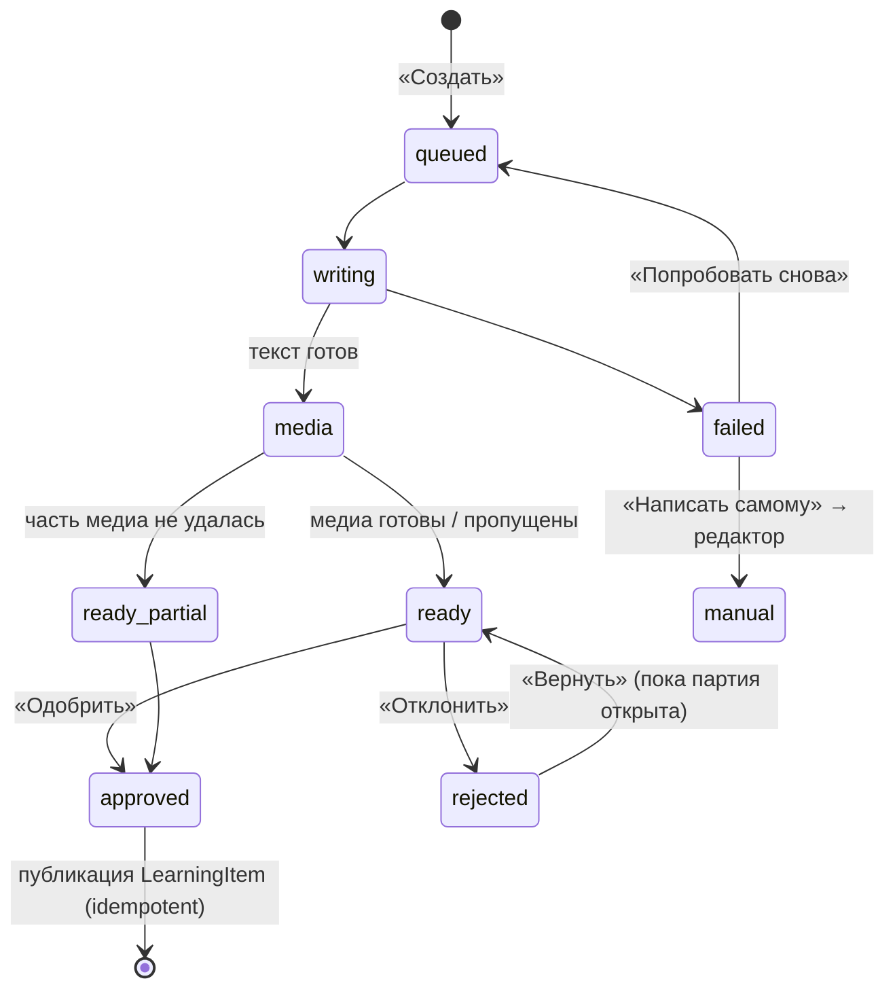

---
artifact:
  id: ux-research-2026-10
  type: research
  title: "AI layer UX and frontend research"
  status: historical
  created_at: "2026-10-01"
  owners: ["project-owner"]
---

# Mnema · AI-слой: UX- и frontend-исследование

**Дата:** 2026-10-01 · **Статус:** исследование и предложения, не принятое решение
**База кода:** `origin/main` @ `9d462f7b` (после #266/#267; read-only worktree), Angular 22.1.5, `@angular/cdk` 22.1.5 (установлен, в коде не импортируется)
**Все внешние ссылки открыты 2026-10-01**, если не указано иное. Пометка UNVERIFIED означает, что утверждение не удалось подтвердить первичным источником.

Документ превращает голосовое ТЗ владельца в проверяемые UX-решения, привязанные к текущему коду и канонам `docs/`. Он не меняет продуктовые контракты: части, которые расходятся с принятыми документами, вынесены в раздел 1 как решения для владельца.

---

## 0. Короткий итог

1. **Сначала решение владельца.** #77 (AI) отложен, #265 исключает генерацию, квоты и биллинг. Нужен decision record (D-04/D-08). UI скрыт за серверными флагами по fail-closed паттерну `GET /api/capabilities`.
2. **Один composer на три входа:** «На потом», «Новый материал», «Упражнения с ИИ». Состав: поле запроса, настройки с прогрессивным раскрытием, preflight-оценка лимита.
3. **Генерация — серверная фоновая задача.** Стрим только для открытой мастерской. `EventSource` не передаёт `Authorization`, поэтому используется HttpClient `partialText`: работает и в текущем XHR-бэкенде. Запасной путь — опрос.
4. **«Печать» блоками.** Готовые узлы `native-v1` проявляются ≤ 600 мс. Токены не стримятся. При `reduced-motion` текст появляется сразу. Live-регион — только сводки.
5. **Мастерская — пейджер «3 из 10»** со статусом у каждого материала. Можно работать, не дожидаясь партии. Сбой одного материала не ломает партию, лимит за него не списывается.
6. **Правка фрагмента — в существующем меню выделения** `native-editor` («Попросить Мнемозину…»). Diff, версии блока, «Оставить / Вернуть». На телефоне — нижняя панель.
7. **Тоглы — native radio в `fieldset`.** Пояснения к «Авто» — видимым живым текстом, а не hover-tooltip.
8. **Эталоны «1–10» не нужны:** «как в колоде» по умолчанию, в расширенных настройках — один закреплённый образец.
9. **Змейка:** `@property` + `conic-gradient` на `border-box`-слое. Только hover и фокус, 3 круга. При `reduced-motion` — статичный блик, при `forced-colors` — системная рамка.
10. **Статистика без vanity:** покрытие упражнениями, состояния, повторения, механики, заметки. Inline SVG со штриховкой, таблица-альтернатива. Нужен endpoint `insights`.
11. **Мультивыбор:** строка перестаёт быть `<a>`. Действия — в отдельной нижней панели, а не подменой «Удалить колоду». Массовое удаление — `hold-to-delete` с числом.
12. **Уведомления:** «Входящие» + тосты. 3 с только для эха, 6 с для «Готово», ошибки висят до закрытия. Пауза при hover, фокусе и скрытой вкладке. В Study тост ждёт естественной паузы.
13. **Paywall:** Free выбран по умолчанию. Одна шкала ИИ-лимита и отдельный счётчик колод. Неотмеченная галочка автопродления, отмена в один клик. Цены 449/990/1900 противоречат принятым 299 ₽.
14. **Имя:** «Мнемозина» — голос в диалоге, «ИИ» — функциональные метки (уже в коде). Без аватара-лица.
15. **Без AI можно начать сразу:** центр уведомлений, хаб колоды с мультивыбором, статистика.

---

## 1. Исходные ограничения и конфликты с видением

| Канон (файл) | Что сказано | Конфликт с ТЗ | Предложение |
|---|---|---|---|
| `product-direction-v2.md` D-04, #77 | Managed AI возвращается только через реактивированный #77 после product validation | Всё ТЗ — AI-слой | Owner decision record: реактивировать узкий scope (генерация материалов/упражнений), privacy/cost gates оставить |
| #265 «Не входит» | AI generation, jobs, quotas, billing | Composer, workshop, usage | Новый epic, не расширение #265 |
| `mnema-brand-and-ui-contract.md`, «Движение» | «Никакого… бесконечной анимации»; движение объясняет смену состояния | Змейка, shimmer | Змейка — hover-feedback, конечное число кругов; loader — функциональный индикатор с текстовой подписью |
| там же, «Визуальная идея» | Без «градиентов ради объёма», без «технологических микротекстов» | Переливы как в CLI | Монохромный индиго → лавандовый `--mn-hint`, без радуги |
| `design-and-experience-2026-09.md` | Лендинг без AI-обещаний | Маркетинг AI | AI появляется в продукте раньше, чем на лендинге |
| `product-direction-v2.md`, метрики | Не оптимизировать card count, opens, streak; не рисовать mastery % | «Красивые графики, побуждающие заниматься» | Только структурные и честные метрики (раздел F) |
| `russia-launch-economics-2026.md` | Starter 299 ₽/30 дней, Free 20 credits, недельные порции, годовой — только после двух когорт | 449/990/1900 ₽, годовая оплата | Обновить гипотезу явно; годовой тариф — флагом после когорт |
| `authoring-and-study-workflows.md` | Истечение подписки не удаляет колоды, блокирует только добавление | Лимит колод как платный рычаг | Совместимо, если текст paywall говорит ровно это |
| там же | EditingDraft: 30 дней, ≤ 200 активных на аккаунт | «Выход без approve → draft» × 10 | Предложения хранятся в партии генерации, не в EditingDraft (раздел A) |
| `product-direction-v2.md` | «Notification mechanics остаются отдельным будущим решением» | Центр уведомлений | Решение владельца: in-app only (без email/push) на первом шаге |
| Код #266 | AI-бейдж — «ИИ», capability `aiAssessment`/`speechToText`, fail closed | — | Расширить тот же контракт: `aiGeneration`, `aiMediaSearch`, `aiMediaSynthesis` |

Отдельно: в ТЗ микрофон стоит во всплывающем окне правки. Голосовой ввод требует STT, а STT по #265 выключен и не должен подменяться скрытым browser speech recognition. До включения `speechToText` кнопку микрофона в этом окне **не показывать**: окно должно оставаться минимальным. В Study кнопка «Ответить голосом» остаётся видимой и выключенной с объяснением, как сейчас.

---

## A. Паттерны «generation studio» и что перенести

### A.1 Что делают продукты

| Продукт | Механика (только наблюдаемый UI) | Перенос в Mnema |
|---|---|---|
| **Gamma** | Запрос → редактируемый план карточек → настройки `amount: brief/medium/detailed/extensive`, источник изображений (`aiGenerated`, `stock`, `webFreeToUse`…, `noImages`) ([API params](https://developers.gamma.app/guides/generate-api-parameters-explained)). AI-правка ограничивается колодой, карточкой или элементом. Переключатель Original/Modified показывается до принятия, но правка применяется целиком ([help](https://help.gamma.app/en/articles/8033284-can-i-edit-my-content-using-ai)). Стоимость изображения видна заранее, за ошибки AI не списывается ([credits](https://help.gamma.app/en/articles/7834324-how-do-credits-work-in-gamma)) | Шкала подробности почти совпадает с ТЗ. Нужны выбор источника медиа и честное правило «за сбой не платите». Не брать всё-или-ничего |
| **RemNote** | Выделить → Create AI Cards. Три уровня детализации, у каждого видны **оценка числа карточек и стоимость**. Предпросмотр с чекбоксами, «Save & Keep Text». AI-карточки не попадают сразу в due-очередь ([help](https://help.remnote.com/en/articles/10102901-generating-flashcards-with-ai)) | Preflight по каждому уровню. Сгенерированное не попадает в расписание до одобрения. Тот же принцип черновика у Quizlet Smart Assist ([blog](https://quizlet.com/blog/ai-study-era)) |
| **ChatGPT Canvas** *(выведен 2026-05-28)* | Пресеты длины и уровня чтения, «Show changes», откат версии ([intro](https://openai.com/index/introducing-canvas/)) | Только «Show changes» + back |
| **Claude Artifacts** | Отдельное окно. Выделить → **Edit with Claude** → ввести запрос ([support](https://support.claude.com/en/articles/17153992-what-are-artifacts-and-how-do-i-use-them)) | Модель «выделил → мини-запрос» |
| **Notion Agent** | Space на пустой строке открывает запрос. «Edit with AI» на выделении даёт Accept / Discard / Try again, и каждый Try again расходует лимит ([guide](https://www.notion.com/help/guides/notion-ai-for-docs), [allowance](https://www.notion.com/help/complimentary-ai-responses)) | Повтор — платное действие, его стоимость видна |
| **Google Docs · Gemini** | Refine: Rephrase / Shorten / Elaborate / Formal / Casual… Правки приходят как suggestions: ✓ по одной или Accept all ([support](https://support.google.com/docs/answer/13447609)) | Пресеты в мини-окне. Принятие по одной правке |
| **Apple Writing Tools** | Изменения подчёркнуты, Previous/Next, «Use Original» для одной правки, Revert / Accept All, Undo по шагам ([guide](https://support.apple.com/en-mn/guide/iphone/iph6f08da1d2/ios)) | Лучший образец diff внутри абзаца |
| **Cursor** | Выделить → Cmd/Ctrl+K → инструкция → правка только выделения ([docs](https://cursor.com/docs/inline-edit/overview)). Пользователи резко отреагировали на удаление ревью по каждой правке ([forum](https://forum.cursor.com/t/bring-back-per-change-apply-inline-diff-review-you-re-throwing-away-your-best-ux-advantage/160856)) | Подтверждение по частям — ожидаемый стандарт |
| **Figma Make** | Указать элемент → панель свойств или запрос. Любая правка, человека или AI, создаёт версию, восстановление ничего не удаляет ([help](https://help.figma.com/hc/en-us/articles/42009840449175-Edit-a-Figma-Make-file)) | Версия на каждую правку блока |
| **Napkin** | Hover или выделение → «Generate Visual» → несколько вариантов → выбрать стиль → вставить ([help](https://help.napkin.ai/en/articles/15923699-visuals-generation)) | Картинка и аудио: 3–4 варианта, а не один |
| **Claude Code** | Ключевое слово подсвечивается мерцанием, начиная с 2.1.161 мерцание учитывает «Reduce motion»; workflow-ключ получил «purple shimmer» ([CHANGELOG](https://raw.githubusercontent.com/anthropics/claude-code/main/CHANGELOG.md)). Радужная окраска в официальных документах — UNVERIFIED | Даже CLI выключает мерцание при reduced motion |

### A.2 Лучшие практики для «партия из N + правки по блокам»

1. **План — по желанию.** По умолчанию генерация стартует сразу. «Сначала план» в расширенных настройках даёт дешёвый список заголовков для правки до дорогой генерации (outline Gamma).
2. **Статус у каждого элемента:** `queued → writing → media → ready | failed`, затем `approved | rejected`. Повтор — у элемента. Сводка «7 готово · 2 пишутся · 1 не удался»; дольше 10 с — прогресс ([Cloudscape](https://cloudscape.design/gen-ai/patterns/progressive-steps/)).
3. **Не ждать партию:** первый готовый материал открывается сразу, мастерская не блокирует правку.
4. **Частичный сбой:** причина, «Попробовать снова», «Написать самому» (путь дальше — [PAIR](https://pair.withgoogle.com/chapter/errors-failing/)), «лимит не списан».
5. **Версии блока:** любая правка кладёт снимок узла в стек; «Вернуть» и «Показать изменения» (Figma Make, Canvas).
6. **Принятие по частям:** каждое изменение отдельно, плюс «Принять всё».
7. **Медиа — 3–4 разных варианта** ([Apple HIG](https://developer.apple.com/design/human-interface-guidelines/generative-ai)).
8. **Метка текстом, один раз на группу** ([NN/g sparkles](https://www.nngroup.com/articles/ai-sparkles-icon-problem/), [Cloudscape label](https://cloudscape.design/gen-ai/patterns/generative-ai-output-label/)); после проверки человеком — мягче ([NN/g PACED](https://www.nngroup.com/articles/disclose-ai-paced/)).
9. **Одобрение ≠ расписание:** публикуется обычная immutable revision, упражнения входят в Study по политике новых objectives.

**Где хранить «недоодобренное»** (на ревью архитектора). Десять предложений не должны занимать 10 из 200 EditingDraft. Серверная `GenerationBatch` хранит предложения и ручные правки (autosave); «Одобрить» публикует LearningItem существующей идемпотентной командой; уход без одобрения оставляет партию в «Незавершённых мастерских» колоды. Заметка «На потом» получает `converted` только после одобрения.

**Педагогический аргумент за совместный режим.** Самостоятельно созданное запоминается лучше прочитанного (метаанализ 86 исследований, d ≈ 0,40 — [Bertsch et al., 2007](https://link.springer.com/article/10.3758/BF03193441)). Поэтому правки — предложения, одобрение — осознанное действие, «Править самому» — равноправная кнопка.

---

## B. Streaming и «печать»

**Честный стрим токенов против блочного прогресса.** Материал — это структурированный документ `native-v1` (узлы с `id`, `type`, `attrs`). Сырые токены JSON нельзя отрисовать, не разбирая частичный JSON, а частичный rich-text дергает раскладку. Поэтому:

- **Сервер стримит события, а не токены.** События: `item.started`, `node.ready {itemId, node}`, `media.pending {nodeId, kind}`, `media.ready`, `item.ready`, `item.failed {reason}`. У каждого события порядковый `seq`, чтобы после переподключения продолжить с `?after=seq` без дублей.
- **Клиент проявляет каждый готовый узел** классом `is-arriving` длительностью ≤ 600 мс. Для текста это маска «чернила проступают» сверху вниз: дёшево, работает для многострочного текста, подходит бумажному стилю. Посимвольная «печатная машинка» не нужна: темп задаёт вычисление, а не скорость чтения ([UIST’25](https://arxiv.org/abs/2504.17999)), и данных о пользе такой анимации для понимания нет.
- **Placeholder медиа** — бумажная рамка фиксированного размера (`aspect-ratio`, без CLS) с подписью «Подбираем изображение…». Конкретный текст прогресса предписан [Apple HIG](https://developer.apple.com/design/human-interface-guidelines/generative-ai). Когда приходит `media.ready`, изображение проявляется в ту же рамку.

```css
/* Мягкий край маски «стекает» сверху вниз; в конце маска полностью непрозрачна. */
.native-node.is-arriving {
  mask: linear-gradient(#000 80%, transparent) no-repeat top / 100% 200%;
  animation: mn-ink-in .6s cubic-bezier(.22,.61,.36,1) both;
}
@keyframes mn-ink-in { from { mask-size: 100% 0%; } }
@media (prefers-reduced-motion: reduce) { .native-node.is-arriving { animation: none; } }
```

**Политика `aria-live`:**

- Контейнер, куда приходит текст, **не делать** live-регионом. На статье выставлять `aria-busy="true"`, пока материал пишется ([MDN aria-busy](https://developer.mozilla.org/en-US/docs/Web/Accessibility/ARIA/Reference/Attributes/aria-busy)).
- Отдельный, заранее присутствующий в DOM `role="status"` получает редкие сводки: «Материал 3 из 10 готов», «Готово: 9 материалов, 1 не удался». Сводки приходят не чаще одной в 2 с, лишние склеиваются.
- Объявления по токенам заваливают чтение или теряются ([разбор](https://tianpan.co/blog/2026/04/17/ai-accessibility-streaming-screen-readers), практика). Норма — [WCAG 4.1.3](https://www.w3.org/WAI/WCAG22/Understanding/status-messages.html).
- Если автообновление длится дольше 5 с, нужна возможность его остановить ([WCAG 2.2.2](https://www.w3.org/WAI/WCAG22/Understanding/pause-stop-hide.html)). Кнопка «Остановить генерацию» есть всегда, и остановка не теряет уже готовое.

**Как это потребляет Angular 22:**

- `EventSource` принимает только `withCredentials` и не может отправить заголовок `Authorization` ([WHATWG SSE](https://html.spec.whatwg.org/multipage/server-sent-events.html), открытый [whatwg/html#2177](https://github.com/whatwg/html/issues/2177)). Авторизация в Mnema — Bearer из памяти, поэтому `EventSource` не подходит.
- HttpClient отдаёт `DownloadProgress` с накопленным `partialText` для `responseType: 'text'` ([HttpDownloadProgressEvent](https://angular.dev/api/common/http/HttpDownloadProgressEvent)). Проверено в исходнике 22.1.5: и fetch-, и **XHR**-бэкенд заполняют `partialText`, так что текущий `withXhr()` не мешает, а interceptor с токеном продолжает работать. В v22 `reportProgress` объявлен deprecated, его заменяет `reportDownloadProgress` ([options](https://angular.dev/api/common/http/HttpClientCommonOptions)). `partialText` накапливается, поэтому разбор NDJSON/SSE-кадров держит смещение.
- **Обёртка — `rxResource({ params, stream })`**, стабильная с v22.0 ([RxResourceOptions](https://angular.dev/api/core/rxjs-interop/RxResourceOptions); статусы `idle | loading | reloading | resolved | error | local` — [ResourceStatus](https://angular.dev/api/core/ResourceStatus)). `stream` возвращает Observable состояния партии, свёрнутого (`scan`) из событий. Компонент читает `batch.value()` как signal.
- **Запасной путь — опрос** `GET …/generation-batches/{id}?after=seq` каждые 2 с, пока партия активна, и раз в 30 с для центра уведомлений.
- **Zone.js.** Приложение явно вызывает `provideZoneChangeDetection()`, то есть пока не zoneless, хотя zoneless — дефолт с v21 ([guide](https://angular.dev/guide/zoneless)). Каждое progress-событие XHR запускает change detection всего приложения. Поэтому события пачкуются (`bufferTime(100)` или `animationFrameScheduler`) до записи в signal. Переход на zoneless — отдельная задача, не блокер.
- **`@defer (on viewport)`** — для плееров, diff и графиков, с placeholder фиксированного размера и обёрткой `aria-live="polite" aria-atomic="true"` ([guide](https://angular.dev/guide/templates/defer)). Главный текст и CTA не откладывать.

---

## C. Правка выделенного фрагмента: всплывающее окно и нижняя панель

### C.1 Мастерская: компоновка

```
← Колода «Японский N4»                                    [Уведомления · 2]
МАСТЕРСКАЯ · из 4 заметок «На потом»                 ИИ · проверьте факты
Глаголы движения                                                    (h1)
┌ ‹  3 из 10  › ───────────────────────────────────────────────────────┐
│ ● ● ◐ ○ ○ ○ ○ ○ ✕ ○   7 готово · 2 пишутся · 1 не удался   [Стоп]    │
├──────────────────────────────────────────────────────────────────────┤
│ «行く・来る・帰る»                       [Править самому] [Ещё вариант] │
│ ▌Абзац проявляется чернилами…                                         │
│ ┌──────────── 16:9 ────────────┐  ← клик: «Найти похожее / Создать»  │
│ │  Подбираем изображение…      │                                      │
│ └──────────────────────────────┘                                      │
│ ▶ аудио 0:04 · синтезированная речь                                   │
│ ─ ─ ─ ─ ─ ─ ─ ─ ─ ─ ─ ─ ─ ─ ─ ─ ─ ─ ─ ─ ─ ─ ─ ─ ─ ─ ─ ─ ─ ─ ─ ─ ─ ─  │
│ Из заметки: «行く vs 来る — когда что?»                                │
│  [Удалить (удержание)]           [Отклонить]    [Одобрить и далее →]   │
└──────────────────────────────────────────────────────────────────────┘
Одобрить все готовые (6)                               Выйти в колоду
```

- Пейджер — это `nav aria-label="Материалы партии"` с кнопками «‹ ›» и `ol` точек-статусов. Каждая точка — кнопка с текстом вида «Материал 7, готов, одобрен». Форма точки (●◐○✕✓) передаёт статус без цвета ([WCAG 1.4.1](https://www.w3.org/WAI/WCAG22/Understanding/use-of-color.html)). Текущая точка получает `aria-current="step"`. URL отражает позицию (`?n=3`), чтобы ссылка из уведомления вела к нужному материалу.
- «Одобрить и далее →» — главное действие и переход к следующему неразобранному материалу. «Отклонить» обратимо, пока открыта партия. «Удалить» использует `app-hold-to-delete-button`, как и в остальном продукте.
- Уход без одобрения ничего не теряет: предложения и ручные правки сохраняются в партии (раздел A). Guard на уходе нужен только во время неподтверждённого autosave, как в `canLeaveItemEditor`.

### C.2 Мини-окно запроса

**Повторное использование.** `native-editor.component` уже показывает при непустом выделении панель `role="group" aria-label="Действия с выделенным текстом"` («Сделать ссылкой», «Добавить чтение») и позиционирует её через `coordsAtPos`. Сюда добавляется третья кнопка, «Попросить Мнемозину…». Отдельный механизм выделения не нужен. Для изображения и аудио используется уже существующий инспектор медиа `rich-tools` («Настройки медиа»), в который добавляется секция «Найти похожее / Создать».

```
Выделено: «потому что глагол 来る обозначает движение к говорящему…»
┌──────────────────────────────────────────────┐
│ Что изменить?                                 │
│ [Проще] [Короче] [Пример] [Подробнее]         │  ← пресеты (Docs, Canvas)
│ ┌──────────────────────────────────────┐ ➤   │
│ │ слишком сложный текст                 │     │  Enter = отправить
│ └──────────────────────────────────────┘     │
│ ≈ 0,3% лимита                        Esc ×    │
└──────────────────────────────────────────────┘
```

- **Семантика.** Немодальный `role="dialog"` с `aria-labelledby` («Что изменить?»), фокус — в поле. Esc и клик вне окна закрывают его и возвращают фокус и выделение в документ; набранный запрос сохраняется до смены выделения. Пресеты — обычная группа кнопок; [APG Toolbar](https://www.w3.org/WAI/ARIA/apg/patterns/toolbar/) — только если кнопок больше четырёх ([APG Dialog](https://www.w3.org/WAI/ARIA/apg/patterns/dialog-modal/)).
- **Слой.** Достаточно `popover="manual"` с текущим JS-позиционированием, к тому же это top layer ([Popover API](https://developer.mozilla.org/en-US/docs/Web/API/Popover_API): Newly available с 2025-01). CSS anchor positioning пока Limited ([webstatus](https://webstatus.dev/features/anchor-positioning)), `popover="hint"` тоже Limited ([webstatus](https://webstatus.dev/features/popover-hint)). На них полагаться рано.
- **Выделение должно оставаться видимым**, пока фокус в окне. В ProseMirror это делается inline-декорацией с классом `ai-target`. В режиме чтения, вне редактора, — через [CSS Custom Highlight API](https://developer.mozilla.org/en-US/docs/Web/API/CSS_Custom_Highlight_API) (Newly с 2026-03). Чтобы связать DOM-выделение с узлом, рендерер должен выводить `data-node-id`. Сейчас он этого не делает, хотя у каждого `NativeNode` есть стабильный `id`.
- **Состояния отправки:**
  - `idle` — кнопка ➤ активна при непустом поле или выбранном пресете.
  - `sending` — поле только для чтения, ➤ превращается в «Отменить», запрос прерывается через unsubscribe или `AbortSignal`.
  - Окно закрывается, блок переходит в `rewriting`: старый текст остаётся видимым и читаемым, рамка выделена штриховым пунктиром, сбоку подпись «Мнемозина переписывает…», на блоке `aria-busy`. Это «бумажный набросок» вместо shimmer. Текст не бледнеет через opacity: бренд-контракт требует не понижать opacity текста.
  - Результат подставляется на место с проявлением (B). Под блоком появляется полоска: «Переписано · Показать изменения · Оставить · Вернуть · Ещё раз».
- **Diff.** Удалённое показывается `<del>` с зачёркиванием, добавленное — `<ins>` с подчёркиванием. Некоторые экранные чтецы не озвучивают `del`/`ins` ([MDN del a11y](https://developer.mozilla.org/en-US/docs/Web/HTML/Reference/Elements/del#accessibility)), поэтому добавляется визуально скрытый текст «удалено:»/«добавлено:». Образец — Apple Writing Tools: подчёркивание, «Предыдущее/Следующее», «Вернуть исходное» для одной правки.
- **Мобильная версия.** Системное меню выделения на iOS/Android всплывает над выделением и конфликтует с собственным окном. Поэтому при `(pointer: coarse)` внизу появляется полоса «Изменить с Мнемозиной», а по нажатию — нижняя панель на `<dialog>` + `showModal()` (Widely, [webstatus](https://webstatus.dev/features/dialog)) с пресетами и полем `enterkeyhint="send"`. `closedby` не использовать: в Safari его нет ([webstatus](https://webstatus.dev/features/dialog-closedby)); Esc и «×» обрабатывать самим.
- **Микрофон.** См. раздел 1: показывать только при `speechToText.available`. Запись берётся из логики `MediaRecorder` в `native-media-upload.component.ts` (выбор mime `audio/webm;codecs=opus`/`audio/mp4`, `getUserMedia`). Её нужно вынести в общий signal-based `AudioRecorder` для загрузки и голосового запроса. Без Web Speech API.
- **Картинка.** Выбор узла открывает инспектор. Поле «Что должно быть на картинке» заполнено alt-текстом. Две кнопки: «Найти похожее в интернете» и «Создать». Результат — сетка из 3–4 вариантов, у найденных указаны источник и лицензия (как у Gamma: `webFreeToUse`, `webFreeToUseCommercially`). Предыдущая картинка остаётся доступна через «Вернуть». **Аудио** — аналогично: «Найти запись» или «Озвучить» с выбором голоса и скорости. Синтез помечается «синтезированная речь».

---

## D. Composer и настройки

### D.1 Компоновка: запрос сверху, настройки ниже

```
← Колода «Японский N4»
НОВЫЙ МАТЕРИАЛ
Юзуру, что будем учить сегодня?                                (h1 = label)
┌──────────────────────────────────────────────────────────────┐
│ Например: 20 глаголов движения с примерами из аниме           │  textarea, field-sizing
│                                                              │
│ [＋ Заметки «На потом» · 4 выбрано ✕]                         │
│                                       ≈ 6% лимита  [ Создать ➤ ]  ← snake CTA
└──────────────────────────────────────────────────────────────┘
Колода: [Японский N4 ▾]          Или откройте пустой редактор →
─────────────────────────────────────────────── Настройки · Авто
Подробность   (•Авто) (Кратко) (Средне) (Подробно)
  Авто: Мнемозина выберет объём по заметке — обычно 2–4 абзаца.   ← живое пояснение
Вложения      [✓] Изображения  [✓] Аудио  [ ] Видео  [✓] Ссылки  [ ] Таблицы
  Аудио: сколько (•Авто)(1)(2)(3)   длительность (•Авто)(до 5 с)(до 30 с)
Похоже на     (•Как в колоде) ( Выбрать материал… )
▸ Настроить для каждой заметки отдельно   (2 настроены)
▸ Сначала показать план
```

- **Один компонент на три входа.** Из «На потом» заметки приходят как чипы, и поле запроса становится необязательным. Из «Новый материал» поле обязательно. Из колоды для упражнений меняется только набор настроек (раздел G.3).
- **Приветствие — видимый label, а не placeholder** ([WCAG 3.3.2](https://www.w3.org/WAI/WCAG22/Understanding/labels-or-instructions.html)). Имя — из `AuthService.user().name`; без имени — «Что будем учить сегодня?». В placeholder — пример запроса.
- **Enter отправляет, Shift+Enter переносит строку**, но **никогда во время IME-композиции**. Японский, китайский и корейский ввод подтверждает кандидата клавишей Enter. Проверять `event.isComposing` ([MDN](https://developer.mozilla.org/en-US/docs/Web/API/KeyboardEvent/isComposing)) и, для старого WebKit, `keyCode === 229`. Для языковой когорты это критично. На телефоне Enter переносит строку, отправка — видимой кнопкой с `enterkeyhint="send"`.
- **Поле растёт** через `field-sizing: content` (Newly с 2026-06; в старых браузерах остаётся фиксированная высота, [webstatus](https://webstatus.dev/features/field-sizing)) с `max-block-size`.
- **«Чат исчезает → мастерская»** — переход на `/decks/:id/workshop/:batchId` через same-document View Transition (Newly с 2025-10, [webstatus](https://webstatus.dev/features/view-transitions)); при `reduced-motion` мгновенно. Фокус на h1 уже переносит `focusPageHeading()` в app-shell.
- **Когда AI недоступен** (capability false, лимит исчерпан, сеть), страница «Новый материал» сразу открывает существующий редактор и показывает спокойную заметку. Мёртвого composer нет. Ручной путь — равноправная ссылка «Или откройте пустой редактор».

### D.2 Многоуровневый тогл

Это **native radio** в `fieldset` + `legend`, внешне сегменты:

- Стрелки, Space и фокус обеспечивает платформа ([APG Radio Group](https://www.w3.org/WAI/ARIA/apg/patterns/radio/)). Так же уже устроен `mechanic-picker` из #267.
- Вложенные параметры аудио («сколько», «длительность») — это две отдельные радиогруппы. Они раскрываются только при отмеченном «Аудио» (шаблон disclosure), а не одна «многоуровневая» кнопка, циклически переключающая значения: такую не прочитать экранным чтецом.
- «Авто» всегда первый вариант и выбран по умолчанию.

```html
<fieldset class="segmented" aria-describedby="detail-hint">
  <legend>Подробность</legend>
  <label><input type="radio" name="detail" value="AUTO" checked> Авто</label>
  <label><input type="radio" name="detail" value="BRIEF"> Кратко</label>
  <label><input type="radio" name="detail" value="MEDIUM"> Средне</label>
  <label><input type="radio" name="detail" value="DETAILED"> Подробно</label>
  <p id="detail-hint" class="hint" aria-live="polite">{{ detailHint() }}</p>
</fieldset>
```

```css
.segmented { display: flex; flex-wrap: wrap; border: 0; padding: 0; gap: 0; }
.segmented label { position: relative; display: inline-flex; align-items: center; min-block-size: var(--mn-touch-min);
  padding-inline: var(--mn-space-4); border: 1px solid var(--mn-field-border); margin-inline-start: -1px; cursor: pointer; }
.segmented input { position: absolute; opacity: 0; inset: 0; margin: 0; cursor: pointer; }
.segmented label:has(:checked) { background: var(--mn-ink); color: var(--mn-on-ink); border-color: var(--mn-ink); }
.segmented label:has(:focus-visible) { outline: 3px solid var(--mn-focus); outline-offset: 2px; z-index: 1; }
@media (forced-colors: active) { .segmented label:has(:checked) { outline: 2px solid Highlight; } }
```

**Подсказки «Авто сам определит…».** Hover-tooltip недоступен с touch и по [WCAG 1.4.13](https://www.w3.org/WAI/WCAG22/Understanding/content-on-hover-or-focus.html) обязан быть закрываемым и устойчивым; паттерн tooltip в APG не завершён ([APG Tooltip](https://www.w3.org/WAI/ARIA/apg/patterns/tooltip/)). Решение — **живое пояснение под группой** (`detail-hint`), меняющееся с выбором. Длинные объяснения — в toggletip: кнопка «ⓘ» с `popovertarget` и `popover="auto"` (light dismiss и Esc бесплатно).

Тексты:
- «Авто: Мнемозина выберет объём по заметке — обычно 2–4 абзаца.»
- «Кратко: определение и один пример.»
- «Подробно: объяснение, 3–5 примеров, исключения.»
- Для вложений: «Авто добавит изображение и аудио, только если они помогают запомнить».

### D.3 Тонкая настройка и эталоны

- **Тонкая настройка по заметкам** (`<details>`, свёрнута): в строке — начало заметки, `app-mnema-select` (`compact`) для подробности («Как для всех» / …) и кнопка «Вложения: как для всех» с маленьким popover чекбоксов. Summary: «2 заметки настроены отдельно».
- **«1–10 материалов-эталонов».** Честный вердикт: **не делать.** Аргументы:
  - Выбор десяти образцов — отдельная задача сортировки.
  - Каждый эталон увеличивает контекст запроса, а значит стоимость и задержку.
  - Пользователь не увидит, какой из десяти на что повлиял.
- **Чем заменить:** «Похоже на: (•) как в колоде / ( ) выбрать материал…». В режиме «как в колоде» сервер сам берёт 1–3 недавних материала колоды как стилевой контекст. Во втором варианте пользователь закрепляет **один** материал через маленький picker с серверным поиском по названиям (у `mnema-select` только typeahead по загруженным опциям — для больших колод не хватит). Если интервью покажут потребность, позже можно разрешить до трёх.

### D.4 Preflight-оценка рядом с кнопкой

«≈ 6% месячного лимита». Если оценка неточная, показывается диапазон: «4–8%». Оценку считает сервер (`POST …/generation-estimates`, debounce 400 мс на изменение настроек) — так же, как RemNote и Gamma показывают стоимость до запуска. Если лимита не хватает, кнопка **не выключается**. Нажатие показывает рядом заметку: «Не хватит лимита: выберите «Кратко», уберите видео или посмотрите тарифы». Заблокированная кнопка без объяснения хуже.

---

## E. CTA «Начать генерацию» со «змейкой»

### E.1 Техники

| Техника | Как | Поддержка | Производительность | Вердикт |
|---|---|---|---|---|
| `@property` + `conic-gradient(from var(--angle))` на `border-box`-слое фона | анимируется зарегистрированный угол | `@property` Newly с 2024-07 (Chrome 85, Firefox 128, Safari 16.4); conic Widely ([webstatus](https://webstatus.dev/features/registered-custom-properties)) | custom properties анимируются **в main thread** и перерисовывают элемент в каждом кадре ([web.dev](https://web.dev/blog/at-property-performance)); для одной кнопки приемлемо | **Основная** |
| Вращающийся `::after` с conic + `overflow:hidden` | `transform: rotate` на compositor | везде | compositor-only ([web.dev](https://web.dev/articles/animations-guide)) | Запасной вариант, если профилирование покажет проблему. Требует лишней обёртки |
| `mask-composite: exclude` + `content-box` | кольцо маской | `mask` Widely с 2026-06, но `content-box` в `mask-clip` в Safari по BCD **нет** | — | Не использовать (Safari) |
| SVG `<rect pathLength>` + `stroke-dashoffset` | 2–3 штриха разной длины и прозрачности | везде | дешёвая перерисовка | Равномерная скорость по периметру, но лишний DOM. Резерв |
| `offset-path: border-box` для «головы» | точка, летящая по рамке | basic-shape и box-ключи во всех движках с Safari 18 ([MDN](https://developer.mozilla.org/en-US/docs/Web/CSS/offset-path)) | transform | Красиво, но хвост придётся рисовать отдельно. Избыточно |

Глобальный `::before` у `.button` уже занят волновой заливкой (`global_styles.css`, `clip-path: circle(...)`). Поэтому змейка живёт в слое фона рамки, а не в псевдоэлементе. Волна заливает только padding-box, а рамка остаётся видимой.

### E.2 Сниппет в токенах проекта

```css
/* Регистрация нужна, чтобы угол и цвета интерполировались плавно, а не скачком. */
@property --mn-snake-angle { syntax: "<angle>"; inherits: false; initial-value: 0deg; }
@property --mn-snake-head  { syntax: "<color>"; inherits: false; initial-value: #281378; } /* = --mn-ink */
@property --mn-snake-tail  { syntax: "<color>"; inherits: false; initial-value: #281378; }

/* В покое голова и хвост цвета ink — кольцо сливается с кнопкой. */
.button.primary.generate-cta {
  --mn-snake-width: 2px;
  border: var(--mn-snake-width) solid transparent;
  border-radius: var(--mn-radius);
  color: var(--mn-on-ink);
  background:
    linear-gradient(var(--mn-ink) 0 0) padding-box,
    conic-gradient(from var(--mn-snake-angle),
      var(--mn-ink) 0 55%,
      color-mix(in oklab, var(--mn-snake-tail) 35%, var(--mn-ink)) 74%,  /* тусклый хвост */
      var(--mn-snake-tail) 90%,
      var(--mn-snake-head) 97%,                                          /* яркая голова */
      var(--mn-ink) 99.5%) border-box;
  transition: --mn-snake-head .25s ease, --mn-snake-tail .25s ease;
}
.generate-cta:is(:hover, :focus-visible):not(:disabled) {
  --mn-snake-head: var(--mn-sheet);
  --mn-snake-tail: var(--mn-hint);
}
@media (prefers-reduced-motion: no-preference) {
  .generate-cta:is(:hover, :focus-visible):not(:disabled) {
    animation: mn-snake 1.6s linear 3 forwards;   /* конечное число кругов, ≈ 4.8 с */
  }
}
@keyframes mn-snake { to { --mn-snake-angle: 1turn; } }
@media (prefers-reduced-motion: reduce) {
  .generate-cta:is(:hover, :focus-visible):not(:disabled) { --mn-snake-angle: 40deg; } /* статичный блик */
}
@media (forced-colors: active) {
  /* gradient-фон в forced colors вычисляется в none; рамку задаём системными цветами */
  .generate-cta { border-color: ButtonText; background: ButtonFace; color: ButtonText; }
}
```

Пояснения:

- **Три круга вместо бесконечности** — требование бренд-контракта. Анимацию запускает действие пользователя ([WCAG 2.3.3](https://www.w3.org/WAI/WCAG22/Understanding/animation-from-interactions.html)), а не автозапуск ([2.2.2](https://www.w3.org/WAI/WCAG22/Understanding/pause-stop-hide.html)). Глобальное правило `reduced-motion` и так режет длительность до 0,01 мс; статичный блик сохраняет различимость hover.
- **Forced colors.** По [CSS Color Adjust](https://www.w3.org/TR/css-color-adjust-1/) `background-image` без `url()` вычисляется в `none`, а `box-shadow` убирается. Поэтому в этом режиме задаётся явная системная рамка.
- **Где применять.** Только одна такая кнопка на экран: «Создать» в composer и «Добавить упражнения» в билдере. Никогда в обычных `.primary`, иначе приём перестаёт быть сигналом. При нехватке лимита змейка не запускается, но кнопка остаётся нажимаемой (D.4).
- **Палитра.** Голова `--mn-sheet` (13,6:1 к ink), хвост `--mn-hint`, без радуги: «переливы как в CLI» переводятся в индиго-гравюру. Контраст подписи кнопки не меняется (`--mn-on-ink` на `--mn-ink`).

---

## F. Статистика колоды

### F.1 Что мотивирует, оставаясь честным

Принцип из канона: показываются структурные факты и следующий шаг. Нельзя показывать mastery-проценты, стрики, общее время и число повторений. Каждый виджет заканчивается действием.

| Виджет | Форма | Мотивирующий текст + действие | Данные сейчас | Чего нет |
|---|---|---|---|---|
| **Покрытие упражнениями** | donut, в центре «34 из 50» | «16 материалов без упражнений — они не попадут в занятия» → «Показать» / «Упражнения с ИИ» | `items.total` есть; число упражнений — только `GET /exercises?memberKey=` по одному на материал (N+1, запрещено design-доком) | агрегат `coverage` |
| **Где вы сейчас** | waffle-сетка (клетка = материал, при > 200 — корзины) или одна stacked-полоса | «К повторению 12» → «Учить» | `study-progress`: `NOT_STARTED / LEARNING / DUE / ON_TRACK` по материалу, страницы ≤ 100 (агрегат на клиенте = полный обход) | агрегат `states` |
| **Ближайшие повторения** | 7 столбцов-дней | «В четверг 20 — можно начать сегодня с короткого занятия» | `nextDue` по материалу | `dueByDay[7]` в timezone аккаунта |
| **Разнообразие механик** | точечная диаграмма по 7 механикам | «Почти всё — выбор ответа. Ввод ответа проверяет память надёжнее» (классы evidence CHOICE = LOW, FREE_RESPONSE до HIGH — `exercise-catalog-v2.md`) | нет | `exercisesByMechanic` |
| **Неразобранные заметки** | число + возраст самой давней | «Здесь есть мысли, к которым вы давно не возвращались» (формулировка из design-дока) → «Разобрать» / «Создать материалы с ИИ» | `listDeckCaptures(…, 1).total` | `oldestOpenCreatedAt` |

**Новый endpoint** (вход для архитектора): `GET /api/decks/{id}/insights` → `{ asOf, coverage, states, dueByDay, exercisesByMechanic, captures }`, считается сервером по текущей ревизии, `Cache-Control: private, no-store`. Плюс серверная сортировка `GET /decks/{id}/items?sort=exerciseCount&include=exerciseCount` с курсором — иначе «пустые сначала» на больших колодах не сделать. Ошибка статистики не прячет колоду и действия (design-док).

### F.2 Реализация без библиотеки

- **Каждый виджет** — `<figure>` и `<figcaption>`. Внутри inline SVG с `role="img"` и `aria-labelledby` на заголовок и текстовую сводку («34 из 50 материалов с упражнениями»). Под ним `<details><summary>Показать таблицей</summary><table>…`: таблица-альтернатива для сложных изображений.
- **Donut** — два `<circle pathLength="100">` и `stroke-dasharray="68 32"`. Числа — HTML-текст поверх SVG, шрифт `--mn-font-display` («фолио»), подписи в mono.
- **Различие без цвета.** Штриховка «под гравюру» через `<pattern>`:
  - ON_TRACK — сплошное ink,
  - LEARNING — диагональная штриховка,
  - DUE — перекрёстная,
  - NOT_STARTED — пустая бумага с контуром.
  - В forced colors `fill`/`stroke` принудительно заменяются системными ([CSS Color Adjust](https://www.w3.org/TR/css-color-adjust-1/)), а геометрия штриховки остаётся. Состояния различимы и в ч/б печати.
- **Движение.** Прорисовка дуги (`stroke-dashoffset`) один раз при первом появлении, только при `prefers-reduced-motion: no-preference`. Блок оборачивается в `@defer (on viewport)` с placeholder того же размера.
- **Раскладка.** На desktop — grid `repeat(auto-fit, minmax(min(100%, 16rem), 1fr))`. На mobile — горизонтальная лента со `scroll-snap`; это `role="region" aria-label="Статистика колоды" tabindex="0"`, чтобы её можно было прокрутить с клавиатуры. Видны три главных виджета, остальные — под «Ещё статистика».

---

## G. Мультивыбор, массовые действия, билдер упражнений

### G.1 Хаб колоды

```
← Мои колоды
ЛИЧНАЯ КОЛОДА
Японский N4                                                [Изменить]
Описание (отрисованный markdown)…
[ Учить ]  [Новый материал]  [На потом · 4]  [Упражнения с ИИ]
┌ Покрытие ─┐ ┌ Где вы ───┐ ┌ Повторения ┐            Ещё статистика ▸
│   ◔ 34/50 │ │ ▦▦▦▤▤░░░ │ │ ▁▃▂▅▁▁▂    │
└───────────┘ └───────────┘ └────────────┘
Материалы · 50                       Порядок: [Без упражнений сначала ▾]
[▣] Выбрать все
[ ] 1  行く・来る            ⚠ нет упражнений                 12.09.2026
[✓] 2  Частица に            3 упражнения                     14.09.2026
…                                                (подгрузка заранее)
┌──────────────────────── прилипает к низу ──────────────────────────┐
│ Выбрано 7   [Упражнения с ИИ]   [Удалить выбранные · 7]  [Снять выбор] │
└────────────────────────────────────────────────────────────────────┘
```

Сейчас страница колоды — это форма метаданных, которая всегда раскрыта. Предлагается хаб «сначала читать»:

- Описание отрисовано, форма и «Удалить колоду» спрятаны за «Изменить» (прогрессивное раскрытие).
- Список материалов переезжает с `/decks/:id/materials` в хаб. По правилу greenfield старый маршрут удаляется, а не дублируется. **Это решение владельца**, потому что меняется IA «Просмотреть материалы».

### G.2 Строка, выбор и массовое удаление

- **Разметка.** `.item-row` сейчас `<a>`, а чекбокс внутри ссылки недопустим. Строка становится `<li class="item-row">` с `<input type="checkbox" aria-label="Выбрать «行く・来る»">`, номером, `<a class="row-link">` (растянута на строку через `::after { position:absolute; inset:0 }`, чекбокс поднят `z-index:1`) и числом упражнений.
- **Волна сохраняется:** `setWaveOrigin` ищет `closest('.item-row')`, это работает и для `li`. В глобальном правиле волны (`global_styles.css`, `:is(…, .item-row, .deck-row):is(:hover, :focus-visible)`) для строки нужен `:has(:focus-visible)`: `li` сам фокус не получает.
- **Предупреждение «нет упражнений»** — значок, текст и `--mn-caution` вместе, не один цвет.
- **«Выбрать все»** — tri-state чекбокс со свойством `indeterminate` ([APG Checkbox, mixed](https://www.w3.org/WAI/ARIA/apg/patterns/checkbox/examples/checkbox-mixed/)). Список подгружается бесконечно, поэтому после «все» показывается строка «Выбраны 20 загруженных. Выбрать все 50 в колоде?». Серверная команда принимает либо явные ID (≤ 100), либо `{ allInDeck: true, except: [...], expectedDeckRevision }`.
- **Клавиатура и мышь.** Space переключает нативно. Shift+клик выделяет диапазон от последнего переключённого материала. Стрелки не перехватываются. Полезнее диапазона кнопка «Выбрать без упражнений».
- **Touch.** Чекбоксы видны всегда, область нажатия 44 px за счёт `label`. Long-press не нужен: его никто не находит, и он конфликтует с выделением текста и системным меню.
- **Панель действий** — `role="region" aria-label="Действия с выбранными"`, прилипает к низу.
  - Фокус на неё не перескакивает. В `role="status"` с задержкой 500 мс приходит «Выбрано 7 материалов».
  - Чтобы панель не перекрывала фокус в строке, у списка задан `scroll-padding-block-end` равный её высоте ([WCAG 2.4.11](https://www.w3.org/WAI/WCAG22/Understanding/focus-not-obscured-minimum.html)).
  - Esc в списке снимает выбор.
- **Удаление.** «Удалить колоду» не превращается на месте в «Удалить выбранные»: одна и та же кнопка с разным смыслом ведёт к ошибке режима. В хабе удаление колоды и так живёт в панели «Изменить», а массовое удаление — в панели выбора. В панели используется существующий `app-hold-to-delete-button`:
  - `label="Удалить выбранные · 7"`;
  - нужен новый необязательный input `consequence`: «7 материалов и 15 упражнений исчезнут из колоды. История ответов сохранится»;
  - частичный успех описывается честно: «5 удалено. 2 материала изменились в другой вкладке — обновите список».

### G.3 Билдер упражнений с ИИ и диалог из карточки материала

- **Тот же composer** (раздел D), но с другим набором настроек. Поле сверху необязательно: «Мнемозина, сделай по 3 упражнения на перевод». Ниже:
  - **Механики** — чипы-чекбоксы семи механик из каталога #266/#268, по умолчанию «Авто».
  - **Приоритет**: (•) сначала материалы без упражнений / ( ) все выбранные.
  - **Сколько**: (•) Авто / ( ) Точно: `<input type="range" min="1" max="N">` + `<output>` с `aria-valuetext="3 упражнения на материал"` / ( ) В пределах бюджета: «не больше 10% лимита».
  - Ползунок и проценты — это два способа задать одно и то же. Они взаимоисключающие радиоварианты, а не два активных контрола.
- **Результат — один экран проверки партии.** Предпросмотры заданий идут списком через `exercise-preview-host` из #267. Все отмечены чекбоксом «Оставить» (как в RemNote), внизу кнопка «Сохранить выбранные (14)». Сохранённые упражнения получают метку «Новое»: она снимается после первого открытия или через 7 дней и хранится на сервере. «Изменить» открывает существующий редактор #267 в режиме `AUTHOR_READY`.
- **Диалог в карточке материала** — свёрнутый composer «Попросить Мнемозину…», а не постоянный чат.
  - Каждый запрос даёт карточку результата с предпросмотром и действиями «Оставить / Вернуть / Ещё раз».
  - Пример: «замени аудио на мужской голос» показывает новый плеер рядом со старым.
  - История диалога не хранится дольше сессии (privacy). Значим только результат, применённый как ревизия.

---

## H. Центр уведомлений

### H.1 Архитектура

- **`NotificationCenter`** — сервис `providedIn: 'root'` на signals:
  - `inbox` — серверная страница уведомлений;
  - `unreadCount`;
  - `toastQueue`;
  - `quiet` — `computed` от маршрута и `StudyFocus`.
- **Сервер.** `GET /api/notifications?cursor`, `POST /api/notifications/read`; источники — завершение и сбой партии, напоминание о списании. Опрос раз в 30 с при видимой вкладке, раз в 5 с во время своей партии, в мастерской — её стрим. Только in-app; email/push — отдельное решение.
- **Тосты.** Контейнер `<section class="toast-region" aria-label="Уведомления">` в `app-shell` после `<main>`. Это landmark, в который можно перейти с клавиатуры. Сами тосты **не** live. Озвучивает их отдельный, постоянно присутствующий в DOM `role="status"`: live-регион должен существовать до вставки текста ([Soueidan](https://www.sarasoueidan.com/blog/accessible-notifications-with-aria-live-regions-part-1/)). CDK `LiveAnnouncer` установлен, но каждый `announce()` стирает предыдущее сообщение ([cdk/a11y](https://github.com/angular/components/blob/22.1.x/src/cdk/a11y/a11y.md)). При серии тостов нужна своя очередь.
- **Слой.** Тосты — `popover="manual"`, панель «Входящих» — `popover="auto"` (light dismiss и Esc). Известная ловушка: пока открыт модальный `<dialog>`, всё вне него, включая top-layer popover, становится inert ([HTML spec](https://html.spec.whatwg.org/multipage/interaction.html#modal-dialogs-and-inert-subtrees), [whatwg/html#9936](https://github.com/whatwg/html/issues/9936)). Пока открыта модальная нижняя панель, тосты откладываются. Альтернатива на установленном CDK: в v22 Overlay по умолчанию рендерится как native popover (`usePopover`), есть функциональные `createFlexibleConnectedPositionStrategy` ([overlay.md](https://github.com/angular/components/blob/22.1.x/src/cdk/overlay/overlay.md)). Зависимость не нужна.

### H.2 Время, жесты, стек

| Решение | Обоснование |
|---|---|
| **3 с** только для однострочных подтверждений («Материал одобрен»). **6 с** для «Готово» со ссылкой. **Ошибки не скрываются сами** | [WCAG 2.2.1](https://www.w3.org/WAI/WCAG22/Understanding/timing-adjustable.html) допускает исчезающий тост, если информация доступна иначе (здесь — «Входящие»). Дизайн-системы советуют ≥ 5 с ([React Spectrum](https://react-spectrum.adobe.com/react-spectrum/Toast.html), [Carbon](https://carbondesignsystem.com/components/notification/usage/)). 3 с годятся только для эха |
| Пауза при hover, `:focus-within` и скрытой вкладке | Sonner ([toaster](https://sonner.emilkowal.ski/toaster)), React Aria |
| Свайп + обязательный «×» | Свайп — path-based жест, нужна альтернатива одним указателем ([WCAG 2.5.1](https://www.w3.org/WAI/WCAG22/Understanding/pointer-gestures.html)). Реализация: Pointer Events + `setPointerCapture` + `touch-action: pan-y` (Widely, [webstatus](https://webstatus.dev/features/pointer-events-api)). Порог закрытия: \|dx\| > 40% ширины или скорость > 0,5 px/мс |
| Не больше 3 видимых, новые сверху, остальные — «+2 ещё» → «Входящие» | [Atlassian flags](https://atlassian.design/components/flag/usage), Sonner `visibleToasts: 3` |
| При `reduced-motion` — появление прозрачностью вместо сдвига | [WCAG 2.3.3](https://www.w3.org/WAI/WCAG22/Understanding/animation-from-interactions.html): изменения прозрачности движением не считаются |
| Desktop — сверху справа (ТЗ), ширина ≤ 22rem. Mobile — сверху на всю ширину с учётом `env(safe-area-inset-top)` | Тост не должен целиком закрывать сфокусированный контрол ([WCAG 2.4.11](https://www.w3.org/WAI/WCAG22/Understanding/focus-not-obscured-minimum.html)) |

Контекст: Primer прямо не рекомендует тосты, а GitHub их убрал ([Primer](https://primer.style/accessibility/patterns/accessible-notifications-and-messages/)). Тосты в Mnema остаются вторичным каналом. Первичный канал — состояние на месте (бейдж «Новое», статус партии) и «Входящие».

### H.3 «Не мешать во время Study»

На маршруте `decks/:id/study`, пока задание открыто, тост **ставится в очередь до естественной паузы**: экрана обратной связи после ответа, конца сессии или ухода со страницы. Бейдж колокольчика обновляется сразу. Это шаблон «отложить прерывание» из [WCAG 2.2.4](https://www.w3.org/WAI/WCAG22/Understanding/interruptions.html) (AAA). Пожелание владельца выполняется: уведомление «Готово» приходит даже во время занятия другой колоды, просто через несколько секунд и без потери фокуса. Настройка в профиле: «Во время занятия: в паузах (по умолчанию) / сразу / только значок».

### H.4 Колокольчик

- В блоке `.session` шапки: `<button aria-expanded aria-controls aria-label="Уведомления, 2 новых">`. Бейдж — цифра в кружке, при нуле не показывается, после 99 — «99+», по образцу счётчика «На потом».
- Панель — `<ul>` ссылок, а не `role="menu"`. В ней «Отметить всё прочитанным» и «Показать ещё» (cursor).
- Пустое состояние: «Пока тихо. Когда Мнемозина закончит работу, сообщение появится здесь».
- Тексты:
  - «Готово: 9 материалов для «Японский N4» ждут проверки» → «Открыть мастерскую»;
  - «Один материал не получился — лимит за него не списан»;
  - «Новые упражнения: 14 — уже в колоде».

---

## I. Paywall и usage

### I.1 Структура страницы `/plans`

1. **Заголовок** персонализирован по ответу из онбординга. Цель «Собеседование» → «Месяц до собеседования мечты — без хаоса в заметках». Нужен неперсонализированный запасной вариант ([Adapty](https://adapty.io/blog/mobile-paywall-personalization/)).
2. **Если пришли от лимита** — сначала контекст: «В октябре использовано 92% лимита ИИ. Обновится 1 ноября». Подтекст: созданное остаётся.
3. **Тарифы** — нативная радиогруппа ([APG Radio](https://www.w3.org/WAI/ARIA/apg/patterns/radio/)). **По умолчанию выбран Free** с подписью «Ваш тариф». RevenueCat советует предвыбирать годовой ([RevenueCat](https://www.revenuecat.com/blog/growth/paywall-tests-grow-app-revenue)), Adapty — проверять предвыбор A/B-тестом ([Adapty](https://adapty.io/blog/high-performing-paywall-2026/)). Free по умолчанию — честный выбор владельца, совместимый с запретом скрывать бесплатный план ([NN/g obstruction](https://www.nngroup.com/articles/deceptive-patterns/)). Значок «Популярный» — не больше одного.
4. **Карточка тарифа.** Цена в месяц текстом и 3 отличия в человеческих единицах: «≈ 40 материалов с ИИ в месяц», «до 10 колод», «изображения и озвучка». Выбранная карточка помечается галочкой и словом «Выбрано», не только цветом ([WCAG 1.4.1](https://www.w3.org/WAI/WCAG22/Understanding/use-of-color.html)).
5. **Якоря.** На тариф один якорь, и он проверяем:
   - «≈ 15 ₽ в день» — арифметика;
   - «как две чашки кофе» — только с актуальной проверкой цены;
   - «час репетитора» — только как «дополнение к занятиям с репетитором», без обещания его заменить.
   - Якорь и цель онбординга связаны: студенту — сессия, языковой когорте — разговорная практика.
6. **«Сравнить подробно»** — `<details>` с таблицей. Таблица работает при 5 колонках или меньше ([NN/g](https://www.nngroup.com/articles/comparison-tables/)).
7. **Месяц/год.** По economics-доку годовой тариф только после двух платёжных когорт, поэтому за флагом. Когда появится, показывать месячный эквивалент и **итоговую сумму в год** текстом. Скидку писать словами: «вместо 5 388 ₽». `<del>` многие чтецы не озвучивают ([MDN](https://developer.mozilla.org/en-US/docs/Web/HTML/Reference/Elements/del)).
8. **CTA меняется с выбором:** Free — «Продолжить бесплатно», платный — «Оформить «Плюс» — 449 ₽ в месяц».
9. **Согласие.** Отдельная **неотмеченная** галочка: «Согласен(на) на автоматическое списание 449 ₽ каждые 30 дней. Следующее — 1 ноября 2026. Отключить можно в профиле в любой момент». Основания:
   - автоотметки запрещены 69-ФЗ, п. 3.1 ст. 16 ЗоЗПП, с 01.09.2025 ([Kremlin](http://www.kremlin.ru/acts/bank/51801));
   - отказ от сохранённых платёжных данных электронно — 376-ФЗ, с 01.03.2026 ([Консультант](https://www.consultant.ru/document/cons_doc_LAW_516658/));
   - в профиле — «Отключить автопродление и отвязать карту» одним действием.
   - Напоминание перед списанием законом не требуется: норму исключили из законопроекта ([pnp.ru](https://www.pnp.ru/social/deputaty-podredaktirovali-zakonoproekt-o-podpisochnykh-lovushkakh.html)). Но это guardrail из `russia-legal-launch-checklist-2026.md`, поэтому оно приходит в центр уведомлений.
10. **FAQ:** «Что будет с колодами, если не продлю?» → «Все колоды остаются: их можно читать, править и учить. Нельзя только добавлять новые сверх бесплатного лимита». Формулировка из workflows-контракта.

На mobile карточки идут столбцом, CTA прилипает к низу, у формы есть `scroll-padding-block-end`.

### I.2 Сколько шкал

**Одна шкала на ресурс.** AI-кредиты — единый бюджет, взвешенный по стоимости (`russia-launch-economics-2026.md`). Две шкалы одного лимита (месяц и неделя) запутают. Предложение:

```
ИИ в октябре   ████████████▒▒▒▒░░░░░░░░│░░░░│░░░  62% · ≈ 15 материалов
               использовано  резерв     ↑ 12 окт. откроется ещё 25%
Колоды         ■■■■□  4 из 5
```

- Шкала ИИ: сплошная часть — израсходовано, штриховка — зарезервировано идущими партиями, засечки — недельные порции.
- Колоды — отдельный счётчик, потому что это другой ресурс.
- Главное — текст. Полоса декоративна (`aria-hidden`), сводка — обычный текст. Без `role="meter"`: поддержка неровная, а текст надёжнее.
- **Preflight в билдере:** «≈ 12% месячного лимита (из оставшихся 38%)». После запуска лимит резервируется, после завершения списывается фактическая стоимость, сбой возвращает резерв.

### I.3 Онбординг-вопрос

«Для чего вам Mnema?» — одна радиогруппа: «Экзамены и сессия / Собеседование / Язык / Работа и профессия / Для себя», плюс «Пропустить». Ответ:

- хранится в профиле, его можно изменить;
- используется в примерах placeholder composer, в заголовке paywall и в пустых состояниях;
- **не** уходит AI-провайдеру по умолчанию (минимизация ПД, `russia-legal-launch-checklist-2026.md`).

---

## J. Имя агента и голос

| Вариант | Плюсы | Минусы |
|---|---|---|
| **«Мнемозина»** | Связь с гравюрой и брендом (Mnema ← μνήμη). Запоминается. Склоняется предсказуемо: Мнемозине, Мнемозину | Антропоморфизм ведёт к завышенному доверию ([NN/g](https://www.nngroup.com/articles/anthropomorphism/)); очеловечивание не повышает доверие ([FAccT’24](https://arxiv.org/abs/2404.16047)). Длинное слово для кнопок |
| «ИИ» без имени | Уже в коде (#266: бейдж «ИИ», «Проверять смысл ответа с ИИ»). Честно, коротко | Безлико в диалоговых местах |
| «Помощник» | Нейтрально | Ничего не говорит, конфликтует с будущими «помощниками»-людьми (соавторы) |
| «Муза» | Дочери Мнемозины вдохновляют, а автор — человек | Звучит легковесно для экзаменов |

**Рекомендация — гибрид.**

- **«Мнемозина» — имя собеседника.** Только там, где идёт обращение: приветствие composer, «Попросить Мнемозину…», статусы («Мнемозина переписывает…»), уведомления.
- **Функциональные подписи и раскрытие — «ИИ».** Например: бейдж «ИИ», «Создано с ИИ», «синтезированная речь». Пользователи не связывают значок «искр» (sparkles) с AI ([NN/g](https://www.nngroup.com/articles/ai-sparkles-icon-problem/)), поэтому всегда нужен текст.
- **Без лица-аватара.** Значок — звезда ✧ из уже существующего декора (`deck-constellation`).
- **Первое лицо — редко.** Мнемозина не говорит о чувствах и ошибается вслух: «Проверьте даты — я могла ошибиться». Это перевод в голос норм HAX G2 «показывать, как часто система ошибается» и PAIR о калибровке доверия.
- **Тон:** спокойный, книжный, без восклицаний подряд. Вместо «Ура!!!» — «Готово. Можно проверить и начать учить». Одна лёгкая тёплая фраза в завершении допустима, это проверяется на когортах.

**Маркировка.**

- У материала поле происхождения `origin: MANUAL | AI_ASSISTED`, у блока — `aiEdited`. После ручной правки метка мягче: «С участием ИИ, проверено вами» ([NN/g PACED](https://www.nngroup.com/articles/disclose-ai-paced/)).
- Изображения и аудио: «Создано ИИ» / «синтезированная речь». Найденные в сети — источник и лицензия.
- Правовая рамка:
  - 243-ФЗ «О поддержке развития технологий ИИ»: ст. 9 даёт пользователю **возможность** маркировать аудио и видео, созданные БФМ, ст. 10 обязывает раскрывать условия прав на результаты. Обе статьи применяются с **01.03.2027** ([Kremlin](http://www.kremlin.ru/acts/bank/53467), [Гарант](https://www.garant.ru/news/2171301/)).
  - Применимость ст. 10 к приложению, которое вызывает чужую модель, — вопрос юристу (UNVERIFIED).
  - Для сравнения: EU AI Act ст. 50 действует с 02.08.2026 ([EC FAQ](https://digital-strategy.ec.europa.eu/en/faqs/transparency-obligations-under-article-50-ai-act)).
  - Маркировка в UI с первого дня дешевле, чем потом добавлять её в данные.

---

## K. Экраны, компоненты, риски, декомпозиция

### K.1 Состояния партии



### K.2 Экраны и обязательные состояния

| Экран | Маршрут | Loading | Empty | Error / partial | Offline / лимит / флаг |
|---|---|---|---|---|---|
| «На потом» + выбор | `/decks/:id/capture` | есть | «Заметок пока нет» | ошибка удаления одной заметки на месте | без `aiGeneration` кнопка «Создать материалы с ИИ» скрыта |
| Composer | `/decks/:id/materials/new`, `…/create?notes=` | оценка «≈ …» — скелет | — | оценка недоступна → «Оценить не удалось, можно запустить» | лимит → объяснение + «Тарифы»; флаг off → сразу редактор |
| Мастерская | `/decks/:id/workshop/:batchId` | «Мнемозина начинает…» | партия пуста → назад | элемент failed + retry; стрим упал → опрос, «Связь восстановлена» | offline: «Нет сети — продолжим, когда появится», готовое читается |
| Хаб колоды | `/decks/:id` | скелеты фиксированной высоты | «Добавьте первый материал» + 2 пути | статистика не загрузилась → колода работает | — |
| Билдер упражнений | `/decks/:id/exercises/generate` | как composer | нет выбранных → «Выберите материалы» | экран проверки: часть не создана | как composer |
| Входящие / тосты | shell | — | «Пока тихо…» | ошибка загрузки списка → «Повторить» | offline: бейдж не меняется, без ложных тостов |
| Paywall | `/plans` | — | — | платёж не подтверждён ≠ успех (redirect не активирует тариф) | годовой за флагом |
| Профиль: usage | `/profile` | — | «ИИ ещё не использовался» | — | отключение автопродления — одно действие |

### K.3 Инвентарь компонентов

**Переиспользовать:**

- `app-hold-to-delete-button` — массовое удаление, удаление в мастерской; новый необязательный input `consequence`;
- `app-mnema-select` в режиме `compact` — настройки по заметкам, «Похоже на…», порядок списка;
- `.notice` / `role=status` / `role=alert`;
- всплывающее меню выделения и инспектор медиа `native-editor`;
- логика `MediaRecorder` из `native-media-upload` — вынести в `AudioRecorder`;
- `CapabilitiesApiService` — расширить флагами `aiGeneration`, `aiMediaSearch`, `aiMediaSynthesis`, fail closed;
- `exercise-preview-host` (#267);
- волна строк и `setWaveOrigin`;
- паттерн IntersectionObserver-подгрузки;
- `deck-description`;
- `deck-constellation` (звезда ✧).

**Создать:**

- `SegmentedChoice` (radio) и `Toggletip`;
- `GenerationComposer` и `GenerationSettings`;
- `UsageEstimate` и `UsageMeter`;
- CSS `.generate-cta`;
- `WorkshopPage`, `BatchPager`, `ProposalView`;
- `BlockRevisionBar` + `InlineDiff`;
- `AiPromptPopover` (+ bottom-sheet вариант);
- `MediaAlternatives`;
- `DeckInsights` (`CoverageDonut`, `StateWaffle`, `DueStrip`, `MechanicDots`);
- `SelectableMaterialList` и `BulkActionBar`;
- `ExerciseBatchReview`;
- `NotificationCenter` (service), `ToastRegion`, `NotificationBell`;
- `PlansPage` и `PlanOption`;
- `GoalOnboarding`.

Тексты UI — в шаблонах на русском, как во всём новом коде. Устаревший `I18nService` с v1-ключами не расширять: выбор механизма локализации — отдельная оценка по бренд-контракту.

### K.4 Риски

| Риск | Смягчение |
|---|---|
| Ошибки фактов в учебном материале | Метка «проверьте факты», ссылки-источники в материале, одобрение как осознанное действие. Ничего не попадает в Study до одобрения |
| ПД в заметках уходят зарубежному провайдеру | Redaction + псевдонимный `user_id` из legal-чеклиста; провайдер — решение #77 |
| Авторские права на найденные изображения и аудио | Только источники с лицензией; источник и лицензия показываются и хранятся; без хотлинка |
| Стоимость медиа съедает маржу | Preflight, резерв, раздельные веса credits для изображений, аудио, видео; «unlimited» запрещён economics-доком |
| Захват фокуса и скролла стримом | Без автоскролла к новым блокам; проявление на месте; live-регион только сводками |
| Партии засоряют drafts | `GenerationBatch` отдельно от EditingDraft (A.2) |
| Снижение собственной активности ученика | Совместный режим по умолчанию, «Править самому» равноправно (generation effect, A.2) |
| Тосты над модальными окнами неактивны | Откладывать на время модального окна (H.1) |
| Бренд размывается анимациями | Одна змейка на экран, конечные круги, никакой радуги |

### K.5 Подсказки для декомпозиции

Порядок по ценности и независимости. Каждый пункт — отдельный проверяемый результат за 1–3 дня, согласно `work-item-standard.md`.

0. **Решение владельца** (без кода): реактивация части #77, имя, тарифы 449/990/1900 против 299, политика уведомлений, перенос списка материалов в хаб. Пока решения нет, AI-задачи не идут в Ready.
1. **Центр уведомлений** без AI: shell, «Входящие», тосты, тихий режим в Study. Генератор событий для теста — существующие длительные операции (обработка медиа).
2. **Хаб колоды**: режим «сначала читать», список с числом упражнений, сортировка «пустые сначала», мультивыбор, массовое удаление. Backend: счётчики, сортировка, bulk-команда.
3. **Статистика колоды**: `insights` endpoint и 3 виджета (покрытие, состояния, повторения) с таблицами-альтернативами.
4. **UI-примитивы**: `SegmentedChoice`, `Toggletip`, `UsageMeter`, `.generate-cta`. Только frontend, демонстрируются на существующих настройках.
5. **Партия генерации — backend**: job, события, резерв лимита, capability `aiGeneration`, без UI.
6. **Composer + выбор в «На потом»** за флагом, с preflight.
7. **Мастерская**: пейджер, статусы, одобрение и отклонение, стрим с опросом как запасным путём.
8. **Правка фрагмента**: мини-окно, версии блока, diff, мобильная нижняя панель.
9. **Альтернативы медиа**: поиск с лицензией, генерация, TTS.
10. **Билдер упражнений и экран проверки партии**; диалог в карточке материала.
11. **Paywall, онбординг-цель, usage в профиле** — после legal и payment gate (#78/#79).

Пункты 1–4 не зависят от AI, и их можно начать сразу после пункта 0. Пункты 6–10 — после 5. Пункт 11 — после платёжных эпиков.

---

## Источники (открыты 2026-10-01)

**Стандарты и a11y:**
- [WCAG 2.2](https://www.w3.org/TR/WCAG22/)
- Understanding:
  - [1.4.1](https://www.w3.org/WAI/WCAG22/Understanding/use-of-color.html), [1.4.13](https://www.w3.org/WAI/WCAG22/Understanding/content-on-hover-or-focus.html)
  - [2.2.1](https://www.w3.org/WAI/WCAG22/Understanding/timing-adjustable.html), [2.2.2](https://www.w3.org/WAI/WCAG22/Understanding/pause-stop-hide.html), [2.2.4](https://www.w3.org/WAI/WCAG22/Understanding/interruptions.html), [2.3.3](https://www.w3.org/WAI/WCAG22/Understanding/animation-from-interactions.html)
  - [2.4.11](https://www.w3.org/WAI/WCAG22/Understanding/focus-not-obscured-minimum.html), [2.5.1](https://www.w3.org/WAI/WCAG22/Understanding/pointer-gestures.html), [2.5.7](https://www.w3.org/WAI/WCAG22/Understanding/dragging-movements.html)
  - [3.3.2](https://www.w3.org/WAI/WCAG22/Understanding/labels-or-instructions.html), [4.1.3](https://www.w3.org/WAI/WCAG22/Understanding/status-messages.html)
- APG:
  - [Dialog](https://www.w3.org/WAI/ARIA/apg/patterns/dialog-modal/), [Alert](https://www.w3.org/WAI/ARIA/apg/patterns/alert/), [Toolbar](https://www.w3.org/WAI/ARIA/apg/patterns/toolbar/)
  - [Checkbox mixed](https://www.w3.org/WAI/ARIA/apg/patterns/checkbox/examples/checkbox-mixed/), [Radio](https://www.w3.org/WAI/ARIA/apg/patterns/radio/), [Tooltip](https://www.w3.org/WAI/ARIA/apg/patterns/tooltip/)
  - [Disclosure](https://www.w3.org/WAI/ARIA/apg/patterns/disclosure/), [Feed](https://www.w3.org/WAI/ARIA/apg/patterns/feed/)
- [CSS Color Adjust](https://www.w3.org/TR/css-color-adjust-1/)
- HTML: [SSE](https://html.spec.whatwg.org/multipage/server-sent-events.html), [modal inertness](https://html.spec.whatwg.org/multipage/interaction.html#modal-dialogs-and-inert-subtrees), [#2177](https://github.com/whatwg/html/issues/2177), [#9936](https://github.com/whatwg/html/issues/9936)

**Поддержка браузеров** (MDN BCD 8.1.4 + webstatus.dev):
- [@property](https://webstatus.dev/features/registered-custom-properties), [popover](https://webstatus.dev/features/popover), [popover-hint](https://webstatus.dev/features/popover-hint)
- [anchor positioning](https://webstatus.dev/features/anchor-positioning), [dialog](https://webstatus.dev/features/dialog), [closedby](https://webstatus.dev/features/dialog-closedby)
- [view transitions](https://webstatus.dev/features/view-transitions), [field-sizing](https://webstatus.dev/features/field-sizing), [highlight](https://webstatus.dev/features/highlight)
- [pointer events](https://webstatus.dev/features/pointer-events-api)
- MDN: [offset-path](https://developer.mozilla.org/en-US/docs/Web/CSS/offset-path), [isComposing](https://developer.mozilla.org/en-US/docs/Web/API/KeyboardEvent/isComposing), [aria-busy](https://developer.mozilla.org/en-US/docs/Web/Accessibility/ARIA/Reference/Attributes/aria-busy), [del](https://developer.mozilla.org/en-US/docs/Web/HTML/Reference/Elements/del)
- web.dev: [@property performance](https://web.dev/blog/at-property-performance), [animations guide](https://web.dev/articles/animations-guide)

**Angular 22:**
- [resource](https://angular.dev/guide/signals/resource), [RxResourceOptions](https://angular.dev/api/core/rxjs-interop/RxResourceOptions), [ResourceStatus](https://angular.dev/api/core/ResourceStatus), [httpResource](https://angular.dev/api/common/http/httpResource)
- [HttpDownloadProgressEvent](https://angular.dev/api/common/http/HttpDownloadProgressEvent), [HttpClient options](https://angular.dev/api/common/http/HttpClientCommonOptions)
- [zoneless](https://angular.dev/guide/zoneless), [@defer](https://angular.dev/guide/templates/defer), [animations](https://angular.dev/guide/animations), [a11y](https://angular.dev/best-practices/a11y)
- CDK: [overlay](https://github.com/angular/components/blob/22.1.x/src/cdk/overlay/overlay.md), [a11y](https://github.com/angular/components/blob/22.1.x/src/cdk/a11y/a11y.md)
- [Angular Aria](https://angular.dev/guide/aria/overview) — отдельный пакет, потребует разрешения на зависимость; не рекомендуется сейчас.
- Исходник `@angular/common` 22.1.5: XHR-бэкенд заполняет `partialText`.

**Продукты:**
- [Gamma API](https://developers.gamma.app/guides/generate-api-parameters-explained), [Gamma AI edits](https://help.gamma.app/en/articles/8033284-can-i-edit-my-content-using-ai), [Gamma credits](https://help.gamma.app/en/articles/7834324-how-do-credits-work-in-gamma)
- [RemNote](https://help.remnote.com/en/articles/10102901-generating-flashcards-with-ai), [Quizlet](https://quizlet.com/blog/ai-study-era), [Canvas](https://openai.com/index/introducing-canvas/), [Claude Artifacts](https://support.claude.com/en/articles/17153992-what-are-artifacts-and-how-do-i-use-them)
- [Notion](https://www.notion.com/help/guides/notion-ai-for-docs), [Gemini Docs](https://support.google.com/docs/answer/13447609), [Apple Writing Tools](https://support.apple.com/en-mn/guide/iphone/iph6f08da1d2/ios)
- [Cursor](https://cursor.com/docs/inline-edit/overview), [Figma Make](https://help.figma.com/hc/en-us/articles/42009840449175-Edit-a-Figma-Make-file), [Napkin](https://help.napkin.ai/en/articles/15923699-visuals-generation), [Claude Code CHANGELOG](https://raw.githubusercontent.com/anthropics/claude-code/main/CHANGELOG.md)

**Гайды:**
- [Apple HIG Generative AI](https://developer.apple.com/design/human-interface-guidelines/generative-ai), [PAIR](https://pair.withgoogle.com/chapter/errors-failing/), [HAX](https://www.microsoft.com/en-us/research/blog/guidelines-for-human-ai-interaction-design/)
- Cloudscape: [steps](https://cloudscape.design/gen-ai/patterns/progressive-steps/), [label](https://cloudscape.design/gen-ai/patterns/generative-ai-output-label/)
- NN/g: [sparkles](https://www.nngroup.com/articles/ai-sparkles-icon-problem/), [PACED](https://www.nngroup.com/articles/disclose-ai-paced/), [anthropomorphism](https://www.nngroup.com/articles/anthropomorphism/), [comparison tables](https://www.nngroup.com/articles/comparison-tables/), [deceptive patterns](https://www.nngroup.com/articles/deceptive-patterns/)
- [Primer notifications](https://primer.style/accessibility/patterns/accessible-notifications-and-messages/), [React Spectrum Toast](https://react-spectrum.adobe.com/react-spectrum/Toast.html), [Carbon](https://carbondesignsystem.com/components/notification/usage/), [Atlassian flag](https://atlassian.design/components/flag/usage), [Sonner](https://sonner.emilkowal.ski/toaster)
- [Soueidan, live regions](https://www.sarasoueidan.com/blog/accessible-notifications-with-aria-live-regions-part-1/)
- Paywall: [RevenueCat](https://www.revenuecat.com/blog/growth/paywall-tests-grow-app-revenue), [Adapty personalization](https://adapty.io/blog/mobile-paywall-personalization/), [Adapty 2026](https://adapty.io/blog/high-performing-paywall-2026/)
- Исследования: [Bertsch et al. 2007](https://link.springer.com/article/10.3758/BF03193441), [FAccT’24](https://arxiv.org/abs/2404.16047), [UIST’25](https://arxiv.org/abs/2504.17999)

**Право РФ/ЕС:**
- 376-ФЗ: [Консультант](https://www.consultant.ru/document/cons_doc_LAW_516658/), [pravo.gov.ru](http://publication.pravo.gov.ru/document/0001202510150009)
- 69-ФЗ: [Kremlin](http://www.kremlin.ru/acts/bank/51801)
- 243-ФЗ: [Kremlin](http://www.kremlin.ru/acts/bank/53467), [Гарант](https://www.garant.ru/news/2171301/)
- [pnp.ru о напоминаниях](https://www.pnp.ru/social/deputaty-podredaktirovali-zakonoproekt-o-podpisochnykh-lovushkakh.html)
- [EU AI Act Art. 50 FAQ](https://digital-strategy.ec.europa.eu/en/faqs/transparency-obligations-under-article-50-ai-act)

**Внутренние:**
- `AGENTS.md`
- `docs/frontend/{design-and-experience-2026-09,mnema-brand-and-ui-contract}.md`
- `docs/product/{product-direction-v2,authoring-and-study-workflows,final-polish-2026-09-29,ux-improvements-2026-09-29,exercise-catalog-v2,russia-launch-economics-2026,russia-legal-launch-checklist-2026}.md`
- issues #77, #265, #267
- `frontend/src/app/**` на `9d462f7b`
