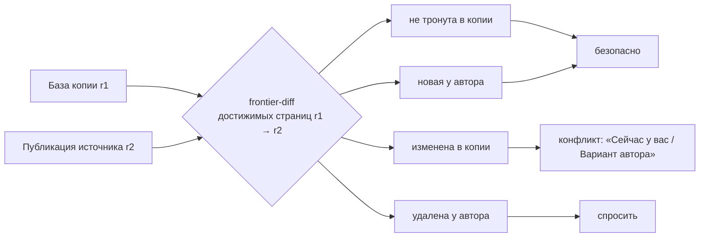

---
artifact:
  id: community-decks-rfc-2026-10
  type: rfc
  title: "RFC: колоды сообщества — доступ, копии, обновления, каталог, поиск и рекомендации"
  status: historical
  created_at: "2026-10-10"
  updated_at: "2026-10-10"
  base_revision: "origin/main 284b4664 (#416)"
  owners: ["project-owner"]
  decision_scope: [visibility-acl, fork-storage, upstream-updates, media-authorization,
                   public-urls, catalog-search, ranking-recommendations, public-profiles]
  evidence_accessed: "2026-10-10"
  reviews: ["independent adversarial architecture review 2026-10-10 (findings reconciled in §19)"]
---

# RFC: колоды сообщества

Статус — **historical**. Владелец ответил на все вопросы 2026-10-10 (§20). Принятые
решения перенесены в [продуктовый контракт](../../product/community-decks.md),
[архитектуру](../../architecture/community-decks.md),
[журнал решений](../../decisions/owner-decisions-2026-08.md#колоды-сообщества-принято-2026-10-10)
и [refinement](../../engineering/community-decks-refinement.md). При расхождении
приоритет у этих документов. RFC опирается на:

- [общий доступ, обновления, ссылки и право](./research-sharing-and-legal.md);
- [ранжирование, рекомендации и поиск](./research-ranking-and-search.md);
- [аудит индексов](./index-audit.md);
- независимое адверсариальное ревью архитектуры (§19).

## 1. Коротко

- **Хранилище к форкам готово, реляционный слой — нет.**
  - Неизменяемые блоки и страничные манифесты
    ([revision storage](../../architecture/revision-storage-and-runtime-boundaries.md))
    позволяют создать копию за O(1): новая колода в том же `reuse_scope_id` и два
    durable pin на корни манифестов источника.
  - Но неизменяемые ревизии материалов, упражнений, целей и их привязки лежат в
    строках, ключённых по **колоде** (`deck_id`). Их цепочки, лимиты и триггеры
    рассчитаны на одну колоду. Ни дешёвое, ни «честное» копирование этих строк
    не проходит без серьёзной переделки (§6.2).
  - Принятый документ задумывал обратное: неизменяемые ревизии общие и
    авторизуются через манифест колоды. Код при реализации личных колод от этого
    отошёл.
- **Рекомендация для фундамента:** перенести неизменяемые строки с «колоды» на
  «линию» (`reuse_scope_id`). У колоды остаются только указатели на головы.
  Копия = O(1) записей + лёгкие указатели, которые пишет job. Обновление = сдвиг
  указателей. Пока пользователей ноль, это механическая миграция. С пользователями
  она стала бы дорогой.
- **Экспоненциальной деградации нет.** История у источника одна, линейная. У копии
  есть база и разреженный список своих решений. Чтение не зависит от числа копий и
  версий. Обновление — O(изменений). Хранилище растёт линейно. Основной его
  потребитель — сама учёба (`study_presentation`, генерации кандидатов), а не
  копии (§15).
- **Ещё блокеры фундамента:**
  - права зашиты как `owner_id = :actor`: около 150 предикатов в 28 файлах;
  - медиа авторизуются только владельцем, и при разделении владельцев проверка
    готовности медиа «молча проходит»;
  - видимость нельзя хранить колонками `deck` (её блокирует `deck_head_guard`);
  - публичный профиль Identity уже открыт без согласия;
  - нет публичных маршрутов и динамического OG.
- **Найдены существующие операционные пробелы, не связанные с фичей:**
  - сборка мусора хранилища (`collectBatch`/`expireStaging`) не вызывается в
    production;
  - у генераций кандидатов Study нет retention;
  - на `media_asset(source_blob_id)` нет индекса.

  Для них предлагаются отдельные задачи (§16).
- **Предложение — четыре эпика:**
  1. Фундамент, доступ и копии.
  2. Обновления копий.
  3. Сообщество и поиск.
  4. Рекомендации и витрины.

  Всё на PostgreSQL, без новых сервисов и ML-стека. Вопросы владельцу — в §17.

## 2. Что уже решено раньше

| Источник | Решение, которое сохраняется |
|---|---|
| [Owner decisions](../../decisions/owner-decisions-2026-08.md#будущие-публичные-колоды-и-collaboration) | Копирование быстрое и с физическим переиспользованием. Прогресс независим. Update preview рядом с highlight diff. Удаление источника не ломает копии. Видимость `PUBLIC` / `LINK/REQUEST_RESTRICTED` / `PRIVATE`. Профиль автора со статистикой. **Нет** выплат авторам и **нет** подписок на update-уведомления. Публичные колоды бесплатны. |
| [Product direction D-05…D-07](../../product/product-direction-v2.md#продуктовые-решения) | Ручной выборочный pull рекомендован. Автотрекинг не выбран. Предложения автору — позже. |
| [Revision storage](../../architecture/revision-storage-and-runtime-boundaries.md#future-pull-and-contribution-semantics) | Трёхстороннее сравнение. Конфликт сохраняет моё. Авто-применение только «inside the user's approved pull», без «hidden background advance». План с устаревшими головами отвергается. |
| [Content platform](../../architecture/content-platform-v2.md#visibility-collaboration-and-publication-review) | Restricted-доступ — это явное разрешение, а не «неугадываемый URL». Счётчики каталога — перестраиваемые агрегаты. |

Пункты, которые RFC предлагает **пересмотреть** (решает владелец):

1. «Fork cannot require eager per-item rows»
   ([revision storage](../../architecture/revision-storage-and-runtime-boundaries.md#physical-candidates-and-selected-choice)).
   Предлагается: «копия создаётся за O(1); указатели голов пишет job; неизменяемые
   строки общие для линии» ([Q13](#17-вопросы-владельцу)).
2. Уровень «по ссылке» рядом с restricted
   ([content platform](../../architecture/content-platform-v2.md#visibility-collaboration-and-publication-review)).
   Это отдельный, явно названный уровень, а не замена restricted
   ([Q1](#17-вопросы-владельцу)).
3. Режим получения обновлений: ручной по умолчанию остаётся. Автоматический —
   только как явная настройка копии ([Q7](#17-вопросы-владельцу)).

## 3. Факты кода и расхождения (main `284b4664`)

| # | Факт | Следствие |
|---|---|---|
| F1 | `deck` хранит `owner_id`, `reuse_scope_id`, `head_revision_id`, `row_version`, `deleted_at`. `deck_head_guard` запрещает UPDATE других колонок, а `row_version` связан FK с `sequence` ревизии (`V3:53-69`, `V17`). | Видимость, публикацию, код ссылки и источник копии нельзя хранить колонками `deck`. Нужны отдельные таблицы `deck_publication` и `deck_fork`. |
| F2 | Хранилище ключуется `reuse_scope_id`. Схема прямо допускает линию из нескольких колод (`V3:5-6`). Сейчас каждая колода получает свой scope (`DeckService.java:64`). `stageBatch`/`retain` умеют пинить существующие корни. | Копия за O(1) возможна. Работа нескольких колод в одном scope в рантайме ещё не проверена. |
| F3 | `item_revision`, `exercise_revision` (`content`/`answer_key` JSONB после V21), `exercise_content_binding`, `objective_revision`, `memory_objective`, heads, `item_preview`, медиа-ссылки ключуются `deck_id`. Действуют ограничения: `deck_sequence ≥ 1`, линейные цепочки, `UNIQUE(deck_id, member_key, deck_revision_id)`, `deck_item_change` ≤100 строк на ревизию (и INNER JOIN при историческом чтении), `deck_exercise_change` PK `(deck_id, deck_revision_id)` — одно упражнение на ревизию. Привязки упражнений закрепляют **неголовные** ревизии материалов. | Копирование «головных строк с сохранением ID» не проходит. Копирование повтором публикаций — сотни синтетических ревизий. Отсюда рекомендация §6. |
| F4 | Около 150 предикатов `owner_id = :actor\|:owner` в 28 файлах. | Единый `DeckAccess` и отдельный read-only путь для чужих колод — большой, но механический рефакторинг. |
| F5 | Медиа: `MediaCatalog.resolve/playback` фильтруют `a.owner_id = actor`. `MediaManifestCatalog` джойнит head-таблицы и `asset.owner_id = owner`. `exercise_media_ready` джойнит `asset.owner_id = ref.owner_id`: при разделении владельцев `bool_and` даёт NULL, а `COALESCE(…, TRUE)` пропускает проверку. Playback требует JWT и подписывает исходный blob с `attachment`. | Нужна модель «доступ через опубликованную ревизию» (§8). Без неё гость не увидит медиа, а проверка готовности ломается тихо. |
| F6 | Identity: `GET /api/accounts/profiles/**` — `permitAll`, отдаёт username, имя и био по UUID. «Non-public» сейчас значит только banned или unknown. `profile_username` необязателен. | Согласие на публичный профиль и шлюз на этом эндпоинте — первая задача эпика 1, до того как любой публичный API покажет `owner_id`. |
| F7 | В шапке три пункта. Меню «⋯», Web Share и копирования ссылок нет. Иконки — встроенные SVG-глифы (`sg-foundations`). Все `/decks/**` закрыты `authGuard`. OG-мета статичны в `index.html`. | Нужны новые компоненты styleguide, публичные маршруты и подстановка OG. |
| F8 | `pg_trgm` опционален (V28). Production — `postgres:18.6-alpine` без явной локали. `unaccent` нет. | Перед индексами по кириллице проверить на prod `show_trgm('Привет')`. |
| F9 | `learning_profile.goal` существует, но в V41 сказано: цель «only changes copy and the recommended tier». | Использовать цель для рекомендаций можно только после явного решения и правки политики ПДн. |
| F10 | Центр уведомлений: свободные kind, ≤200 на владельца. | Хватает для запросов доступа. Рассылка «обновление» всем копиям противоречит решению владельца. |
| F11 | `ImmutableStorage.collectBatch`/`expireStaging` вызываются только из тестов. Локально `storage_gc_candidate ≈ storage_object`. | GC хранилища в production не работает. Это существующий пробел, отдельная задача. |
| F12 | `study_candidate_generation` уникальна по `(deck_id, exercises_root_id)`. Каждое изменение корня упражнений создаёт новую полную генерацию кандидатов. Строки неизменяемы, retention нет. `study_presentation` хранит JSONB на каждую выдачу. | Это главный будущий потребитель места. Он уже касается личных колод, отдельная задача. |
| F13 | Универсального durable-job фреймворка нет, есть отдельные воркеры (генерация, медиа). | Эпики должны заложить общий исполнитель job'ов (lease, retry, progress) или явно переиспользовать паттерн воркеров. |

## 4. Термины

- **Источник** — колода, которую копируют.
- **Копия (форк)** — личная колода с записью `deck_fork`. В интерфейсе: «Добавить к
  себе», «Моя копия».
- **Линия** — источник и все его копии, разделяющие `reuse_scope_id`.
  Неизменяемые объекты и ревизии принадлежат линии, указатели голов — колоде.
- **Публикация** — явный выпуск состояния для зрителей и копий
  (`deck_publication.published_revision_id`). Сохранение в редакторе — ещё не
  публикация.
- **База копии** — ревизия источника, относительно которой считается копия.
  Хранится для колоды целиком, а для отдельных единиц — там, где выборы разошлись.
- **Своя правка** — единица, чья голова в копии отличается от базы по содержимому.
- **Обновление** — план «база → новая публикация» относительно головы копии.
  Применяется одной ревизией.

## 5. Видимость и доступ

### 5.1 Уровни (рекомендация)

| Уровень | Кто видит | В каталоге и профиле | Кто может скопировать |
|---|---|---|---|
| Приватная (по умолчанию) | только владелец | нет | — |
| По ссылке | любой со ссылкой, в том числе гость | нет | любой вошедший |
| По приглашению | владелец и аккаунты с грантом; остальные видят «нет доступа» и кнопку запроса | в профиле — только тем, у кого грант | аккаунты с грантом |
| Публичная | все, в том числе гости | да (при пороге качества, §9.2) | любой вошедший |

### 5.2 Хранение

- `deck_publication(deck_id PK, visibility, published_revision_id, published_at,
  public_code, code_rotated_at, topic_id, content_language, target_language, level,
  tags, release_note, requests_enabled, row_version)`.
  - Метаданные каталога относятся к опубликованному состоянию: их пишет команда
    публикации вместе с `published_revision_id`.
  - Смена видимости не создаёт ревизию колоды и не вызывает 412 у открытого
    редактора.
- `deck_access_grant(deck_id, grantee_id, role, granted_by, granted_at)` с
  `role = VIEWER` сейчас. `EDITOR` зарезервирован под соавторов.
- `deck_invite(invite_id, deck_id, token_hash, max_uses, uses, expires_at,
  revoked_at)` — пригласительные ссылки (§5.4).
- `deck_access_request(deck_id, requester_id, status, created_at, decided_at)`.

### 5.3 Экраны и коды

- Колоды нет, она удалена или приватна у чужого → один экран «Колода не найдена»
  (404).
- «По приглашению» без гранта → «Колода доступна по приглашению» (403):
  - без названия колоды;
  - автор показывается, если у него есть публичный профиль;
  - есть «Запросить доступ».
- Копия есть, а доступ к источнику пропал → копия остаётся. Обновления
  прекращаются, на карточке копии пометка «Источник больше недоступен». Если
  доступ вернулся — обновления возобновляются. **Исключение — юридическое снятие
  (§14):** оно распространяется по линии на копии того же содержимого.

### 5.4 Как дать доступ без раздувания базы и без «оракула логинов»

Ревью показало, что приглашение по логину плохо подходит основным способом:

- логин необязателен;
- эндпоинт поиска по логину раскрывает, существует ли пользователь;
- в списке гостей видны люди без публичного профиля.

Рекомендация:

1. **Пригласительная ссылка** (основной способ для учителя):
   - многоразовая или одноразовая, со сроком действия, отзываемая;
   - открывший её вошедший пользователь получает грант;
   - в базе хранится только хеш токена.
2. **Запрос доступа** с экрана 403:
   - уведомление `DECK_ACCESS_REQUESTED`, агрегированное — одно в день на колоду;
   - при одобрении `DECK_ACCESS_GRANTED`;
   - лимиты: не больше 20 открытых и 5 запросов в день у просителя;
   - отклонение тихое, повторный запрос через 30 дней;
   - открытые запросы истекают через 30 дней;
   - владелец может отключить запросы.
3. **Приглашение по логину** — дополнительно и только для пользователей с
   публичным профилем. Резолв ограничен по частоте, ответ не различает «нет» и
   «скрыт».

### 5.5 Где меняется доступ

Создание колоды остаётся без вопроса о доступе: пустую колоду публиковать нечего.
Доступ меняется в трёх местах:

- **Хаб колоды → «Доступ».** Segmented choice, ссылка с «Копировать», «Сменить
  ссылку», приглашения, запросы.
- **Меню «⋯» → «Доступ…».**
- **Переход в «Публичную».** Показывается чек-лист:
  - описание;
  - тема и язык;
  - порог качества;
  - согласие на публичный профиль;
  - первая публикация.

## 6. Копии и хранение

### 6.1 Что делает копия

- Создаёт новую колоду владельца в том же `reuse_scope_id`.
- Ставит первую ревизию на корни манифестов **опубликованной** ревизии источника:
  два новых durable pin и запись `deck_fork(deck_id, upstream_deck_id,
  base_revision_id, forked_at, auto_update, detached_at)`.
- В копию входят метаданные, материалы, упражнения и ссылки на медиа.
- **Не** входят:
  - прогресс автора;
  - «На потом»;
  - черновики;
  - «Эталон»;
  - сессии Мастерской.

### 6.2 Варианты реляционного слоя

Размеры — оценка по средним строкам локальной БД (с индексами, только головные
строки), ±2×. Пример владельца: 100 материалов и 500 упражнений.

| Вариант | Как устроено | Корректность | Место на копию примера | Цена |
|---|---|---|---|---|
| A. Копировать строки | Повтор публикаций источника в копию через существующие команды, с новыми ID | Проходит все ограничения, но даёт около 500 синтетических ревизий: одно упражнение на ревизию, ≤100 материалов на ревизию. «Нетронутость» требует отдельной таблицы соответствия ID. | ≈2–4 МБ + страницы синтетических ревизий | Низкая по схеме, высокая по времени копии и сложности планировщика |
| A′. Копировать строки с сохранением ID | Импорт головных строк одной «импортной» ревизией | Требует ослабить ограничения F3 и импортировать неголовные ревизии, на которые ссылаются привязки | ≈1,8 МБ | Средняя, но ломает намеренные инварианты |
| **B. Неизменяемые строки линии + указатели колоды** | `item_revision`, `exercise_revision`, привязки, `objective_revision`, `item_preview`, медиа-ссылки ключуются `(reuse_scope_id, revision_id)`. У колоды остаются heads/identity (материал, упражнение, цель) и журнал изменений. | Неголовные ревизии из привязок общие. Конфликт «моя голова R′ / упражнение автора на R» допустим. «Нетронутость» — равенство `revision_id` (откат правки сравнивается по fingerprint содержимого). | ≈0,3–0,5 МБ указателей | Средняя-высокая: миграция ключей, правка SQL около 28 файлов, перенос FK Study на линию. Пользователей ноль — идеальный момент. |
| C. Полный copy-on-write | Разреженные свои правки, всё остальное через манифест базы | Нужен индекс манифеста по ключу материала (сейчас манифест упорядочен по rank, поиск ключа сканирует страницы). Каждое чтение и Study разрешает «моё ∪ база». | ≈5 КБ | Высокая, отдельный эпик |

### 6.3 Рекомендация

1. **B как фундамент эпика 1.**
   - Копия пишется за O(1) синхронно.
   - Указатели голов (около 0,2–0,5 КБ на единицу) пишет job сразу после клика.
     Пользователя переводят в копию со статусом «Готовим колоду…», пока job не
     закончит. Для маленькой колоды это доли секунды.
   - Ленивую материализацию отклоняем: ревью показало, что нужен «держатель строк»
     с транзитивным разрешением и двойной путь чтения, а выгода только на брошенных
     копиях.
   - Путь «чтение по ревизии» (манифест → дескриптор → строки линии по PK)
     остаётся. Он нужен для публичного просмотра опубликованной ревизии и правой
     колонки экрана обновления.
2. **Триггер перехода к C:** колода порядка 10⁴–10⁵ активных копий или указатели
   копий дороже ~15% объёма БД. Тогда, вместе с key-addressed манифестом, в
   отдельном эпике.
3. **Проверить на прототипе до коммита к B:**
   - одна линия на несколько колод в рантайме;
   - GC по общему scope после подключения GC (F11);
   - стоимость миграции FK Study.

## 7. Обновления копий

### 7.1 Явная публикация (рекомендация)

- Автор сохраняет как обычно. Зрители и копии видят только
  `published_revision_id`.
- Хаб подсказывает: «Изменения для учеников не опубликованы (12) — Опубликовать
  обновление». Есть поле «Что нового» до 500 символов.
- Первая публикация происходит при переходе из «Приватной».
- Плюсы:
  - копии не получают полуготовое состояние;
  - обновления группируются в понятные релизы;
  - так же работают Figma и RemNote.
- Альтернатива — [Q6](#17-вопросы-владельцу).

### 7.2 План



- **Единицы:**
  - метаданные колоды;
  - материал;
  - упражнение, включая `enabled`;
  - цель;
  - порядок материалов (`reorder`).
- **Diff.** У страниц случайные id. Неизменённые поддеревья переиспользуются
  path-copy от общего предка, но ординалы сдвигаются после вставок. Поэтому нужен
  новый алгоритм — frontier-diff по множествам достижимых id страниц, а не
  спуск по ординалам. Оценка O(изменений · log N) правдоподобна, но
  подтверждается только реализацией и тестом. Любой «rebuild» манифеста
  перевыпускает все id, и такую операцию нужно запретить для опубликованных
  линий.
- **Замыкание зависимостей.** Новое упражнение тянет свой материал. В варианте B
  упражнение автора может ссылаться на ревизию R материала, даже если у человека
  своя голова R′, потому что неголовные ревизии общие для линии. Валидация
  узлов привязки решает, «безопасно» это или «конфликт».
- **Нужен новый путь публикации:** одна ревизия, которая несёт материалы,
  упражнения, цели и метаданные сразу. Сейчас одно упражнение означает одну
  ревизию. До 100 единиц применение синхронное, больше — job.
- **Базы при частичном применении.** «Пропустить» в v1 нет. Каждая единица плана
  заканчивается одним из трёх состояний:
  - принята;
  - отклонена — записывается `fork_unit_decision` с ревизией автора, до которой
    вопрос решён;
  - остаётся «в ожидании» — у неё своя база, старая.

  База колоды сдвигается, только если ожидающих единиц нет. Так безопасные
  изменения не теряются.
- План фиксирует обе головы. Изменение головы между показом и применением делает
  план недействительным. Применение идемпотентно по command id.

### 7.3 Почему нет «бесконечного цикла версий»

- Линия публикаций автора одна.
- Копия хранит базу и разреженный список своих решений. Отказ не порождает версию
  автора: он записывает, до какой ревизии вопрос решён, и следующая правка той же
  единицы спрашивается снова.
- Состояние копии — O(единиц, которых человек коснулся). Оно не зависит от числа
  версий и копий.
- Копия копии следит только за прямым источником.

### 7.4 Режим получения

**Рекомендация, согласованная с принятыми документами:**

- по умолчанию вручную;
- на карточке копии значок «Есть обновление». Он вычисляется при чтении
  сравнением `base` и `published_revision_id` источника, без рассылки;
- экран обзора с кнопкой «Принять всё безопасное» в одно нажатие;
- конфликты и удаления — только по выбору человека.

**Опционально**, если владелец захочет «как у учителя»: настройка копии «Принимать
безопасное автоматически» (выключена по умолчанию). Это явное согласие, то есть
«approved pull»:

- применяет фоновый job после публикации автора — только для копий с этой
  настройкой и активностью за 30 дней, с троттлингом;
- не выполняется на пути чтения;
- после применения показывается «Что нового» с возможностью вернуть единицу.

Почему не авто по умолчанию: принятые документы запрещают «hidden background
advance», а запись при открытии колоды гонялась бы с редактором и Study. Решение —
[Q7](#17-вопросы-владельцу).

Study: выдача упражнений учитывает актуальные головы, поэтому применение
обновления меняет следующие выдачи текущей сессии. Уже показанная попытка
сохраняет свой снимок. Изменение правильного ответа сохраняет расписание
(решение O-02).

### 7.5 Экран обзора

Ни один из изученных продуктов не показывает ученику визуальный diff.

- Сводка: «+100 материалов, 230 упражнений, 50 исправлений, 2 конфликта,
  3 удалено автором».
- Вкладки: «Новое», «Исправления», «Конфликты», «Удалено автором».
- Каждая строка раскрывается в две колонки, **«Сейчас у вас» | «Вариант автора»**.
  Обе рисует тот же renderer, что Browse.
- Изменённые узлы подсвечены по стабильным node id, внутри текста подсвечены
  слова.
- На mobile вместо колонок — переключатель.
- Слияния частей одного материала в v1 нет.

## 8. Медиа

- **Проекция `published_media(deck_id, revision_id, asset_id, kind)`** пишется
  командой публикации, инкрементально по изменённым единицам. Авторизация
  playback для чужой колоды: доступ к колоде → ассет есть в `published_media`
  опубликованной ревизии, или в головах собственной копии. Это O(1) на запрос,
  без сканирования манифеста.
  - Альтернатива: короткоживущие подписанные media-grant при рендере документа.
- **Медиа-ссылки линии.** `content_media_ref`/`exercise_media_ref` ключуются по
  линии и хранят `asset_owner_id`.
  - Все запросы, которые джойнят `asset.owner_id = ref.owner_id`, переписываются
    в том же PR, включая `exercise_media_ready`, `MediaManifestCatalog` и
    `MediaCatalog`.
  - Нужен тест на fail-closed поведение готовности медиа: иначе `COALESCE(…, TRUE)`
    молча пропустит неготовое медиа.
- **Гости и чужие зрители:**
  - публичный media-эндпоинт без JWT только для «публичных» и «по ссылке», с rate
    limit;
  - не владельцу отдаются только производные варианты (playback/thumbnail) без
    EXIF;
  - исходный blob с `attachment` — только владельцу.
- **Офлайн-манифест** (`media_manifest`, FK на владельца ревизии) для копий
  строится по колоде копии. Холды ассетов автора держатся ссылками линии.
- **Стоковые иллюстрации** (Openverse и Wikimedia: CC BY / BY-SA / иногда NC).
  Атрибуция из provenance показывается в публичном просмотре. NC в публичных
  колодах — [Q32](#17-вопросы-владельцу).

## 9. Сообщество (каталог)

### 9.1 Проекция

`public_deck` — по строке на публичную колоду, только над опубликованной ревизией:

- идентификаторы: `deck_id`, `public_code`, `owner_id`;
- даты: `published_at`, `content_updated_at`;
- метаданные: `title`, `description`, `topic_ids`, `content_language`,
  `target_language`, `level`, `tags`;
- состав: `item_count`, `exercise_count`, `has_audio`/`has_image`/`has_video`,
  `mechanics`;
- поиск: `search_ru`/`search_simple` (STORED tsvector), `title_norm`;
- модерация: `rank_penalty`, `hidden_by_moderation`.

Обновление:

- Команда публикации пишет только строку-заявку (outbox).
- Агрегаты состава считает job, инкрементально по `published_media` и изменённым
  единицам. В транзакции публикации их не пересчитываем: это O(N) против
  ограниченных транзакций и таймаута.
- Счётчики пересчитывает отдельный job (§11).

### 9.2 Порог попадания в общий список

Рекомендация: не меньше 10 материалов, хотя бы одно упражнение, обязательное
описание. Колода ниже порога видна в профиле и по ссылке.

### 9.3 Карточка и публичный просмотр

- **Карточка:**
  - название, 2 строки описания, тема и язык;
  - автор: аватар 20 px и `@username`, ведёт в профиль;
  - «120 материалов · 480 упражнений», значки медиа;
  - «Добавили 1,2 тыс.» и «Учат сейчас 128» — обе цифры показываются от 10 и с
    округлением;
  - «Обновлена 3 дня назад»;
  - меню «⋯»: «Поделиться», «Пожаловаться».
- **Публичный просмотр `/d/{code}`:**
  - read-only хаб и renderer;
  - вкладки «Материалы» и «Упражнения» с превью;
  - главная кнопка «Добавить к себе» или «Открыть мою копию»;
  - «Поделиться»;
  - без «Учить», «Изменить» и Мастерской.

### 9.4 Профиль автора `/u/{username}`

- Аватар, имя, `@username`, био (только при согласии).
- Публичные колоды. Зрителю с грантом — ещё колоды «по приглашению» с меткой
  «доступна вам».
- Сумма «учат сейчас».
- Друзей и подписок нет.
- В своём профиле — «Как меня видят другие».

### 9.5 Холодный старт контента

Пустая витрина хуже её отсутствия (урок Memrise). Рекомендация:

- до открытия раздела подготовить 10–20 стартовых колод от аккаунта «Мнема»;
- пустые «Мои колоды» предлагают «Начать с колоды сообщества».

## 10. Ссылки и превью

- **Адрес колоды `/d/{code}/{slug}`:**
  - `code` — 10 символов base58, случайный, не производный от UUID;
  - `slug` — транслит, вычисляется при рендере;
  - неверный slug → 301 и self-canonical;
  - переименование и одинаковые названия ничего не ломают.
- **«По ссылке» и «по приглашению»:**
  - адрес без slug, `noindex`;
  - **обобщённое OG-превью** без названия;
  - код меняется при каждом понижении видимости («Сменить ссылку»), чтобы старые
    утёкшие ссылки не оживали.
- **Профиль `/u/{username}`.** Смена логина ломает старую ссылку на профиль, но не
  ссылки на колоды.
- **OG без SSR.** Caddy или nginx отдаёт для `/d/*` и `/u/*` тот же `index.html` с
  подставленными `title`, `description`, `og:*`, `canonical`, `robots` из публичного
  эндпоинта Learning с коротким кэшем. `sitemap.xml` строится из `public_deck`.
  Angular SSR — отдельно, если SEO станет каналом.
- **«Поделиться».**
  - Через меню «⋯» во всех списках, в хабе и публичном просмотре.
  - На mobile — Web Share (`title` + `url`), на desktop — копирование ссылки и тост.
  - Готового текста нет: язык получателя неизвестен.

## 11. Ранжирование, метрики и рекомендации

### 11.1 Метрики

| Метрика | Определение | Где |
|---|---|---|
| Добавили | различные аккаунты кроме автора, сделавшие **прямую** копию, за всё время | карточка (от 10), ранг |
| Учат сейчас | различные аккаунты кроме автора с завершённой SCHEDULED-сессией в прямой копии за 30 дней | карточка (от 10), ранг |
| Активированные | копии с занятиями в ≥3 разных дня | ранг |
| Возвращаются | доля учеников со второй неделей занятий | скрыто, для качества в ранге |
| Обновлена | `published_at` | карточка, свежесть |

`deck_engagement(deck_id, account_id, kind, first_at, last_at, study_days)`
пополняется инкрементально. Job читает `study_session` по существующему индексу
`study_session_reporting_complete(completed_at)` и сопоставляет колоды через
`deck_fork`. Звёзд и лайков в v1 нет: копия честнее и дешевле. Позже можно
вернуться к «Сохранить» ([Q27](#17-вопросы-владельцу)).

### 11.2 Базовый ранг (job раз в час, поколения)

```
c_u   = trust_u × (fork30_u + 2·activated30_u) × 2^(−дней_с_события/14)
S     = Σ_u c_u      (различные не-авторы)
Q     = (activated + 10·0.25) / (forks + 10)
fresh = 0.6 + 0.4 · 2^(−дней_с_значимой_публикации/120)
score = ln(1+S) × (0.5+Q) × fresh × rank_penalty
```

Защита от накруток:
- считаются различные люди;
- автор исключён;
- вес 0,25 для аккаунтов моложе 3 дней или без подтверждённой почты;
- `ln` гасит сотню ботов до +4,6;
- точный score скрыт;
- ночной запрос аномалий (больше 70% копий от аккаунтов младше 48 часов) → флаг в
  кабинет владельца.

Снимки ранга идут поколениями `deck_rank(generation, …)`. Предыдущее поколение
живёт 24 часа, чтобы курсоры не ломались. Константы — стартовые эвристики.

### 11.3 Персонализация без ML

- **Профиль интересов** `user_topic_interest(account_id, topic_id, weight)`, до
  20 строк. Сигналы с убыванием веса:
  - чипы «Что хотите изучать?» при первом входе в Сообщество (явный выбор);
  - темы своих копий;
  - занятия в копиях;
  - открытия колод в каталоге;
  - ответ «Для чего вам Mnema?» — только после явного решения и правки политики
    (F9).
- Приватные колоды в ИИ не отправляются.
- **Кандидаты → ранжирование → переранжирование:**
  - кандидаты: топ-N по трём темам + новые + глобальный топ, около 100;
  - ранжирование: `score × (1 + 0.8·интерес) × (язык ? 1 : 0.3)`;
  - не больше двух колод одного автора или темы в первых 10;
  - без уже добавленных;
  - 2 из 12 мест — исследование.
- **Объяснение:** «Потому что вы учите испанский». Профиль виден и сбрасывается.
- **Позже**, от ~2–5 тыс. активных: «Добавившие X добавили и Y» (ночная
  ко-встречаемость). Ещё позже — pgvector.

### 11.4 Данные сейчас

- `catalog_event`:
  - ключ и контекст: `uuidv7`, `account_id` или гость, `deck_id`, `revision_id`;
  - `kind`: `DETAIL_VIEW` / `FORK` / `STUDY_START` / `DROP` / `SEARCH_CLICK`;
  - атрибуция: `surface`, `position`, `rank_version`.
- Показы — агрегатами по дням.
- Сырые события — 13 месяцев.
- Нужен пункт в политике ПДн.

## 12. Поиск

- **Где:** PostgreSQL 18 по `public_deck`.
- **Два STORED-вектора:**
  - `russian` с весами A название / B описание / C теги;
  - `simple + unaccent` для латиниц.
- **Опечатки:** `pg_trgm` GIN по `title_norm`.
- **Синонимы:** `topic_alias` для «испанский / spanish / español».
- **Релевантность:** `0.6·ts_rank_cd(…, 1|32) + 0.2·word_similarity +
  0.2·процентиль ранга` с понижением при несовпадении языка.
- **Пагинация:**
  - кандидаты — топ-200;
  - курсор `(score, deck_id, generation)`, стабилен в рамках поколения;
  - каталог — `(generation, rank)`.
- **Запуск:** по Enter или книге. Ограничение длины, rate limit для гостей.
- **Предусловия:**
  - проверить `show_trgm('Привет')` на prod;
  - создать `unaccent` и конфигурацию (суперпользователь, `init-database.sh`).
- **Выход из Postgres:** больше ~100k публичных колод, p95 больше 200 мс или нужен
  поиск по мере ввода с морфологией и CJK. Тогда Manticore или Meilisearch.

## 13. Интерфейс

- **Шапка:** «Мои колоды · Сообщество · Новая колода · Профиль». Гостям тоже
  показываем «Сообщество».
- **Страница «Сообщество»:**
  - книга поиска, чипы фильтров;
  - полки «Для вас», «Выбор Мнемы» (редакционная, из кабинета владельца), «Учат
    сейчас», «Новое», темы;
  - плитки выдачи через общий auto-load с `mn-ink-in` и лёгким каскадом;
  - reduced-motion — без каскада.
- **Книга поиска:**
  - разметка — `<search>`, `<form role="search">`, `<input type="search">` с
    подписью;
  - на странице Сообщества книга раскрыта сразу (раскрытие проигрывается один
    раз);
  - закрытая книга с лупой стоит в шапке как вход в поиск (`aria-expanded`);
  - Enter или клик по книге ищет.
  - Решение — [Q20](#17-вопросы-владельцу).
- **Typewriter:**
  - слой поверх пустого поля с `aria-hidden`;
  - останавливается при фокусе и вводе, Tab ничего не дописывает;
  - reduced-motion — одна статичная подсказка;
  - пул из 50 идей:

  > испанский с нуля · английский B2 · хирагана и катакана · таблица Менделеева ·
  > анатомия костей · SQL для собеседований · столицы мира · ПДД · история России
  > XX века · интегралы · немецкие артикли · основы Python · латинские названия
  > растений · фармакология · стихи Пушкина · аккорды для гитары · фразовые глаголы ·
  > ОГЭ по математике · ЕГЭ по химии · IELTS Writing · корейский хангыль · иероглифы
  > HSK 1 · французские глаголы · алгоритмы и структуры данных · основы бухучёта ·
  > термины права · микроэкономика · мышцы человека · латынь для медиков · созвездия ·
  > флаги стран · даты Второй мировой · команды Git · команды Linux · формулы физики ·
  > теоремы геометрии · нотная грамота · художники и картины · винные регионы ·
  > кулинарные термины · итальянский для путешествий · турецкий для начинающих ·
  > арабский алфавит · грузинский алфавит · эсперанто · Kubernetes · паттерны
  > проектирования · английский для IT · медицинский английский · биология клетки

- **Фильтры:**
  - Тема;
  - Что учим;
  - Уровень;
  - Размер: «на вечер» (<50), «на месяц» (50–300), «большой курс» (300+);
  - Внутри: аудио, картинки, видео;
  - Упражнения: «на слух», «сопоставление», «письменный ответ», «выбор варианта»,
    «по порядку»;
  - «Живая» — обновлялась за месяц.
- **Сортировка:** Для вас / Популярные / Учат сейчас / Новые / Обновлённые.
- **В styleguide до экранов:**
  - меню «⋯» (APG menu button);
  - карточка публичной колоды;
  - чип автора;
  - панель доступа;
  - колонки diff;
  - глифы (inline SVG, `currentColor`, штрих 1,5–1,75): книга-поиск (закрытая и
    раскрытая), поделиться, копия-ветвь, замок, цепь, свиток с печатью,
    колоннада.
- **Позже:** «Новая колода» из шапки можно перенести в «Мои колоды» как главную
  кнопку.

## 14. Безопасность, ПДн и правила

- **ACL:**
  - `DeckAccess` в начале каждого чтения;
  - мутации чужих колод запрещены SQL-предикатом владельца;
  - публичные эндпоинты с rate limit;
  - 404/403 по §5.3.
- **Контент.** Renderer не исполняет пользовательский код. Ссылки в публичном
  контенте получают `rel="ugc nofollow"`.
- **152-ФЗ ст. 10.1:**
  - отдельное согласие на публичный профиль: не предотмечено, по полям, снимаемое,
    с журналом;
  - **шлюз на `GET /profiles/**` ставится первым** (F6);
  - без согласия публичной колоды нет (рекомендация) или показывается «автор
    скрыт» ([Q17](#17-вопросы-владельцу));
  - текст согласия — юристу.
- **Правила и жалобы** до первой публичной колоды:
  - кнопка «Пожаловаться» на колоде и профиле;
  - правила со сроком рассмотрения не больше 30 дней;
  - журнал снятий;
  - скрытие в кабинете владельца;
  - пункт соглашения о разрешении просмотра и копирования внутри Mnema;
  - без комментариев и сообщений.
- **Юридическое снятие.** Действует по линии: скрывает содержимое в источнике и в
  копиях, где оно не изменено, через `deck_fork` и общие ревизии линии. Это
  исключение из «копии навсегда».
- **Удаление аккаунта автора:**
  - публичные колоды уходят из каталога;
  - копии остаются, автор отображается как «аккаунт удалён»;
  - ревизии линии, на которые ссылаются копии, не удаляются: они уже
    принадлежат копиям;
  - персональные данные автора не входят в содержимое колоды. Путь purge в
    Learning пока не построен ([MattoYuzuru/Mnema#409](https://github.com/MattoYuzuru/Mnema/issues/409)), и эпики должны учесть его вместе с этим
    правилом.
- **Выкачивание каталога:** лимиты для гостей, без стены входа на старте.

## 15. Ёмкость

| Что растёт | Порядок | Комментарий |
|---|---|---|
| Указатели копий (вариант B) | ≈0,3–0,5 МБ на копию колоды «100 + 500» | 10k копий ≈ 3–5 ГБ |
| Учёба (уже сейчас) | `study_presentation` JSONB на выдачу + новая генерация кандидатов на каждое изменение упражнений | За месяц занятий одного ученика плюс-минус сопоставимо с копией. Нужен retention (F12) |
| Каталог | `public_deck` ≈ число публичных колод (10³–10⁵) | Тривиально для PG |
| События | ≈ просмотры и копии; показы — агрегатами | 13 месяцев, потом агрегаты |

Все числа — оценки, не замеры production.

### 15.1 Индексы

Статический аудит ([index-audit.md](./index-audit.md)):

- избыточных префиксных индексов нет;
- 27 FK без индекса по ведущей колонке почти все указывают на неизменяемых или
  неудаляемых родителей;
- реальная находка — `media_asset(source_blob_id)`;
- неиспользуемые индексы можно определить только по статистике production.

Новые индексы фичи (каждый — вместе с запросом и EXPLAIN в PR):

- поиск: GIN `search_ru`, `search_simple`, `title_norm gin_trgm_ops`;
- ранг: `deck_rank(generation, rank)`,
  `(generation, topic_id, score DESC, deck_id DESC)`;
- профиль: `public_deck(owner_id, published_at DESC)`;
- копии:
  - `deck_fork(upstream_deck_id)`;
  - уникальный `deck_fork(owner, upstream)` для живых копий;
- доступ: `deck_access_grant(grantee_id)`, `deck_invite(token_hash)`;
- медиа и метрики: `published_media(deck_id, revision_id, asset_id)` как PK,
  `deck_engagement(account_id)`;
- линия (вариант B): PK `(reuse_scope_id, revision_id)` неизменяемых таблиц и
  `(reuse_scope_id, member_key, item_sequence)` для истории.

## 16. Эпики (черновик) и отдельные задачи

| Эпик | Содержание | Зависит от |
|---|---|---|
| 1. Фундамент, доступ и копии | (а) согласие и шлюз публичного профиля в Identity; (б) неизменяемые строки линии (вариант B) + прототип одной линии на несколько колод; (в) `DeckAccess` и read-only путь, чтение по ревизии; (г) `deck_publication` и явная публикация; (д) `published_media` и медиа для чужих и гостей; (е) копия (O(1) + job); (ж) публичный просмотр, меню «⋯», «Поделиться», 404/403, приглашения и запросы; (з) OG-подстановка; (и) юридический минимум и скрытие в кабинете; (к) общий исполнитель job'ов | отдельные задачи 1–2 |
| 2. Обновления копий | frontier-diff, комбинированная публикация, план и решения по единицам, экран обзора с визуальным diff, «Принять всё безопасное», опциональный авто-режим, отвязка, «источник недоступен» | 1 |
| 3. Сообщество и поиск | темы, синонимы, язык, `public_deck` + job агрегатов, FTS + trgm, страница Сообщества, профили, «Выбор Мнемы», метрики, ранг v1, sitemap | 1 (параллельно со 2) |
| 4. Рекомендации и витрины | события и агрегаты, профиль интересов, «Для вас», explore, антинакрутка, позже ко-встречаемость | 3 |

Каждый эпик режется на задачи по 1–3 дня по
[work item standard](../../engineering/work-item-standard.md).

Отдельные задачи, не зависящие от фичи:

1. Подключить GC хранилища в production (F11). Это предусловие варианта B.
2. Retention для `study_candidate_generation`/`study_presentation` (F12).
3. Индекс `media_asset(source_blob_id)` ([аудит](./index-audit.md)).
4. С разрешения владельца — read-only статистика индексов с production.

## 17. Вопросы владельцу

Варианты перечислены от рекомендуемого. Те же вопросы заданы интерактивной формой
в сессии. Ответы записываются сюда и в журнал решений.

1. **Уровни доступа:** 4 (приватная / по ссылке / по приглашению / публичная) ·
   3 без «по ссылке» · 2.
2. **Где выбирать доступ:** панель в хабе и «⋯», при создании не спрашиваем ·
   список при создании + хаб.
3. **«Запросить доступ»:** да (1 таблица + 2 уведомления, лимиты) · только экран.
4. **Как приглашать:** пригласительная ссылка + запрос доступа, логин — только для
   публичных профилей · только логины.
5. **Гости:** видят «публичные» и «по ссылке», для копии нужен вход · только
   вошедшие.
6. **Публикация обновлений:** явная кнопка + «Что нового» · каждое сохранение
   видно сразу.
7. **Получение обновлений:** вручную + «Принять всё безопасное», опциональная
   авто-настройка копии · всё вручную без авто · авто по умолчанию (нужен пересмотр
   принятых решений).
8. **Удаления автором:** никогда автоматически · как остальное.
9. **Единица решения:** материал или упражнение + групповые кнопки · всё или
   ничего · сразу слияние частей.
10. **Копии при смене доступа:** остаются, обновления останавливаются и
    возобновляются, кроме юридического снятия; есть «Отвязать» · иначе.
11. **Повторное добавление:** одна копия на чужой источник → «Открыть мою копию»,
    копия копии разрешена · несколько копий.
12. **Состав копии:** без прогресса, «На потом», черновиков, «Эталона», Мастерской ·
    иначе.
13. **Хранение (ADR):** B — общие неизменяемые строки линии сейчас · A —
    копирование повтором публикаций · C — сразу полный copy-on-write.
14. **Что видит автор:** только агрегаты · список логинов.
15. **Ссылки:** `/d/{code}/{slug}` с 301, slug только у публичных, код меняется при
    понижении · только код · `/@author/slug`.
16. **Профиль:** `/u/{username}`, логин обязателен для публикации · `/@username`.
17. **Согласие 152-ФЗ:** без согласия публичной колоды нет · «автор скрыт».
18. **Юридический минимум до первой публичной колоды** · позже.
19. **Раздел:** «Сообщество», видно гостям · «Каталог» · «Библиотека».
20. **Книга поиска:** раскрыта на странице, закрытая в шапке · закрытая на
    странице.
21. **Запуск поиска:** Enter или книга · живой поиск.
22. **Typewriter:** 50 идей, пассивно, reduced-motion статично · без него.
23. **Фильтры и сортировки v1:** набор §13 · уже · шире.
24. **Метаданные публикации:** тема из справочника + авто-язык + уровень и теги по
    желанию · только теги · ИИ-классификация.
25. **Порог каталога:** ≥10 материалов, ≥1 упражнение, описание · без порога.
26. **Цифры карточки:** добавили / учат сейчас (от 10) / обновлена / состав · +
    звёзды.
27. **Звёзды:** не в v1 · сразу.
28. **Персонализация v1:** чипы интересов + темы копий + активность, цель
    «Для чего вам Mnema?» только после правки политики · только популярность ·
    сразу коллаборативная.
29. **Сбор событий:** да, 13 месяцев, видимый и сбрасываемый профиль · минимум.
30. **Полки:** «Выбор Мнемы» + популярное + новое + темы, промо позже · промо сразу.
31. **Стартовый контент:** 10–20 колод от «Мнемы» до открытия раздела · без посева.
32. **Стоковые медиа:** атрибуция, NC не допускать в публичные · только атрибуция.
33. **Уведомления:** значок «Есть обновление» при чтении, без рассылок · рассылка
    каждой копии (противоречит решению владельца об update-уведомлениях).
34. **Выкачивание:** лимиты для гостей · стена входа после N поисков.
35. **Индексы:** разрешить read-only статистику prod + индекс
    `media_asset(source_blob_id)` · только статический аудит.
36. **Удаление аккаунта автора:** колоды из каталога, копии остаются · иначе.
37. **Эпики:** 4 (§16) · 3.
38. **Отдельные задачи** (GC хранилища, retention Study, индекс): завести сейчас,
    вне эпиков · включить в эпик 1.

## 18. Источники

- Внешние — в двух исследованиях.
- Внутренние: миграции `V2`, `V3`, `V4`, `V6`, `V7`, `V8`, `V10`, `V14`, `V17`,
  `V21`, `V24`, `V41` и классы `DeckService`, `ItemRepository`, `ItemService`,
  `ExerciseService`, `ExerciseRepository`, `StudySessionRepository`, `MediaCatalog`,
  `MediaManifestCatalog`, `MediaPlaybackController`, `ImmutableStorage`,
  `CountedPages` в `backend/services/learning`.
- Identity: `SecurityConfiguration.java` и
  [guide](../../../backend/services/identity-account/guide.md).
- Фронтенд: `app-shell.component.html`, `sg-foundations.component.html`,
  `app.routes.ts`.

## 19. Независимое ревью и что изменилось

Адверсариальное ревью (2026-10-10, статический анализ кода и схемы) нашло 3 блокера
и 8 серьёзных замечаний.

| Замечание ревью | Изменение RFC |
|---|---|
| Копирование головных строк с сохранением ID нарушает ограничения схемы | §6: рекомендация сменилась с «ленивого A» на B; A и A′ описаны как альтернативы с ценой |
| Видимость нельзя хранить в `deck` | §5.2: `deck_publication`, `deck_fork` |
| Профиль Identity открыт без согласия | F6, §14: шлюз — первая задача |
| Медиа: fail-open готовности, owner-join, JWT, исходник с EXIF, O(N) проверка | §8: `published_media`, fail-closed тест, производные варианты |
| Планировщик: случайные id страниц, одно упражнение на ревизию, частичное применение, зависимости | §7.2: frontier-diff, комбинированная публикация, базы по единицам |
| Авто по умолчанию противоречит принятым решениям | §7.4: вручную по умолчанию, авто — явная настройка |
| Ёмкость: учёба дороже копий, A→B не механика | §15, F12, отдельная задача retention |
| Ленивая материализация требует «держателя строк» | §6.3: отклонена |
| GC хранилища не вызывается в production | F11, отдельная задача 1 |
| Проекция каталога в транзакции публикации | §9.1: outbox + job |
| Логины: оракул, необязательность, роли | §5.4: пригласительные ссылки, `role` в гранте |
| Код ссылки, OG для «по ссылке», счётчики | §10, §11.1 |

## 20. Ответы владельца (2026-10-10)

- Приняты рекомендованные варианты всех вопросов §17, **кроме Q31**: стартовые
  колоды от Mnema не готовятся.
- По Q28 цель «Для чего вам Mnema?» используется только после правки политики
  ПДн.
- Замечания владельца:
  - каждое архитектурное решение проверяется при нулевой нагрузке и при большом
    MAU;
  - интерфейс переиспользует и расширяет styleguide;
  - используются существующие бесконечная подгрузка, выпадающие списки, флажки и
    другие компоненты Mnema.
- Эпики и задачи:
  [MattoYuzuru/Mnema#419](https://github.com/MattoYuzuru/Mnema/issues/419)–[MattoYuzuru/Mnema#462](https://github.com/MattoYuzuru/Mnema/issues/462).
