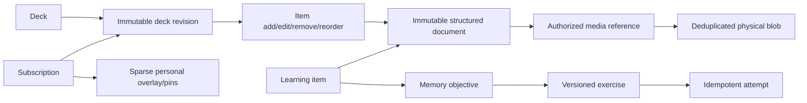

---
artifact:
  id: project-review-2026-08
  type: decision-review
  title: "Mnema technical and product review"
  status: proposed
  created_at: "2026-08-15"
  updated_at: "2026-08-30"
  owners: ["project-owner"]
  evidence_revision: "8e0c83d"
  review_scope: [architecture, data, scale, frontend, ux, product, monetization, documentation, delivery]
---

# Mnema technical and product review

## Outcome

> **Owner resolution update (2026-08-30):** this review's evidence remains valid, but the replacement is now explicitly greenfield: no `/v2` coexistence, compatibility layer, retained legacy snapshot or old visual identity. Downtime is acceptable, Identity and User consolidate, and AI follows the manual learning MVP.

**Mnema стоит превращать в hosted startup, но не масштабировать текущую модель.** Spring, Java, PostgreSQL and Angular are not the core problem. The current content/version/subscription model, unsafe release details and configuration-heavy UX are.

The proposed v2 is:

- a rich structured `LearningItem`, not front/back fields or arbitrary templates;
- multiple versioned exercises over one item and explicit memory objectives;
- immutable deck/item revisions, change sets, shared content and sparse personal state;
- PostgreSQL + JSONB + object storage, not MongoDB or literal Git;
- deck-scoped Browse/Study, not a cross-deck Today queue;
- managed AI later in the Russian hosted product, with a manual learning MVP first;
- a unified Identity & Account deployable plus modular Learning API and only justified workers;
- a fresh account-only production cutover with no retained legacy snapshot or rollback after deletion.

The owner decisions are recorded in [owner-decisions-2026-08](../decisions/owner-decisions-2026-08.md). This review is the executive sequence; linked designs contain the contracts.

## Confirmed critical findings

| Priority | Fact | Consequence |
|---|---|---|
| P0 | A global card edit builds a complete next deck snapshot ([CardService.java](../../backend/services/core/src/main/java/app/mnema/core/deck/service/CardService.java#L1054)) | incremental creation of `N` cards produces `N(N+1)/2` public-card rows |
| P0 | Subscribe/fork eagerly creates a user-card row per source card ([DeckService.java](../../backend/services/core/src/main/java/app/mnema/core/deck/service/DeckService.java#L630)) | subscribers × cards storage before study |
| P0 | Some reads select latest card by card ID instead of pinned deck revision ([DeckCardViewAdapter.java](../../backend/services/core/src/main/java/app/mnema/core/deck/adapter/DeckCardViewAdapter.java#L103)) | browse/review can violate update semantics |
| P0 | A stale update session can mutate a published target revision ([CardService.java](../../backend/services/core/src/main/java/app/mnema/core/deck/service/CardService.java#L1512)) | history is not truly immutable |
| P0 | Production serves unhashed JS/CSS with one-year immutable cache ([nginx.conf](../../frontend/nginx.conf#L50)) | returning users can be stuck on an obsolete frontend |
| P0 | Main delivery can cancel a partial multi-target deployment | clusters/services can run different releases |
| P0 | Repository production PostgreSQL is one 15 Gi PVC without a proven backup/restore runbook ([postgres.yaml](../../k8s/postgres.yaml#L45)) | storage and recovery boundaries are unsafe |
| P1 | Review submission has no client event idempotency contract | retries/first-state concurrency can duplicate outcomes |
| P1 | Import processing does not reclaim every stale `processing` job | jobs can remain stuck after failure |
| P1 | User statistics in browser storage are not consistently identity-scoped | account switching can expose stale local state |
| P1 | All route components are eager; live `main.js` is about 1.66 MiB raw | unnecessary initial transfer and parse work |
| P1 | Mobile drawer contains focusable descendants while hidden from accessibility tree | keyboard/screen-reader interaction is broken |

## Current capacity cliff

Current deck snapshots grow as:

```text
rows = N × (N + 1) / 2
```

At an illustrative 2–5 KiB heap/index cost per copied public-card row:

| Cards added incrementally | Snapshot rows | Illustrative size |
|---:|---:|---:|
| 1,000 | 500,500 | 0.9–2.3 GiB |
| 3,000 | 4,501,500 | 8.4–21.0 GiB |
| 10,000 | 50,005,000 | 93–233 GiB |

This is not a benchmark, but it is enough to reject the model. V2 stores a whole snapshot only for one bounded item document; deck revisions store changes and a rebuildable current projection.

The v2 scenario model estimates only ~3/37/444 peak API RPS at 1k/10k/100k MAU, but review history can reach ~5–9 GiB / 69–118 GiB / 0.9–1.5 TiB primary data per year, and retained media ~20 GB / 0.5 TB / 10 TB before safety overhead. At real scale storage/retention/media dominate ordinary API RPS. Full assumptions and scale triggers are in [reset/capacity/offline plan](../operations/v2-reset-capacity-and-offline-plan.md).

## Target content and data model



Core invariants:

1. Published deck/item/exercise revisions never mutate.
2. Subscribe creates a pointer, not N user rows.
3. Fork creates a new deck identity but reuses immutable content until changed.
4. Personal additions/notes/hides/pins exist only when changed.
5. Content is a typed, versioned JSON document; Markdown and Anki are adapters.
6. Native renderer executes no user JavaScript or arbitrary CSS.
7. An exercise references a pinned item revision and stable node IDs.
8. Attempts use client IDs, store exact runtime/evaluator versions and update study state transactionally.
9. Physical media dedup never bypasses logical authorization.
10. Unknown document nodes remain preserved with visible fallback.

Details: [content platform](../architecture/content-platform-v2.md), [native content format](../architecture/learning-content-format-v2.md), [exercise catalog](../product/exercise-catalog-v2.md).

## Technology decision

- **Java 21 / Spring Boot 3.5:** keep. A full Kotlin rewrite or Boot 4 migration adds unrelated risk.
- **PostgreSQL:** keep and align environments on PostgreSQL 18 after compatibility testing. JSONB covers bounded rich documents; relational constraints cover ACL, revisions, attempts, billing and jobs.
- **Angular:** keep, then upgrade sequentially from unsupported Angular 18 to a supported current line with tests per major. Performance issues are largely route/loading/state/rendering choices.
- **Object storage:** Yandex Object Storage production, MinIO contract tests/local development.
- **Redis:** cache/rate limiting only, not durable workflow truth.
- **Queue:** PostgreSQL lease/heartbeat/reclaim first; Kafka only after measured queue-age/DB triggers.
- **Literal Git, MongoDB, Elasticsearch, sharding:** reject at launch; each has an explicit future trigger.

Initial deployment should be a modular Spring API for identity/content/library/study/billing plus separate AI/import/media workers. This is not permission to recreate `CardService` as one larger class: enforce application-command and module boundaries, then split a process only for measured resource, failure or security isolation.

## Product direction

Hosted Mnema should promise efficient learning of the user's material through appropriate exercises and visible progress. It should not expose templates, fields, provider/model, algorithm weights or version graphs before first value.

The launch has two accessible cohorts — language learners and university/exam learners — sharing one P0 loop but using different acquisition messages. Study is always launched inside one deck. Browse is distinct and does not update progress.

P0 exercises: reveal/self-rating, typed, cloze, single and multiple choice. P1: matching, ordering, listening dictation, multi-value recall and image occlusion/labeling. Open-ended AI grading and code/speech/tutor modes wait for evidence.

Hosted AI is managed and provider-agnostic. Manual learning remains free. The accepted offer is Free, a one-time 14-day no-card trial and Starter `299 ₽/30 days`; Plus is deferred. P95 variable cost must remain ≤20–25% of realized revenue. Direct DeepSeek is the primary eval candidate, Yandex AI is excluded, and production requires a non-Yandex fallback plus privacy/cross-border gates. Facts and assumptions are in [launch economics](../product/russia-launch-economics-2026.md) and the [legal/payment checklist](../product/russia-legal-launch-checklist-2026.md).

T‑Bank recurring acquiring requires IP/legal entity; a self-employed physical person alone is not sufficient. IP+NPD can bridge launch but the 2.4m ₽ annual NPD limit is roughly 669 average subscribers at 299 ₽/30 days before other NPD income. Legal, fiscal and privacy review is a launch gate.

## Frontend direction

Keep Angular, but replace the UI completely. Liquid Glass and the current broad visual identity are not constraints. Epic #74 will receive separate owner design input; until then, use a minimal accessible semantic HTML/CSS baseline, preserve no v1 component boundary for compatibility, and keep the Angular upgrade separate from product-surface work. Performance/a11y evidence remains in the [superseded frontend direction audit](../frontend/experience-audit-2026-08.md).

## Migration decision

Preserve only allowlisted long-lived account/identity/profile fields and account-owned avatar assets. Delete sessions/authorizations plus all learning content, media, reviews, imports and AI data. The canonical product is replaced directly: no `/v2`, dual writes, transformer or compatibility runtime.

The point of no return covers the live legacy database/PVC, snapshots/PITR/WAL, object versions, multipart uploads and caches. No full legacy snapshot is created or retained. After deletion begins, v1 rollback is impossible by accepted owner decision; only account-only recovery and roll-forward remain. The exact operational contract is in the [operations plan](../operations/v2-reset-capacity-and-offline-plan.md).

## Sequenced roadmap

### Gate 0 — decisions and safety

- accept native content/exercise architecture;
- inspect/export production accounts and rehearse restore;
- decide irreversible data-destruction envelope;
- fix frontend immutable cache and non-cancellable complete releases;
- establish PostgreSQL/MinIO E2E and backup/restore evidence;
- run editor/renderer spike before selecting a dependency.

### Slice 1 — greenfield foundation

- fresh runtime/migration baseline and unified Identity & Account boundary;
- canonical unversioned routes, UUID/CAS/idempotency contracts and delivery topology;
- account-only transfer/reconciliation and no-snapshot cutover tooling;
- no editor, exercise, media or AI implementation hidden in foundation.

### Slice 2 — useful product loop

- full editor + quick text/voice draft;
- deck-scoped Browse/Study and P0 exercises;
- deterministic evaluation and scheduler objective state;
- two concierge cohorts with activation/retention instrumentation.

### Slice 3 — differentiation and payment

- safe deck update/conflict flow, collaboration review and profiles;
- P1 exercises;
- T‑Bank recurring pilot at 299 ₽ and quota validation;
- production load/fault tests at 2× expected launch traffic.

### Slice 4 — cutover

- maintenance, final account export/import and reconciliation;
- synthetic end-to-end smoke while writes remain closed;
- traffic cutover, replacement monitoring and explicit point of no return;
- deletion of all legacy content/media/database/backup artifacts with no retained snapshot;
- only then expand acquisition and P2 exercises.

## Do not do

- Do not preserve templates/fields/language pairs in the native model “for flexibility”.
- Do not store canonical content as two Markdown documents.
- Do not execute user JS/MDX or arbitrary CSS.
- Do not add MongoDB because JSON is flexible.
- Do not build literal Git/JGit or expose Git terminology.
- Do not rewrite the entire backend in Kotlin or migrate frontend frameworks.
- Do not promise APKG round-trip, unlimited AI or all 30 exercise types.
- Do not retain current self-host as a v2 launch blocker.
- Do not delete production data before an isolated account restore and explicit target manifest.
- Do not change `LICENSE` without ownership/contributor/legal review; Apache rights already granted remain granted.

Resolution update (2026-08-30): the owner accepted a prospective
personal-use source-available license and fixed `v1-apache-final` as the last
Apache revision. Historical Apache grants remain unchanged. Public code
contributions are paused pending a separate contributor agreement, and final
IP-counsel review remains a pre-merge residual risk. See
[source license transition](../decisions/source-license-transition.md).

## Evidence status

The repository gates passed during the audit: backend quality with 647 tests and configured coverage thresholds; frontend lint, 48 tests and production build. There is no configured frontend coverage threshold or end-to-end suite, and S3 behaviour is not yet verified against automated MinIO E2E. No production mutation or destructive database operation was performed.
